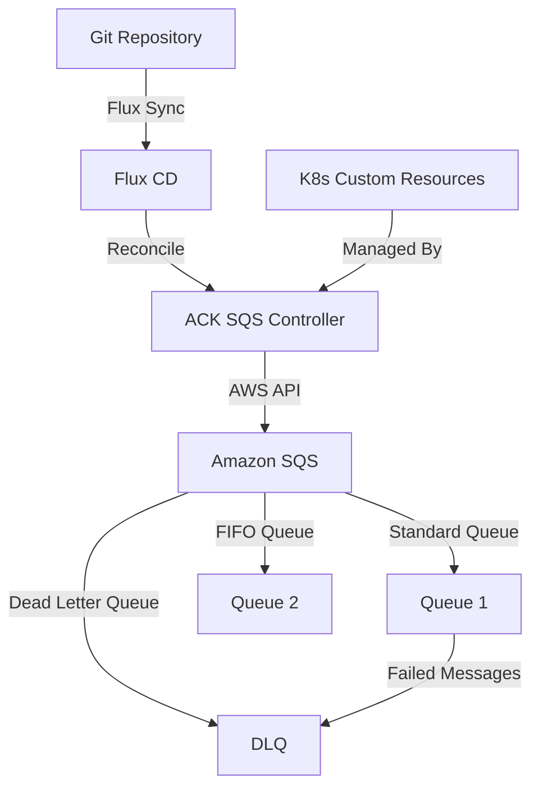

# How to Deploy Amazon SQS Controller with Flux CD

Author: [nawazdhandala](https://github.com/nawazdhandala)

Tags: Flux CD, Amazon SQS, AWS, Message Queue, Kubernetes, GitOps, ACK

Description: A practical guide to deploying the AWS Controllers for Kubernetes (ACK) SQS Controller with Flux CD to manage Amazon SQS queues via GitOps.

---

## Introduction

The AWS Controllers for Kubernetes (ACK) SQS Controller allows you to manage Amazon SQS queues directly from Kubernetes using custom resources. By combining ACK with Flux CD, you can define your SQS queues as Kubernetes manifests in Git, enabling a fully GitOps-driven workflow for your AWS messaging infrastructure.

This guide walks through deploying the ACK SQS Controller on Kubernetes using Flux CD and creating SQS queues declaratively.

## Prerequisites

Before starting, ensure you have:

- An EKS cluster or Kubernetes cluster with AWS access (v1.26 or later)
- Flux CD installed and bootstrapped
- kubectl configured for your cluster
- An AWS account with permissions to create SQS queues
- IAM Roles for Service Accounts (IRSA) configured on EKS

## Architecture Overview



## Step 1: Create the Namespace

Define a namespace for the ACK controller.

```yaml
# ack-sqs-namespace.yaml
# Namespace for ACK SQS controller components
apiVersion: v1
kind: Namespace
metadata:
  name: ack-system
  labels:
    app.kubernetes.io/managed-by: flux
    app.kubernetes.io/name: ack-sqs
```

## Step 2: Configure IAM Role for Service Account

Create the IAM policy and service account for the ACK controller.

```yaml
# ack-sqs-serviceaccount.yaml
# Service account with IRSA annotation for AWS access
apiVersion: v1
kind: ServiceAccount
metadata:
  name: ack-sqs-controller
  namespace: ack-system
  annotations:
    # Replace with your actual IAM role ARN
    eks.amazonaws.com/role-arn: arn:aws:iam::123456789012:role/ack-sqs-controller-role
  labels:
    app.kubernetes.io/name: ack-sqs-controller
    app.kubernetes.io/managed-by: flux
```

Create the IAM policy for SQS access (apply this via AWS CLI or Terraform):

```yaml
# iam-policy-reference.yaml
# This is a reference for the IAM policy needed by the ACK controller
# Apply this using AWS CLI: aws iam create-policy --policy-name ACK-SQS-Policy --policy-document file://policy.json
#
# Policy JSON:
# {
#   "Version": "2012-10-17",
#   "Statement": [
#     {
#       "Effect": "Allow",
#       "Action": [
#         "sqs:CreateQueue",
#         "sqs:DeleteQueue",
#         "sqs:GetQueueAttributes",
#         "sqs:GetQueueUrl",
#         "sqs:ListQueues",
#         "sqs:SetQueueAttributes",
#         "sqs:TagQueue",
#         "sqs:UntagQueue",
#         "sqs:ListQueueTags"
#       ],
#       "Resource": "*"
#     }
#   ]
# }
```

## Step 3: Add the ACK Helm Repository

Register the ACK Helm repository with Flux CD.

```yaml
# ack-helmrepo.yaml
# ECR public registry for ACK Helm charts
apiVersion: source.toolkit.fluxcd.io/v1
kind: HelmRepository
metadata:
  name: ack-sqs
  namespace: ack-system
spec:
  interval: 1h
  type: oci
  # ACK SQS controller Helm chart from ECR public
  url: oci://public.ecr.aws/aws-controllers-k8s
```

## Step 4: Create the HelmRelease

Deploy the ACK SQS Controller using a HelmRelease.

```yaml
# ack-sqs-helmrelease.yaml
# Deploys the ACK SQS Controller via Flux CD
apiVersion: helm.toolkit.fluxcd.io/v1
kind: HelmRelease
metadata:
  name: ack-sqs-controller
  namespace: ack-system
spec:
  interval: 30m
  chart:
    spec:
      chart: sqs-chart
      version: "1.0.x"
      sourceRef:
        kind: HelmRepository
        name: ack-sqs
        namespace: ack-system
      interval: 12h
  values:
    # AWS configuration
    aws:
      region: us-east-1
      # Use the IRSA service account
      credentials:
        secretName: ""

    # Use the pre-configured service account
    serviceAccount:
      create: false
      name: ack-sqs-controller

    # Controller resource limits
    resources:
      requests:
        cpu: 100m
        memory: 128Mi
      limits:
        cpu: 250m
        memory: 256Mi

    # Enable leader election for HA
    leaderElection:
      enabled: true

    # Logging configuration
    log:
      level: info
      # Enable JSON logging for structured output
      enableDevelopmentLogging: false

    # Install CRDs
    installCRDs: true

    # Metrics configuration
    metrics:
      service:
        enabled: true
        port: 8080
```

## Step 5: Create SQS Queue Resources

Define SQS queues as Kubernetes custom resources.

```yaml
# sqs-standard-queue.yaml
# Standard SQS queue managed by ACK
apiVersion: sqs.services.k8s.aws/v1alpha1
kind: Queue
metadata:
  name: app-events-queue
  namespace: ack-system
  annotations:
    # Flux annotation for tracking
    kustomize.toolkit.fluxcd.io/prune: "true"
spec:
  queueName: app-events-queue
  # Message retention period (4 days in seconds)
  messageRetentionPeriod: "345600"
  # Visibility timeout (30 seconds)
  visibilityTimeout: "30"
  # Maximum message size (256 KB)
  maximumMessageSize: "262144"
  # Delay before message becomes visible (0 seconds)
  delaySeconds: "0"
  # Long polling wait time
  receiveMessageWaitTimeSeconds: "20"
  # Enable server-side encryption
  kmsMasterKeyID: alias/aws/sqs
  kmsDataKeyReusePeriodSeconds: "300"
  tags:
    Environment: production
    ManagedBy: flux-cd
    Team: platform
---
# Dead letter queue for failed messages
apiVersion: sqs.services.k8s.aws/v1alpha1
kind: Queue
metadata:
  name: app-events-dlq
  namespace: ack-system
spec:
  queueName: app-events-dlq
  # Retain DLQ messages for 14 days
  messageRetentionPeriod: "1209600"
  visibilityTimeout: "30"
  kmsMasterKeyID: alias/aws/sqs
  tags:
    Environment: production
    ManagedBy: flux-cd
    Type: dead-letter-queue
```

## Step 6: Configure Dead Letter Queue Redrive Policy

Link the main queue to its dead letter queue.

```yaml
# sqs-redrive-policy.yaml
# Standard queue with dead letter queue redrive policy
apiVersion: sqs.services.k8s.aws/v1alpha1
kind: Queue
metadata:
  name: app-orders-queue
  namespace: ack-system
spec:
  queueName: app-orders-queue
  messageRetentionPeriod: "345600"
  visibilityTimeout: "60"
  receiveMessageWaitTimeSeconds: "20"
  # Redrive policy linking to the DLQ
  # Messages are sent to DLQ after 3 failed processing attempts
  redrivePolicy: |
    {
      "deadLetterTargetArn": "arn:aws:sqs:us-east-1:123456789012:app-events-dlq",
      "maxReceiveCount": 3
    }
  kmsMasterKeyID: alias/aws/sqs
  tags:
    Environment: production
    ManagedBy: flux-cd
---
# FIFO queue for ordered message processing
apiVersion: sqs.services.k8s.aws/v1alpha1
kind: Queue
metadata:
  name: app-transactions-fifo
  namespace: ack-system
spec:
  # FIFO queues must end with .fifo
  queueName: app-transactions.fifo
  # Enable FIFO queue
  fifoQueue: "true"
  # Enable content-based deduplication
  contentBasedDeduplication: "true"
  messageRetentionPeriod: "345600"
  visibilityTimeout: "30"
  kmsMasterKeyID: alias/aws/sqs
  tags:
    Environment: production
    ManagedBy: flux-cd
    Type: fifo-queue
```

## Step 7: Add Network Policies

Secure the ACK controller network access.

```yaml
# ack-networkpolicy.yaml
# Network policy for ACK SQS controller
apiVersion: networking.k8s.io/v1
kind: NetworkPolicy
metadata:
  name: ack-sqs-controller-policy
  namespace: ack-system
spec:
  podSelector:
    matchLabels:
      app.kubernetes.io/name: ack-sqs-controller
  policyTypes:
    - Ingress
    - Egress
  ingress:
    # Allow metrics scraping
    - from:
        - namespaceSelector:
            matchLabels:
              name: monitoring
      ports:
        - protocol: TCP
          port: 8080
  egress:
    # Allow DNS resolution
    - ports:
        - protocol: UDP
          port: 53
    # Allow HTTPS to AWS APIs
    - ports:
        - protocol: TCP
          port: 443
```

## Step 8: Set Up the Flux Kustomization

Organize all resources with a Flux Kustomization.

```yaml
# kustomization.yaml
# Flux Kustomization for ACK SQS Controller and queue resources
apiVersion: kustomize.toolkit.fluxcd.io/v1
kind: Kustomization
metadata:
  name: ack-sqs
  namespace: flux-system
spec:
  interval: 10m
  targetNamespace: ack-system
  sourceRef:
    kind: GitRepository
    name: flux-system
  path: ./clusters/my-cluster/ack-sqs
  prune: true
  healthChecks:
    - apiVersion: apps/v1
      kind: Deployment
      name: ack-sqs-controller
      namespace: ack-system
  timeout: 5m
```

## Step 9: Verify the Deployment

After pushing to Git, verify everything is working.

```bash
# Check Flux reconciliation
flux get helmreleases -n ack-system

# Verify the ACK controller is running
kubectl get pods -n ack-system

# Check CRDs are installed
kubectl get crds | grep sqs

# List SQS queue resources
kubectl get queues -n ack-system

# Check queue status and ARN
kubectl describe queue app-events-queue -n ack-system

# Verify queues exist in AWS
aws sqs list-queues --region us-east-1

# Get queue attributes
aws sqs get-queue-attributes \
  --queue-url https://sqs.us-east-1.amazonaws.com/123456789012/app-events-queue \
  --attribute-names All
```

## Troubleshooting

Common issues and solutions:

```bash
# Check ACK controller logs
kubectl logs -n ack-system -l app.kubernetes.io/name=ack-sqs-controller

# Verify IRSA is configured correctly
kubectl describe serviceaccount ack-sqs-controller -n ack-system

# Check queue sync status
kubectl get queues -n ack-system -o wide

# Verify IAM permissions
kubectl exec -n ack-system deploy/ack-sqs-controller -- \
  aws sts get-caller-identity

# Check Flux Kustomization errors
flux get kustomizations -n flux-system | grep ack-sqs

# Force reconciliation
flux reconcile helmrelease ack-sqs-controller -n ack-system
```

## Conclusion

You have successfully deployed the ACK SQS Controller on Kubernetes using Flux CD. This setup allows you to manage Amazon SQS queues declaratively through Kubernetes custom resources, all driven by GitOps. You can now create standard queues, FIFO queues, and dead letter queues simply by adding YAML manifests to your Git repository, with Flux CD automatically reconciling the desired state.
