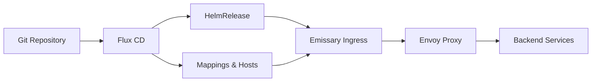

# How to Deploy Ambassador/Emissary Ingress with Flux CD

Author: [nawazdhandala](https://github.com/nawazdhandala)

Tags: flux cd, ambassador, emissary ingress, kubernetes, gitops, networking, api gateway

Description: A step-by-step guide to deploying Emissary Ingress (formerly Ambassador) in Kubernetes using Flux CD for GitOps-based API gateway management.

---

## Introduction

Emissary Ingress, formerly known as Ambassador, is a Kubernetes-native API gateway built on Envoy Proxy. It provides sophisticated traffic management, authentication, rate limiting, and TLS termination. By deploying it through Flux CD, you can manage your entire API gateway configuration through Git, ensuring consistency and auditability.

This guide covers deploying Emissary Ingress using Flux CD, configuring host mappings, and managing traffic policies declaratively.

## Prerequisites

Before starting, make sure you have:

- A Kubernetes cluster (v1.24 or later)
- Flux CD installed and bootstrapped
- kubectl configured for your cluster
- A Git repository connected to Flux CD

## Architecture Overview



## Adding the Emissary Helm Repository

Create a HelmRepository source pointing to the Emissary Ingress chart repository.

```yaml
# clusters/my-cluster/sources/emissary-helmrepository.yaml
apiVersion: source.toolkit.fluxcd.io/v1
kind: HelmRepository
metadata:
  name: datawire
  namespace: flux-system
spec:
  interval: 1h
  url: https://app.getambassador.io
```

## Creating the Namespace

```yaml
# clusters/my-cluster/namespaces/emissary-namespace.yaml
apiVersion: v1
kind: Namespace
metadata:
  name: emissary
  labels:
    toolkit.fluxcd.io/tenant: networking
```

## Installing Emissary CRDs

Emissary Ingress requires custom resource definitions to be installed first. Create a separate HelmRelease for the CRDs.

```yaml
# clusters/my-cluster/helm-releases/emissary-crds.yaml
apiVersion: helm.toolkit.fluxcd.io/v1
kind: HelmRelease
metadata:
  name: emissary-crds
  namespace: emissary
spec:
  interval: 1h
  chart:
    spec:
      chart: emissary-crds
      version: "8.9.x"
      sourceRef:
        kind: HelmRepository
        name: datawire
        namespace: flux-system
      interval: 12h
  # CRDs should not be pruned
  install:
    crds: CreateReplace
  upgrade:
    crds: CreateReplace
```

## Deploying Emissary Ingress

Now deploy Emissary Ingress itself, with a dependency on the CRDs installation.

```yaml
# clusters/my-cluster/helm-releases/emissary-helmrelease.yaml
apiVersion: helm.toolkit.fluxcd.io/v1
kind: HelmRelease
metadata:
  name: emissary-ingress
  namespace: emissary
spec:
  interval: 30m
  # Wait for CRDs to be installed first
  dependsOn:
    - name: emissary-crds
      namespace: emissary
  chart:
    spec:
      chart: emissary-ingress
      version: "8.9.x"
      sourceRef:
        kind: HelmRepository
        name: datawire
        namespace: flux-system
      interval: 12h
  values:
    # Replica count for high availability
    replicaCount: 2

    # Service configuration
    service:
      type: LoadBalancer
      annotations:
        service.beta.kubernetes.io/aws-load-balancer-type: "nlb"
      ports:
        - name: http
          port: 80
          targetPort: 8080
        - name: https
          port: 443
          targetPort: 8443

    # Resource allocation
    resources:
      requests:
        cpu: 200m
        memory: 300Mi
      limits:
        cpu: 1000m
        memory: 600Mi

    # Enable prometheus metrics
    createDevPortalMappings: false

    # Envoy log level
    env:
      AES_LOG_LEVEL: warn
```

## Configuring a Listener

Listeners define the ports and protocols Emissary Ingress listens on.

```yaml
# clusters/my-cluster/emissary-config/listener-http.yaml
apiVersion: getambassador.io/v3alpha1
kind: Listener
metadata:
  name: http-listener
  namespace: emissary
spec:
  port: 8080
  protocol: HTTP
  securityModel: XFP
  hostBinding:
    namespace:
      from: ALL
---
# clusters/my-cluster/emissary-config/listener-https.yaml
apiVersion: getambassador.io/v3alpha1
kind: Listener
metadata:
  name: https-listener
  namespace: emissary
spec:
  port: 8443
  protocol: HTTPS
  securityModel: XFP
  hostBinding:
    namespace:
      from: ALL
```

## Configuring Hosts

Host resources define the domains Emissary Ingress manages.

```yaml
# apps/my-app/emissary/host.yaml
apiVersion: getambassador.io/v3alpha1
kind: Host
metadata:
  name: app-host
  namespace: emissary
spec:
  hostname: app.example.com
  # TLS configuration
  tlsSecret:
    name: app-tls-secret
  # Redirect HTTP to HTTPS
  requestPolicy:
    insecure:
      action: Redirect
```

## Creating Mappings

Mappings define how requests are routed to backend services.

```yaml
# apps/my-app/emissary/mapping.yaml
apiVersion: getambassador.io/v3alpha1
kind: Mapping
metadata:
  name: my-app-mapping
  namespace: default
spec:
  hostname: app.example.com
  prefix: /
  service: my-app-service.default:80
  timeout_ms: 30000
  # Enable retries
  retry_policy:
    retry_on: "5xx"
    num_retries: 3
---
# API mapping with path-based routing
apiVersion: getambassador.io/v3alpha1
kind: Mapping
metadata:
  name: my-api-mapping
  namespace: default
spec:
  hostname: app.example.com
  prefix: /api/
  service: my-api-service.default:8080
  # Rewrite the prefix
  rewrite: /
  # Add request headers
  add_request_headers:
    X-Gateway: "emissary"
  # Enable CORS
  cors:
    origins:
      - "https://example.com"
    methods:
      - GET
      - POST
      - PUT
    max_age: "86400"
```

## Rate Limiting Configuration

```yaml
# apps/my-app/emissary/ratelimit.yaml
apiVersion: getambassador.io/v3alpha1
kind: Mapping
metadata:
  name: rate-limited-api
  namespace: default
spec:
  hostname: app.example.com
  prefix: /api/public/
  service: my-api-service.default:8080
  labels:
    ambassador:
      - request_label_group:
          - remote_address:
              key: remote_address
---
apiVersion: getambassador.io/v3alpha1
kind: RateLimitService
metadata:
  name: ratelimit
  namespace: emissary
spec:
  service: ratelimit.emissary:8081
  protocol_version: v3
```

## Flux Kustomization

Tie everything together with a Flux Kustomization.

```yaml
# clusters/my-cluster/emissary-kustomization.yaml
apiVersion: kustomize.toolkit.fluxcd.io/v1
kind: Kustomization
metadata:
  name: emissary-ingress
  namespace: flux-system
spec:
  interval: 10m
  sourceRef:
    kind: GitRepository
    name: flux-system
  path: ./clusters/my-cluster/emissary-config
  prune: true
  dependsOn:
    - name: emissary-helm
  healthChecks:
    - apiVersion: apps/v1
      kind: Deployment
      name: emissary-ingress
      namespace: emissary
  timeout: 5m
```

## Monitoring and Verification

After pushing the manifests, verify the deployment.

```bash
# Check HelmRelease status
flux get helmreleases -n emissary

# Verify Emissary pods are running
kubectl get pods -n emissary

# Check the external service IP
kubectl get svc -n emissary

# List all configured mappings
kubectl get mappings --all-namespaces

# List all configured hosts
kubectl get hosts -n emissary

# Check Emissary diagnostics
kubectl exec -n emissary deploy/emissary-ingress -- curl -s localhost:8877/ambassador/v0/diag/?json=true | jq '.routes'
```

## Troubleshooting

Common issues and how to resolve them.

```bash
# View Emissary Ingress logs
kubectl logs -n emissary deploy/emissary-ingress

# Check for configuration errors
kubectl get mappings --all-namespaces -o yaml | grep -A5 "status:"

# Verify listeners are active
kubectl get listeners -n emissary

# Test connectivity to a backend
kubectl exec -n emissary deploy/emissary-ingress -- curl -s http://my-app-service.default:80/health
```

## Conclusion

Deploying Emissary Ingress with Flux CD provides a robust, GitOps-managed API gateway for your Kubernetes cluster. The combination of Envoy Proxy's performance with Flux CD's automated reconciliation ensures that your ingress configuration is always in sync with your desired state in Git. Changes to routing, TLS, and traffic policies are all version-controlled and automatically applied.
