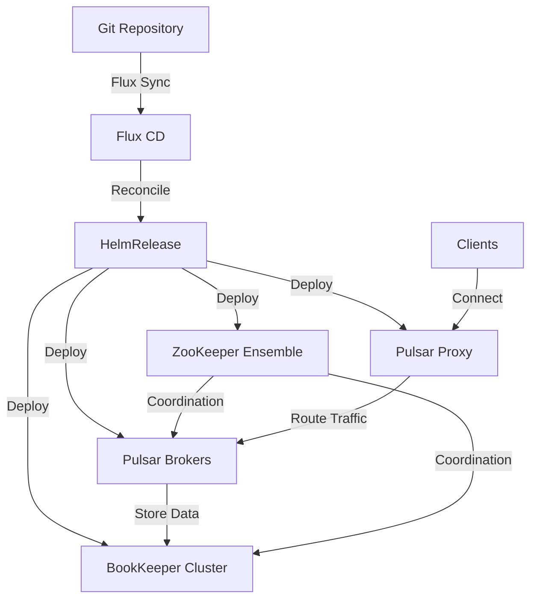

# How to Deploy Apache Pulsar with Flux CD

Author: [nawazdhandala](https://github.com/nawazdhandala)

Tags: Flux CD, Apache Pulsar, Message Queue, Kubernetes, GitOps, Streaming

Description: A practical guide to deploying Apache Pulsar on Kubernetes using Flux CD for GitOps-based message streaming infrastructure.

---

## Introduction

Apache Pulsar is a distributed messaging and streaming platform that combines the best features of traditional messaging systems and publish-subscribe systems. It offers multi-tenancy, geo-replication, and tiered storage out of the box, making it an excellent choice for enterprise messaging workloads.

This guide walks through deploying Apache Pulsar on Kubernetes using Flux CD, giving you a reproducible, GitOps-driven deployment pipeline.

## Prerequisites

Before starting, ensure you have:

- A Kubernetes cluster (v1.26 or later) with at least 3 worker nodes
- Flux CD installed and bootstrapped
- kubectl configured for your cluster
- A Git repository connected to Flux CD
- At least 50Gi of available persistent storage

## Architecture Overview



## Step 1: Create the Namespace

Define a dedicated namespace for Apache Pulsar.

```yaml
# pulsar-namespace.yaml
# Dedicated namespace for all Apache Pulsar components
apiVersion: v1
kind: Namespace
metadata:
  name: pulsar-system
  labels:
    app.kubernetes.io/managed-by: flux
    app.kubernetes.io/name: pulsar
```

## Step 2: Add the Helm Repository

Register the Apache Pulsar Helm chart repository with Flux CD.

```yaml
# pulsar-helmrepo.yaml
# Points Flux to the official Apache Pulsar Helm repository
apiVersion: source.toolkit.fluxcd.io/v1
kind: HelmRepository
metadata:
  name: apache-pulsar
  namespace: pulsar-system
spec:
  interval: 1h
  # Official Apache Pulsar Helm chart repository
  url: https://pulsar.apache.org/charts
```

## Step 3: Create the HelmRelease

Define the HelmRelease that deploys Apache Pulsar with all its components.

```yaml
# pulsar-helmrelease.yaml
# Deploys the full Apache Pulsar stack via Flux CD
apiVersion: helm.toolkit.fluxcd.io/v2
kind: HelmRelease
metadata:
  name: pulsar
  namespace: pulsar-system
spec:
  interval: 30m
  # Set a longer timeout as Pulsar has many components
  timeout: 15m
  chart:
    spec:
      chart: pulsar
      version: "3.x"
      sourceRef:
        kind: HelmRepository
        name: apache-pulsar
        namespace: pulsar-system
      interval: 12h
  values:
    # ZooKeeper configuration for cluster coordination
    zookeeper:
      replicaCount: 3
      resources:
        requests:
          cpu: 200m
          memory: 512Mi
        limits:
          cpu: 500m
          memory: 1Gi
      persistence:
        enabled: true
        size: 20Gi
        storageClassName: standard

    # BookKeeper configuration for message storage
    bookkeeper:
      replicaCount: 3
      resources:
        requests:
          cpu: 500m
          memory: 1Gi
        limits:
          cpu: "1"
          memory: 2Gi
      persistence:
        journal:
          enabled: true
          size: 20Gi
          storageClassName: standard
        ledgers:
          enabled: true
          size: 50Gi
          storageClassName: standard

    # Pulsar Broker configuration
    broker:
      replicaCount: 3
      resources:
        requests:
          cpu: 500m
          memory: 1Gi
        limits:
          cpu: "1"
          memory: 2Gi
      # Configure broker settings
      configData:
        # Enable transaction support
        transactionCoordinatorEnabled: "true"
        # Message retention settings
        defaultRetentionTimeInMinutes: "4320"
        defaultRetentionSizeInMB: "1024"
        # Deduplication
        brokerDeduplicationEnabled: "true"

    # Pulsar Proxy for client connections
    proxy:
      replicaCount: 2
      resources:
        requests:
          cpu: 200m
          memory: 256Mi
        limits:
          cpu: 500m
          memory: 512Mi
      service:
        type: ClusterIP
        ports:
          http: 8080
          pulsar: 6650

    # Enable Pulsar Manager UI
    pulsar_manager:
      enabled: true
      replicaCount: 1
      resources:
        requests:
          cpu: 100m
          memory: 256Mi

    # Monitoring configuration
    monitoring:
      prometheus: true
      grafana: false
```

## Step 4: Configure Authentication

Set up token-based authentication for Pulsar.

```yaml
# pulsar-auth-secret.yaml
# Secret containing Pulsar authentication tokens
# Use sealed-secrets or SOPS in production
apiVersion: v1
kind: Secret
metadata:
  name: pulsar-token-keys
  namespace: pulsar-system
type: Opaque
stringData:
  # These are placeholder values - generate real keys in production
  # Use: bin/pulsar tokens create-key-pair
  PULSAR_PREFIX_tokenSecretKey: "your-secret-key-here"
  PULSAR_PREFIX_superUserRoles: "admin,proxy"
  PULSAR_PREFIX_authenticationEnabled: "true"
  PULSAR_PREFIX_authenticationProviders: "org.apache.pulsar.broker.authentication.AuthenticationProviderToken"
```

## Step 5: Create Tenant and Namespace Configuration

Set up Pulsar tenants and namespaces using a Kubernetes Job.

```yaml
# pulsar-tenant-setup.yaml
# Job to initialize Pulsar tenants and namespaces
apiVersion: batch/v1
kind: Job
metadata:
  name: pulsar-tenant-setup
  namespace: pulsar-system
  annotations:
    # Run after the main deployment is complete
    helm.sh/hook: post-install
spec:
  template:
    spec:
      containers:
        - name: pulsar-admin
          image: apachepulsar/pulsar:3.3.0
          command:
            - /bin/bash
            - -c
            - |
              # Wait for Pulsar to be ready
              until bin/pulsar-admin brokers healthcheck; do
                echo "Waiting for Pulsar broker..."
                sleep 10
              done

              # Create application tenant
              bin/pulsar-admin tenants create app-tenant \
                --admin-roles admin \
                --allowed-clusters standalone

              # Create namespaces for different services
              bin/pulsar-admin namespaces create app-tenant/events
              bin/pulsar-admin namespaces create app-tenant/notifications
              bin/pulsar-admin namespaces create app-tenant/analytics

              # Set retention policies
              bin/pulsar-admin namespaces set-retention app-tenant/events \
                --size 10G --time 72h

              # Set message TTL
              bin/pulsar-admin namespaces set-message-ttl app-tenant/events \
                --messageTTL 86400

              echo "Tenant setup complete"
          env:
            - name: PULSAR_ADMIN_URL
              value: "http://pulsar-proxy.pulsar-system.svc:8080"
      restartPolicy: OnFailure
  backoffLimit: 5
```

## Step 6: Add Network Policies

Secure Pulsar component communication with network policies.

```yaml
# pulsar-networkpolicy.yaml
# Controls network access between Pulsar components
apiVersion: networking.k8s.io/v1
kind: NetworkPolicy
metadata:
  name: pulsar-broker-policy
  namespace: pulsar-system
spec:
  podSelector:
    matchLabels:
      component: broker
  policyTypes:
    - Ingress
    - Egress
  ingress:
    # Allow proxy to connect to brokers
    - from:
        - podSelector:
            matchLabels:
              component: proxy
      ports:
        - protocol: TCP
          port: 6650
        - protocol: TCP
          port: 8080
    # Allow broker-to-broker communication
    - from:
        - podSelector:
            matchLabels:
              component: broker
      ports:
        - protocol: TCP
          port: 6650
  egress:
    # Allow DNS
    - ports:
        - protocol: UDP
          port: 53
    # Allow connection to ZooKeeper
    - to:
        - podSelector:
            matchLabels:
              component: zookeeper
      ports:
        - protocol: TCP
          port: 2181
    # Allow connection to BookKeeper
    - to:
        - podSelector:
            matchLabels:
              component: bookkeeper
      ports:
        - protocol: TCP
          port: 3181
```

## Step 7: Configure Monitoring

Set up monitoring with ServiceMonitor resources.

```yaml
# pulsar-servicemonitor.yaml
# Prometheus ServiceMonitor for Pulsar metrics
apiVersion: monitoring.coreos.com/v1
kind: ServiceMonitor
metadata:
  name: pulsar-broker-monitor
  namespace: pulsar-system
  labels:
    release: prometheus
spec:
  selector:
    matchLabels:
      component: broker
  endpoints:
    - port: http
      interval: 30s
      path: /metrics
---
# Monitor BookKeeper metrics
apiVersion: monitoring.coreos.com/v1
kind: ServiceMonitor
metadata:
  name: pulsar-bookkeeper-monitor
  namespace: pulsar-system
  labels:
    release: prometheus
spec:
  selector:
    matchLabels:
      component: bookkeeper
  endpoints:
    - port: http
      interval: 30s
      path: /metrics
```

## Step 8: Set Up the Flux Kustomization

Create the Flux Kustomization to manage all Pulsar resources.

```yaml
# kustomization.yaml
# Flux Kustomization for Apache Pulsar deployment
apiVersion: kustomize.toolkit.fluxcd.io/v1
kind: Kustomization
metadata:
  name: pulsar
  namespace: flux-system
spec:
  interval: 10m
  targetNamespace: pulsar-system
  sourceRef:
    kind: GitRepository
    name: flux-system
  path: ./clusters/my-cluster/pulsar
  prune: true
  healthChecks:
    - apiVersion: apps/v1
      kind: StatefulSet
      name: pulsar-zookeeper
      namespace: pulsar-system
    - apiVersion: apps/v1
      kind: StatefulSet
      name: pulsar-bookkeeper
      namespace: pulsar-system
    - apiVersion: apps/v1
      kind: StatefulSet
      name: pulsar-broker
      namespace: pulsar-system
  timeout: 15m
```

## Step 9: Verify the Deployment

After pushing to Git, verify the deployment is working.

```bash
# Check Flux reconciliation
flux get helmreleases -n pulsar-system

# Verify all Pulsar pods are running
kubectl get pods -n pulsar-system

# Check broker health
kubectl exec -n pulsar-system pulsar-broker-0 -- \
  bin/pulsar-admin brokers healthcheck

# List tenants
kubectl exec -n pulsar-system pulsar-broker-0 -- \
  bin/pulsar-admin tenants list

# Produce a test message
kubectl exec -n pulsar-system pulsar-broker-0 -- \
  bin/pulsar-client produce persistent://app-tenant/events/test \
  -m "Hello from Flux CD" -n 1

# Consume test messages
kubectl exec -n pulsar-system pulsar-broker-0 -- \
  bin/pulsar-client consume persistent://app-tenant/events/test \
  -s "test-sub" -n 1
```

## Troubleshooting

Common issues and their solutions:

```bash
# Check Flux reconciliation errors
kubectl describe helmrelease pulsar -n pulsar-system

# View broker logs for errors
kubectl logs -n pulsar-system -l component=broker --tail=100

# Check ZooKeeper connectivity
kubectl exec -n pulsar-system pulsar-zookeeper-0 -- \
  bin/pulsar zookeeper-shell localhost:2181 ls /

# Verify BookKeeper storage
kubectl get pvc -n pulsar-system

# Check disk usage on BookKeeper nodes
kubectl exec -n pulsar-system pulsar-bookkeeper-0 -- df -h /pulsar/data
```

## Conclusion

You have successfully deployed Apache Pulsar on Kubernetes using Flux CD. This setup includes a full production-ready stack with ZooKeeper for coordination, BookKeeper for message storage, Pulsar brokers for message processing, and a proxy for client access. The GitOps approach ensures all configuration changes are tracked, reviewed, and automatically applied to your cluster.
