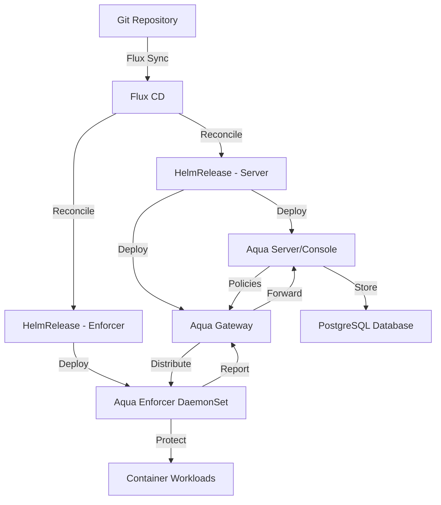

# How to Deploy Aqua Security with Flux CD

Author: [nawazdhandala](https://github.com/nawazdhandala)

Tags: flux cd, aqua security, container security, kubernetes, gitops, runtime protection, vulnerability management

Description: A practical guide to deploying Aqua Security platform on Kubernetes using Flux CD for comprehensive cloud-native security management.

---

## Introduction

Aqua Security is a comprehensive cloud-native security platform that provides full lifecycle security for containerized and serverless applications. It offers vulnerability scanning, runtime protection, network micro-segmentation, compliance enforcement, and drift prevention. Aqua integrates deeply with Kubernetes to secure workloads from build to runtime.

This guide demonstrates how to deploy Aqua Security on Kubernetes using Flux CD, enabling enterprise-grade container security managed through GitOps principles.

## Prerequisites

Before starting, ensure you have:

- A Kubernetes cluster (v1.26 or later)
- Flux CD installed and bootstrapped
- kubectl configured for your cluster
- A Git repository connected to Flux CD
- An Aqua Security license key (obtain from Aqua Security)
- A PostgreSQL database for the Aqua server (or use the bundled one)

## Architecture Overview



## Step 1: Create the Namespace

Define a namespace for Aqua Security components.

```yaml
# aqua-namespace.yaml
# Dedicated namespace for Aqua Security platform
apiVersion: v1
kind: Namespace
metadata:
  name: aqua-security
  labels:
    app.kubernetes.io/managed-by: flux
    app.kubernetes.io/name: aqua-security
    # Aqua enforcers need privileged access
    pod-security.kubernetes.io/enforce: privileged
```

## Step 2: Add the Aqua Helm Repository

Register the Aqua Security Helm chart repository.

```yaml
# aqua-helmrepo.yaml
# Official Aqua Security Helm chart repository
apiVersion: source.toolkit.fluxcd.io/v1
kind: HelmRepository
metadata:
  name: aqua-security
  namespace: aqua-security
spec:
  interval: 1h
  url: https://helm.aquasec.com
```

## Step 3: Create Required Secrets

Set up secrets for the Aqua Security deployment.

```yaml
# aqua-secrets.yaml
# Secrets for Aqua Security platform
# Use sealed-secrets or SOPS in production
apiVersion: v1
kind: Secret
metadata:
  name: aqua-license
  namespace: aqua-security
type: Opaque
stringData:
  # Your Aqua Security license key
  license: "your-aqua-license-key-here"
---
# Database credentials
apiVersion: v1
kind: Secret
metadata:
  name: aqua-db-credentials
  namespace: aqua-security
type: Opaque
stringData:
  # PostgreSQL connection details
  db-password: "your-secure-db-password"
  db-username: "aqua_admin"
---
# Aqua admin credentials
apiVersion: v1
kind: Secret
metadata:
  name: aqua-admin
  namespace: aqua-security
type: Opaque
stringData:
  admin-password: "your-secure-admin-password"
---
# Enforcer token for agent authentication
apiVersion: v1
kind: Secret
metadata:
  name: aqua-enforcer-token
  namespace: aqua-security
type: Opaque
stringData:
  token: "your-enforcer-token-here"
```

## Step 4: Deploy the Aqua Server

Create the HelmRelease for the Aqua Server and Gateway.

```yaml
# aqua-server-helmrelease.yaml
# Deploys the Aqua Security server and gateway via Flux CD
apiVersion: helm.toolkit.fluxcd.io/v1
kind: HelmRelease
metadata:
  name: aqua-server
  namespace: aqua-security
spec:
  interval: 30m
  timeout: 15m
  chart:
    spec:
      chart: server
      version: "2024.4.x"
      sourceRef:
        kind: HelmRepository
        name: aqua-security
        namespace: aqua-security
      interval: 12h
  values:
    # Global image settings
    imageCredentials:
      create: false

    # Aqua Server (Console) configuration
    web:
      replicaCount: 2
      resources:
        requests:
          cpu: 500m
          memory: 1Gi
        limits:
          cpu: "2"
          memory: 2Gi
      service:
        type: ClusterIP
        port: 8080
      # TLS configuration
      tls:
        enabled: true
        secretName: aqua-web-tls
      # Admin password from secret
      adminPassword:
        secretName: aqua-admin
        secretKey: admin-password

    # Aqua Gateway configuration
    gateway:
      replicaCount: 2
      resources:
        requests:
          cpu: 200m
          memory: 512Mi
        limits:
          cpu: "1"
          memory: 1Gi
      service:
        type: ClusterIP
        port: 8443

    # Database configuration
    db:
      # Use external PostgreSQL database
      external:
        enabled: true
        host: "postgres.database.svc"
        port: 5432
        name: aqua_db
        passwordSecret: aqua-db-credentials
        passwordSecretKey: db-password
        usernameSecret: aqua-db-credentials
        usernameSecretKey: db-username
        ssl: true

    # Scanner component
    scanner:
      enabled: true
      replicaCount: 2
      resources:
        requests:
          cpu: 200m
          memory: 512Mi
        limits:
          cpu: "1"
          memory: 1Gi

    # License from secret
    license:
      secretName: aqua-license
      secretKey: license

    # Aqua CyberCenter for vulnerability data
    cyberCenter:
      enabled: true
```

## Step 5: Deploy the Aqua Enforcer

Create the HelmRelease for the Aqua Enforcer DaemonSet.

```yaml
# aqua-enforcer-helmrelease.yaml
# Deploys Aqua Enforcer agents on all nodes via Flux CD
apiVersion: helm.toolkit.fluxcd.io/v1
kind: HelmRelease
metadata:
  name: aqua-enforcer
  namespace: aqua-security
spec:
  interval: 30m
  dependsOn:
    # Enforcer depends on the server being deployed first
    - name: aqua-server
  chart:
    spec:
      chart: enforcer
      version: "2024.4.x"
      sourceRef:
        kind: HelmRepository
        name: aqua-security
        namespace: aqua-security
      interval: 12h
  values:
    # Enforcer group name
    enforcerGroup: production-enforcers

    # Gateway connection
    gate:
      host: aqua-gateway.aqua-security.svc
      port: 8443

    # Token for authenticating with the server
    token:
      secretName: aqua-enforcer-token
      secretKey: token

    # Resource configuration
    resources:
      requests:
        cpu: 100m
        memory: 256Mi
      limits:
        cpu: "1"
        memory: 1Gi

    # Tolerations to run on all nodes
    tolerations:
      - effect: NoSchedule
        operator: Exists
      - effect: NoExecute
        operator: Exists

    # Enforcer capabilities
    enforcerConfig:
      # Enable runtime protection
      runtimeProtection: true
      # Enable network control
      networkControl: true
      # Enable drift prevention
      driftPrevention: true
      # Container runtime
      containerRuntime: containerd
      runtimeSocketPath: /var/run/containerd/containerd.sock

    # Host protection settings
    hostProtection:
      enabled: true
      # Monitor host processes
      hostProcesses: true
      # Monitor host network
      hostNetwork: true
```

## Step 6: Configure Runtime Policies

Define runtime security policies as ConfigMaps.

```yaml
# aqua-runtime-policies.yaml
# Runtime security policy configuration
apiVersion: v1
kind: ConfigMap
metadata:
  name: aqua-runtime-policies
  namespace: aqua-security
data:
  runtime-policy.json: |
    {
      "name": "production-runtime-policy",
      "description": "Runtime protection policy for production workloads",
      "enabled": true,
      "enforce": true,
      "rules": {
        "block_cryptocurrency_mining": true,
        "block_fileless_exec": true,
        "block_reverse_shell": true,
        "block_container_exec": false,
        "audit_container_exec": true,
        "block_non_compliant_images": true,
        "block_unregistered_images": true,
        "readonly_files_and_directories": [
          "/etc/passwd",
          "/etc/shadow",
          "/etc/group",
          "/bin",
          "/sbin",
          "/usr/bin",
          "/usr/sbin"
        ],
        "blocked_executables": [
          "nc",
          "ncat",
          "nmap",
          "wget",
          "curl"
        ],
        "blocked_packages": [
          "nmap",
          "netcat",
          "tcpdump"
        ],
        "allowed_registries": [
          "registry.example.com",
          "123456789012.dkr.ecr.us-east-1.amazonaws.com"
        ]
      }
    }
```

## Step 7: Set Up Network Policies

Secure communication between Aqua components.

```yaml
# aqua-networkpolicy.yaml
# Network policy for Aqua Security components
apiVersion: networking.k8s.io/v1
kind: NetworkPolicy
metadata:
  name: aqua-server-policy
  namespace: aqua-security
spec:
  podSelector:
    matchLabels:
      app: aqua-web
  policyTypes:
    - Ingress
    - Egress
  ingress:
    # Allow web UI access
    - from:
        - namespaceSelector:
            matchLabels:
              aqua-access: "true"
      ports:
        - protocol: TCP
          port: 8080
        - protocol: TCP
          port: 8443
    # Allow gateway communication
    - from:
        - podSelector:
            matchLabels:
              app: aqua-gateway
      ports:
        - protocol: TCP
          port: 8080
  egress:
    # Allow DNS
    - ports:
        - protocol: UDP
          port: 53
    # Allow database connection
    - to:
        - namespaceSelector:
            matchLabels:
              name: database
      ports:
        - protocol: TCP
          port: 5432
    # Allow HTTPS for CyberCenter updates
    - ports:
        - protocol: TCP
          port: 443
---
# Network policy for Aqua Gateway
apiVersion: networking.k8s.io/v1
kind: NetworkPolicy
metadata:
  name: aqua-gateway-policy
  namespace: aqua-security
spec:
  podSelector:
    matchLabels:
      app: aqua-gateway
  policyTypes:
    - Ingress
    - Egress
  ingress:
    # Allow enforcer connections
    - from:
        - podSelector:
            matchLabels:
              app: aqua-enforcer
      ports:
        - protocol: TCP
          port: 8443
  egress:
    # Allow DNS
    - ports:
        - protocol: UDP
          port: 53
    # Allow connection to server
    - to:
        - podSelector:
            matchLabels:
              app: aqua-web
      ports:
        - protocol: TCP
          port: 8080
```

## Step 8: Configure Monitoring

Set up Prometheus monitoring for Aqua Security.

```yaml
# aqua-servicemonitor.yaml
# Prometheus ServiceMonitor for Aqua Security metrics
apiVersion: monitoring.coreos.com/v1
kind: ServiceMonitor
metadata:
  name: aqua-server-monitor
  namespace: aqua-security
  labels:
    release: prometheus
spec:
  selector:
    matchLabels:
      app: aqua-web
  endpoints:
    - port: http
      interval: 30s
      path: /api/v1/metrics
---
# Alert rules for Aqua Security events
apiVersion: monitoring.coreos.com/v1
kind: PrometheusRule
metadata:
  name: aqua-security-alerts
  namespace: aqua-security
  labels:
    release: prometheus
spec:
  groups:
    - name: aqua-security
      rules:
        - alert: AquaEnforcerDisconnected
          expr: aqua_enforcer_connected == 0
          for: 5m
          labels:
            severity: critical
          annotations:
            summary: "Aqua Enforcer disconnected from server"
            description: "Enforcer on node {{ $labels.node }} has been disconnected for 5 minutes."

        - alert: AquaCriticalVulnerability
          expr: increase(aqua_critical_vulnerabilities_total[1h]) > 0
          for: 5m
          labels:
            severity: warning
          annotations:
            summary: "New critical vulnerability detected by Aqua"
            description: "{{ $value }} new critical vulnerabilities found in the last hour."
```

## Step 9: Set Up the Flux Kustomization

Organize all Aqua resources with Flux.

```yaml
# kustomization.yaml
# Flux Kustomization for Aqua Security
apiVersion: kustomize.toolkit.fluxcd.io/v1
kind: Kustomization
metadata:
  name: aqua-security
  namespace: flux-system
spec:
  interval: 10m
  targetNamespace: aqua-security
  sourceRef:
    kind: GitRepository
    name: flux-system
  path: ./clusters/my-cluster/aqua-security
  prune: true
  healthChecks:
    - apiVersion: apps/v1
      kind: Deployment
      name: aqua-web
      namespace: aqua-security
    - apiVersion: apps/v1
      kind: Deployment
      name: aqua-gateway
      namespace: aqua-security
    - apiVersion: apps/v1
      kind: DaemonSet
      name: aqua-enforcer
      namespace: aqua-security
  timeout: 15m
```

## Step 10: Verify the Deployment

After pushing to Git, verify everything is running.

```bash
# Check Flux reconciliation status
flux get helmreleases -n aqua-security

# Verify all Aqua pods are running
kubectl get pods -n aqua-security

# Check server health
kubectl logs -n aqua-security -l app=aqua-web --tail=20

# Verify gateway is connected
kubectl logs -n aqua-security -l app=aqua-gateway --tail=20

# Check enforcers on all nodes
kubectl get pods -n aqua-security -l app=aqua-enforcer -o wide

# Access the Aqua console via port-forward
kubectl port-forward -n aqua-security svc/aqua-web 8080:8080

# Verify enforcer connectivity
kubectl exec -n aqua-security deploy/aqua-gateway -- \
  curl -s localhost:8443/health
```

## Troubleshooting

Common issues and solutions:

```bash
# Check server logs for database connectivity
kubectl logs -n aqua-security -l app=aqua-web --tail=100 | grep -i "database\|error"

# Verify enforcer can reach gateway
kubectl logs -n aqua-security ds/aqua-enforcer --tail=50

# Check license validity
kubectl logs -n aqua-security -l app=aqua-web | grep -i license

# Verify secrets are mounted
kubectl get secrets -n aqua-security

# Check Flux errors
kubectl describe helmrelease aqua-server -n aqua-security
kubectl describe helmrelease aqua-enforcer -n aqua-security

# Force reconciliation
flux reconcile helmrelease aqua-server -n aqua-security
```

## Conclusion

You have successfully deployed Aqua Security on Kubernetes using Flux CD. Your cluster now has enterprise-grade container security including runtime protection, vulnerability scanning, drift prevention, network micro-segmentation, and admission control. All security configurations are managed as code through GitOps, providing full auditability and reproducibility across environments.
