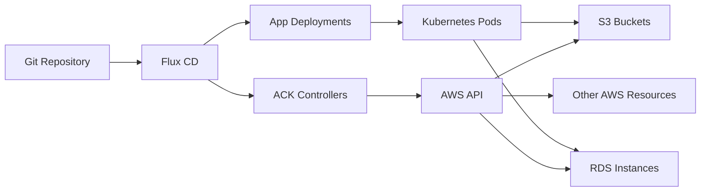

# How to Deploy AWS Controllers for Kubernetes (ACK) with Flux CD

Author: [nawazdhandala](https://github.com/nawazdhandala)

Tags: Flux CD, ack, aws controllers for kubernetes, GitOps, S3, RDS, Kubernetes, AWS

Description: Deploy AWS Controllers for Kubernetes using Flux CD to manage AWS resources like S3 buckets and RDS instances through GitOps.

---

## Introduction

AWS Controllers for Kubernetes (ACK) lets you define and manage AWS resources directly from Kubernetes using custom resources. By combining ACK with Flux CD, you can manage your entire AWS infrastructure through GitOps -- defining S3 buckets, RDS databases, and other AWS services as Kubernetes manifests stored in Git.

This guide covers installing ACK controllers via Flux CD and creating AWS resources declaratively.

## Prerequisites

Before starting, ensure you have:

- An Amazon EKS cluster running Kubernetes 1.25 or later
- Flux CD installed and bootstrapped
- AWS CLI configured with appropriate permissions
- An OIDC provider associated with your EKS cluster
- kubectl access to the cluster

## Architecture Overview



## Step 1: Create IAM Roles for ACK Controllers

Each ACK controller needs its own IAM role. Create roles for the services you plan to manage.

### S3 Controller IAM Role

```bash
ACCOUNT_ID=$(aws sts get-caller-identity --query Account --output text)
OIDC_PROVIDER=$(aws eks describe-cluster \
  --name my-cluster \
  --query "cluster.identity.oidc.issuer" \
  --output text | sed 's|https://||')

# Create trust policy for the S3 controller
cat > s3-trust-policy.json <<EOF
{
  "Version": "2012-10-17",
  "Statement": [
    {
      "Effect": "Allow",
      "Principal": {
        "Federated": "arn:aws:iam::${ACCOUNT_ID}:oidc-provider/${OIDC_PROVIDER}"
      },
      "Action": "sts:AssumeRoleWithWebIdentity",
      "Condition": {
        "StringEquals": {
          "${OIDC_PROVIDER}:sub": "system:serviceaccount:ack-system:ack-s3-controller",
          "${OIDC_PROVIDER}:aud": "sts.amazonaws.com"
        }
      }
    }
  ]
}
EOF

# Create the IAM role for S3 controller
aws iam create-role \
  --role-name ack-s3-controller \
  --assume-role-policy-document file://s3-trust-policy.json

# Attach S3 full access policy
aws iam attach-role-policy \
  --role-name ack-s3-controller \
  --policy-arn arn:aws:iam::aws:policy/AmazonS3FullAccess
```

### RDS Controller IAM Role

```bash
# Create trust policy for the RDS controller
cat > rds-trust-policy.json <<EOF
{
  "Version": "2012-10-17",
  "Statement": [
    {
      "Effect": "Allow",
      "Principal": {
        "Federated": "arn:aws:iam::${ACCOUNT_ID}:oidc-provider/${OIDC_PROVIDER}"
      },
      "Action": "sts:AssumeRoleWithWebIdentity",
      "Condition": {
        "StringEquals": {
          "${OIDC_PROVIDER}:sub": "system:serviceaccount:ack-system:ack-rds-controller",
          "${OIDC_PROVIDER}:aud": "sts.amazonaws.com"
        }
      }
    }
  ]
}
EOF

# Create the IAM role for RDS controller
aws iam create-role \
  --role-name ack-rds-controller \
  --assume-role-policy-document file://rds-trust-policy.json

# Attach RDS full access policy
aws iam attach-role-policy \
  --role-name ack-rds-controller \
  --policy-arn arn:aws:iam::aws:policy/AmazonRDSFullAccess
```

## Step 2: Create the ACK Helm Repository Source

```yaml
# ack-helm-repo.yaml
apiVersion: source.toolkit.fluxcd.io/v1
kind: HelmRepository
metadata:
  name: ack-charts
  namespace: flux-system
spec:
  interval: 1h
  # ACK charts are hosted as OCI artifacts in ECR Public
  type: oci
  url: oci://public.ecr.aws/aws-controllers-k8s
```

## Step 3: Deploy the S3 ACK Controller

```yaml
# ack-s3-controller.yaml
apiVersion: helm.toolkit.fluxcd.io/v2
kind: HelmRelease
metadata:
  name: ack-s3-controller
  namespace: ack-system
spec:
  interval: 15m
  chart:
    spec:
      chart: s3-chart
      version: "1.0.x"
      sourceRef:
        kind: HelmRepository
        name: ack-charts
        namespace: flux-system
  install:
    # Create the namespace if it does not exist
    createNamespace: true
    remediation:
      retries: 3
  upgrade:
    remediation:
      retries: 3
  values:
    # AWS region for the controller
    aws:
      region: us-east-1
    # Service account with IRSA annotation
    serviceAccount:
      annotations:
        eks.amazonaws.com/role-arn: arn:aws:iam::123456789012:role/ack-s3-controller
    # Resource allocation
    resources:
      requests:
        cpu: 50m
        memory: 64Mi
      limits:
        cpu: 100m
        memory: 128Mi
    # Install CRDs with the chart
    installScope: cluster
```

## Step 4: Deploy the RDS ACK Controller

```yaml
# ack-rds-controller.yaml
apiVersion: helm.toolkit.fluxcd.io/v2
kind: HelmRelease
metadata:
  name: ack-rds-controller
  namespace: ack-system
spec:
  interval: 15m
  chart:
    spec:
      chart: rds-chart
      version: "1.4.x"
      sourceRef:
        kind: HelmRepository
        name: ack-charts
        namespace: flux-system
  install:
    createNamespace: true
    remediation:
      retries: 3
  upgrade:
    remediation:
      retries: 3
  values:
    aws:
      region: us-east-1
    serviceAccount:
      annotations:
        eks.amazonaws.com/role-arn: arn:aws:iam::123456789012:role/ack-rds-controller
    resources:
      requests:
        cpu: 50m
        memory: 64Mi
      limits:
        cpu: 100m
        memory: 128Mi
    installScope: cluster
```

## Step 5: Create the Flux Kustomization for ACK Controllers

```yaml
# infrastructure/ack-controllers/kustomization.yaml
apiVersion: kustomize.config.k8s.io/v1beta1
kind: Kustomization
resources:
  - namespace.yaml
  - ack-helm-repo.yaml
  - ack-s3-controller.yaml
  - ack-rds-controller.yaml
```

```yaml
# infrastructure/ack-controllers/namespace.yaml
apiVersion: v1
kind: Namespace
metadata:
  name: ack-system
  labels:
    app.kubernetes.io/managed-by: flux
```

## Step 6: Create an S3 Bucket via ACK

Now that the S3 controller is running, create an S3 bucket using a Kubernetes custom resource.

```yaml
# apps/storage/s3-bucket.yaml
# This creates an actual S3 bucket in AWS via the ACK controller
apiVersion: s3.services.k8s.aws/v1alpha1
kind: Bucket
metadata:
  name: my-app-data-bucket
  namespace: default
spec:
  name: my-app-data-bucket-production
  # Enable versioning
  versioning:
    status: Enabled
  # Server-side encryption
  encryption:
    rules:
      - applyServerSideEncryptionByDefault:
          sseAlgorithm: aws:kms
  # Block all public access
  publicAccessBlock:
    blockPublicAcls: true
    blockPublicPolicy: true
    ignorePublicAcls: true
    restrictPublicBuckets: true
  # Tagging for cost allocation
  tagging:
    tagSet:
      - key: Environment
        value: production
      - key: ManagedBy
        value: flux-ack
```

## Step 7: Create an RDS Instance via ACK

Create an RDS PostgreSQL instance through ACK.

```yaml
# apps/database/db-subnet-group.yaml
# Create a DB subnet group first
apiVersion: rds.services.k8s.aws/v1alpha1
kind: DBSubnetGroup
metadata:
  name: my-app-db-subnets
  namespace: default
spec:
  name: my-app-db-subnets
  description: Subnet group for application database
  subnetIDs:
    - subnet-0abcdef1234567890
    - subnet-0abcdef1234567891
  tags:
    - key: Environment
      value: production
---
# apps/database/rds-instance.yaml
# Create the RDS PostgreSQL instance
apiVersion: rds.services.k8s.aws/v1alpha1
kind: DBInstance
metadata:
  name: my-app-database
  namespace: default
spec:
  # Instance identifier in AWS
  dbInstanceIdentifier: my-app-db-production
  # Engine configuration
  engine: postgres
  engineVersion: "15.4"
  dbInstanceClass: db.t3.medium
  # Storage configuration
  allocatedStorage: 50
  storageType: gp3
  storageEncrypted: true
  # Network configuration
  dbSubnetGroupName: my-app-db-subnets
  vpcSecurityGroupIDs:
    - sg-0123456789abcdef0
  publiclyAccessible: false
  # Database configuration
  dbName: myappdb
  masterUsername: dbadmin
  # Reference a Kubernetes secret for the master password
  masterUserPassword:
    name: rds-master-password
    key: password
  # Backup configuration
  backupRetentionPeriod: 7
  preferredBackupWindow: "03:00-04:00"
  # Maintenance window
  preferredMaintenanceWindow: "sun:05:00-sun:06:00"
  # Enable deletion protection
  deletionProtection: true
  # Multi-AZ for high availability
  multiAZ: true
  # Tags
  tags:
    - key: Environment
      value: production
    - key: ManagedBy
      value: flux-ack
```

## Step 8: Create the Database Password Secret

```yaml
# apps/database/rds-secret.yaml
apiVersion: v1
kind: Secret
metadata:
  name: rds-master-password
  namespace: default
type: Opaque
stringData:
  # In production, use sealed-secrets or external-secrets
  password: "change-me-to-a-secure-password"
```

## Step 9: Create a Kustomization for Application Resources

```yaml
# apps/kustomization.yaml
apiVersion: kustomize.config.k8s.io/v1beta1
kind: Kustomization
resources:
  - storage/s3-bucket.yaml
  - database/db-subnet-group.yaml
  - database/rds-instance.yaml
  - database/rds-secret.yaml
```

```yaml
# clusters/my-cluster/apps.yaml
apiVersion: kustomize.toolkit.fluxcd.io/v1
kind: Kustomization
metadata:
  name: aws-resources
  namespace: flux-system
spec:
  interval: 10m
  sourceRef:
    kind: GitRepository
    name: fleet-infra
  path: ./apps
  prune: true
  # Depend on ACK controllers being installed first
  dependsOn:
    - name: ack-controllers
  # Longer timeout for AWS resource creation
  timeout: 15m
```

## Step 10: Verify AWS Resource Creation

```bash
# Check ACK controller pods
kubectl get pods -n ack-system

# Check the S3 bucket resource status
kubectl describe bucket my-app-data-bucket -n default

# Verify the bucket exists in AWS
aws s3 ls | grep my-app-data-bucket

# Check the RDS instance resource status
kubectl describe dbinstance my-app-database -n default

# Verify the RDS instance in AWS
aws rds describe-db-instances \
  --db-instance-identifier my-app-db-production \
  --query 'DBInstances[0].[DBInstanceStatus,Endpoint.Address]' \
  --output table

# Check Flux reconciliation status
flux get kustomizations
flux get helmreleases -n ack-system
```

## Troubleshooting

```bash
# Issue: ACK controller not starting
# Check the HelmRelease status
flux get helmreleases -n ack-system
kubectl describe helmrelease ack-s3-controller -n ack-system

# Issue: AWS resource stuck in "Creating" state
# Check the controller logs for API errors
kubectl logs -n ack-system -l app.kubernetes.io/name=ack-s3-controller --tail=50

# Issue: Permission denied errors
# Verify IRSA is properly configured
kubectl describe sa ack-s3-controller -n ack-system | grep eks.amazonaws.com

# Issue: Resource not syncing
# Force reconciliation
flux reconcile kustomization aws-resources
```

## Conclusion

Combining ACK with Flux CD provides a powerful GitOps workflow for managing AWS infrastructure alongside your Kubernetes workloads. By defining S3 buckets, RDS instances, and other AWS resources as Kubernetes custom resources, you get the benefits of version control, automated reconciliation, and a unified deployment pipeline for both your applications and their underlying AWS infrastructure.
