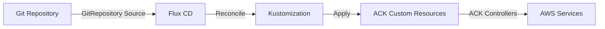

# How to Deploy AWS Resources with ACK and Flux CD

Author: [nawazdhandala](https://github.com/nawazdhandala)

Tags: Flux CD, AWS, ack, GitOps, Kubernetes, IaC, Cloud resources

Description: Learn how to deploy and manage AWS resources using AWS Controllers for Kubernetes (ACK) integrated with Flux CD for GitOps-driven cloud infrastructure.

---

AWS Controllers for Kubernetes (ACK) lets you manage AWS resources directly from your Kubernetes cluster using custom resources. When combined with Flux CD, you get a powerful GitOps workflow for provisioning and managing AWS infrastructure. This guide covers setting up ACK with Flux CD to deploy common AWS resources.

## Prerequisites

Before you begin, ensure you have the following:

- An EKS cluster (v1.26 or later) or any Kubernetes cluster with AWS access
- Flux CD installed on your cluster (v2.x)
- AWS CLI configured with appropriate permissions
- kubectl configured to access your cluster
- An IAM role with permissions for the AWS services you want to manage

## Understanding ACK

ACK provides Kubernetes controllers for AWS services. Each controller manages a specific AWS service and maps AWS resources to Kubernetes custom resources. Flux CD reconciles these resources from a Git repository, creating a GitOps pipeline for AWS infrastructure.



## Step 1: Set Up the Flux CD Git Repository Source

Define a Git repository source for your AWS infrastructure definitions:

```yaml
# git-source.yaml
# Flux CD GitRepository source for AWS infrastructure configs
apiVersion: source.toolkit.fluxcd.io/v1
kind: GitRepository
metadata:
  name: aws-infrastructure
  namespace: flux-system
spec:
  # Check for changes every 5 minutes
  interval: 5m
  url: https://github.com/your-org/aws-infrastructure
  ref:
    branch: main
  secretRef:
    name: git-credentials
```

## Step 2: Install ACK Controllers via Flux CD

Install the ACK controllers using HelmRelease resources. Each AWS service requires its own controller:

```yaml
# ack-s3-controller.yaml
# HelmRepository for ACK charts
apiVersion: source.toolkit.fluxcd.io/v1
kind: HelmRepository
metadata:
  name: ack-charts
  namespace: flux-system
spec:
  interval: 1h
  url: https://aws-controllers-k8s.github.io/community/helm
---
# HelmRelease to install the ACK S3 controller
apiVersion: helm.toolkit.fluxcd.io/v2
kind: HelmRelease
metadata:
  name: ack-s3-controller
  namespace: ack-system
spec:
  interval: 10m
  chart:
    spec:
      chart: s3-chart
      version: "1.0.x"
      sourceRef:
        kind: HelmRepository
        name: ack-charts
        namespace: flux-system
  values:
    # Configure the AWS region for the controller
    aws:
      region: us-east-1
    # Use IRSA for authentication
    serviceAccount:
      annotations:
        eks.amazonaws.com/role-arn: arn:aws:iam::123456789012:role/ack-s3-controller
```

## Step 3: Install Additional ACK Controllers

Install controllers for other AWS services you need:

```yaml
# ack-rds-controller.yaml
# HelmRelease for the ACK RDS controller
apiVersion: helm.toolkit.fluxcd.io/v2
kind: HelmRelease
metadata:
  name: ack-rds-controller
  namespace: ack-system
spec:
  interval: 10m
  chart:
    spec:
      chart: rds-chart
      version: "1.4.x"
      sourceRef:
        kind: HelmRepository
        name: ack-charts
        namespace: flux-system
  values:
    aws:
      region: us-east-1
    serviceAccount:
      annotations:
        eks.amazonaws.com/role-arn: arn:aws:iam::123456789012:role/ack-rds-controller
---
# ack-ec2-controller.yaml
# HelmRelease for the ACK EC2 controller
apiVersion: helm.toolkit.fluxcd.io/v2
kind: HelmRelease
metadata:
  name: ack-ec2-controller
  namespace: ack-system
spec:
  interval: 10m
  chart:
    spec:
      chart: ec2-chart
      version: "1.2.x"
      sourceRef:
        kind: HelmRepository
        name: ack-charts
        namespace: flux-system
  values:
    aws:
      region: us-east-1
    serviceAccount:
      annotations:
        eks.amazonaws.com/role-arn: arn:aws:iam::123456789012:role/ack-ec2-controller
```

## Step 4: Deploy an S3 Bucket

Create an S3 bucket using the ACK S3 custom resource:

```yaml
# s3-bucket.yaml
# ACK S3 Bucket custom resource managed by Flux CD
apiVersion: s3.services.k8s.aws/v1alpha1
kind: Bucket
metadata:
  name: my-app-data-bucket
  namespace: default
  # Annotations to help ACK manage the resource
  annotations:
    services.k8s.aws/region: us-east-1
spec:
  # Globally unique bucket name
  name: my-app-data-bucket-production
  # Enable versioning for data protection
  versioning:
    status: Enabled
  # Configure server-side encryption
  encryption:
    rules:
      - applyServerSideEncryptionByDefault:
          sseAlgorithm: aws:kms
          kmsMasterKeyID: alias/my-kms-key
  # Block public access
  publicAccessBlock:
    blockPublicAcls: true
    blockPublicPolicy: true
    ignorePublicAcls: true
    restrictPublicBuckets: true
  # Add tags for resource tracking
  tagging:
    tagSet:
      - key: Environment
        value: production
      - key: ManagedBy
        value: flux-cd-ack
```

## Step 5: Deploy an RDS Database

Create an RDS database instance:

```yaml
# rds-instance.yaml
# ACK RDS DBInstance for a PostgreSQL database
apiVersion: rds.services.k8s.aws/v1alpha1
kind: DBInstance
metadata:
  name: my-app-database
  namespace: default
spec:
  # Unique identifier for the database instance
  dbInstanceIdentifier: my-app-db-production
  # Database engine configuration
  engine: postgres
  engineVersion: "15.4"
  # Instance sizing
  dbInstanceClass: db.t3.medium
  # Storage configuration
  allocatedStorage: 100
  storageType: gp3
  storageEncrypted: true
  # Database credentials from a Kubernetes secret
  masterUsername: dbadmin
  masterUserPassword:
    name: rds-credentials
    key: password
  # Network configuration
  dbSubnetGroupName: my-app-db-subnet-group
  vpcSecurityGroupIDs:
    - sg-0123456789abcdef0
  # Backup configuration
  backupRetentionPeriod: 7
  preferredBackupWindow: "03:00-04:00"
  # Enable Multi-AZ for high availability
  multiAZ: true
  # Tags for the resource
  tags:
    - key: Environment
      value: production
    - key: ManagedBy
      value: flux-cd-ack
```

## Step 6: Deploy a VPC with Subnets

Set up networking using ACK EC2 resources:

```yaml
# vpc.yaml
# ACK EC2 VPC resource
apiVersion: ec2.services.k8s.aws/v1alpha1
kind: VPC
metadata:
  name: my-app-vpc
  namespace: default
spec:
  # CIDR block for the VPC
  cidrBlock: "10.0.0.0/16"
  # Enable DNS support
  enableDNSSupport: true
  enableDNSHostnames: true
  tags:
    - key: Name
      value: my-app-vpc-production
    - key: ManagedBy
      value: flux-cd-ack
---
# subnet-public.yaml
# ACK EC2 Subnet resource for a public subnet
apiVersion: ec2.services.k8s.aws/v1alpha1
kind: Subnet
metadata:
  name: public-subnet-1a
  namespace: default
spec:
  # CIDR for this subnet
  cidrBlock: "10.0.1.0/24"
  # The VPC reference
  vpcID: vpc-0123456789abcdef0
  # Availability zone
  availabilityZone: us-east-1a
  # Map public IPs to instances in this subnet
  mapPublicIPOnLaunch: true
  tags:
    - key: Name
      value: public-subnet-1a
    - key: kubernetes.io/role/elb
      value: "1"
```

## Step 7: Create the Flux CD Kustomization

Tie everything together with a Kustomization that deploys all ACK resources:

```yaml
# kustomization.yaml
# Flux CD Kustomization for deploying AWS resources via ACK
apiVersion: kustomize.toolkit.fluxcd.io/v1
kind: Kustomization
metadata:
  name: aws-infrastructure
  namespace: flux-system
spec:
  interval: 10m
  # Reference the Git repository source
  sourceRef:
    kind: GitRepository
    name: aws-infrastructure
  # Path within the repository containing the ACK resources
  path: ./aws/production
  # Prune resources that are removed from the repository
  prune: true
  # Wait for resources to become ready
  wait: true
  # Set a timeout for resource readiness
  timeout: 30m
  # Health checks for deployed resources
  healthChecks:
    - apiVersion: s3.services.k8s.aws/v1alpha1
      kind: Bucket
      name: my-app-data-bucket
      namespace: default
    - apiVersion: rds.services.k8s.aws/v1alpha1
      kind: DBInstance
      name: my-app-database
      namespace: default
  # Define dependencies to ensure proper ordering
  dependsOn:
    - name: ack-controllers
```

## Step 8: Set Up IAM Roles for Service Accounts (IRSA)

Create the IAM trust policy for ACK controllers:

```yaml
# ack-service-account.yaml
# Service account with IRSA annotation for ACK S3 controller
apiVersion: v1
kind: ServiceAccount
metadata:
  name: ack-s3-controller
  namespace: ack-system
  annotations:
    # IRSA annotation that links the service account to an IAM role
    eks.amazonaws.com/role-arn: arn:aws:iam::123456789012:role/ack-s3-controller
```

Create the IAM policy:

```bash
# Create an IAM policy for the ACK S3 controller
cat > s3-policy.json << 'EOF'
{
  "Version": "2012-10-17",
  "Statement": [
    {
      "Effect": "Allow",
      "Action": [
        "s3:CreateBucket",
        "s3:DeleteBucket",
        "s3:PutBucketVersioning",
        "s3:PutEncryptionConfiguration",
        "s3:PutBucketPublicAccessBlock",
        "s3:PutBucketTagging",
        "s3:GetBucketVersioning",
        "s3:GetEncryptionConfiguration",
        "s3:GetBucketPublicAccessBlock",
        "s3:GetBucketTagging",
        "s3:ListBucket"
      ],
      "Resource": "*"
    }
  ]
}
EOF

aws iam create-policy \
  --policy-name ack-s3-controller-policy \
  --policy-document file://s3-policy.json
```

## Step 9: Configure Notifications

Set up alerts for ACK resource status changes:

```yaml
# ack-alerts.yaml
# Alert for ACK resource changes managed by Flux CD
apiVersion: notification.toolkit.fluxcd.io/v1
kind: Alert
metadata:
  name: ack-resource-alerts
  namespace: flux-system
spec:
  providerRef:
    name: slack-provider
  eventSources:
    # Watch the Kustomization that deploys ACK resources
    - kind: Kustomization
      name: aws-infrastructure
      namespace: flux-system
  eventSeverity: info
```

## Step 10: Verify the Deployment

Check that all resources are deployed and synced:

```bash
# Verify ACK controllers are running
kubectl get pods -n ack-system

# Check the status of ACK resources
kubectl get buckets.s3.services.k8s.aws -n default
kubectl get dbinstances.rds.services.k8s.aws -n default

# Check Flux CD reconciliation status
flux get kustomizations

# View detailed status of a specific resource
kubectl describe bucket.s3.services.k8s.aws my-app-data-bucket -n default

# Check for any errors in the ACK controller logs
kubectl logs -n ack-system deployment/ack-s3-controller -f
```

## Best Practices

1. **Use IRSA** for authentication instead of static AWS credentials
2. **Separate controllers by service** -- install only the ACK controllers you need
3. **Use namespaces** to organize resources by environment or team
4. **Enable pruning** in Flux CD Kustomizations to clean up deleted resources
5. **Tag all resources** with metadata for cost tracking and ownership
6. **Set appropriate reconciliation intervals** based on resource criticality
7. **Use Flux CD dependencies** to ensure resources are created in the correct order

## Conclusion

ACK and Flux CD together provide a powerful way to manage AWS infrastructure using Kubernetes-native resources and GitOps workflows. By defining your AWS resources as Kubernetes custom resources in a Git repository, you gain version control, auditability, and automated reconciliation. This approach simplifies multi-cloud management and lets platform teams provide self-service infrastructure to development teams through familiar Kubernetes interfaces.
