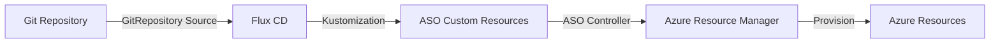

# How to Deploy Azure Resources with ASO and Flux CD

Author: [nawazdhandala](https://github.com/nawazdhandala)

Tags: Flux CD, Azure, aso, GitOps, Kubernetes, IaC, cloud resources

Description: Learn how to deploy and manage Azure resources using Azure Service Operator (ASO) integrated with Flux CD for GitOps-driven cloud infrastructure.

---

Azure Service Operator (ASO) allows you to provision and manage Azure resources directly from Kubernetes. When paired with Flux CD, you get a GitOps pipeline that automatically reconciles your desired Azure infrastructure state from a Git repository. This guide walks through deploying common Azure resources using ASO and Flux CD.

## Prerequisites

Before you begin, ensure you have the following:

- An AKS cluster (v1.26 or later) or any Kubernetes cluster
- Flux CD installed on your cluster (v2.x)
- Azure CLI configured with appropriate permissions
- kubectl configured to access your cluster
- An Azure service principal or managed identity with required permissions

## Understanding ASO

Azure Service Operator v2 provides Kubernetes custom resource definitions (CRDs) for Azure services. Each Azure resource type is represented as a Kubernetes custom resource. Flux CD watches your Git repository and reconciles ASO resources automatically.



## Step 1: Install ASO with Flux CD

Create HelmRelease resources to install ASO:

```yaml
# aso-helm-repo.yaml
# HelmRepository for the ASO Helm chart
apiVersion: source.toolkit.fluxcd.io/v1
kind: HelmRepository
metadata:
  name: aso-charts
  namespace: flux-system
spec:
  interval: 1h
  url: https://raw.githubusercontent.com/Azure/azure-service-operator/main/v2/charts
---
# aso-helmrelease.yaml
# HelmRelease to install Azure Service Operator v2
apiVersion: helm.toolkit.fluxcd.io/v2
kind: HelmRelease
metadata:
  name: azure-service-operator
  namespace: azureserviceoperator-system
spec:
  interval: 10m
  chart:
    spec:
      chart: azure-service-operator
      version: "2.6.x"
      sourceRef:
        kind: HelmRepository
        name: aso-charts
        namespace: flux-system
  values:
    # Configure the Azure credentials
    azureSubscriptionID: "your-subscription-id"
    # Use workload identity for authentication (recommended)
    useWorkloadIdentityAuth: true
    # Install CRDs for the services you need
    crdPattern: "resources.azure.com/*;containerservice.azure.com/*;dbforpostgresql.azure.com/*;storage.azure.com/*;network.azure.com/*"
```

## Step 2: Configure Azure Credentials

Create a secret with Azure service principal credentials:

```yaml
# azure-credentials.yaml
# Secret containing Azure service principal credentials for ASO
apiVersion: v1
kind: Secret
metadata:
  name: aso-credential
  namespace: azureserviceoperator-system
type: Opaque
stringData:
  # Azure Active Directory tenant ID
  AZURE_TENANT_ID: "your-tenant-id"
  # Azure subscription ID
  AZURE_SUBSCRIPTION_ID: "your-subscription-id"
  # Service principal client ID
  AZURE_CLIENT_ID: "your-client-id"
  # Service principal client secret
  AZURE_CLIENT_SECRET: "your-client-secret"
```

## Step 3: Create a Resource Group

Define an Azure Resource Group:

```yaml
# resource-group.yaml
# ASO ResourceGroup custom resource
apiVersion: resources.azure.com/v1api20200601
kind: ResourceGroup
metadata:
  name: my-app-rg
  namespace: default
spec:
  # Azure region where the resource group will be created
  location: eastus
  # Tags for the resource group
  tags:
    environment: production
    managedBy: flux-cd-aso
```

## Step 4: Deploy an Azure Storage Account

Create a storage account within the resource group:

```yaml
# storage-account.yaml
# ASO StorageAccount custom resource
apiVersion: storage.azure.com/v1api20230101
kind: StorageAccount
metadata:
  name: myappstorageaccount
  namespace: default
spec:
  # Reference to the resource group
  owner:
    name: my-app-rg
  # Azure region
  location: eastus
  # Storage account kind and SKU
  kind: StorageV2
  sku:
    name: Standard_LRS
  # Enable HTTPS traffic only
  supportsHttpsTrafficOnly: true
  # Minimum TLS version
  minimumTlsVersion: TLS1_2
  # Configure blob service properties
  allowBlobPublicAccess: false
  # Network rules
  networkAcls:
    defaultAction: Deny
    bypass: AzureServices
  # Tags
  tags:
    environment: production
    managedBy: flux-cd-aso
```

## Step 5: Deploy an Azure PostgreSQL Flexible Server

Provision a managed PostgreSQL database:

```yaml
# postgresql-server.yaml
# ASO PostgreSQL Flexible Server
apiVersion: dbforpostgresql.azure.com/v1api20230601
kind: FlexibleServer
metadata:
  name: my-app-postgres
  namespace: default
spec:
  # Reference to the resource group
  owner:
    name: my-app-rg
  location: eastus
  # PostgreSQL version
  version: "15"
  # Server SKU
  sku:
    name: Standard_D2s_v3
    tier: GeneralPurpose
  # Storage configuration
  storage:
    storageSizeGB: 128
    autoGrow: Enabled
  # High availability configuration
  highAvailability:
    mode: ZoneRedundant
  # Backup configuration
  backup:
    backupRetentionDays: 7
    geoRedundantBackup: Disabled
  # Admin credentials from a Kubernetes secret
  administratorLogin: pgadmin
  administratorLoginPassword:
    name: postgres-credentials
    key: password
  tags:
    environment: production
    managedBy: flux-cd-aso
---
# postgresql-database.yaml
# ASO PostgreSQL Database within the flexible server
apiVersion: dbforpostgresql.azure.com/v1api20230601
kind: FlexibleServersDatabase
metadata:
  name: my-app-db
  namespace: default
spec:
  # Reference to the parent PostgreSQL server
  owner:
    name: my-app-postgres
  # Character set configuration
  charset: UTF8
  collation: en_US.utf8
```

## Step 6: Deploy a Virtual Network

Create networking resources:

```yaml
# virtual-network.yaml
# ASO Virtual Network
apiVersion: network.azure.com/v1api20240101
kind: VirtualNetwork
metadata:
  name: my-app-vnet
  namespace: default
spec:
  owner:
    name: my-app-rg
  location: eastus
  # Address space for the virtual network
  addressSpace:
    addressPrefixes:
      - "10.0.0.0/16"
  tags:
    environment: production
    managedBy: flux-cd-aso
---
# subnet.yaml
# ASO Subnet within the virtual network
apiVersion: network.azure.com/v1api20240101
kind: VirtualNetworksSubnet
metadata:
  name: app-subnet
  namespace: default
spec:
  owner:
    name: my-app-vnet
  # Subnet address prefix
  addressPrefix: "10.0.1.0/24"
  # Service endpoints
  serviceEndpoints:
    - service: Microsoft.Storage
    - service: Microsoft.Sql
---
# nsg.yaml
# ASO Network Security Group
apiVersion: network.azure.com/v1api20240101
kind: NetworkSecurityGroup
metadata:
  name: my-app-nsg
  namespace: default
spec:
  owner:
    name: my-app-rg
  location: eastus
  tags:
    environment: production
```

## Step 7: Create the Flux CD Kustomization

Define a Kustomization to manage all ASO resources:

```yaml
# kustomization.yaml
# Flux CD Kustomization for deploying Azure resources via ASO
apiVersion: kustomize.toolkit.fluxcd.io/v1
kind: Kustomization
metadata:
  name: azure-infrastructure
  namespace: flux-system
spec:
  interval: 10m
  sourceRef:
    kind: GitRepository
    name: azure-infrastructure
  path: ./azure/production
  # Prune resources when removed from Git
  prune: true
  wait: true
  timeout: 30m
  # Ensure ASO is installed before deploying resources
  dependsOn:
    - name: azure-service-operator
  # Health checks for deployed resources
  healthChecks:
    - apiVersion: resources.azure.com/v1api20200601
      kind: ResourceGroup
      name: my-app-rg
      namespace: default
```

## Step 8: Export Resource Secrets

Configure ASO to export connection details to Kubernetes secrets:

```yaml
# storage-account-with-secret.yaml
# Storage account that exports its keys to a Kubernetes secret
apiVersion: storage.azure.com/v1api20230101
kind: StorageAccount
metadata:
  name: myappstorageaccount
  namespace: default
spec:
  owner:
    name: my-app-rg
  location: eastus
  kind: StorageV2
  sku:
    name: Standard_LRS
  # Export connection details to a Kubernetes secret
  operatorSpec:
    secrets:
      # Store the storage account key in a Kubernetes secret
      key1:
        name: storage-account-keys
        key: primary-key
      # Store the connection string
      connectionString1:
        name: storage-account-keys
        key: connection-string
```

## Step 9: Set Up Multi-Environment Deployments

Use Kustomize overlays for different environments:

```yaml
# base/kustomization.yaml
# Base Kustomization for shared ASO resource definitions
apiVersion: kustomize.config.k8s.io/v1beta1
kind: Kustomization
resources:
  - resource-group.yaml
  - storage-account.yaml
  - postgresql-server.yaml
  - virtual-network.yaml
---
# overlays/production/kustomization.yaml
# Production overlay with production-specific patches
apiVersion: kustomize.config.k8s.io/v1beta1
kind: Kustomization
resources:
  - ../../base
patches:
  - target:
      kind: FlexibleServer
      name: my-app-postgres
    patch: |
      - op: replace
        path: /spec/sku/name
        value: Standard_D4s_v3
      - op: replace
        path: /spec/storage/storageSizeGB
        value: 256
```

## Step 10: Verify the Deployment

Check that all Azure resources are properly provisioned:

```bash
# Check ASO controller status
kubectl get pods -n azureserviceoperator-system

# List all ASO resources
kubectl get resourcegroups.resources.azure.com
kubectl get storageaccounts.storage.azure.com
kubectl get flexibleservers.dbforpostgresql.azure.com

# Check Flux CD reconciliation status
flux get kustomizations

# View detailed status of a resource
kubectl describe storageaccount myappstorageaccount

# Verify resource exists in Azure
az group show --name my-app-rg
az storage account show --name myappstorageaccount --resource-group my-app-rg
```

## Best Practices

1. **Use workload identity** instead of service principal secrets when running on AKS
2. **Install only needed CRDs** using the crdPattern configuration to reduce cluster overhead
3. **Use owner references** to establish parent-child relationships between Azure resources
4. **Export secrets** using operatorSpec to make connection details available to applications
5. **Use Kustomize overlays** for multi-environment configurations
6. **Enable Flux CD pruning** to automatically delete Azure resources removed from Git
7. **Set health checks** in Flux CD Kustomizations to track provisioning status

## Conclusion

Azure Service Operator and Flux CD together provide a Kubernetes-native, GitOps-driven approach to managing Azure infrastructure. By representing Azure resources as Kubernetes custom resources and storing them in Git, you achieve full auditability, version control, and automated reconciliation. This approach integrates naturally with existing Kubernetes workflows and allows platform teams to offer self-service Azure resource provisioning through familiar Kubernetes interfaces.
