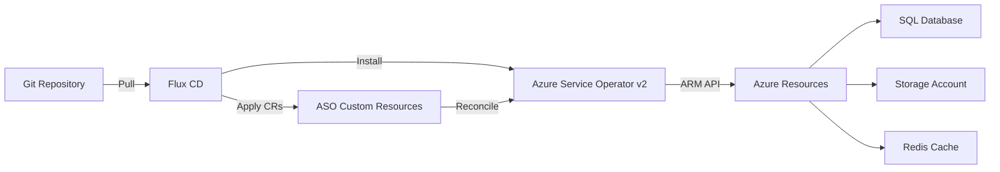

# How to Deploy Azure Service Operator with Flux CD

Author: [nawazdhandala](https://github.com/nawazdhandala)

Tags: flux-cd, Azure, azure-service-operator, GitOps, Kubernetes, Infrastructure-as-Code, ASO

Description: Learn how to install Azure Service Operator v2 via Flux CD and manage Azure resources like databases, storage accounts, and more through GitOps.

---

## Introduction

Azure Service Operator (ASO) v2 allows you to provision and manage Azure resources directly from Kubernetes using custom resource definitions (CRDs). When combined with Flux CD, you can manage both your Kubernetes workloads and the underlying Azure infrastructure through a single GitOps workflow. This means your database, storage accounts, Redis caches, and other Azure services are defined as YAML manifests in Git and reconciled automatically.

This guide walks through installing ASO v2 using Flux CD, configuring authentication, and creating Azure resources through GitOps.

## Prerequisites

- An AKS cluster with Flux CD installed
- Azure CLI (v2.50 or later)
- Flux CLI (v2.2 or later)
- Workload identity enabled on the AKS cluster
- An Azure subscription with permissions to create resources

## Architecture



## Step 1: Set Up Authentication for ASO

ASO needs credentials to manage Azure resources. Workload identity is the recommended authentication method.

```bash
# Set variables
export RESOURCE_GROUP="rg-fluxcd-demo"
export CLUSTER_NAME="aks-fluxcd-demo"
export LOCATION="eastus"
export ASO_IDENTITY_NAME="id-aso-controller"
export SUBSCRIPTION_ID=$(az account show --query "id" --output tsv)
export TENANT_ID=$(az account show --query "tenantId" --output tsv)

# Create a user-assigned managed identity for ASO
az identity create \
  --resource-group $RESOURCE_GROUP \
  --name $ASO_IDENTITY_NAME \
  --location $LOCATION

# Get the identity details
export ASO_CLIENT_ID=$(az identity show \
  --resource-group $RESOURCE_GROUP \
  --name $ASO_IDENTITY_NAME \
  --query "clientId" \
  --output tsv)

export ASO_PRINCIPAL_ID=$(az identity show \
  --resource-group $RESOURCE_GROUP \
  --name $ASO_IDENTITY_NAME \
  --query "principalId" \
  --output tsv)

# Grant Contributor role on the subscription (or scope to a resource group)
az role assignment create \
  --assignee $ASO_PRINCIPAL_ID \
  --role "Contributor" \
  --scope "/subscriptions/${SUBSCRIPTION_ID}"
```

### Create Federated Credential for ASO

```bash
# Get the OIDC issuer URL
export OIDC_ISSUER=$(az aks show \
  --resource-group $RESOURCE_GROUP \
  --name $CLUSTER_NAME \
  --query "oidcIssuerProfile.issuerUrl" \
  --output tsv)

# Create federated credential for the ASO controller service account
az identity federated-credential create \
  --name "aso-controller-fed" \
  --identity-name $ASO_IDENTITY_NAME \
  --resource-group $RESOURCE_GROUP \
  --issuer $OIDC_ISSUER \
  --subject "system:serviceaccount:azureserviceoperator-system:azureserviceoperator-default" \
  --audiences "api://AzureADTokenExchange"
```

## Step 2: Create the ASO Credential Secret

ASO requires a secret with Azure credential information.

```yaml
# File: clusters/my-cluster/aso/namespace.yaml
apiVersion: v1
kind: Namespace
metadata:
  name: azureserviceoperator-system
  labels:
    app.kubernetes.io/managed-by: flux
---
# File: clusters/my-cluster/aso/aso-credential-secret.yaml
apiVersion: v1
kind: Secret
metadata:
  name: aso-credential
  namespace: azureserviceoperator-system
type: Opaque
stringData:
  # Subscription where ASO will create resources
  AZURE_SUBSCRIPTION_ID: "<SUBSCRIPTION_ID>"
  # Tenant ID of your Azure AD
  AZURE_TENANT_ID: "<TENANT_ID>"
  # Client ID of the managed identity
  AZURE_CLIENT_ID: "<ASO_CLIENT_ID>"
  # Use workload identity authentication
  AUTH_MODE: "workloadidentity"
```

## Step 3: Install ASO v2 via Flux CD HelmRelease

```yaml
# File: clusters/my-cluster/aso/helm-source.yaml
apiVersion: source.toolkit.fluxcd.io/v1
kind: HelmRepository
metadata:
  name: aso-helm-repo
  namespace: flux-system
spec:
  type: oci
  interval: 30m
  # ASO Helm charts are published to GitHub Container Registry
  url: oci://ghcr.io/azure/azure-service-operator
```

```yaml
# File: clusters/my-cluster/aso/helm-release.yaml
apiVersion: helm.toolkit.fluxcd.io/v2
kind: HelmRelease
metadata:
  name: azure-service-operator
  namespace: azureserviceoperator-system
spec:
  interval: 15m
  chart:
    spec:
      chart: azure-service-operator
      version: "2.x"
      sourceRef:
        kind: HelmRepository
        name: aso-helm-repo
        namespace: flux-system
  install:
    # CRDs are managed by the Helm chart
    crds: CreateReplace
    remediation:
      retries: 3
  upgrade:
    crds: CreateReplace
    remediation:
      retries: 3
  values:
    # Configure workload identity for ASO
    azureSubscriptionID: "<SUBSCRIPTION_ID>"
    azureTenantID: "<TENANT_ID>"
    azureClientID: "<ASO_CLIENT_ID>"
    useWorkloadIdentityAuth: true
    # Install only the CRDs you need to reduce cluster resource usage
    crdPattern: "resources.azure.com/*;dbforpostgresql.azure.com/*;cache.azure.com/*;storage.azure.com/*;network.azure.com/*"
```

## Step 4: Create a Flux Kustomization for ASO

```yaml
# File: clusters/my-cluster/aso/kustomization.yaml
apiVersion: kustomize.config.k8s.io/v1beta1
kind: Kustomization
resources:
  - namespace.yaml
  - aso-credential-secret.yaml
  - helm-source.yaml
  - helm-release.yaml
```

```yaml
# File: clusters/my-cluster/aso-kustomization.yaml
apiVersion: kustomize.toolkit.fluxcd.io/v1
kind: Kustomization
metadata:
  name: azure-service-operator
  namespace: flux-system
spec:
  interval: 10m
  sourceRef:
    kind: GitRepository
    name: flux-system
  path: ./clusters/my-cluster/aso
  prune: true
  wait: true
  timeout: 10m
```

## Step 5: Verify ASO Installation

```bash
# Check that the ASO pods are running
kubectl get pods -n azureserviceoperator-system

# Verify the HelmRelease is reconciled
flux get helmreleases -n azureserviceoperator-system

# Check that ASO CRDs are installed
kubectl get crds | grep azure.com

# Check ASO controller logs
kubectl logs -n azureserviceoperator-system \
  deployment/azureserviceoperator-controller-manager \
  --tail=50
```

## Step 6: Create Azure Resources via GitOps

Now you can define Azure resources as Kubernetes custom resources and manage them through Flux CD.

### Create a Resource Group

```yaml
# File: apps/azure-resources/resource-group.yaml
apiVersion: resources.azure.com/v1api20200601
kind: ResourceGroup
metadata:
  name: rg-app-resources
  namespace: default
spec:
  location: eastus
  tags:
    managed-by: flux-cd
    environment: production
```

### Create an Azure Database for PostgreSQL

```yaml
# File: apps/azure-resources/postgresql-server.yaml
apiVersion: dbforpostgresql.azure.com/v1api20221201
kind: FlexibleServer
metadata:
  name: psql-myapp-prod
  namespace: default
spec:
  location: eastus
  owner:
    # Reference the resource group created above
    name: rg-app-resources
  version: "15"
  sku:
    name: Standard_B2s
    tier: Burstable
  storage:
    storageSizeGB: 32
  # Administrator credentials stored as a Kubernetes secret
  administratorLogin: psqladmin
  administratorLoginPassword:
    name: psql-admin-password
    key: password
  tags:
    managed-by: flux-cd
---
# File: apps/azure-resources/postgresql-database.yaml
apiVersion: dbforpostgresql.azure.com/v1api20221201
kind: FlexibleServersDatabase
metadata:
  name: myapp-db
  namespace: default
spec:
  owner:
    name: psql-myapp-prod
  charset: UTF8
  collation: en_US.utf8
```

### Create an Azure Storage Account

```yaml
# File: apps/azure-resources/storage-account.yaml
apiVersion: storage.azure.com/v1api20230101
kind: StorageAccount
metadata:
  name: stmyappprod
  namespace: default
spec:
  location: eastus
  owner:
    name: rg-app-resources
  kind: StorageV2
  sku:
    name: Standard_LRS
  # Enable secure transfer
  supportsHttpsTrafficOnly: true
  minimumTlsVersion: TLS1_2
  tags:
    managed-by: flux-cd
    environment: production
```

### Create an Azure Cache for Redis

```yaml
# File: apps/azure-resources/redis-cache.yaml
apiVersion: cache.azure.com/v1api20230801
kind: Redis
metadata:
  name: redis-myapp-prod
  namespace: default
spec:
  location: eastus
  owner:
    name: rg-app-resources
  sku:
    name: Basic
    family: C
    capacity: 1
  enableNonSslPort: false
  minimumTlsVersion: "1.2"
  redisConfiguration:
    maxmemoryPolicy: allkeys-lru
  tags:
    managed-by: flux-cd
```

## Step 7: Export Connection Strings to Kubernetes Secrets

ASO can automatically export connection information to Kubernetes secrets.

```yaml
# File: apps/azure-resources/postgresql-secret-export.yaml
apiVersion: dbforpostgresql.azure.com/v1api20221201
kind: FlexibleServer
metadata:
  name: psql-myapp-prod
  namespace: default
spec:
  location: eastus
  owner:
    name: rg-app-resources
  version: "15"
  sku:
    name: Standard_B2s
    tier: Burstable
  storage:
    storageSizeGB: 32
  administratorLogin: psqladmin
  administratorLoginPassword:
    name: psql-admin-password
    key: password
  # Export connection details to a Kubernetes secret
  operatorSpec:
    secrets:
      fullyQualifiedDomainName:
        name: psql-connection
        key: hostname
```

## Step 8: Create a Kustomization for Azure Resources

```yaml
# File: apps/azure-resources/kustomization.yaml
apiVersion: kustomize.config.k8s.io/v1beta1
kind: Kustomization
resources:
  # Resource group must be created first
  - resource-group.yaml
  # Then create dependent resources
  - storage-account.yaml
  - postgresql-server.yaml
  - postgresql-database.yaml
  - redis-cache.yaml
```

```yaml
# File: clusters/my-cluster/azure-resources-kustomization.yaml
apiVersion: kustomize.toolkit.fluxcd.io/v1
kind: Kustomization
metadata:
  name: azure-resources
  namespace: flux-system
spec:
  interval: 10m
  sourceRef:
    kind: GitRepository
    name: flux-system
  path: ./apps/azure-resources
  prune: true
  # Wait for ASO to be installed first
  dependsOn:
    - name: azure-service-operator
  # Longer timeout since Azure resource creation can take time
  timeout: 30m
  wait: true
  healthChecks:
    - apiVersion: resources.azure.com/v1api20200601
      kind: ResourceGroup
      name: rg-app-resources
      namespace: default
```

## Step 9: Monitor Azure Resource Status

```bash
# Check the status of all ASO-managed resources
kubectl get resourcegroups,flexibleservers,storageaccounts,redis -A

# Get detailed status of a specific resource
kubectl describe flexibleserver psql-myapp-prod -n default

# Check for provisioning status
kubectl get flexibleserver psql-myapp-prod -n default \
  -o jsonpath='{.status.conditions[?(@.type=="Ready")]}'

# View ASO controller logs for resource creation progress
kubectl logs -n azureserviceoperator-system \
  deployment/azureserviceoperator-controller-manager \
  --tail=100 | grep "psql-myapp"
```

## Troubleshooting

### Resource Stuck in Provisioning

```bash
# Check the resource conditions
kubectl get flexibleserver psql-myapp-prod -n default -o yaml | grep -A5 conditions

# Check for Azure-side errors
kubectl describe flexibleserver psql-myapp-prod -n default
```

### Authentication Errors

```bash
# Verify the ASO credential secret
kubectl get secret aso-credential -n azureserviceoperator-system -o yaml

# Check the workload identity is configured
kubectl get serviceaccount azureserviceoperator-default \
  -n azureserviceoperator-system -o yaml
```

### CRD Not Found

If a CRD is not available, update the `crdPattern` in the HelmRelease values:

```bash
# List installed ASO CRDs
kubectl get crds | grep azure.com | sort
```

### Resource Deletion

When Flux prunes a resource, ASO will delete the corresponding Azure resource. To prevent accidental deletion, use the reconcile policy annotation:

```yaml
apiVersion: resources.azure.com/v1api20200601
kind: ResourceGroup
metadata:
  name: rg-important-data
  namespace: default
  annotations:
    # Prevent ASO from deleting the Azure resource when the CR is deleted
    serviceoperator.azure.com/reconcile-policy: detach-on-delete
spec:
  location: eastus
```

## Conclusion

Deploying Azure Service Operator with Flux CD creates a unified GitOps workflow for managing both Kubernetes workloads and Azure infrastructure. By defining Azure resources as Kubernetes custom resources in Git, you get version control, code review, and automated reconciliation for your entire stack. ASO v2 supports a wide range of Azure services, and the combination with Flux CD ensures that your infrastructure stays in sync with your declared desired state.
