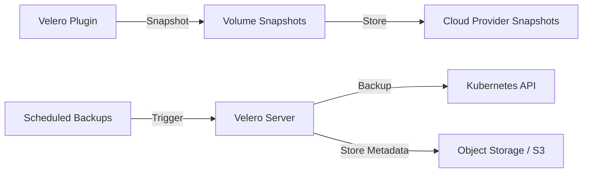

# How to Deploy Backup Solutions with Flux CD

Author: [nawazdhandala](https://github.com/nawazdhandala)

Tags: flux cd, velero, backup, disaster recovery, kubernetes, gitops, restore

Description: A practical guide to deploying and managing Velero for Kubernetes cluster backups using Flux CD and GitOps principles.

---

## Introduction

Backups are a critical component of any production Kubernetes deployment. Velero is an open-source tool that provides backup and restore capabilities for Kubernetes cluster resources and persistent volumes. When managed through Flux CD, your backup configuration becomes declarative, version-controlled, and consistently applied across clusters.

This guide covers deploying Velero with Flux CD, configuring backup schedules, setting up disaster recovery procedures, and managing backup policies through GitOps.

## Prerequisites

- A running Kubernetes cluster
- Flux CD installed and bootstrapped
- An S3-compatible object storage bucket for backup storage
- Cloud provider credentials with appropriate permissions
- kubectl access to your cluster

## Architecture Overview



## Repository Structure

```
infrastructure/
  velero/
    namespace.yaml
    helmrepository.yaml
    helmrelease.yaml
    schedules/
      daily-backup.yaml
      weekly-full-backup.yaml
      namespace-backup.yaml
    restore/
      restore-template.yaml
```

## Creating the Namespace

```yaml
# infrastructure/velero/namespace.yaml
apiVersion: v1
kind: Namespace
metadata:
  name: velero
  labels:
    monitoring: enabled
```

## Adding the Helm Repository

```yaml
# infrastructure/velero/helmrepository.yaml
apiVersion: source.toolkit.fluxcd.io/v1
kind: HelmRepository
metadata:
  name: vmware-tanzu
  namespace: flux-system
spec:
  interval: 1h
  url: https://vmware-tanzu.github.io/helm-charts
```

## Deploying Velero for AWS

```yaml
# infrastructure/velero/helmrelease.yaml
apiVersion: helm.toolkit.fluxcd.io/v1
kind: HelmRelease
metadata:
  name: velero
  namespace: velero
spec:
  interval: 30m
  chart:
    spec:
      chart: velero
      version: "7.x"
      sourceRef:
        kind: HelmRepository
        name: vmware-tanzu
        namespace: flux-system
  install:
    crds: CreateReplace
    remediation:
      retries: 3
  upgrade:
    crds: CreateReplace
    remediation:
      retries: 3
  values:
    # Velero configuration
    configuration:
      # Backup storage location
      backupStorageLocation:
        - name: default
          provider: aws
          bucket: my-cluster-velero-backups
          config:
            region: us-east-1
            # Optional: use a custom S3 endpoint for MinIO
            # s3Url: https://minio.example.com
            # s3ForcePathStyle: "true"
      # Volume snapshot location
      volumeSnapshotLocation:
        - name: default
          provider: aws
          config:
            region: us-east-1
      # Default backup TTL (30 days)
      defaultBackupTTL: 720h
      # Features to enable
      features: EnableCSI
    # Install AWS plugin
    initContainers:
      - name: velero-plugin-for-aws
        image: velero/velero-plugin-for-aws:v1.10.0
        volumeMounts:
          - mountPath: /target
            name: plugins
      # CSI plugin for CSI volume snapshots
      - name: velero-plugin-for-csi
        image: velero/velero-plugin-for-csi:v0.7.0
        volumeMounts:
          - mountPath: /target
            name: plugins
    # Resource allocation
    resources:
      requests:
        cpu: 200m
        memory: 256Mi
      limits:
        cpu: 500m
        memory: 512Mi
    # Service account with IAM role
    serviceAccount:
      server:
        annotations:
          eks.amazonaws.com/role-arn: arn:aws:iam::123456789012:role/velero-backup
    # Deploy node agent for file-system backups (Restic/Kopia)
    deployNodeAgent: true
    nodeAgent:
      resources:
        requests:
          cpu: 100m
          memory: 256Mi
        limits:
          cpu: 500m
          memory: 1Gi
    # Prometheus metrics
    metrics:
      enabled: true
      serviceMonitor:
        enabled: true
```

## Daily Backup Schedule

Create a scheduled backup that runs daily.

```yaml
# infrastructure/velero/schedules/daily-backup.yaml
apiVersion: velero.io/v1
kind: Schedule
metadata:
  name: daily-cluster-backup
  namespace: velero
spec:
  # Run daily at 2 AM UTC
  schedule: "0 2 * * *"
  # Use default backup TTL from Velero configuration
  template:
    # Include all namespaces except system namespaces
    includedNamespaces:
      - "*"
    excludedNamespaces:
      - kube-system
      - kube-public
      - kube-node-lease
      - velero
    # Include all resource types
    includedResources:
      - "*"
    # Exclude events and node resources
    excludedResources:
      - events
      - nodes
      - nodes.metrics.k8s.io
    # Snapshot persistent volumes
    snapshotVolumes: true
    # Storage location
    storageLocation: default
    # Volume snapshot location
    volumeSnapshotLocations:
      - default
    # Backup TTL: keep for 7 days
    ttl: 168h
    # Labels to identify this backup
    metadata:
      labels:
        backup-type: daily
```

## Weekly Full Backup

A more comprehensive weekly backup with longer retention.

```yaml
# infrastructure/velero/schedules/weekly-full-backup.yaml
apiVersion: velero.io/v1
kind: Schedule
metadata:
  name: weekly-full-backup
  namespace: velero
spec:
  # Run every Sunday at 1 AM UTC
  schedule: "0 1 * * 0"
  template:
    # Include everything
    includedNamespaces:
      - "*"
    includedResources:
      - "*"
    excludedResources:
      - events
    snapshotVolumes: true
    storageLocation: default
    volumeSnapshotLocations:
      - default
    # Keep weekly backups for 30 days
    ttl: 720h
    # Use file-system backup for volumes that do not support snapshots
    defaultVolumesToFsBackup: true
    metadata:
      labels:
        backup-type: weekly-full
```

## Namespace-Specific Backup

Back up critical namespaces more frequently.

```yaml
# infrastructure/velero/schedules/namespace-backup.yaml
apiVersion: velero.io/v1
kind: Schedule
metadata:
  name: production-namespace-backup
  namespace: velero
spec:
  # Run every 6 hours
  schedule: "0 */6 * * *"
  template:
    # Only back up the production namespace
    includedNamespaces:
      - production
    includedResources:
      - "*"
    snapshotVolumes: true
    storageLocation: default
    volumeSnapshotLocations:
      - default
    # Keep for 14 days
    ttl: 336h
    # Order of resource backup (ensures dependencies are restored correctly)
    orderedResources:
      # Back up secrets and configmaps first
      v1/Secret: "production/db-credentials,production/app-config"
      v1/ConfigMap: "production/app-settings"
    metadata:
      labels:
        backup-type: production
        frequency: every-6h
---
apiVersion: velero.io/v1
kind: Schedule
metadata:
  name: database-namespace-backup
  namespace: velero
spec:
  # Run hourly
  schedule: "0 * * * *"
  template:
    includedNamespaces:
      - databases
    includedResources:
      - "*"
    snapshotVolumes: true
    # Use file-system backup for database volumes
    defaultVolumesToFsBackup: true
    storageLocation: default
    ttl: 168h
    metadata:
      labels:
        backup-type: database
        frequency: hourly
```

## Backup with Resource Filtering

Use label selectors to back up specific resources.

```yaml
# infrastructure/velero/schedules/labeled-backup.yaml
apiVersion: velero.io/v1
kind: Schedule
metadata:
  name: critical-apps-backup
  namespace: velero
spec:
  schedule: "0 */4 * * *"
  template:
    includedNamespaces:
      - "*"
    # Only back up resources with this label
    labelSelector:
      matchLabels:
        backup: critical
    snapshotVolumes: true
    storageLocation: default
    ttl: 336h
```

## Restore Template

A template for restoring from a backup.

```yaml
# infrastructure/velero/restore/restore-template.yaml
# This file serves as a template. Copy and modify for actual restores.
# Do NOT apply this directly - create a specific restore manifest.
apiVersion: velero.io/v1
kind: Restore
metadata:
  name: restore-from-daily-YYYY-MM-DD
  namespace: velero
spec:
  # Name of the backup to restore from
  backupName: daily-cluster-backup-20260306020000
  # Restore to specific namespaces
  includedNamespaces:
    - production
  # Restore all resource types
  includedResources:
    - "*"
  # Restore persistent volume data
  restorePVs: true
  # Preserve the existing node ports
  preserveNodePorts: true
  # What to do with existing resources
  existingResourcePolicy: update
```

## Monitoring Backup Health

Set up alerts for backup failures.

```yaml
# infrastructure/velero/monitoring/alerts.yaml
apiVersion: monitoring.coreos.com/v1
kind: PrometheusRule
metadata:
  name: velero-alerts
  namespace: velero
spec:
  groups:
    - name: velero
      rules:
        # Alert when a backup fails
        - alert: VeleroBackupFailed
          expr: |
            increase(velero_backup_failure_total[24h]) > 0
          for: 5m
          labels:
            severity: critical
          annotations:
            summary: "Velero backup failed"
            description: "A Velero backup has failed in the last 24 hours."
        # Alert when no backups have completed recently
        - alert: VeleroNoRecentBackup
          expr: |
            time() - velero_backup_last_successful_timestamp > 86400
          for: 1h
          labels:
            severity: warning
          annotations:
            summary: "No successful Velero backup in 24 hours"
            description: "The last successful backup was over 24 hours ago."
        # Alert on backup partial failures
        - alert: VeleroBackupPartialFailure
          expr: |
            increase(velero_backup_partial_failure_total[24h]) > 0
          for: 5m
          labels:
            severity: warning
          annotations:
            summary: "Velero backup partially failed"
```

## Flux Kustomization

```yaml
# clusters/my-cluster/velero.yaml
apiVersion: kustomize.toolkit.fluxcd.io/v1
kind: Kustomization
metadata:
  name: velero
  namespace: flux-system
spec:
  interval: 15m
  path: ./infrastructure/velero
  prune: true
  sourceRef:
    kind: GitRepository
    name: flux-system
  healthChecks:
    - apiVersion: apps/v1
      kind: Deployment
      name: velero
      namespace: velero
  timeout: 10m
  decryption:
    provider: sops
    secretRef:
      name: sops-gpg
```

## Verifying the Deployment

```bash
# Check Flux reconciliation
flux get kustomizations velero
flux get helmreleases -n velero

# Verify Velero pods
kubectl get pods -n velero

# Check backup storage location status
velero backup-location get

# List scheduled backups
velero schedule get

# List completed backups
velero backup get

# Describe a specific backup
velero backup describe daily-cluster-backup-20260306020000

# Check backup logs
velero backup logs daily-cluster-backup-20260306020000

# Create a manual backup
velero backup create manual-backup-$(date +%Y%m%d) --include-namespaces production
```

## Troubleshooting

- **Backup stuck in progress**: Check Velero pod logs and node-agent logs. Verify the storage bucket is accessible
- **Volume snapshots failing**: Ensure the CSI driver supports snapshots and VolumeSnapshotClass is configured
- **Restore not working**: Verify the backup is valid with `velero backup describe`. Check for namespace conflicts
- **Slow backups**: Consider using file-system backup only for volumes that need it. Exclude large, non-critical namespaces

## Conclusion

Deploying Velero through Flux CD gives you a GitOps-managed backup and disaster recovery solution. By defining backup schedules, retention policies, and monitoring rules in Git, you ensure that your backup strategy is consistently applied, easily auditable, and automatically reconciled. Regular backup testing through restore drills is essential to validate your disaster recovery capabilities.
