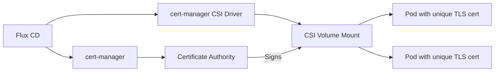

# How to Deploy cert-manager CSI Driver with Flux CD

Author: [nawazdhandala](https://github.com/nawazdhandala)

Tags: Flux CD, Cert-Manager, CSI Driver, Kubernetes, TLS, Certificates, Security, GitOps

Description: A practical guide to deploying the cert-manager CSI driver on Kubernetes using Flux CD for automatic in-pod TLS certificate provisioning.

---

## Introduction

The cert-manager CSI driver is a Container Storage Interface (CSI) plugin that works alongside cert-manager to mount TLS certificates directly into pod filesystems. Unlike traditional cert-manager Certificate resources that create Kubernetes Secrets, the CSI driver provisions unique certificates per pod, ensuring each workload has its own identity. This is particularly useful for mTLS, service mesh integrations, and workloads requiring unique per-pod certificates.

This guide demonstrates how to deploy both cert-manager and its CSI driver using Flux CD.

## Prerequisites

- A Kubernetes cluster (v1.25+)
- Flux CD installed and bootstrapped
- kubectl and flux CLI tools installed
- Basic understanding of cert-manager and CSI drivers

## Architecture Overview



## Repository Structure

```text
clusters/
  my-cluster/
    cert-manager/
      namespace.yaml
      helmrepository.yaml
      cert-manager-helmrelease.yaml
      csi-driver-helmrelease.yaml
      cluster-issuer.yaml
      kustomization.yaml
```

## Step 1: Create the Namespace

```yaml
# clusters/my-cluster/cert-manager/namespace.yaml
apiVersion: v1
kind: Namespace
metadata:
  name: cert-manager
  labels:
    app.kubernetes.io/managed-by: flux
```

## Step 2: Add the Jetstack Helm Repository

```yaml
# clusters/my-cluster/cert-manager/helmrepository.yaml
apiVersion: source.toolkit.fluxcd.io/v1
kind: HelmRepository
metadata:
  name: jetstack
  namespace: cert-manager
spec:
  interval: 1h
  # Official Jetstack Helm chart repository for cert-manager
  url: https://charts.jetstack.io
```

## Step 3: Deploy cert-manager

Install cert-manager as a prerequisite for the CSI driver.

```yaml
# clusters/my-cluster/cert-manager/cert-manager-helmrelease.yaml
apiVersion: helm.toolkit.fluxcd.io/v2
kind: HelmRelease
metadata:
  name: cert-manager
  namespace: cert-manager
spec:
  interval: 30m
  chart:
    spec:
      chart: cert-manager
      version: "1.16.x"
      sourceRef:
        kind: HelmRepository
        name: jetstack
        namespace: cert-manager
      interval: 12h
  # Install CRDs with the Helm chart
  install:
    crds: CreateReplace
  upgrade:
    crds: CreateReplace
  values:
    # Enable the certificate approval controller
    enableCertificateOwnerRef: true

    # Resource limits for the controller
    resources:
      requests:
        cpu: 100m
        memory: 128Mi
      limits:
        cpu: 500m
        memory: 256Mi

    # Webhook configuration
    webhook:
      resources:
        requests:
          cpu: 50m
          memory: 64Mi
        limits:
          cpu: 250m
          memory: 128Mi

    # CA Injector for webhook TLS
    cainjector:
      resources:
        requests:
          cpu: 50m
          memory: 64Mi
        limits:
          cpu: 250m
          memory: 128Mi

    # Prometheus monitoring
    prometheus:
      enabled: true
      servicemonitor:
        enabled: true
```

## Step 4: Deploy the CSI Driver

```yaml
# clusters/my-cluster/cert-manager/csi-driver-helmrelease.yaml
apiVersion: helm.toolkit.fluxcd.io/v2
kind: HelmRelease
metadata:
  name: cert-manager-csi-driver
  namespace: cert-manager
spec:
  interval: 30m
  # Ensure cert-manager is deployed first
  dependsOn:
    - name: cert-manager
      namespace: cert-manager
  chart:
    spec:
      chart: cert-manager-csi-driver
      version: "0.10.x"
      sourceRef:
        kind: HelmRepository
        name: jetstack
        namespace: cert-manager
      interval: 12h
  values:
    # CSI driver runs as a DaemonSet on every node
    resources:
      requests:
        cpu: 50m
        memory: 64Mi
      limits:
        cpu: 250m
        memory: 128Mi

    # Liveness probe configuration
    livenessProbe:
      enabled: true
      httpGet:
        port: healthz
        path: /healthz

    # Node driver registrar sidecar
    nodeDriverRegistrar:
      resources:
        requests:
          cpu: 10m
          memory: 20Mi
        limits:
          cpu: 100m
          memory: 64Mi

    # Liveness probe sidecar
    livenessProbeImage:
      resources:
        requests:
          cpu: 10m
          memory: 20Mi
        limits:
          cpu: 100m
          memory: 64Mi

    # Tolerations to ensure the driver runs on all nodes
    tolerations:
      - operator: Exists
```

## Step 5: Create a ClusterIssuer

Set up a CA-based ClusterIssuer for the CSI driver to use.

```yaml
# clusters/my-cluster/cert-manager/cluster-issuer.yaml
apiVersion: cert-manager.io/v1
kind: ClusterIssuer
metadata:
  name: csi-ca-issuer
spec:
  ca:
    # Reference to the Kubernetes Secret containing the CA key pair
    secretName: csi-ca-key-pair
---
# Self-signed issuer to bootstrap the CA
apiVersion: cert-manager.io/v1
kind: ClusterIssuer
metadata:
  name: selfsigned-issuer
spec:
  selfSigned: {}
---
# Certificate for the CA key pair
apiVersion: cert-manager.io/v1
kind: Certificate
metadata:
  name: csi-ca
  namespace: cert-manager
spec:
  isCA: true
  commonName: "cert-manager-csi-ca"
  # CA certificate validity
  duration: 87600h # 10 years
  renewBefore: 8760h # 1 year
  secretName: csi-ca-key-pair
  privateKey:
    algorithm: ECDSA
    size: 256
  issuerRef:
    name: selfsigned-issuer
    kind: ClusterIssuer
    group: cert-manager.io
```

## Step 6: Use the CSI Driver in a Workload

Mount unique TLS certificates into pods using CSI volumes.

```yaml
# clusters/my-cluster/apps/secure-service.yaml
apiVersion: apps/v1
kind: Deployment
metadata:
  name: secure-service
  namespace: default
spec:
  replicas: 3
  selector:
    matchLabels:
      app: secure-service
  template:
    metadata:
      labels:
        app: secure-service
    spec:
      containers:
        - name: app
          image: nginx:alpine
          ports:
            - containerPort: 443
          # Mount the CSI-provisioned TLS certificate
          volumeMounts:
            - name: tls-cert
              mountPath: /tls
              readOnly: true
          env:
            # Point the application to the certificate files
            - name: TLS_CERT_FILE
              value: /tls/tls.crt
            - name: TLS_KEY_FILE
              value: /tls/tls.key
            - name: TLS_CA_FILE
              value: /tls/ca.crt
      volumes:
        - name: tls-cert
          csi:
            driver: csi.cert-manager.io
            readOnly: true
            volumeAttributes:
              # Issuer to use for certificate generation
              csi.cert-manager.io/issuer-name: csi-ca-issuer
              csi.cert-manager.io/issuer-kind: ClusterIssuer
              # Certificate DNS names (each pod gets a unique cert)
              csi.cert-manager.io/dns-names: "${POD_NAME}.secure-service.default.svc.cluster.local"
              # Certificate duration and renewal
              csi.cert-manager.io/duration: "24h"
              csi.cert-manager.io/renew-before: "4h"
              # Key configuration
              csi.cert-manager.io/key-algorithm: "ECDSA"
              csi.cert-manager.io/key-size: "256"
              # File names for the certificate, key, and CA
              csi.cert-manager.io/certificate-file: tls.crt
              csi.cert-manager.io/privatekey-file: tls.key
              csi.cert-manager.io/ca-file: ca.crt
```

## Step 7: mTLS Between Services

Configure two services with mutual TLS using the CSI driver.

```yaml
# clusters/my-cluster/apps/mtls-client.yaml
apiVersion: apps/v1
kind: Deployment
metadata:
  name: mtls-client
  namespace: default
spec:
  replicas: 1
  selector:
    matchLabels:
      app: mtls-client
  template:
    metadata:
      labels:
        app: mtls-client
    spec:
      containers:
        - name: client
          image: curlimages/curl:latest
          command: ["sleep", "infinity"]
          volumeMounts:
            - name: client-tls
              mountPath: /tls
              readOnly: true
      volumes:
        - name: client-tls
          csi:
            driver: csi.cert-manager.io
            readOnly: true
            volumeAttributes:
              # Same issuer as the server for mutual trust
              csi.cert-manager.io/issuer-name: csi-ca-issuer
              csi.cert-manager.io/issuer-kind: ClusterIssuer
              csi.cert-manager.io/dns-names: "mtls-client.default.svc.cluster.local"
              csi.cert-manager.io/duration: "24h"
              csi.cert-manager.io/renew-before: "4h"
              csi.cert-manager.io/certificate-file: tls.crt
              csi.cert-manager.io/privatekey-file: tls.key
              csi.cert-manager.io/ca-file: ca.crt
```

## Step 8: Flux Kustomization

```yaml
# clusters/my-cluster/cert-manager/kustomization.yaml
apiVersion: kustomize.toolkit.fluxcd.io/v1
kind: Kustomization
metadata:
  name: cert-manager
  namespace: flux-system
spec:
  interval: 10m
  path: ./clusters/my-cluster/cert-manager
  prune: true
  sourceRef:
    kind: GitRepository
    name: flux-system
  wait: true
  timeout: 5m
  healthChecks:
    - apiVersion: apps/v1
      kind: Deployment
      name: cert-manager
      namespace: cert-manager
    - apiVersion: apps/v1
      kind: DaemonSet
      name: cert-manager-csi-driver
      namespace: cert-manager
```

## Verifying the Deployment

```bash
# Check cert-manager pods
kubectl get pods -n cert-manager

# Verify the CSI driver DaemonSet is running on all nodes
kubectl get daemonset -n cert-manager -l app.kubernetes.io/name=cert-manager-csi-driver

# Verify the CSI driver is registered
kubectl get csidriver csi.cert-manager.io

# Check the CA certificate was created
kubectl get certificate -n cert-manager csi-ca

# Verify a pod has its unique certificate mounted
kubectl exec -n default deploy/secure-service -- openssl x509 -in /tls/tls.crt -noout -subject -dates

# Check that each pod replica has a different certificate
for pod in $(kubectl get pods -n default -l app=secure-service -o name); do
  echo "--- $pod ---"
  kubectl exec -n default $pod -- openssl x509 -in /tls/tls.crt -noout -serial
done
```

## Troubleshooting

```bash
# Check CSI driver pod logs
kubectl logs -n cert-manager -l app.kubernetes.io/name=cert-manager-csi-driver

# Check cert-manager controller logs for signing issues
kubectl logs -n cert-manager -l app.kubernetes.io/name=cert-manager

# Describe a pod to see CSI volume mount events
kubectl describe pod -n default -l app=secure-service

# Verify the ClusterIssuer is ready
kubectl get clusterissuer csi-ca-issuer -o jsonpath='{.status.conditions}'

# Check for certificate request errors
kubectl get certificaterequest -A
```

## Conclusion

The cert-manager CSI driver with Flux CD provides a powerful mechanism for issuing unique per-pod TLS certificates without creating Kubernetes Secrets. This approach is ideal for mTLS, zero-trust architectures, and workloads that need ephemeral, automatically-rotated certificates. By managing the entire stack through Flux CD, you ensure your certificate infrastructure is version-controlled and consistently deployed.
