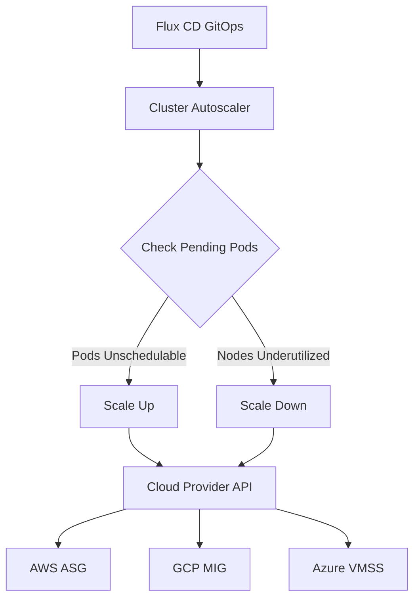

# How to Deploy Cluster Autoscaler with Flux CD

Author: [nawazdhandala](https://github.com/nawazdhandala)

Tags: flux cd, cluster autoscaler, kubernetes, node scaling, gitops, aws, gcp, azure

Description: A practical guide to deploying the Kubernetes Cluster Autoscaler using Flux CD for automatic node scaling across cloud providers.

---

## Introduction

The Kubernetes Cluster Autoscaler automatically adjusts the number of nodes in your cluster based on resource demand. When pods cannot be scheduled due to insufficient resources, it scales up by adding nodes. When nodes are underutilized, it scales down by removing them. Unlike Karpenter (which is AWS-specific), the Cluster Autoscaler works across all major cloud providers including AWS, GCP, and Azure.

This guide covers deploying the Cluster Autoscaler with Flux CD and configuring it for optimal scaling behavior.

## Prerequisites

- A Kubernetes cluster (v1.25+) on a supported cloud provider
- Flux CD installed and bootstrapped
- Cloud provider IAM permissions for node group management
- kubectl and flux CLI tools installed
- Node groups or managed instance groups pre-configured

## Architecture Overview



## Repository Structure

```
clusters/
  my-cluster/
    cluster-autoscaler/
      namespace.yaml
      helmrepository.yaml
      helmrelease.yaml
      kustomization.yaml
```

## Step 1: Create the Namespace

```yaml
# clusters/my-cluster/cluster-autoscaler/namespace.yaml
apiVersion: v1
kind: Namespace
metadata:
  name: cluster-autoscaler
  labels:
    app.kubernetes.io/managed-by: flux
```

## Step 2: Add the Helm Repository

```yaml
# clusters/my-cluster/cluster-autoscaler/helmrepository.yaml
apiVersion: source.toolkit.fluxcd.io/v1
kind: HelmRepository
metadata:
  name: autoscaler
  namespace: cluster-autoscaler
spec:
  interval: 1h
  # Official Kubernetes Autoscaler Helm chart repository
  url: https://kubernetes.github.io/autoscaler
```

## Step 3: Deploy for AWS EKS

```yaml
# clusters/my-cluster/cluster-autoscaler/helmrelease.yaml
apiVersion: helm.toolkit.fluxcd.io/v1
kind: HelmRelease
metadata:
  name: cluster-autoscaler
  namespace: cluster-autoscaler
spec:
  interval: 30m
  chart:
    spec:
      chart: cluster-autoscaler
      version: "9.43.x"
      sourceRef:
        kind: HelmRepository
        name: autoscaler
        namespace: cluster-autoscaler
      interval: 12h
  values:
    # Cloud provider configuration
    cloudProvider: aws
    awsRegion: us-east-1

    # Auto-discovery of node groups using tags
    autoDiscovery:
      clusterName: my-cluster
      # Tags used to discover Auto Scaling Groups
      tags:
        - "k8s.io/cluster-autoscaler/enabled"
        - "k8s.io/cluster-autoscaler/my-cluster"

    # IRSA service account for AWS API access
    rbac:
      create: true
      serviceAccount:
        create: true
        name: cluster-autoscaler
        annotations:
          eks.amazonaws.com/role-arn: arn:aws:iam::111122223333:role/ClusterAutoscalerRole

    # Resource configuration
    resources:
      requests:
        cpu: 100m
        memory: 300Mi
      limits:
        cpu: 500m
        memory: 500Mi

    # Replica count
    replicaCount: 2

    # Leader election for HA
    leaderElection:
      enabled: true

    # Scaling behavior configuration
    extraArgs:
      # How long to wait before scaling down a node (default: 10m)
      scale-down-delay-after-add: "10m"
      # How long to wait after a scale-down failure
      scale-down-delay-after-failure: "3m"
      # How long a node must be underutilized before scale-down
      scale-down-unneeded-time: "10m"
      # Utilization threshold below which a node is considered underutilized
      scale-down-utilization-threshold: "0.5"
      # Maximum number of nodes that can be scaled down simultaneously
      max-graceful-termination-sec: "600"
      # Balance similar node groups
      balance-similar-node-groups: "true"
      # Skip nodes with system pods
      skip-nodes-with-system-pods: "true"
      # Skip nodes with local storage
      skip-nodes-with-local-storage: "false"
      # Expander strategy: random, most-pods, least-waste, price, priority
      expander: least-waste
      # Maximum number of empty nodes to scale down simultaneously
      max-empty-bulk-delete: "10"
      # New pods scale-up delay
      new-pod-scale-up-delay: "0s"
      # Scan interval
      scan-interval: "10s"
      # Maximum node provision time
      max-node-provision-time: "15m"

    # Pod disruption budget
    podDisruptionBudget:
      minAvailable: 1

    # Priority expander configuration
    priorityConfigMapAnnotations:
      cluster-autoscaler.kubernetes.io/priority-expander-config: |
        10:
          - .*spot.*
        50:
          - .*on-demand.*

    # Prometheus monitoring
    serviceMonitor:
      enabled: true
      interval: 30s

    # Pod annotations for monitoring
    podAnnotations:
      prometheus.io/scrape: "true"
      prometheus.io/port: "8085"
```

## Step 4: Deploy for GCP GKE

```yaml
# clusters/my-cluster/cluster-autoscaler/helmrelease-gcp.yaml
apiVersion: helm.toolkit.fluxcd.io/v1
kind: HelmRelease
metadata:
  name: cluster-autoscaler
  namespace: cluster-autoscaler
spec:
  interval: 30m
  chart:
    spec:
      chart: cluster-autoscaler
      version: "9.43.x"
      sourceRef:
        kind: HelmRepository
        name: autoscaler
        namespace: cluster-autoscaler
      interval: 12h
  values:
    # GCP cloud provider
    cloudProvider: gce
    # GCP-specific configuration
    extraArgs:
      # GCP project ID
      gcp-project-id: my-gcp-project
      # Balance similar node groups for even distribution
      balance-similar-node-groups: "true"
      scale-down-utilization-threshold: "0.5"
      scale-down-unneeded-time: "10m"
      expander: least-waste

    # Node groups to manage
    autoscalingGroups:
      - name: gke-my-cluster-default-pool
        minSize: 1
        maxSize: 10
      - name: gke-my-cluster-high-mem-pool
        minSize: 0
        maxSize: 5

    resources:
      requests:
        cpu: 100m
        memory: 300Mi
      limits:
        cpu: 500m
        memory: 500Mi
```

## Step 5: Deploy for Azure AKS

```yaml
# clusters/my-cluster/cluster-autoscaler/helmrelease-azure.yaml
apiVersion: helm.toolkit.fluxcd.io/v1
kind: HelmRelease
metadata:
  name: cluster-autoscaler
  namespace: cluster-autoscaler
spec:
  interval: 30m
  chart:
    spec:
      chart: cluster-autoscaler
      version: "9.43.x"
      sourceRef:
        kind: HelmRepository
        name: autoscaler
        namespace: cluster-autoscaler
      interval: 12h
  values:
    cloudProvider: azure
    # Azure-specific configuration
    azureClientID: "your-client-id"
    azureClientSecret: "your-client-secret"
    azureSubscriptionID: "your-subscription-id"
    azureTenantID: "your-tenant-id"
    azureResourceGroup: "my-resource-group"
    azureVMType: AKS

    # Node pools to manage
    autoscalingGroups:
      - name: nodepool1
        minSize: 1
        maxSize: 10
      - name: spotpool
        minSize: 0
        maxSize: 20

    extraArgs:
      balance-similar-node-groups: "true"
      scale-down-utilization-threshold: "0.5"
      expander: least-waste

    resources:
      requests:
        cpu: 100m
        memory: 300Mi
      limits:
        cpu: 500m
        memory: 500Mi
```

## Step 6: Configure Pod Disruption Budgets

Protect critical workloads during scale-down events.

```yaml
# clusters/my-cluster/apps/pdb.yaml
apiVersion: policy/v1
kind: PodDisruptionBudget
metadata:
  name: critical-app-pdb
  namespace: default
spec:
  # Ensure at least 2 replicas are always available
  minAvailable: 2
  selector:
    matchLabels:
      app: critical-app
---
# Annotation to prevent scale-down for specific pods
apiVersion: apps/v1
kind: Deployment
metadata:
  name: critical-app
  namespace: default
spec:
  replicas: 3
  selector:
    matchLabels:
      app: critical-app
  template:
    metadata:
      labels:
        app: critical-app
      annotations:
        # Prevent the autoscaler from evicting this pod
        cluster-autoscaler.kubernetes.io/safe-to-evict: "false"
    spec:
      containers:
        - name: app
          image: critical-app:latest
          resources:
            requests:
              cpu: 500m
              memory: 512Mi
            limits:
              cpu: 1000m
              memory: 1Gi
```

## Step 7: Priority-Based Scaling Configuration

```yaml
# clusters/my-cluster/cluster-autoscaler/priority-config.yaml
apiVersion: v1
kind: ConfigMap
metadata:
  name: cluster-autoscaler-priority-expander
  namespace: cluster-autoscaler
data:
  # Priority configuration for the expander
  # Higher number = higher priority
  priorities: |
    100:
      # Highest priority: use spot/preemptible nodes first
      - .*spot.*
      - .*preemptible.*
    50:
      # Medium priority: general-purpose on-demand nodes
      - .*general.*
      - .*default.*
    10:
      # Lowest priority: high-memory or GPU nodes
      - .*high-mem.*
      - .*gpu.*
```

## Step 8: Flux Kustomization

```yaml
# clusters/my-cluster/cluster-autoscaler/kustomization.yaml
apiVersion: kustomize.toolkit.fluxcd.io/v1
kind: Kustomization
metadata:
  name: cluster-autoscaler
  namespace: flux-system
spec:
  interval: 10m
  path: ./clusters/my-cluster/cluster-autoscaler
  prune: true
  sourceRef:
    kind: GitRepository
    name: flux-system
  wait: true
  timeout: 5m
  healthChecks:
    - apiVersion: apps/v1
      kind: Deployment
      name: cluster-autoscaler-aws-cluster-autoscaler
      namespace: cluster-autoscaler
```

## Verifying the Deployment

```bash
# Check autoscaler pods
kubectl get pods -n cluster-autoscaler

# View autoscaler status
kubectl get configmap -n cluster-autoscaler cluster-autoscaler-status -o yaml

# Check autoscaler logs for scaling decisions
kubectl logs -n cluster-autoscaler -l app.kubernetes.io/name=aws-cluster-autoscaler --tail=30

# View current node count
kubectl get nodes --no-headers | wc -l

# Check node group sizes
kubectl logs -n cluster-autoscaler -l app.kubernetes.io/name=aws-cluster-autoscaler | grep -i "scale"

# Verify Flux reconciliation
flux get helmrelease -n cluster-autoscaler
```

## Troubleshooting

```bash
# Check for scale-up failures
kubectl logs -n cluster-autoscaler -l app.kubernetes.io/name=aws-cluster-autoscaler | grep -i "failed to scale"

# View unschedulable pods
kubectl get pods --field-selector=status.phase=Pending -A

# Check node conditions
kubectl describe nodes | grep -A5 "Conditions"

# Verify IAM permissions (AWS)
kubectl describe sa -n cluster-autoscaler cluster-autoscaler

# Check autoscaler events
kubectl get events -n cluster-autoscaler --sort-by='.lastTimestamp'

# View scale-down candidates
kubectl logs -n cluster-autoscaler -l app.kubernetes.io/name=aws-cluster-autoscaler | grep "underutilized"
```

## Tuning Recommendations

- Set `scale-down-utilization-threshold` to 0.5 for balanced cost and availability
- Use `least-waste` expander for cost-optimized instance selection
- Enable `balance-similar-node-groups` for even distribution across AZs
- Set `max-node-provision-time` based on your cloud provider's instance launch time
- Use PodDisruptionBudgets to protect critical workloads during scale-down
- Monitor the autoscaler metrics to track scaling latency and failures

## Conclusion

The Cluster Autoscaler with Flux CD provides cross-cloud node autoscaling managed through GitOps. By defining scaling parameters, expander strategies, and protection rules as code, you ensure consistent and predictable scaling behavior. While cloud-specific solutions like Karpenter may offer advanced features, the Cluster Autoscaler remains the most portable option for multi-cloud Kubernetes environments managed by Flux CD.
