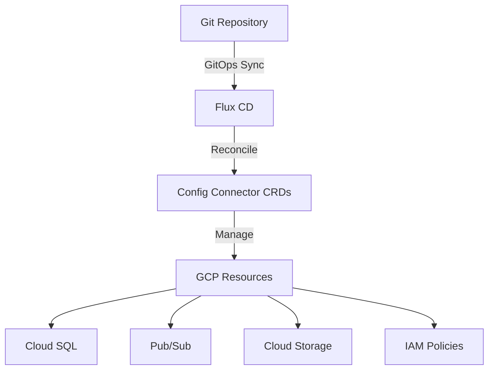

# How to Deploy Config Connector with Flux CD on GKE

Author: [nawazdhandala](https://github.com/nawazdhandala)

Tags: Flux CD, Config Connector, GKE, GCP, GitOps, Kubernetes, Infrastructure as Code

Description: A step-by-step guide to deploying and managing GCP resources using Config Connector and Flux CD on Google Kubernetes Engine.

---

## Introduction

Google Cloud Config Connector is a Kubernetes add-on that lets you manage GCP resources through Kubernetes manifests. Combined with Flux CD, you get a fully GitOps-driven approach to managing both your Kubernetes workloads and the underlying GCP infrastructure from a single Git repository.

This guide shows you how to install Config Connector on GKE, configure it with Workload Identity, and manage GCP resources through Flux CD reconciliation.

## Prerequisites

- A GKE cluster running Kubernetes 1.27 or later
- Flux CD v2.x bootstrapped on the cluster
- `gcloud` CLI authenticated with Owner or Editor role
- A Git repository connected to Flux CD

## Understanding the Architecture



Config Connector translates Kubernetes custom resources into GCP API calls. Flux CD ensures these custom resources stay in sync with your Git repository, giving you a declarative, auditable pipeline for cloud infrastructure.

## Step 1: Enable the Required GCP APIs

```bash
# Enable the APIs needed for Config Connector
gcloud services enable \
  cloudresourcemanager.googleapis.com \
  serviceusage.googleapis.com \
  iam.googleapis.com \
  container.googleapis.com \
  sqladmin.googleapis.com \
  pubsub.googleapis.com \
  storage.googleapis.com
```

## Step 2: Install Config Connector Add-On on GKE

The simplest method is to enable the Config Connector add-on on your GKE cluster.

```bash
# Enable Config Connector on an existing GKE cluster
gcloud container clusters update my-cluster \
  --zone us-central1-a \
  --update-addons ConfigConnector=ENABLED
```

Verify the installation.

```bash
# Check that Config Connector pods are running
kubectl get pods -n cnrm-system

# Verify CRDs are installed
kubectl get crds | grep cnrm | head -10
```

## Step 3: Set Up Workload Identity for Config Connector

Config Connector needs permissions to manage GCP resources. The recommended approach is Workload Identity.

```bash
# Set environment variables
export PROJECT_ID=$(gcloud config get-value project)
export SA_NAME=config-connector-sa

# Create a GCP service account for Config Connector
gcloud iam service-accounts create ${SA_NAME} \
  --display-name="Config Connector Service Account" \
  --project=${PROJECT_ID}

# Grant the service account permissions to manage resources
# Adjust roles based on the resources you plan to manage
gcloud projects add-iam-policy-binding ${PROJECT_ID} \
  --member="serviceAccount:${SA_NAME}@${PROJECT_ID}.iam.gserviceaccount.com" \
  --role="roles/editor"

# Bind the GCP service account to the Kubernetes service account
gcloud iam service-accounts add-iam-policy-binding \
  ${SA_NAME}@${PROJECT_ID}.iam.gserviceaccount.com \
  --member="serviceAccount:${PROJECT_ID}.svc.id.goog[cnrm-system/cnrm-controller-manager]" \
  --role="roles/iam.workloadIdentityUser"
```

## Step 4: Configure Config Connector with a ConfigConnectorContext

Create a `ConfigConnectorContext` resource that tells Config Connector which GCP project to manage.

```yaml
# infrastructure/config-connector/config-connector-context.yaml
# This resource binds Config Connector to a specific
# GCP project and service account
apiVersion: core.cnrm.cloud.google.com/v1beta1
kind: ConfigConnectorContext
metadata:
  name: configconnectorcontext.core.cnrm.cloud.google.com
  namespace: config-connector
spec:
  # The GCP project to manage resources in
  googleServiceAccount: "config-connector-sa@my-project-id.iam.gserviceaccount.com"
```

Create the namespace first.

```yaml
# infrastructure/config-connector/namespace.yaml
apiVersion: v1
kind: Namespace
metadata:
  name: config-connector
  annotations:
    # Annotate with the GCP project ID
    cnrm.cloud.google.com/project-id: "my-project-id"
```

## Step 5: Add Config Connector to Flux Kustomization

Create a Flux Kustomization to manage Config Connector configuration.

```yaml
# clusters/my-cluster/config-connector.yaml
apiVersion: kustomize.toolkit.fluxcd.io/v1
kind: Kustomization
metadata:
  name: config-connector-setup
  namespace: flux-system
spec:
  interval: 10m
  path: ./infrastructure/config-connector
  prune: true
  sourceRef:
    kind: GitRepository
    name: flux-system
  # Config Connector resources can take time to provision
  timeout: 10m
  # Wait for health checks to pass
  wait: true
  healthChecks:
    - apiVersion: core.cnrm.cloud.google.com/v1beta1
      kind: ConfigConnectorContext
      name: configconnectorcontext.core.cnrm.cloud.google.com
      namespace: config-connector
```

## Step 6: Define GCP Resources as Kubernetes Manifests

Now you can define GCP resources in your Git repository and let Flux manage them.

### Cloud Storage Bucket

```yaml
# infrastructure/gcp-resources/storage-bucket.yaml
# Creates a GCS bucket managed by Config Connector
apiVersion: storage.cnrm.cloud.google.com/v1beta1
kind: StorageBucket
metadata:
  name: my-app-data-bucket
  namespace: config-connector
  annotations:
    # Control what happens when the K8s resource is deleted
    cnrm.cloud.google.com/deletion-policy: "abandon"
spec:
  # Bucket location
  location: US-CENTRAL1
  # Storage class for the bucket
  storageClass: STANDARD
  # Enable versioning for data protection
  versioning:
    enabled: true
  # Lifecycle rules to manage costs
  lifecycleRule:
    - action:
        type: Delete
      condition:
        age: 90
        isLive: false
  # Uniform bucket-level access
  uniformBucketLevelAccess: true
```

### Cloud SQL Instance

```yaml
# infrastructure/gcp-resources/cloud-sql.yaml
# Creates a Cloud SQL PostgreSQL instance
apiVersion: sql.cnrm.cloud.google.com/v1beta1
kind: SQLInstance
metadata:
  name: my-app-database
  namespace: config-connector
spec:
  # PostgreSQL 15
  databaseVersion: POSTGRES_15
  region: us-central1
  settings:
    tier: db-custom-2-8192
    # Enable automated backups
    backupConfiguration:
      enabled: true
      startTime: "03:00"
      pointInTimeRecoveryEnabled: true
    # IP configuration
    ipConfiguration:
      ipv4Enabled: false
      privateNetworkRef:
        name: my-vpc-network
    # Maintenance window
    maintenanceWindow:
      day: 7
      hour: 4
      updateTrack: stable
    # Storage settings
    diskAutoresize: true
    diskSize: 20
    diskType: PD_SSD
---
# Create a database within the instance
apiVersion: sql.cnrm.cloud.google.com/v1beta1
kind: SQLDatabase
metadata:
  name: my-app-db
  namespace: config-connector
spec:
  instanceRef:
    name: my-app-database
  charset: UTF8
  collation: en_US.UTF8
```

### Pub/Sub Topic and Subscription

```yaml
# infrastructure/gcp-resources/pubsub.yaml
# Creates a Pub/Sub topic for event processing
apiVersion: pubsub.cnrm.cloud.google.com/v1beta1
kind: PubSubTopic
metadata:
  name: app-events
  namespace: config-connector
spec:
  # Retain messages for 7 days
  messageRetentionDuration: "604800s"
---
# Creates a subscription for the topic
apiVersion: pubsub.cnrm.cloud.google.com/v1beta1
kind: PubSubSubscription
metadata:
  name: app-events-processor
  namespace: config-connector
spec:
  topicRef:
    name: app-events
  # Acknowledge deadline in seconds
  ackDeadlineSeconds: 30
  # Retry policy for failed deliveries
  retryPolicy:
    minimumBackoff: "10s"
    maximumBackoff: "600s"
  # Dead letter policy after 5 failed attempts
  deadLetterPolicy:
    deadLetterTopicRef:
      name: app-events-dlq
    maxDeliveryAttempts: 5
```

## Step 7: Create a Flux Kustomization for GCP Resources

```yaml
# clusters/my-cluster/gcp-resources.yaml
apiVersion: kustomize.toolkit.fluxcd.io/v1
kind: Kustomization
metadata:
  name: gcp-resources
  namespace: flux-system
spec:
  interval: 10m
  # Depends on Config Connector being set up first
  dependsOn:
    - name: config-connector-setup
  path: ./infrastructure/gcp-resources
  prune: false
  sourceRef:
    kind: GitRepository
    name: flux-system
  timeout: 15m
  # Health checks ensure resources are actually provisioned
  wait: true
```

## Step 8: Monitor Resource Provisioning

Check the status of Config Connector resources.

```bash
# List all Config Connector resources in the namespace
kubectl get gcp -n config-connector

# Check the status of a specific resource
kubectl describe storagebucket my-app-data-bucket -n config-connector

# View events for troubleshooting
kubectl get events -n config-connector \
  --sort-by='.lastTimestamp' --field-selector type=Warning

# Check Flux reconciliation status
flux get kustomizations
```

## Step 9: Handle Dependencies Between Resources

Some GCP resources depend on others. Use Flux dependencies and Config Connector references to manage ordering.

```yaml
# infrastructure/gcp-resources/kustomization.yaml
apiVersion: kustomize.config.k8s.io/v1beta1
kind: Kustomization
resources:
  # Network resources must be created first
  - vpc-network.yaml
  - subnets.yaml
  # Then resources that depend on the network
  - cloud-sql.yaml
  - gke-cluster.yaml
  # Finally, IAM bindings
  - iam-bindings.yaml
```

For cross-resource references, Config Connector supports `resourceRef` fields.

```yaml
# infrastructure/gcp-resources/iam-binding.yaml
# Grant a service account access to the storage bucket
apiVersion: iam.cnrm.cloud.google.com/v1beta1
kind: IAMPolicyMember
metadata:
  name: bucket-reader-binding
  namespace: config-connector
spec:
  member: "serviceAccount:my-app-sa@my-project-id.iam.gserviceaccount.com"
  role: roles/storage.objectViewer
  resourceRef:
    apiVersion: storage.cnrm.cloud.google.com/v1beta1
    kind: StorageBucket
    name: my-app-data-bucket
```

## Step 10: Implement Drift Detection

Config Connector continuously reconciles the desired state with the actual GCP resource state. Combined with Flux, you get two layers of drift detection.

```bash
# Force Flux to reconcile and detect drift
flux reconcile kustomization gcp-resources

# Check Config Connector reconciliation status
kubectl get storagebucket my-app-data-bucket -n config-connector \
  -o jsonpath='{.status.conditions[?(@.type=="Ready")].status}'
```

## Troubleshooting

### Resource Stuck in "Updating" State

```bash
# Check the resource conditions for error details
kubectl get sqlinstance my-app-database -n config-connector \
  -o yaml | grep -A 10 "conditions:"

# Check Config Connector controller logs
kubectl logs -n cnrm-system \
  -l cnrm.cloud.google.com/component=cnrm-controller-manager \
  --tail=100
```

### Permission Errors

```bash
# Verify the service account has the required roles
gcloud projects get-iam-policy ${PROJECT_ID} \
  --flatten="bindings[].members" \
  --filter="bindings.members:config-connector-sa@" \
  --format="table(bindings.role)"
```

## Summary

You have deployed Config Connector with Flux CD on GKE, enabling GitOps-driven management of GCP resources. This setup allows you to define Cloud SQL instances, storage buckets, Pub/Sub topics, and other GCP resources as Kubernetes manifests in your Git repository. Flux CD ensures these manifests are continuously reconciled, while Config Connector translates them into actual GCP API calls. This approach provides a unified, auditable, and version-controlled workflow for managing both Kubernetes workloads and cloud infrastructure.
