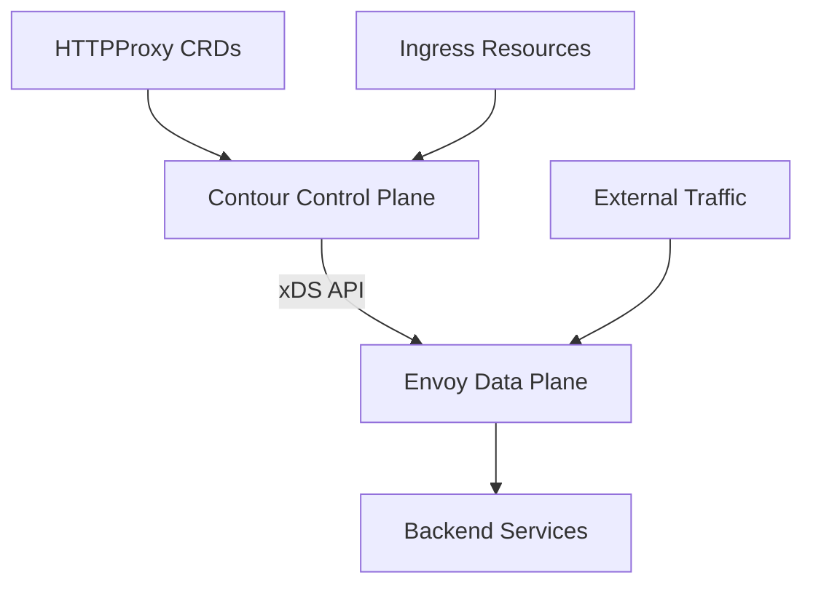

# How to Deploy Contour Ingress with Flux CD

Author: [nawazdhandala](https://github.com/nawazdhandala)

Tags: Flux CD, Contour, Ingresses, Envoy, Kubernetes, GitOps, Networking

Description: Learn how to deploy Contour ingress controller with Flux CD to leverage Envoy proxy for high-performance Kubernetes ingress management.

---

## Introduction

Contour is an open-source Kubernetes ingress controller built on top of the Envoy proxy. It provides a rich set of features including HTTPProxy CRDs for advanced routing, rate limiting, header manipulation, and traffic splitting. Contour is designed for high performance and offers better resource isolation than traditional ingress controllers through its HTTPProxy delegation model.

This guide covers deploying Contour with Flux CD, configuring HTTPProxy resources, and setting up advanced routing features.

## Prerequisites

Before starting, ensure you have:

- A Kubernetes cluster (v1.25 or later)
- Flux CD installed and bootstrapped
- kubectl configured for your cluster
- A domain name for ingress configuration

## Understanding Contour Architecture

Contour uses a two-component architecture:



- **Contour** watches Kubernetes resources and translates them into Envoy configuration
- **Envoy** handles the actual traffic proxying with high performance

## Repository Structure

```text
clusters/
  production/
    infrastructure/
      sources/
        contour.yaml
      contour/
        namespace.yaml
        release.yaml
    apps/
      routes/
        webapp-proxy.yaml
        api-proxy.yaml
```

## Adding the Contour Helm Repository

```yaml
# clusters/production/infrastructure/sources/contour.yaml
apiVersion: source.toolkit.fluxcd.io/v1
kind: HelmRepository
metadata:
  name: bitnami
  namespace: flux-system
spec:
  interval: 1h
  # Bitnami repository hosts the Contour Helm chart
  url: https://charts.bitnami.com/bitnami
```

## Creating the Namespace

```yaml
# clusters/production/infrastructure/contour/namespace.yaml
apiVersion: v1
kind: Namespace
metadata:
  name: projectcontour
  labels:
    app.kubernetes.io/name: contour
```

## Deploying Contour with HelmRelease

```yaml
# clusters/production/infrastructure/contour/release.yaml
apiVersion: helm.toolkit.fluxcd.io/v2
kind: HelmRelease
metadata:
  name: contour
  namespace: projectcontour
spec:
  interval: 1h
  chart:
    spec:
      chart: contour
      version: "18.x"
      sourceRef:
        kind: HelmRepository
        name: bitnami
        namespace: flux-system
      interval: 1h
  install:
    createNamespace: true
    remediation:
      retries: 3
  upgrade:
    remediation:
      retries: 3
  values:
    # Contour control plane configuration
    contour:
      # Number of Contour replicas
      replicaCount: 2
      # Resource allocation for Contour
      resources:
        requests:
          cpu: 100m
          memory: 128Mi
        limits:
          cpu: 500m
          memory: 256Mi
      # Contour configuration
      configInline:
        # Default HTTP versions
        default-http-versions:
          - HTTP/1.1
          - HTTP/2
        # Timeout settings
        timeouts:
          request-timeout: 60s
          connection-idle-timeout: 60s
          stream-idle-timeout: 300s
          max-connection-duration: 0s
          delayed-close-timeout: 1s
          connection-shutdown-grace-period: 5s
        # Rate limit service configuration
        rateLimitService:
          extensionService: projectcontour/ratelimit
          domain: contour
          failOpen: false
        # Access log configuration
        accesslog-format: json
        # Enable external authorization
        policy:
          request-headers:
            set:
              X-Request-Start: "t=%START_TIME(%s.%3f)%"
        # Gateway API support
        gateway:
          controllerName: projectcontour.io/gateway-controller

    # Envoy data plane configuration
    envoy:
      # Number of Envoy replicas
      replicaCount: 3
      # Resource allocation for Envoy
      resources:
        requests:
          cpu: 200m
          memory: 256Mi
        limits:
          cpu: 2000m
          memory: 1Gi
      # Service configuration
      service:
        type: LoadBalancer
        annotations:
          service.beta.kubernetes.io/aws-load-balancer-type: nlb
          service.beta.kubernetes.io/aws-load-balancer-scheme: internet-facing
      # Pod anti-affinity
      affinity:
        podAntiAffinity:
          preferredDuringSchedulingIgnoredDuringExecution:
            - weight: 100
              podAffinityTerm:
                labelSelector:
                  matchExpressions:
                    - key: app.kubernetes.io/component
                      operator: In
                      values:
                        - envoy
                topologyKey: kubernetes.io/hostname
      # Autoscaling
      autoscaling:
        enabled: true
        minReplicas: 3
        maxReplicas: 10
        targetCPU: 70
        targetMemory: 80

    # Metrics configuration
    metrics:
      serviceMonitor:
        enabled: true
        namespace: monitoring
```

## Flux Kustomization for Contour

```yaml
# clusters/production/infrastructure/contour/kustomization.yaml
apiVersion: kustomize.toolkit.fluxcd.io/v1
kind: Kustomization
metadata:
  name: contour
  namespace: flux-system
spec:
  interval: 10m
  path: ./clusters/production/infrastructure/contour
  prune: true
  sourceRef:
    kind: GitRepository
    name: flux-system
  wait: true
  timeout: 5m
  healthChecks:
    - apiVersion: apps/v1
      kind: Deployment
      name: contour-contour
      namespace: projectcontour
    - apiVersion: apps/v1
      kind: DaemonSet
      name: contour-envoy
      namespace: projectcontour
```

## Creating HTTPProxy Resources

Contour's HTTPProxy CRD provides more features than standard Kubernetes Ingress.

### Basic HTTPProxy

```yaml
# clusters/production/apps/routes/webapp-proxy.yaml
apiVersion: projectcontour.io/v1
kind: HTTPProxy
metadata:
  name: webapp
  namespace: production
spec:
  virtualhost:
    # Domain name for this virtual host
    fqdn: app.example.com
    # TLS configuration
    tls:
      secretName: webapp-tls
      # Minimum TLS version
      minimumProtocolVersion: "1.2"
  routes:
    # Frontend route
    - conditions:
        - prefix: /
      services:
        - name: frontend
          port: 80
      # Timeout configuration
      timeoutPolicy:
        response: 30s
        idle: 60s
      # Retry policy
      retryPolicy:
        count: 3
        perTryTimeout: 10s
        retriableStatusCodes:
          - 503
          - 504
      # Response headers
      responseHeadersPolicy:
        set:
          - name: Strict-Transport-Security
            value: "max-age=31536000; includeSubDomains"
          - name: X-Content-Type-Options
            value: "nosniff"
          - name: X-Frame-Options
            value: "DENY"

    # API route
    - conditions:
        - prefix: /api
      services:
        - name: backend
          port: 8080
      # Path rewrite
      pathRewritePolicy:
        replacePrefix:
          - prefix: /api
            replacement: /
      timeoutPolicy:
        response: 60s
```

### HTTPProxy with Traffic Splitting

```yaml
# clusters/production/apps/routes/api-proxy.yaml
apiVersion: projectcontour.io/v1
kind: HTTPProxy
metadata:
  name: api-canary
  namespace: production
spec:
  virtualhost:
    fqdn: api.example.com
    tls:
      secretName: api-tls
  routes:
    - conditions:
        - prefix: /
      services:
        # Stable version receives 90% of traffic
        - name: api-stable
          port: 8080
          weight: 90
        # Canary version receives 10% of traffic
        - name: api-canary
          port: 8080
          weight: 10
      # Load balancing strategy
      loadBalancerPolicy:
        strategy: WeightedLeastRequest
      # Health check configuration
      healthCheckPolicy:
        path: /healthz
        intervalSeconds: 5
        timeoutSeconds: 3
        unhealthyThresholdCount: 3
        healthyThresholdCount: 2
```

### HTTPProxy with Header-Based Routing

```yaml
# clusters/production/apps/routes/header-routing.yaml
apiVersion: projectcontour.io/v1
kind: HTTPProxy
metadata:
  name: header-based-routing
  namespace: production
spec:
  virtualhost:
    fqdn: app.example.com
    tls:
      secretName: app-tls
  routes:
    # Route beta users to the new version
    - conditions:
        - prefix: /
        - header:
            name: X-Beta-User
            exact: "true"
      services:
        - name: frontend-v2
          port: 80

    # Route mobile clients to a mobile-optimized backend
    - conditions:
        - prefix: /api
        - header:
            name: X-Client-Type
            exact: "mobile"
      services:
        - name: mobile-api
          port: 8080

    # Default route for all other traffic
    - conditions:
        - prefix: /
      services:
        - name: frontend-v1
          port: 80
```

## HTTPProxy Delegation

Contour supports delegating route configuration to different namespaces, enabling team self-service:

### Root HTTPProxy

```yaml
# clusters/production/infrastructure/contour/root-proxy.yaml
apiVersion: projectcontour.io/v1
kind: HTTPProxy
metadata:
  name: root-proxy
  namespace: projectcontour
spec:
  virtualhost:
    fqdn: example.com
    tls:
      secretName: root-tls
  includes:
    # Delegate /app path to the frontend team
    - name: frontend-routes
      namespace: frontend-team
      conditions:
        - prefix: /app
    # Delegate /api path to the backend team
    - name: backend-routes
      namespace: backend-team
      conditions:
        - prefix: /api
    # Delegate /admin path to the platform team
    - name: admin-routes
      namespace: platform-team
      conditions:
        - prefix: /admin
```

### Team-Specific HTTPProxy

```yaml
# apps/frontend-team/routes.yaml
apiVersion: projectcontour.io/v1
kind: HTTPProxy
metadata:
  name: frontend-routes
  namespace: frontend-team
spec:
  routes:
    - conditions:
        - prefix: /app
      services:
        - name: frontend
          port: 80
      pathRewritePolicy:
        replacePrefix:
          - prefix: /app
            replacement: /
```

```yaml
# apps/backend-team/routes.yaml
apiVersion: projectcontour.io/v1
kind: HTTPProxy
metadata:
  name: backend-routes
  namespace: backend-team
spec:
  routes:
    - conditions:
        - prefix: /api/v1
      services:
        - name: api-v1
          port: 8080
    - conditions:
        - prefix: /api/v2
      services:
        - name: api-v2
          port: 8080
```

## Rate Limiting with Contour

### Deploy the Rate Limit Service

```yaml
# clusters/production/infrastructure/contour/ratelimit.yaml
apiVersion: apps/v1
kind: Deployment
metadata:
  name: ratelimit
  namespace: projectcontour
spec:
  replicas: 2
  selector:
    matchLabels:
      app: ratelimit
  template:
    metadata:
      labels:
        app: ratelimit
    spec:
      containers:
        - name: ratelimit
          image: docker.io/envoyproxy/ratelimit:master
          ports:
            - containerPort: 8081
              name: grpc
          env:
            - name: LOG_LEVEL
              value: "info"
            - name: REDIS_SOCKET_TYPE
              value: "tcp"
            - name: REDIS_URL
              value: "redis:6379"
            - name: RUNTIME_ROOT
              value: "/data"
            - name: RUNTIME_SUBDIRECTORY
              value: "ratelimit"
            - name: USE_STATSD
              value: "false"
          volumeMounts:
            - name: config
              mountPath: /data/ratelimit/config
      volumes:
        - name: config
          configMap:
            name: ratelimit-config
---
apiVersion: v1
kind: Service
metadata:
  name: ratelimit
  namespace: projectcontour
spec:
  selector:
    app: ratelimit
  ports:
    - port: 8081
      targetPort: 8081
      protocol: TCP
      name: grpc
---
# Extension service for Contour to communicate with rate limiter
apiVersion: projectcontour.io/v1alpha1
kind: ExtensionService
metadata:
  name: ratelimit
  namespace: projectcontour
spec:
  protocol: h2
  services:
    - name: ratelimit
      port: 8081
```

### Apply Rate Limits to Routes

```yaml
# clusters/production/apps/routes/rate-limited-api.yaml
apiVersion: projectcontour.io/v1
kind: HTTPProxy
metadata:
  name: rate-limited-api
  namespace: production
spec:
  virtualhost:
    fqdn: api.example.com
    tls:
      secretName: api-tls
    rateLimitPolicy:
      global:
        descriptors:
          # Global rate limit: 1000 requests per minute
          - entries:
              - genericKey:
                  value: global-limit
      local:
        # Local per-connection rate limit
        requests: 100
        unit: second
        burst: 150
  routes:
    - conditions:
        - prefix: /
      services:
        - name: api
          port: 8080
      rateLimitPolicy:
        local:
          # Per-route rate limit
          requests: 50
          unit: second
```

## Monitoring Contour

```yaml
# clusters/production/monitoring/contour-alerts.yaml
apiVersion: notification.toolkit.fluxcd.io/v1
kind: Alert
metadata:
  name: contour-alerts
  namespace: flux-system
spec:
  severity: warning
  providerRef:
    name: slack-notifications
  eventSources:
    - kind: HelmRelease
      name: contour
      namespace: projectcontour
```

## Troubleshooting

### Contour Not Processing HTTPProxy

```bash
# Check HTTPProxy status
kubectl get httpproxies -A

# View detailed proxy status
kubectl describe httpproxy webapp -n production

# Check Contour logs
kubectl logs -n projectcontour deployment/contour-contour

# Verify Envoy is receiving configuration
kubectl exec -n projectcontour deployment/contour-envoy -- \
  wget -qO- http://localhost:9001/clusters
```

### TLS Issues

```bash
# Verify the TLS secret exists
kubectl get secret webapp-tls -n production

# Check certificate details
kubectl get secret webapp-tls -n production \
  -o jsonpath='{.data.tls\.crt}' | base64 -d | openssl x509 -text -noout

# View Envoy listener configuration
kubectl exec -n projectcontour deployment/contour-envoy -- \
  wget -qO- http://localhost:9001/listeners
```

### Traffic Not Reaching Backend

```bash
# Verify the backend service exists
kubectl get svc -n production

# Test connectivity from Envoy to the backend
kubectl exec -n projectcontour deployment/contour-envoy -- \
  wget -qO- http://frontend.production.svc:80/healthz

# Check Envoy upstream health
kubectl exec -n projectcontour deployment/contour-envoy -- \
  wget -qO- http://localhost:9001/clusters | grep -A 5 "frontend"
```

## Best Practices

1. **Use HTTPProxy CRDs** - Prefer Contour's HTTPProxy over standard Ingress for access to advanced features like delegation, traffic splitting, and rate limiting.
2. **Enable delegation** - Use HTTPProxy delegation to allow teams to manage their own routing while maintaining central control over the root proxy.
3. **Configure health checks** - Define health check policies on routes so Envoy can automatically remove unhealthy backends.
4. **Set timeout policies** - Configure appropriate request and idle timeouts for each route based on the backend service's characteristics.
5. **Use autoscaling** - Enable horizontal pod autoscaling for Envoy to handle traffic spikes automatically.

## Conclusion

Contour with Flux CD provides a high-performance, GitOps-managed ingress solution powered by Envoy proxy. Contour's HTTPProxy CRDs offer advanced features like route delegation for multi-team environments, weighted traffic splitting for canary deployments, and built-in rate limiting. Flux CD ensures all configurations, from the Contour HelmRelease to individual HTTPProxy resources, are version-controlled and continuously reconciled, making your ingress infrastructure as reliable and auditable as your application deployments.
