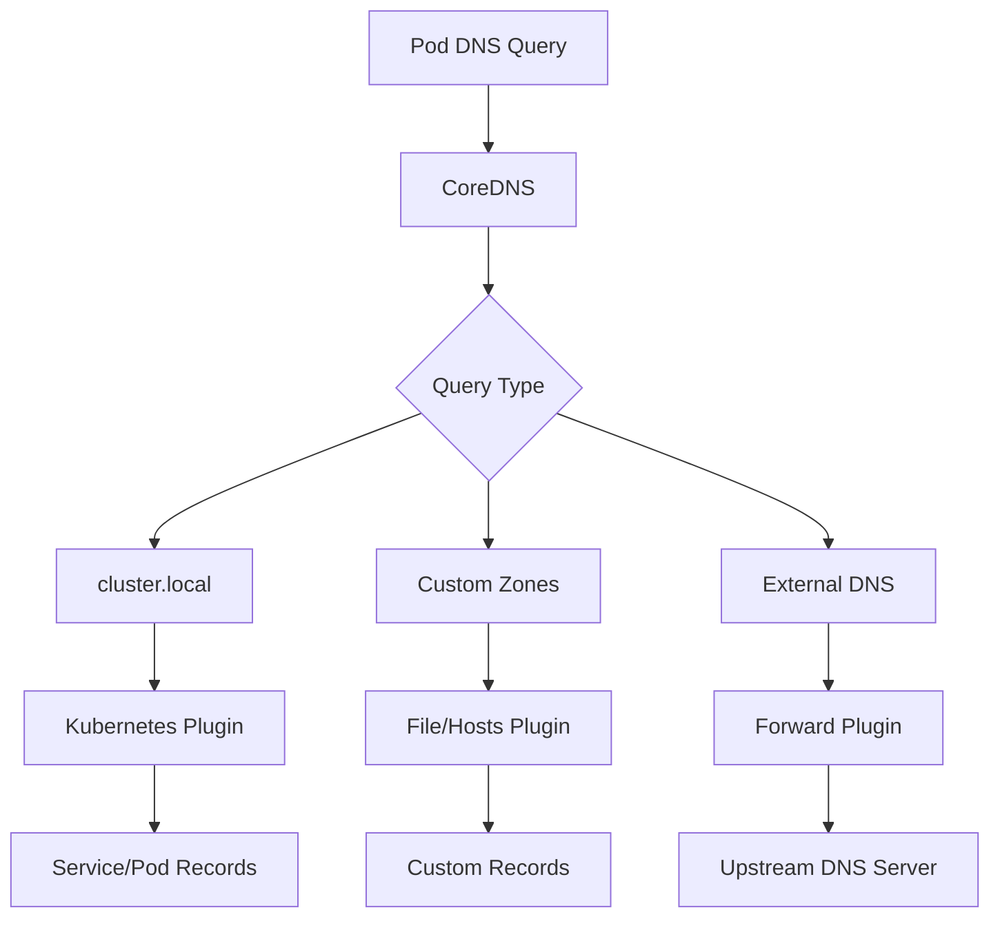

# How to Deploy CoreDNS Configuration with Flux CD

Author: [nawazdhandala](https://github.com/nawazdhandala)

Tags: flux cd, coredns, kubernetes, gitops, networking, dns, service discovery

Description: A practical guide to managing and customizing CoreDNS configuration in Kubernetes using Flux CD for GitOps-driven DNS management.

---

## Introduction

CoreDNS is the default DNS server in Kubernetes, responsible for service discovery and DNS resolution within the cluster. While CoreDNS works out of the box with sensible defaults, production environments often require custom configurations such as conditional forwarding, custom DNS entries, caching tuning, and integration with external DNS systems. Managing these configurations through Flux CD ensures they are version-controlled, auditable, and automatically applied.

This guide covers customizing CoreDNS configuration with Flux CD, including adding custom zones, configuring forwarding rules, and setting up DNS-based service routing.

## Prerequisites

- A Kubernetes cluster (v1.24 or later) with CoreDNS as the DNS provider
- Flux CD installed and bootstrapped
- kubectl configured for your cluster
- A Git repository connected to Flux CD

## Understanding CoreDNS in Kubernetes

CoreDNS runs as a Deployment in the kube-system namespace and uses a ConfigMap called `coredns` for its configuration. The configuration is written in Corefile format, which uses a simple, plugin-based syntax.



## Default CoreDNS Configuration

First, let us look at the default CoreDNS ConfigMap to understand the baseline.

```yaml
# The default Corefile typically looks like this
apiVersion: v1
kind: ConfigMap
metadata:
  name: coredns
  namespace: kube-system
data:
  Corefile: |
    .:53 {
        errors
        health {
           lameduck 5s
        }
        ready
        kubernetes cluster.local in-addr.arpa ip6.arpa {
           pods insecure
           fallthrough in-addr.arpa ip6.arpa
           ttl 30
        }
        prometheus :9153
        forward . /etc/resolv.conf {
           max_concurrent 1000
        }
        cache 30
        loop
        reload
        loadbalance
    }
```

## Customizing CoreDNS with Flux CD

### Custom CoreDNS ConfigMap

Create a customized CoreDNS ConfigMap that Flux CD will manage.

```yaml
# clusters/my-cluster/coredns-config/coredns-configmap.yaml
apiVersion: v1
kind: ConfigMap
metadata:
  name: coredns
  namespace: kube-system
data:
  Corefile: |
    # Main server block for all queries
    .:53 {
        # Log errors to stdout
        errors

        # Health check endpoint on port 8080
        health {
           lameduck 5s
        }

        # Readiness probe endpoint on port 8181
        ready

        # Kubernetes service discovery
        kubernetes cluster.local in-addr.arpa ip6.arpa {
           pods insecure
           fallthrough in-addr.arpa ip6.arpa
           ttl 30
        }

        # Prometheus metrics on port 9153
        prometheus :9153

        # Forward external queries to specific upstream DNS servers
        forward . 8.8.8.8 8.8.4.4 1.1.1.1 {
           max_concurrent 1000
           # Health check upstream servers
           health_check 5s
           # Use a random policy for load balancing
           policy random
        }

        # Increase cache size and TTL for better performance
        cache {
           success 9984 300
           denial 9984 60
           prefetch 10 60s 25%
        }

        # Detect and break forwarding loops
        loop

        # Automatically reload Corefile on changes
        reload 10s

        # Round-robin DNS responses
        loadbalance round_robin
    }
```

### Adding Custom DNS Entries

Use the hosts plugin to add custom static DNS entries.

```yaml
# clusters/my-cluster/coredns-config/coredns-custom-entries.yaml
apiVersion: v1
kind: ConfigMap
metadata:
  name: coredns-custom
  namespace: kube-system
data:
  custom.server: |
    # Custom DNS entries for internal services
    internal.example.com:53 {
        errors
        cache 30

        # Static host entries
        hosts {
            10.0.1.100 db-primary.internal.example.com
            10.0.1.101 db-replica.internal.example.com
            10.0.2.50  cache-server.internal.example.com
            10.0.3.10  monitoring.internal.example.com
            fallthrough
        }
    }
```

Then reference this ConfigMap in the main CoreDNS configuration by importing it.

```yaml
# clusters/my-cluster/coredns-config/coredns-configmap.yaml
apiVersion: v1
kind: ConfigMap
metadata:
  name: coredns
  namespace: kube-system
data:
  Corefile: |
    .:53 {
        errors
        health {
           lameduck 5s
        }
        ready
        kubernetes cluster.local in-addr.arpa ip6.arpa {
           pods insecure
           fallthrough in-addr.arpa ip6.arpa
           ttl 30
        }
        prometheus :9153
        forward . 8.8.8.8 8.8.4.4 {
           max_concurrent 1000
        }
        cache 30
        loop
        reload 10s
        loadbalance
    }

    # Import custom server blocks
    import /etc/coredns/custom/*.server
```

## Conditional DNS Forwarding

Route DNS queries for specific domains to specific DNS servers.

```yaml
# clusters/my-cluster/coredns-config/coredns-conditional.yaml
apiVersion: v1
kind: ConfigMap
metadata:
  name: coredns
  namespace: kube-system
data:
  Corefile: |
    # Default server block
    .:53 {
        errors
        health {
           lameduck 5s
        }
        ready
        kubernetes cluster.local in-addr.arpa ip6.arpa {
           pods insecure
           fallthrough in-addr.arpa ip6.arpa
           ttl 30
        }
        prometheus :9153
        forward . 8.8.8.8 8.8.4.4 {
           max_concurrent 1000
        }
        cache 30
        loop
        reload 10s
        loadbalance
    }

    # Forward corporate domain queries to internal DNS servers
    corp.example.com:53 {
        errors
        cache 30
        forward . 10.10.0.53 10.10.0.54 {
           health_check 10s
        }
    }

    # Forward queries for a partner domain
    partner.example.net:53 {
        errors
        cache 60
        forward . 172.16.0.53 {
           health_check 10s
        }
    }

    # Forward reverse DNS for specific subnets
    10.in-addr.arpa:53 {
        errors
        cache 30
        forward . 10.10.0.53 {
           health_check 10s
        }
    }
```

## CoreDNS with Custom Plugins

### Enabling DNS Logging

```yaml
# clusters/my-cluster/coredns-config/coredns-with-logging.yaml
apiVersion: v1
kind: ConfigMap
metadata:
  name: coredns
  namespace: kube-system
data:
  Corefile: |
    .:53 {
        errors

        # Enable query logging (use with caution in production)
        log . {
           class denial error
        }

        health {
           lameduck 5s
        }
        ready
        kubernetes cluster.local in-addr.arpa ip6.arpa {
           pods insecure
           fallthrough in-addr.arpa ip6.arpa
           ttl 30
        }
        prometheus :9153
        forward . 8.8.8.8 8.8.4.4 {
           max_concurrent 1000
        }
        cache 30
        loop
        reload 10s
        loadbalance
    }
```

## Scaling CoreDNS

Configure CoreDNS autoscaling through a proportional autoscaler.

```yaml
# clusters/my-cluster/coredns-config/dns-autoscaler.yaml
apiVersion: apps/v1
kind: Deployment
metadata:
  name: dns-autoscaler
  namespace: kube-system
  labels:
    k8s-app: dns-autoscaler
spec:
  replicas: 1
  selector:
    matchLabels:
      k8s-app: dns-autoscaler
  template:
    metadata:
      labels:
        k8s-app: dns-autoscaler
    spec:
      serviceAccountName: dns-autoscaler
      containers:
        - name: autoscaler
          image: registry.k8s.io/cpa/cluster-proportional-autoscaler:v1.8.9
          command:
            - /cluster-proportional-autoscaler
            - --namespace=kube-system
            - --configmap=dns-autoscaler
            - --target=deployment/coredns
            - --default-params={"linear":{"coresPerReplica":256,"nodesPerReplica":16,"min":2,"max":10,"preventSinglePointFailure":true}}
            - --logtostderr=true
            - --v=2
          resources:
            requests:
              cpu: 20m
              memory: 10Mi
```

## NodeLocal DNS Cache

Deploy NodeLocal DNS Cache to improve DNS performance by running a local caching agent on each node.

```yaml
# clusters/my-cluster/coredns-config/nodelocaldns-daemonset.yaml
apiVersion: apps/v1
kind: DaemonSet
metadata:
  name: node-local-dns
  namespace: kube-system
  labels:
    k8s-app: node-local-dns
spec:
  selector:
    matchLabels:
      k8s-app: node-local-dns
  template:
    metadata:
      labels:
        k8s-app: node-local-dns
    spec:
      priorityClassName: system-node-critical
      hostNetwork: true
      dnsPolicy: Default
      tolerations:
        - key: CriticalAddonsOnly
          operator: Exists
        - effect: NoSchedule
          operator: Exists
        - effect: NoExecute
          operator: Exists
      containers:
        - name: node-cache
          image: registry.k8s.io/dns/k8s-dns-node-cache:1.23.1
          args:
            - "-localip"
            - "169.254.20.10"
            - "-conf"
            - "/etc/Corefile"
            - "-upstreamsvc"
            - "kube-dns"
          ports:
            - containerPort: 53
              name: dns
              protocol: UDP
            - containerPort: 53
              name: dns-tcp
              protocol: TCP
            - containerPort: 9253
              name: metrics
              protocol: TCP
          resources:
            requests:
              cpu: 25m
              memory: 5Mi
          volumeMounts:
            - name: config-volume
              mountPath: /etc/coredns
      volumes:
        - name: config-volume
          configMap:
            name: node-local-dns
            items:
              - key: Corefile
                path: Corefile.base
```

## Flux Kustomization

```yaml
# clusters/my-cluster/coredns-kustomization.yaml
apiVersion: kustomize.toolkit.fluxcd.io/v1
kind: Kustomization
metadata:
  name: coredns-config
  namespace: flux-system
spec:
  interval: 5m
  sourceRef:
    kind: GitRepository
    name: flux-system
  path: ./clusters/my-cluster/coredns-config
  prune: false
  # Do not prune CoreDNS resources to avoid DNS outages
  force: false
  healthChecks:
    - apiVersion: apps/v1
      kind: Deployment
      name: coredns
      namespace: kube-system
  timeout: 5m
```

## Verifying the Configuration

```bash
# Check CoreDNS pods
kubectl get pods -n kube-system -l k8s-app=kube-dns

# View the active CoreDNS configuration
kubectl get configmap coredns -n kube-system -o yaml

# Test DNS resolution from within the cluster
kubectl run -it --rm dnstest --image=busybox:1.36 --restart=Never -- nslookup kubernetes.default.svc.cluster.local

# Test custom DNS entries
kubectl run -it --rm dnstest --image=busybox:1.36 --restart=Never -- nslookup db-primary.internal.example.com

# Test external DNS resolution
kubectl run -it --rm dnstest --image=busybox:1.36 --restart=Never -- nslookup google.com

# Check CoreDNS metrics
kubectl port-forward -n kube-system svc/kube-dns 9153:9153
curl http://localhost:9153/metrics
```

## Troubleshooting

```bash
# View CoreDNS logs
kubectl logs -n kube-system -l k8s-app=kube-dns

# Check for DNS resolution failures
kubectl logs -n kube-system -l k8s-app=kube-dns | grep -i error

# Verify CoreDNS is listening
kubectl exec -n kube-system deploy/coredns -- netstat -tlnp

# Check DNS latency
kubectl run -it --rm dnsperf --image=quay.io/miekg/dnsperf --restart=Never -- -s kube-dns.kube-system.svc.cluster.local -d /dev/stdin <<< "google.com A"

# Verify the ConfigMap was updated by Flux
flux get kustomizations coredns-config
```

## Conclusion

Managing CoreDNS configuration through Flux CD gives you a reliable, GitOps-driven approach to DNS management in Kubernetes. Custom forwarding rules, static entries, caching policies, and scaling configurations are all version-controlled and automatically applied. This ensures that DNS changes are reviewed, auditable, and consistently deployed across environments. Remember to set `prune: false` for CoreDNS configurations to avoid accidental DNS outages during reconciliation.
