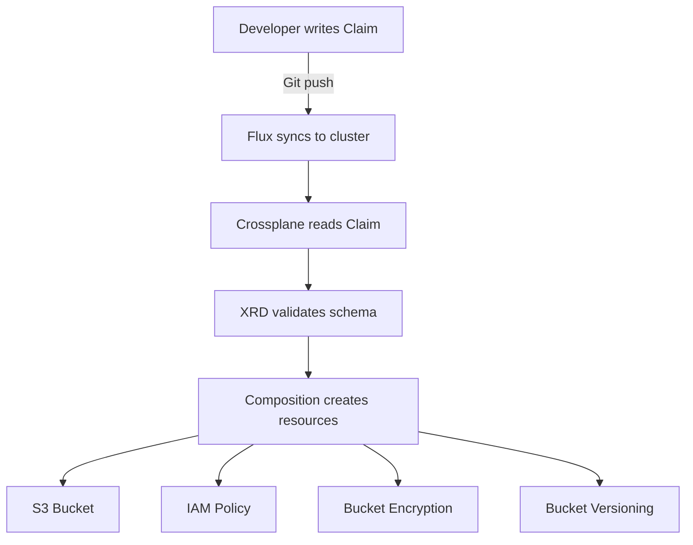

# How to Deploy Crossplane Compositions with Flux CD

Author: [nawazdhandala](https://github.com/nawazdhandala)

Tags: Flux CD, Crossplane, Composition, GitOps, Kubernetes, Platform Engineering

Description: Learn how to build and deploy Crossplane Compositions through Flux CD to create self-service infrastructure APIs for your development teams.

---

## Introduction

Crossplane Compositions let you build higher-level abstractions over cloud resources. Instead of exposing raw cloud APIs to developers, you define opinionated templates that bundle related resources together. When deployed through Flux CD, these compositions become self-service infrastructure APIs that developers can consume by simply committing a YAML claim to Git.

This guide covers creating Crossplane Compositions and CompositeResourceDefinitions (XRDs), deploying them with Flux, and enabling developer self-service.

## Prerequisites

- A Kubernetes cluster with Flux CD and Crossplane installed
- Crossplane AWS providers configured (see the Crossplane with Flux guide)
- Basic familiarity with Crossplane concepts
- kubectl and flux CLI installed

## Understanding the Composition Model



## Defining a CompositeResourceDefinition

The XRD defines the schema for your custom API.

```yaml
# platform/definitions/xstoragebucket.yaml
# Define a custom API for creating storage buckets
# This is what developers will interact with
apiVersion: apiextensions.crossplane.io/v1
kind: CompositeResourceDefinition
metadata:
  # Name must match: x<plural>.<group>
  name: xstoragebuckets.platform.example.com
spec:
  group: platform.example.com
  names:
    kind: XStorageBucket
    plural: xstoragebuckets
  # Enable namespace-scoped claims for developer use
  claimNames:
    kind: StorageBucket
    plural: storagebuckets
  versions:
    - name: v1alpha1
      served: true
      referenceable: true
      schema:
        openAPIV3Schema:
          type: object
          properties:
            spec:
              type: object
              properties:
                # Simple parameters that developers need to set
                region:
                  type: string
                  description: "AWS region for the bucket"
                  enum:
                    - us-east-1
                    - us-west-2
                    - eu-west-1
                environment:
                  type: string
                  description: "Environment classification"
                  enum:
                    - dev
                    - staging
                    - production
                versioning:
                  type: boolean
                  description: "Enable object versioning"
                  default: true
                encryption:
                  type: boolean
                  description: "Enable server-side encryption"
                  default: true
              required:
                - region
                - environment
            status:
              type: object
              properties:
                bucketArn:
                  type: string
                  description: "ARN of the created bucket"
                bucketDomainName:
                  type: string
                  description: "Domain name of the bucket"
```

## Building the Composition

The Composition maps the simple API to actual cloud resources.

```yaml
# platform/compositions/storagebucket-aws.yaml
# Composition that creates an S3 bucket with best practices
apiVersion: apiextensions.crossplane.io/v1
kind: Composition
metadata:
  name: storagebucket-aws
  labels:
    provider: aws
    # Label for selection by the XRD
    crossplane.io/xrd: xstoragebuckets.platform.example.com
spec:
  # Link to the XRD this composition implements
  compositeTypeRef:
    apiVersion: platform.example.com/v1alpha1
    kind: XStorageBucket

  # Pipeline mode for advanced patching
  mode: Pipeline
  pipeline:
    # Step 1: Create all the cloud resources
    - step: create-resources
      functionRef:
        name: function-patch-and-transform
      input:
        apiVersion: pt.fn.crossplane.io/v1beta1
        kind: Resources
        resources:
          # Create the S3 bucket
          - name: bucket
            base:
              apiVersion: s3.aws.upbound.io/v1beta2
              kind: Bucket
              spec:
                forProvider:
                  # Region will be patched from the claim
                  region: us-east-1
                  tags:
                    ManagedBy: crossplane-composition
                providerConfigRef:
                  name: default
            patches:
              # Patch region from the claim
              - type: FromCompositeFieldPath
                fromFieldPath: spec.region
                toFieldPath: spec.forProvider.region
              # Patch environment tag
              - type: FromCompositeFieldPath
                fromFieldPath: spec.environment
                toFieldPath: spec.forProvider.tags.Environment
              # Expose the bucket ARN in status
              - type: ToCompositeFieldPath
                fromFieldPath: status.atProvider.arn
                toFieldPath: status.bucketArn

          # Configure bucket versioning
          - name: versioning
            base:
              apiVersion: s3.aws.upbound.io/v1beta1
              kind: BucketVersioning
              spec:
                forProvider:
                  region: us-east-1
                  bucketSelector:
                    matchControllerRef: true
                  versioningConfiguration:
                    - status: Enabled
                providerConfigRef:
                  name: default
            patches:
              - type: FromCompositeFieldPath
                fromFieldPath: spec.region
                toFieldPath: spec.forProvider.region
              # Conditionally enable versioning
              - type: FromCompositeFieldPath
                fromFieldPath: spec.versioning
                toFieldPath: spec.forProvider.versioningConfiguration[0].status
                transforms:
                  - type: convert
                    convert:
                      toType: string
                  - type: map
                    map:
                      "true": Enabled
                      "false": Suspended

          # Configure server-side encryption
          - name: encryption
            base:
              apiVersion: s3.aws.upbound.io/v1beta1
              kind: BucketServerSideEncryptionConfiguration
              spec:
                forProvider:
                  region: us-east-1
                  bucketSelector:
                    matchControllerRef: true
                  rule:
                    - applyServerSideEncryptionByDefault:
                        - sseAlgorithm: aws:kms
                providerConfigRef:
                  name: default
            patches:
              - type: FromCompositeFieldPath
                fromFieldPath: spec.region
                toFieldPath: spec.forProvider.region

          # Block all public access by default
          - name: public-access-block
            base:
              apiVersion: s3.aws.upbound.io/v1beta1
              kind: BucketPublicAccessBlock
              spec:
                forProvider:
                  region: us-east-1
                  bucketSelector:
                    matchControllerRef: true
                  blockPublicAcls: true
                  blockPublicPolicy: true
                  ignorePublicAcls: true
                  restrictPublicBuckets: true
                providerConfigRef:
                  name: default
            patches:
              - type: FromCompositeFieldPath
                fromFieldPath: spec.region
                toFieldPath: spec.forProvider.region
```

## Installing Composition Functions

Crossplane compositions use functions for patching logic.

```yaml
# platform/functions/patch-and-transform.yaml
# Install the patch-and-transform function
apiVersion: pkg.crossplane.io/v1beta1
kind: Function
metadata:
  name: function-patch-and-transform
spec:
  package: xpkg.upbound.io/crossplane-contrib/function-patch-and-transform:v0.7.0
```

## Building a Database Composition

Create a more complex composition for databases.

```yaml
# platform/definitions/xdatabase.yaml
# XRD for a managed database abstraction
apiVersion: apiextensions.crossplane.io/v1
kind: CompositeResourceDefinition
metadata:
  name: xdatabases.platform.example.com
spec:
  group: platform.example.com
  names:
    kind: XDatabase
    plural: xdatabases
  claimNames:
    kind: Database
    plural: databases
  # Write connection details to a Secret for application use
  connectionSecretKeys:
    - host
    - port
    - username
    - password
  versions:
    - name: v1alpha1
      served: true
      referenceable: true
      schema:
        openAPIV3Schema:
          type: object
          properties:
            spec:
              type: object
              properties:
                engine:
                  type: string
                  enum: [postgres, mysql]
                  default: postgres
                version:
                  type: string
                  default: "16"
                size:
                  type: string
                  description: "Size of the database instance"
                  enum: [small, medium, large]
                  default: small
                region:
                  type: string
                  default: us-east-1
                environment:
                  type: string
                  enum: [dev, staging, production]
              required:
                - environment
```

```yaml
# platform/compositions/database-aws.yaml
# Composition that maps size to instance classes
apiVersion: apiextensions.crossplane.io/v1
kind: Composition
metadata:
  name: database-aws
  labels:
    provider: aws
spec:
  compositeTypeRef:
    apiVersion: platform.example.com/v1alpha1
    kind: XDatabase
  # Expose connection details from the RDS instance
  writeConnectionSecretsToNamespace: crossplane-system
  mode: Pipeline
  pipeline:
    - step: create-database
      functionRef:
        name: function-patch-and-transform
      input:
        apiVersion: pt.fn.crossplane.io/v1beta1
        kind: Resources
        resources:
          - name: rds-instance
            base:
              apiVersion: rds.aws.upbound.io/v1beta2
              kind: Instance
              spec:
                forProvider:
                  region: us-east-1
                  instanceClass: db.t3.micro
                  allocatedStorage: 20
                  engine: postgres
                  engineVersion: "16"
                  username: appadmin
                  autoGeneratePassword: true
                  passwordSecretRef: {}
                  skipFinalSnapshot: true
                  publiclyAccessible: false
                  storageEncrypted: true
                  backupRetentionPeriod: 7
                providerConfigRef:
                  name: default
            patches:
              # Map the size parameter to instance classes
              - type: FromCompositeFieldPath
                fromFieldPath: spec.size
                toFieldPath: spec.forProvider.instanceClass
                transforms:
                  - type: map
                    map:
                      small: db.t3.micro
                      medium: db.t3.medium
                      large: db.r6g.large
              # Map size to storage allocation
              - type: FromCompositeFieldPath
                fromFieldPath: spec.size
                toFieldPath: spec.forProvider.allocatedStorage
                transforms:
                  - type: map
                    map:
                      small: "20"
                      medium: "100"
                      large: "500"
                  - type: convert
                    convert:
                      toType: int
              - type: FromCompositeFieldPath
                fromFieldPath: spec.engine
                toFieldPath: spec.forProvider.engine
              - type: FromCompositeFieldPath
                fromFieldPath: spec.version
                toFieldPath: spec.forProvider.engineVersion
              - type: FromCompositeFieldPath
                fromFieldPath: spec.region
                toFieldPath: spec.forProvider.region
            connectionDetails:
              - name: host
                fromFieldPath: status.atProvider.address
              - name: port
                fromFieldPath: status.atProvider.port
                type: FromFieldPath
              - name: username
                fromFieldPath: spec.forProvider.username
                type: FromFieldPath
```

## Deploying Compositions with Flux

Organize and deploy everything through Flux Kustomizations.

```yaml
# clusters/production/platform.yaml
# Deploy Crossplane functions first
apiVersion: kustomize.toolkit.fluxcd.io/v1
kind: Kustomization
metadata:
  name: crossplane-functions
  namespace: flux-system
spec:
  interval: 10m
  sourceRef:
    kind: GitRepository
    name: flux-system
  path: ./platform/functions
  prune: true
  dependsOn:
    - name: crossplane-providers
---
# Deploy XRDs and Compositions after functions are ready
apiVersion: kustomize.toolkit.fluxcd.io/v1
kind: Kustomization
metadata:
  name: platform-definitions
  namespace: flux-system
spec:
  interval: 10m
  sourceRef:
    kind: GitRepository
    name: flux-system
  path: ./platform/definitions
  prune: true
  dependsOn:
    - name: crossplane-functions
---
# Deploy Compositions that implement the definitions
apiVersion: kustomize.toolkit.fluxcd.io/v1
kind: Kustomization
metadata:
  name: platform-compositions
  namespace: flux-system
spec:
  interval: 10m
  sourceRef:
    kind: GitRepository
    name: flux-system
  path: ./platform/compositions
  prune: true
  dependsOn:
    - name: platform-definitions
```

## Developer Self-Service Claims

Developers create simple claims to request infrastructure.

```yaml
# teams/backend/storage-claim.yaml
# Developer claim for a storage bucket - simple and opinionated
apiVersion: platform.example.com/v1alpha1
kind: StorageBucket
metadata:
  name: user-uploads
  namespace: backend-team
spec:
  region: us-east-1
  environment: production
  versioning: true
  encryption: true
---
# Developer claim for a database
apiVersion: platform.example.com/v1alpha1
kind: Database
metadata:
  name: orders-db
  namespace: backend-team
spec:
  engine: postgres
  version: "16"
  size: medium
  environment: production
  # Connection details will be written to this secret
  writeConnectionSecretToRef:
    name: orders-db-connection
```

## Verifying Deployments

Check that compositions and claims are working correctly.

```bash
# Verify XRDs are installed
kubectl get compositeresourcedefinitions

# Verify Compositions are available
kubectl get compositions

# Check the status of claims
kubectl get storagebuckets -A
kubectl get databases -A

# See the underlying composite resources
kubectl get xstoragebuckets
kubectl get xdatabases

# Check all managed resources created by a composition
kubectl get managed -l crossplane.io/composite=<composite-name>

# Verify Flux synchronization
flux get kustomizations
```

## Conclusion

Crossplane Compositions deployed through Flux CD create a powerful self-service platform. Platform teams define opinionated, secure-by-default infrastructure templates as Compositions, Flux keeps them in sync with Git, and developers consume them through simple claims. Every infrastructure change goes through a pull request, giving you an audit trail and approval process for all cloud resource provisioning.
