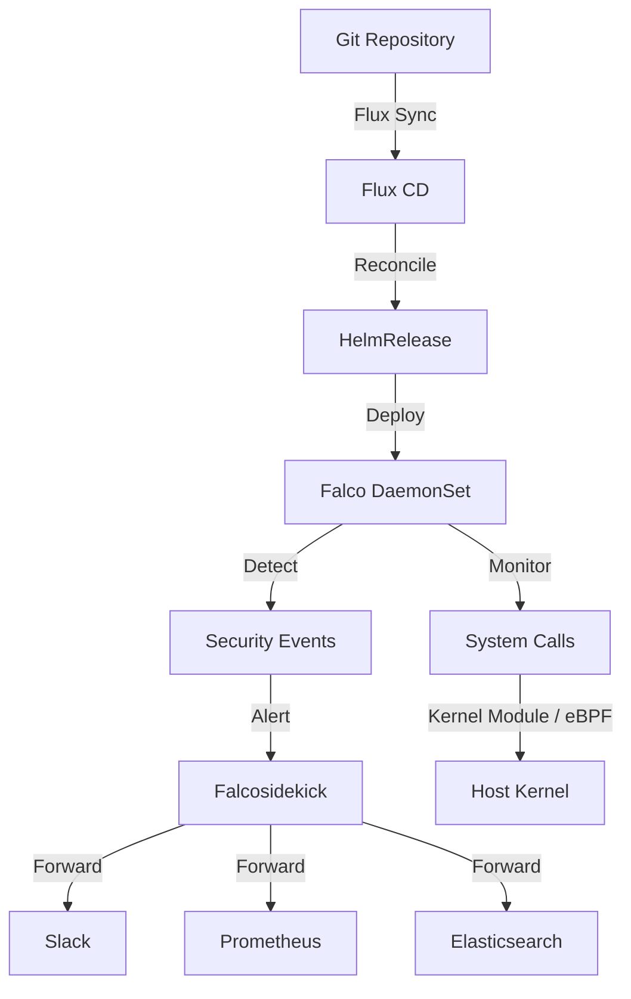

# How to Deploy Falco Runtime Security with Flux CD

Author: [nawazdhandala](https://github.com/nawazdhandala)

Tags: flux cd, falco, runtime security, kubernetes, gitops, security, container security

Description: A practical guide to deploying Falco runtime security on Kubernetes using Flux CD for GitOps-driven threat detection and response.

---

## Introduction

Falco is an open-source runtime security tool originally created by Sysdig. It detects unexpected behavior in running containers and applications by monitoring system calls at the kernel level. Falco can identify threats such as shell access to containers, unexpected network connections, privilege escalation, and file system tampering in real time.

This guide demonstrates how to deploy Falco on Kubernetes using Flux CD, enabling continuous runtime security monitoring managed through GitOps principles.

## Prerequisites

Before starting, ensure you have:

- A Kubernetes cluster (v1.26 or later)
- Flux CD installed and bootstrapped
- kubectl configured for your cluster
- A Git repository connected to Flux CD
- Kernel headers available on worker nodes (for the kernel module driver)

## Architecture Overview



## Step 1: Create the Namespace

Define a namespace for Falco components.

```yaml
# falco-namespace.yaml
# Dedicated namespace for Falco runtime security
apiVersion: v1
kind: Namespace
metadata:
  name: falco-system
  labels:
    app.kubernetes.io/managed-by: flux
    app.kubernetes.io/name: falco
    # Exempt Falco from Pod Security Standards as it needs privileged access
    pod-security.kubernetes.io/enforce: privileged
```

## Step 2: Add the Falco Helm Repository

Register the Falco Helm chart repository with Flux CD.

```yaml
# falco-helmrepo.yaml
# Official Falco Helm chart repository
apiVersion: source.toolkit.fluxcd.io/v1
kind: HelmRepository
metadata:
  name: falcosecurity
  namespace: falco-system
spec:
  interval: 1h
  url: https://falcosecurity.github.io/charts
```

## Step 3: Create the HelmRelease for Falco

Deploy Falco using the official Helm chart.

```yaml
# falco-helmrelease.yaml
# Deploys Falco runtime security via Flux CD
apiVersion: helm.toolkit.fluxcd.io/v1
kind: HelmRelease
metadata:
  name: falco
  namespace: falco-system
spec:
  interval: 30m
  chart:
    spec:
      chart: falco
      version: "4.x"
      sourceRef:
        kind: HelmRepository
        name: falcosecurity
        namespace: falco-system
      interval: 12h
  values:
    # Use eBPF driver instead of kernel module (more portable)
    driver:
      kind: ebpf
      ebpf:
        # Host PID is required for eBPF
        hostNetwork: true

    # Falco configuration
    falco:
      # Log level
      logLevel: info
      # Log format
      logFormat: json
      # Priority threshold for alerts
      priority: warning
      # Enable JSON output for structured logging
      jsonOutput: true
      jsonIncludeOutputProperty: true
      # HTTP output for Falcosidekick
      httpOutput:
        enabled: true
        url: "http://falcosidekick.falco-system.svc:2801"
      # gRPC output
      grpc:
        enabled: true
        bindAddress: "unix:///run/falco/falco.sock"
      grpcOutput:
        enabled: true

    # Resource limits for Falco pods
    resources:
      requests:
        cpu: 100m
        memory: 256Mi
      limits:
        cpu: "1"
        memory: 512Mi

    # Tolerations to run on all nodes including masters
    tolerations:
      - effect: NoSchedule
        operator: Exists
      - effect: NoExecute
        operator: Exists

    # Custom Falco rules
    customRules:
      # Custom rules for detecting suspicious activity
      custom-rules.yaml: |
        # Detect cryptocurrency mining processes
        - rule: Detect Crypto Mining
          desc: Detect cryptocurrency mining processes
          condition: >
            spawned_process and
            (proc.name in (xmrig, minerd, cpuminer, cgminer, bfgminer) or
             proc.cmdline contains "stratum+tcp" or
             proc.cmdline contains "crypto" or
             proc.cmdline contains "mining")
          output: >
            Cryptocurrency mining detected
            (user=%user.name command=%proc.cmdline container=%container.name
             image=%container.image.repository pod=%k8s.pod.name
             namespace=%k8s.ns.name)
          priority: CRITICAL
          tags: [cryptomining, security]

        # Detect reverse shells
        - rule: Detect Reverse Shell
          desc: Detect reverse shell connections from containers
          condition: >
            spawned_process and container and
            ((proc.name = bash or proc.name = sh) and
             proc.cmdline contains "/dev/tcp" or
             proc.cmdline contains "nc -e" or
             proc.cmdline contains "ncat -e")
          output: >
            Reverse shell detected
            (user=%user.name command=%proc.cmdline container=%container.name
             image=%container.image.repository pod=%k8s.pod.name
             namespace=%k8s.ns.name)
          priority: CRITICAL
          tags: [reverse_shell, security]

        # Detect unauthorized kubectl usage
        - rule: Detect Kubectl in Container
          desc: Detect kubectl being run inside a container
          condition: >
            spawned_process and container and proc.name = kubectl
          output: >
            kubectl executed in container
            (user=%user.name command=%proc.cmdline container=%container.name
             pod=%k8s.pod.name namespace=%k8s.ns.name)
          priority: WARNING
          tags: [kubectl, security]
```

## Step 4: Deploy Falcosidekick

Deploy Falcosidekick to forward Falco alerts to various destinations.

```yaml
# falcosidekick-helmrelease.yaml
# Deploys Falcosidekick for alert forwarding
apiVersion: helm.toolkit.fluxcd.io/v1
kind: HelmRelease
metadata:
  name: falcosidekick
  namespace: falco-system
spec:
  interval: 30m
  dependsOn:
    - name: falco
  chart:
    spec:
      chart: falcosidekick
      version: "0.8.x"
      sourceRef:
        kind: HelmRepository
        name: falcosecurity
        namespace: falco-system
      interval: 12h
  values:
    # Resource limits
    resources:
      requests:
        cpu: 50m
        memory: 64Mi
      limits:
        cpu: 200m
        memory: 128Mi

    # Alert output configuration
    config:
      # Slack notifications
      slack:
        webhookurl: ""
        channel: "#security-alerts"
        minimumpriority: "warning"
        messageformat: |
          *Falco Alert*
          Priority: {{ .Priority }}
          Rule: {{ .Rule }}
          Output: {{ .Output }}

      # Prometheus metrics
      prometheus:
        extralabels: "cluster:production"

      # Elasticsearch for log aggregation
      elasticsearch:
        hostport: ""
        index: "falco-alerts"
        type: "_doc"
        minimumpriority: "notice"

    # Enable the web UI
    webui:
      enabled: true
      replicaCount: 1
      resources:
        requests:
          cpu: 50m
          memory: 64Mi
        limits:
          cpu: 100m
          memory: 128Mi
```

## Step 5: Create Alert Configuration Secret

Store sensitive alert destination credentials in a secret.

```yaml
# falco-alert-secret.yaml
# Secret for Falcosidekick alert destinations
# Use sealed-secrets or SOPS in production
apiVersion: v1
kind: Secret
metadata:
  name: falcosidekick-secrets
  namespace: falco-system
type: Opaque
stringData:
  # Slack webhook URL
  SLACK_WEBHOOKURL: "https://hooks.slack.com/services/YOUR/WEBHOOK/URL"
  # Elasticsearch endpoint
  ELASTICSEARCH_HOSTPORT: "https://elasticsearch.logging.svc:9200"
  ELASTICSEARCH_USERNAME: "elastic"
  ELASTICSEARCH_PASSWORD: "your-password"
```

## Step 6: Configure Pod Security for Falco

Ensure Falco has the necessary privileges to monitor system calls.

```yaml
# falco-psp.yaml
# ClusterRole and binding for Falco privileged access
apiVersion: rbac.authorization.k8s.io/v1
kind: ClusterRole
metadata:
  name: falco-privileged
  labels:
    app.kubernetes.io/name: falco
rules:
  - apiGroups: [""]
    resources: ["pods", "nodes", "namespaces"]
    verbs: ["get", "list", "watch"]
  - apiGroups: ["apps"]
    resources: ["deployments", "daemonsets", "replicasets", "statefulsets"]
    verbs: ["get", "list", "watch"]
---
apiVersion: rbac.authorization.k8s.io/v1
kind: ClusterRoleBinding
metadata:
  name: falco-privileged
roleRef:
  apiGroup: rbac.authorization.k8s.io
  kind: ClusterRole
  name: falco-privileged
subjects:
  - kind: ServiceAccount
    name: falco
    namespace: falco-system
```

## Step 7: Set Up Monitoring

Create ServiceMonitor for Falco metrics.

```yaml
# falco-servicemonitor.yaml
# Prometheus ServiceMonitor for Falco and Falcosidekick metrics
apiVersion: monitoring.coreos.com/v1
kind: ServiceMonitor
metadata:
  name: falcosidekick-monitor
  namespace: falco-system
  labels:
    release: prometheus
spec:
  selector:
    matchLabels:
      app.kubernetes.io/name: falcosidekick
  endpoints:
    - port: http
      interval: 30s
      path: /metrics
```

## Step 8: Set Up the Flux Kustomization

Tie all Falco resources together.

```yaml
# kustomization.yaml
# Flux Kustomization for Falco runtime security
apiVersion: kustomize.toolkit.fluxcd.io/v1
kind: Kustomization
metadata:
  name: falco
  namespace: flux-system
spec:
  interval: 10m
  targetNamespace: falco-system
  sourceRef:
    kind: GitRepository
    name: flux-system
  path: ./clusters/my-cluster/falco
  prune: true
  healthChecks:
    - apiVersion: apps/v1
      kind: DaemonSet
      name: falco
      namespace: falco-system
    - apiVersion: apps/v1
      kind: Deployment
      name: falcosidekick
      namespace: falco-system
  timeout: 10m
```

## Step 9: Verify the Deployment

Confirm Falco is running and detecting events.

```bash
# Check Flux reconciliation
flux get helmreleases -n falco-system

# Verify Falco pods are running on all nodes
kubectl get pods -n falco-system -o wide

# Check Falco logs for detection events
kubectl logs -n falco-system -l app.kubernetes.io/name=falco --tail=50

# Trigger a test alert by running a shell in a container
kubectl run test-shell --rm -it --image=alpine -- sh -c "cat /etc/shadow"

# Check if the alert was generated
kubectl logs -n falco-system -l app.kubernetes.io/name=falco --tail=10

# Verify Falcosidekick is receiving events
kubectl logs -n falco-system -l app.kubernetes.io/name=falcosidekick --tail=20

# Check Falco rules loaded
kubectl exec -n falco-system ds/falco -- falco --list
```

## Troubleshooting

Common issues and solutions:

```bash
# Check if eBPF probe loaded successfully
kubectl logs -n falco-system -l app.kubernetes.io/name=falco | grep -i "driver"

# Verify kernel headers are available
kubectl exec -n falco-system ds/falco -- ls /usr/src/

# Check Flux errors
kubectl describe helmrelease falco -n falco-system

# Restart Falco DaemonSet after rule changes
kubectl rollout restart daemonset falco -n falco-system

# Check Falcosidekick connectivity
kubectl exec -n falco-system deploy/falcosidekick -- wget -qO- http://localhost:2801/healthz
```

## Conclusion

You have successfully deployed Falco runtime security on Kubernetes using Flux CD. Falco now monitors system calls across all nodes in your cluster, detecting suspicious activity such as shell access, privilege escalation, cryptocurrency mining, and unauthorized network connections. With Falcosidekick forwarding alerts to Slack, Prometheus, and Elasticsearch, you have a comprehensive runtime security monitoring pipeline fully managed through GitOps.
