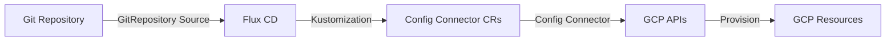

# How to Deploy GCP Resources with Config Connector and Flux CD

Author: [nawazdhandala](https://github.com/nawazdhandala)

Tags: flux cd, gcp, config connector, gitops, kubernetes, iac, google cloud

Description: Learn how to deploy and manage GCP resources using Config Connector integrated with Flux CD for GitOps-driven cloud infrastructure management.

---

Google Cloud Config Connector lets you manage GCP resources through Kubernetes custom resources. Combined with Flux CD, it creates a powerful GitOps workflow for provisioning and managing Google Cloud infrastructure. This guide covers setting up Config Connector with Flux CD to deploy common GCP resources.

## Prerequisites

Before you begin, ensure you have the following:

- A GKE cluster (v1.26 or later) with Config Connector add-on or any Kubernetes cluster
- Flux CD installed on your cluster (v2.x)
- gcloud CLI configured with appropriate permissions
- kubectl configured to access your cluster
- A GCP service account with required IAM roles

## Understanding Config Connector

Config Connector maps GCP resources to Kubernetes custom resources. When you create, update, or delete a Config Connector resource in Kubernetes, it applies the corresponding change in GCP. Flux CD ensures these resources stay in sync with your Git repository.



## Step 1: Install Config Connector

If you are using GKE, enable the Config Connector add-on. For non-GKE clusters, install it via Flux CD:

```yaml
# config-connector-helmrelease.yaml
# HelmRelease to install Config Connector operator
apiVersion: source.toolkit.fluxcd.io/v1
kind: HelmRepository
metadata:
  name: config-connector
  namespace: flux-system
spec:
  interval: 1h
  url: https://charts.config-connector.io
---
apiVersion: helm.toolkit.fluxcd.io/v1
kind: HelmRelease
metadata:
  name: config-connector
  namespace: cnrm-system
spec:
  interval: 10m
  chart:
    spec:
      chart: config-connector
      version: "1.x"
      sourceRef:
        kind: HelmRepository
        name: config-connector
        namespace: flux-system
```

## Step 2: Configure Config Connector with Workload Identity

Set up the Config Connector controller with a GCP service account:

```yaml
# config-connector-context.yaml
# ConfigConnectorContext configures the controller for a namespace
apiVersion: core.cnrm.cloud.google.com/v1beta1
kind: ConfigConnectorContext
metadata:
  name: configconnectorcontext.core.cnrm.cloud.google.com
  namespace: default
spec:
  # The GCP project to manage resources in
  googleServiceAccount: config-connector-sa@my-gcp-project.iam.gserviceaccount.com
  # Request rate limiting
  requestLimit: 25
  # State into which absent resources should be brought
  stateIntoSpec: Merge
```

Set up workload identity binding:

```bash
# Create a GCP service account for Config Connector
gcloud iam service-accounts create config-connector-sa \
  --project=my-gcp-project \
  --display-name="Config Connector Service Account"

# Grant necessary roles
gcloud projects add-iam-policy-binding my-gcp-project \
  --member="serviceAccount:config-connector-sa@my-gcp-project.iam.gserviceaccount.com" \
  --role="roles/editor"

# Bind the Kubernetes service account to the GCP service account
gcloud iam service-accounts add-iam-policy-binding \
  config-connector-sa@my-gcp-project.iam.gserviceaccount.com \
  --member="serviceAccount:my-gcp-project.svc.id.goog[cnrm-system/cnrm-controller-manager]" \
  --role="roles/iam.workloadIdentityUser"
```

## Step 3: Set Up the Git Repository Source

Create a Flux CD GitRepository source:

```yaml
# git-source.yaml
# Flux CD GitRepository source for GCP infrastructure definitions
apiVersion: source.toolkit.fluxcd.io/v1
kind: GitRepository
metadata:
  name: gcp-infrastructure
  namespace: flux-system
spec:
  interval: 5m
  url: https://github.com/your-org/gcp-infrastructure
  ref:
    branch: main
  secretRef:
    name: git-credentials
```

## Step 4: Deploy a Cloud Storage Bucket

Create a GCS bucket using Config Connector:

```yaml
# storage-bucket.yaml
# Config Connector StorageBucket for application data
apiVersion: storage.cnrm.cloud.google.com/v1beta1
kind: StorageBucket
metadata:
  name: my-app-data-bucket
  namespace: default
  annotations:
    # The GCP project to create the bucket in
    cnrm.cloud.google.com/project-id: my-gcp-project
spec:
  # Bucket location
  location: US
  # Storage class for cost optimization
  storageClass: STANDARD
  # Enable uniform bucket-level access
  uniformBucketLevelAccess: true
  # Versioning for data protection
  versioning:
    enabled: true
  # Lifecycle rules to manage object retention
  lifecycleRule:
    - action:
        type: Delete
      condition:
        # Delete objects older than 365 days
        age: 365
    - action:
        type: SetStorageClass
        storageClass: NEARLINE
      condition:
        # Move to Nearline after 30 days
        age: 30
  # Encryption with a customer-managed key
  encryption:
    defaultKmsKeyName: projects/my-gcp-project/locations/us/keyRings/my-keyring/cryptoKeys/my-key
```

## Step 5: Deploy a Cloud SQL Instance

Create a managed PostgreSQL database:

```yaml
# cloudsql-instance.yaml
# Config Connector SQLInstance for PostgreSQL
apiVersion: sql.cnrm.cloud.google.com/v1beta1
kind: SQLInstance
metadata:
  name: my-app-postgres
  namespace: default
  annotations:
    cnrm.cloud.google.com/project-id: my-gcp-project
spec:
  # Database version
  databaseVersion: POSTGRES_15
  # Region
  region: us-central1
  settings:
    # Machine tier
    tier: db-custom-2-8192
    # Disk configuration
    diskSize: 100
    diskType: PD_SSD
    diskAutoresize: true
    # Availability type for high availability
    availabilityType: REGIONAL
    # Backup configuration
    backupConfiguration:
      enabled: true
      startTime: "03:00"
      pointInTimeRecoveryEnabled: true
      backupRetentionSettings:
        retainedBackups: 7
    # IP configuration
    ipConfiguration:
      ipv4Enabled: false
      privateNetworkRef:
        name: my-app-vpc
      requireSsl: true
    # Maintenance window
    maintenanceWindow:
      day: 7
      hour: 3
    # User labels
    userLabels:
      environment: production
      managed-by: flux-cd
---
# cloudsql-database.yaml
# Config Connector SQLDatabase
apiVersion: sql.cnrm.cloud.google.com/v1beta1
kind: SQLDatabase
metadata:
  name: my-app-db
  namespace: default
spec:
  # Reference to the SQL instance
  instanceRef:
    name: my-app-postgres
  charset: UTF8
  collation: en_US.UTF8
---
# cloudsql-user.yaml
# Config Connector SQLUser
apiVersion: sql.cnrm.cloud.google.com/v1beta1
kind: SQLUser
metadata:
  name: app-user
  namespace: default
spec:
  instanceRef:
    name: my-app-postgres
  # Password from a Kubernetes secret
  password:
    valueFrom:
      secretKeyRef:
        name: cloudsql-credentials
        key: password
```

## Step 6: Deploy a VPC Network

Create networking resources:

```yaml
# vpc-network.yaml
# Config Connector ComputeNetwork (VPC)
apiVersion: compute.cnrm.cloud.google.com/v1beta1
kind: ComputeNetwork
metadata:
  name: my-app-vpc
  namespace: default
  annotations:
    cnrm.cloud.google.com/project-id: my-gcp-project
spec:
  # Disable auto-creation of subnets
  autoCreateSubnetworks: false
  # Routing mode
  routingMode: REGIONAL
---
# subnet.yaml
# Config Connector ComputeSubnetwork
apiVersion: compute.cnrm.cloud.google.com/v1beta1
kind: ComputeSubnetwork
metadata:
  name: app-subnet
  namespace: default
spec:
  # Reference to the VPC network
  networkRef:
    name: my-app-vpc
  # IP range for the subnet
  ipCidrRange: "10.0.1.0/24"
  region: us-central1
  # Enable private Google access
  privateIpGoogleAccess: true
  # Secondary IP ranges for GKE pods and services
  secondaryIpRange:
    - rangeName: pods
      ipCidrRange: "10.1.0.0/16"
    - rangeName: services
      ipCidrRange: "10.2.0.0/20"
---
# firewall.yaml
# Config Connector ComputeFirewall
apiVersion: compute.cnrm.cloud.google.com/v1beta1
kind: ComputeFirewall
metadata:
  name: allow-internal
  namespace: default
spec:
  networkRef:
    name: my-app-vpc
  # Allow internal traffic
  allowed:
    - protocol: tcp
      ports:
        - "0-65535"
    - protocol: udp
      ports:
        - "0-65535"
    - protocol: icmp
  # Source ranges (internal VPC traffic)
  sourceRanges:
    - "10.0.0.0/8"
```

## Step 7: Deploy a GKE Cluster

Provision a GKE cluster using Config Connector:

```yaml
# gke-cluster.yaml
# Config Connector ContainerCluster (GKE)
apiVersion: container.cnrm.cloud.google.com/v1beta1
kind: ContainerCluster
metadata:
  name: my-app-cluster
  namespace: default
  annotations:
    cnrm.cloud.google.com/project-id: my-gcp-project
spec:
  location: us-central1
  # Use the VPC network
  networkRef:
    name: my-app-vpc
  subnetworkRef:
    name: app-subnet
  # IP allocation policy for VPC-native clusters
  ipAllocationPolicy:
    clusterSecondaryRangeName: pods
    servicesSecondaryRangeName: services
  # Enable workload identity
  workloadIdentityConfig:
    workloadPool: my-gcp-project.svc.id.goog
  # Private cluster configuration
  privateClusterConfig:
    enablePrivateNodes: true
    enablePrivateEndpoint: false
    masterIpv4CidrBlock: "172.16.0.0/28"
  # Initial node count (managed by node pools)
  initialNodeCount: 1
  # Remove default node pool
  removeDefaultNodePool: true
```

## Step 8: Create the Flux CD Kustomization

```yaml
# kustomization.yaml
# Flux CD Kustomization for GCP resources
apiVersion: kustomize.toolkit.fluxcd.io/v1
kind: Kustomization
metadata:
  name: gcp-infrastructure
  namespace: flux-system
spec:
  interval: 10m
  sourceRef:
    kind: GitRepository
    name: gcp-infrastructure
  path: ./gcp/production
  prune: true
  wait: true
  timeout: 30m
  dependsOn:
    - name: config-connector
  healthChecks:
    - apiVersion: storage.cnrm.cloud.google.com/v1beta1
      kind: StorageBucket
      name: my-app-data-bucket
      namespace: default
```

## Step 9: Verify the Deployment

```bash
# Check Config Connector controller status
kubectl get pods -n cnrm-system

# List all Config Connector resources
kubectl get storagebuckets.storage.cnrm.cloud.google.com
kubectl get sqlinstances.sql.cnrm.cloud.google.com
kubectl get computenetworks.compute.cnrm.cloud.google.com

# Check a specific resource status
kubectl describe storagebucket my-app-data-bucket

# Verify in GCP
gcloud storage buckets describe gs://my-app-data-bucket
gcloud sql instances describe my-app-postgres
gcloud compute networks describe my-app-vpc

# Check Flux CD reconciliation
flux get kustomizations
```

## Best Practices

1. **Use workload identity** for Config Connector authentication on GKE
2. **Scope permissions** with per-namespace Config Connector contexts
3. **Use resource references** (nameRef) instead of hardcoding resource IDs
4. **Apply labels** consistently across all resources for cost tracking
5. **Enable pruning** in Flux CD to automatically clean up deleted resources
6. **Use abandon policy** annotation for resources you want to keep when removing from Git
7. **Separate infrastructure layers** -- networking, databases, and applications in different paths

## Conclusion

Config Connector and Flux CD provide a Kubernetes-native approach to managing GCP infrastructure with GitOps. By defining GCP resources as Kubernetes custom resources and storing them in Git, you gain version control, automated reconciliation, and a consistent management experience. Config Connector's tight integration with GKE and workload identity makes it an excellent choice for teams already running on Google Cloud.
