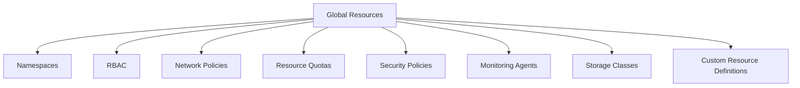

# How to Deploy Global Resources Across Clusters with Flux CD

Author: [nawazdhandala](https://github.com/nawazdhandala)

Tags: flux cd, multi-cluster, global resources, gitops, kubernetes, kustomize

Description: A practical guide to deploying and managing global resources like namespaces, RBAC, network policies, and security policies consistently across all clusters using Flux CD.

---

## Introduction

In a multi-cluster environment, certain resources must exist uniformly across every cluster. These global resources include namespaces, RBAC configurations, network policies, resource quotas, security policies, and monitoring agents. Manually applying these resources to each cluster is error-prone and does not scale. Flux CD allows you to define these global resources once and deploy them to all clusters through GitOps.

This guide demonstrates how to structure your Git repository and Flux configurations to manage global resources efficiently across a fleet of clusters.

## Prerequisites

- Multiple Kubernetes clusters managed by Flux CD
- A hub cluster or individual Flux installations on each cluster
- A Git repository for fleet configuration
- kubectl and Flux CLI installed

## Global Resource Categories

Before diving into implementation, here are the common categories of global resources:



## Step 1: Structure Your Git Repository

Organize global resources in a dedicated directory that gets applied to every cluster.

```
fleet-config/
  global/
    namespaces/
      production.yaml
      staging.yaml
      monitoring.yaml
      kustomization.yaml
    rbac/
      cluster-admins.yaml
      developers.yaml
      readonly.yaml
      kustomization.yaml
    network-policies/
      default-deny.yaml
      allow-dns.yaml
      allow-monitoring.yaml
      kustomization.yaml
    resource-quotas/
      production-quota.yaml
      staging-quota.yaml
      kustomization.yaml
    security/
      pod-security-standards.yaml
      kustomization.yaml
    monitoring/
      node-exporter.yaml
      fluent-bit.yaml
      kustomization.yaml
    kustomization.yaml
  clusters/
    cluster-1/
    cluster-2/
    cluster-3/
```

## Step 2: Define Global Namespaces

```yaml
# global/namespaces/production.yaml
# Production namespace with standard labels and annotations
apiVersion: v1
kind: Namespace
metadata:
  name: production
  labels:
    # Standard labels applied to all clusters
    environment: production
    managed-by: flux
    # Pod security standard enforcement
    pod-security.kubernetes.io/enforce: restricted
    pod-security.kubernetes.io/audit: restricted
    pod-security.kubernetes.io/warn: restricted
---
# global/namespaces/staging.yaml
apiVersion: v1
kind: Namespace
metadata:
  name: staging
  labels:
    environment: staging
    managed-by: flux
    pod-security.kubernetes.io/enforce: baseline
    pod-security.kubernetes.io/audit: restricted
    pod-security.kubernetes.io/warn: restricted
---
# global/namespaces/monitoring.yaml
apiVersion: v1
kind: Namespace
metadata:
  name: monitoring
  labels:
    environment: shared
    managed-by: flux
    pod-security.kubernetes.io/enforce: privileged
```

## Step 3: Define Global RBAC

```yaml
# global/rbac/cluster-admins.yaml
# ClusterRole and binding for cluster administrators
apiVersion: rbac.authorization.k8s.io/v1
kind: ClusterRole
metadata:
  name: fleet-cluster-admin
rules:
  - apiGroups: ["*"]
    resources: ["*"]
    verbs: ["*"]
---
# Bind the admin role to the SRE team group
apiVersion: rbac.authorization.k8s.io/v1
kind: ClusterRoleBinding
metadata:
  name: fleet-cluster-admin-binding
roleRef:
  apiGroup: rbac.authorization.k8s.io
  kind: ClusterRole
  name: fleet-cluster-admin
subjects:
  - kind: Group
    name: sre-team
    apiGroup: rbac.authorization.k8s.io
```

```yaml
# global/rbac/developers.yaml
# Namespace-scoped role for developers in production
apiVersion: rbac.authorization.k8s.io/v1
kind: Role
metadata:
  name: developer
  namespace: production
rules:
  # Developers can view and manage most workload resources
  - apiGroups: ["apps"]
    resources: ["deployments", "replicasets", "statefulsets"]
    verbs: ["get", "list", "watch", "create", "update", "patch"]
  - apiGroups: [""]
    resources: ["pods", "pods/log", "services", "configmaps"]
    verbs: ["get", "list", "watch"]
  # Developers cannot delete pods or access secrets
  - apiGroups: [""]
    resources: ["secrets"]
    verbs: ["get", "list"]
---
apiVersion: rbac.authorization.k8s.io/v1
kind: RoleBinding
metadata:
  name: developer-binding
  namespace: production
roleRef:
  apiGroup: rbac.authorization.k8s.io
  kind: Role
  name: developer
subjects:
  - kind: Group
    name: developers
    apiGroup: rbac.authorization.k8s.io
```

```yaml
# global/rbac/readonly.yaml
# Read-only cluster-wide access for auditors
apiVersion: rbac.authorization.k8s.io/v1
kind: ClusterRole
metadata:
  name: fleet-readonly
rules:
  - apiGroups: ["", "apps", "batch", "networking.k8s.io"]
    resources: ["*"]
    verbs: ["get", "list", "watch"]
  # Explicitly deny access to secrets content
  - apiGroups: [""]
    resources: ["secrets"]
    verbs: ["list"]
---
apiVersion: rbac.authorization.k8s.io/v1
kind: ClusterRoleBinding
metadata:
  name: fleet-readonly-binding
roleRef:
  apiGroup: rbac.authorization.k8s.io
  kind: ClusterRole
  name: fleet-readonly
subjects:
  - kind: Group
    name: auditors
    apiGroup: rbac.authorization.k8s.io
```

## Step 4: Define Global Network Policies

```yaml
# global/network-policies/default-deny.yaml
# Default deny all ingress and egress traffic in production
apiVersion: networking.k8s.io/v1
kind: NetworkPolicy
metadata:
  name: default-deny-all
  namespace: production
spec:
  podSelector: {}
  policyTypes:
    - Ingress
    - Egress
---
# global/network-policies/allow-dns.yaml
# Allow DNS resolution for all pods in production
apiVersion: networking.k8s.io/v1
kind: NetworkPolicy
metadata:
  name: allow-dns
  namespace: production
spec:
  podSelector: {}
  policyTypes:
    - Egress
  egress:
    # Allow DNS queries to kube-dns
    - to:
        - namespaceSelector:
            matchLabels:
              kubernetes.io/metadata.name: kube-system
      ports:
        - protocol: UDP
          port: 53
        - protocol: TCP
          port: 53
---
# global/network-policies/allow-monitoring.yaml
# Allow Prometheus to scrape metrics from all pods
apiVersion: networking.k8s.io/v1
kind: NetworkPolicy
metadata:
  name: allow-monitoring-ingress
  namespace: production
spec:
  podSelector: {}
  policyTypes:
    - Ingress
  ingress:
    - from:
        - namespaceSelector:
            matchLabels:
              kubernetes.io/metadata.name: monitoring
      ports:
        - protocol: TCP
          port: 9090
        - protocol: TCP
          port: 8080
```

## Step 5: Define Resource Quotas

```yaml
# global/resource-quotas/production-quota.yaml
# Resource quota for the production namespace
apiVersion: v1
kind: ResourceQuota
metadata:
  name: production-quota
  namespace: production
spec:
  hard:
    # Compute resource limits
    requests.cpu: "20"
    requests.memory: 40Gi
    limits.cpu: "40"
    limits.memory: 80Gi
    # Object count limits
    pods: "100"
    services: "20"
    persistentvolumeclaims: "30"
    # Prevent use of NodePort services
    services.nodeports: "0"
---
# LimitRange sets default resource requests and limits
apiVersion: v1
kind: LimitRange
metadata:
  name: production-limit-range
  namespace: production
spec:
  limits:
    - type: Container
      default:
        cpu: 200m
        memory: 256Mi
      defaultRequest:
        cpu: 100m
        memory: 128Mi
      max:
        cpu: "4"
        memory: 8Gi
      min:
        cpu: 50m
        memory: 64Mi
```

## Step 6: Deploy Monitoring Agents Globally

```yaml
# global/monitoring/node-exporter.yaml
# DaemonSet for Prometheus node exporter on every node
apiVersion: apps/v1
kind: DaemonSet
metadata:
  name: node-exporter
  namespace: monitoring
  labels:
    app: node-exporter
spec:
  selector:
    matchLabels:
      app: node-exporter
  template:
    metadata:
      labels:
        app: node-exporter
    spec:
      hostNetwork: true
      hostPID: true
      tolerations:
        # Run on all nodes including control plane
        - operator: Exists
      containers:
        - name: node-exporter
          image: prom/node-exporter:v1.7.0
          args:
            - "--path.rootfs=/host"
            - "--web.listen-address=:9100"
          ports:
            - containerPort: 9100
              hostPort: 9100
          resources:
            requests:
              cpu: 50m
              memory: 64Mi
            limits:
              cpu: 100m
              memory: 128Mi
          volumeMounts:
            - name: rootfs
              mountPath: /host
              readOnly: true
      volumes:
        - name: rootfs
          hostPath:
            path: /
```

## Step 7: Create the Global Kustomization

```yaml
# global/kustomization.yaml
# Kustomization that includes all global resources
apiVersion: kustomize.config.k8s.io/v1beta1
kind: Kustomization
resources:
  - namespaces/
  - rbac/
  - network-policies/
  - resource-quotas/
  - security/
  - monitoring/
```

## Step 8: Create Flux Kustomizations for Each Cluster

For a hub-and-spoke setup, create one Kustomization per cluster on the hub:

```yaml
# clusters/hub/global-resources.yaml
# Apply global resources to cluster-1
apiVersion: kustomize.toolkit.fluxcd.io/v1
kind: Kustomization
metadata:
  name: cluster-1-global
  namespace: flux-system
spec:
  interval: 10m
  path: ./global
  prune: true
  sourceRef:
    kind: GitRepository
    name: flux-system
  kubeConfig:
    secretRef:
      name: cluster-1-kubeconfig
  # Force apply to overwrite any manual changes
  force: false
  timeout: 5m
---
# Apply global resources to cluster-2
apiVersion: kustomize.toolkit.fluxcd.io/v1
kind: Kustomization
metadata:
  name: cluster-2-global
  namespace: flux-system
spec:
  interval: 10m
  path: ./global
  prune: true
  sourceRef:
    kind: GitRepository
    name: flux-system
  kubeConfig:
    secretRef:
      name: cluster-2-kubeconfig
  force: false
  timeout: 5m
---
# Apply global resources to cluster-3
apiVersion: kustomize.toolkit.fluxcd.io/v1
kind: Kustomization
metadata:
  name: cluster-3-global
  namespace: flux-system
spec:
  interval: 10m
  path: ./global
  prune: true
  sourceRef:
    kind: GitRepository
    name: flux-system
  kubeConfig:
    secretRef:
      name: cluster-3-kubeconfig
  force: false
  timeout: 5m
```

For standalone Flux installations on each cluster:

```yaml
# clusters/cluster-1/global.yaml
# Each cluster applies the same global resources path
apiVersion: kustomize.toolkit.fluxcd.io/v1
kind: Kustomization
metadata:
  name: global-resources
  namespace: flux-system
spec:
  interval: 10m
  path: ./global
  prune: true
  sourceRef:
    kind: GitRepository
    name: flux-system
  # Global resources should be applied before cluster-specific ones
  # Other Kustomizations can depend on this
```

## Step 9: Add Cluster-Specific Overrides

Sometimes a global resource needs slight modifications per cluster. Use patches or variable substitution.

```yaml
# clusters/cluster-1/global-overrides.yaml
# Override resource quotas for cluster-1 which has more capacity
apiVersion: kustomize.toolkit.fluxcd.io/v1
kind: Kustomization
metadata:
  name: global-resources
  namespace: flux-system
spec:
  interval: 10m
  path: ./global
  prune: true
  sourceRef:
    kind: GitRepository
    name: flux-system
  patches:
    # Increase production quota for this larger cluster
    - target:
        kind: ResourceQuota
        name: production-quota
        namespace: production
      patch: |
        - op: replace
          path: /spec/hard/requests.cpu
          value: "50"
        - op: replace
          path: /spec/hard/requests.memory
          value: "100Gi"
        - op: replace
          path: /spec/hard/pods
          value: "250"
```

## Step 10: Validate Global Resource Consistency

Create a script or CI check to verify that global resources are consistent across clusters.

```bash
# Compare global resources across clusters
for cluster in cluster-1 cluster-2 cluster-3; do
  echo "--- Checking $cluster ---"

  # Verify namespaces exist
  kubectl --context=$cluster get namespaces \
    -l managed-by=flux -o name

  # Verify RBAC is in place
  kubectl --context=$cluster get clusterrolebindings \
    -l managed-by=flux -o name

  # Check network policies in production namespace
  kubectl --context=$cluster get networkpolicies \
    -n production -o name

  # Verify resource quotas
  kubectl --context=$cluster get resourcequotas \
    -n production -o wide
done
```

## Troubleshooting

**Resources not applied to all clusters**: Verify that each cluster has a Kustomization pointing to the `./global` path and that the GitRepository source is accessible.

**RBAC conflicts**: If a cluster has pre-existing RBAC that conflicts with global definitions, use `force: true` carefully or reconcile manually first.

**Network policy blocking traffic**: Test connectivity after applying default-deny policies. Ensure allow rules for DNS and monitoring are applied alongside deny rules.

```bash
# Check Flux reconciliation status across clusters
for cluster in cluster-1 cluster-2 cluster-3; do
  echo "--- $cluster ---"
  flux get kustomizations --context=$cluster | grep global
done
```

## Conclusion

Deploying global resources across clusters with Flux CD ensures consistency and reduces the operational burden of managing multi-cluster environments. By defining namespaces, RBAC, network policies, resource quotas, and monitoring agents in a single location and using Flux to reconcile them across all clusters, you eliminate configuration drift and make it easy to audit your security posture fleet-wide. The Git repository becomes the authoritative source for your organizational policies, and Flux ensures every cluster converges to that desired state.
