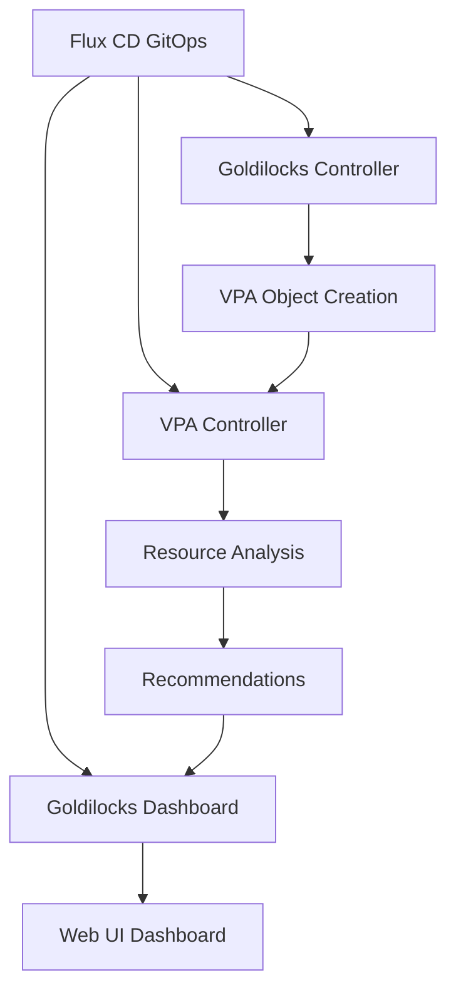

# How to Deploy Goldilocks for Resource Recommendations with Flux CD

Author: [nawazdhandala](https://github.com/nawazdhandala)

Tags: flux cd, goldilocks, resource recommendations, kubernetes, vpa, cost optimization, gitops

Description: A practical guide to deploying Goldilocks on Kubernetes using Flux CD for visualizing resource recommendations and right-sizing workloads.

---

## Introduction

Goldilocks is an open-source tool by Fairwinds that helps you identify the right resource requests and limits for your Kubernetes workloads. It leverages the Vertical Pod Autoscaler (VPA) in recommendation-only mode to analyze actual resource usage and provides a dashboard showing what your containers actually need versus what they request. This helps eliminate over-provisioning (wasting money) and under-provisioning (causing performance issues).

This guide covers deploying Goldilocks and its VPA dependency with Flux CD.

## Prerequisites

- A Kubernetes cluster (v1.25+)
- Flux CD installed and bootstrapped
- kubectl and flux CLI tools installed
- Metrics Server installed (for resource metrics)

## Architecture Overview



## Repository Structure

```
clusters/
  my-cluster/
    goldilocks/
      namespace.yaml
      helmrepository-fairwinds.yaml
      helmrepository-vpa.yaml
      vpa-helmrelease.yaml
      goldilocks-helmrelease.yaml
      ingress.yaml
      kustomization.yaml
```

## Step 1: Create the Namespace

```yaml
# clusters/my-cluster/goldilocks/namespace.yaml
apiVersion: v1
kind: Namespace
metadata:
  name: goldilocks
  labels:
    app.kubernetes.io/managed-by: flux
```

## Step 2: Add Helm Repositories

```yaml
# clusters/my-cluster/goldilocks/helmrepository-fairwinds.yaml
apiVersion: source.toolkit.fluxcd.io/v1
kind: HelmRepository
metadata:
  name: fairwinds-stable
  namespace: goldilocks
spec:
  interval: 1h
  # Fairwinds Helm chart repository for Goldilocks
  url: https://charts.fairwinds.com/stable
---
# clusters/my-cluster/goldilocks/helmrepository-vpa.yaml
apiVersion: source.toolkit.fluxcd.io/v1
kind: HelmRepository
metadata:
  name: fairwinds-stable-vpa
  namespace: goldilocks
spec:
  interval: 1h
  # Fairwinds also hosts the VPA chart
  url: https://charts.fairwinds.com/stable
```

## Step 3: Deploy the Vertical Pod Autoscaler

Goldilocks requires VPA to generate recommendations. Deploy VPA in recommendation-only mode.

```yaml
# clusters/my-cluster/goldilocks/vpa-helmrelease.yaml
apiVersion: helm.toolkit.fluxcd.io/v2
kind: HelmRelease
metadata:
  name: vpa
  namespace: goldilocks
spec:
  interval: 30m
  chart:
    spec:
      chart: vpa
      version: "4.7.x"
      sourceRef:
        kind: HelmRepository
        name: fairwinds-stable-vpa
        namespace: goldilocks
      interval: 12h
  values:
    # Recommender generates resource recommendations
    recommender:
      enabled: true
      resources:
        requests:
          cpu: 50m
          memory: 256Mi
        limits:
          cpu: 200m
          memory: 512Mi
      extraArgs:
        # Prometheus integration for historical data
        storage: prometheus
        prometheus-address: http://prometheus-server.monitoring.svc:9090
        # Recommendation margin (percentage above actual usage)
        recommendation-margin-fraction: "0.15"
        # History length for recommendations
        pod-recommendation-min-cpu-millicores: 15
        pod-recommendation-min-memory-mb: 64

    # Disable updater - we only want recommendations, not auto-updates
    updater:
      enabled: false

    # Disable admission controller - no automatic resource changes
    admissionController:
      enabled: false
```

## Step 4: Deploy Goldilocks

```yaml
# clusters/my-cluster/goldilocks/goldilocks-helmrelease.yaml
apiVersion: helm.toolkit.fluxcd.io/v2
kind: HelmRelease
metadata:
  name: goldilocks
  namespace: goldilocks
spec:
  interval: 30m
  # Ensure VPA is deployed first
  dependsOn:
    - name: vpa
      namespace: goldilocks
  chart:
    spec:
      chart: goldilocks
      version: "9.1.x"
      sourceRef:
        kind: HelmRepository
        name: fairwinds-stable
        namespace: goldilocks
      interval: 12h
  values:
    # Controller watches namespaces and creates VPA objects
    controller:
      enabled: true
      resources:
        requests:
          cpu: 50m
          memory: 64Mi
        limits:
          cpu: 250m
          memory: 256Mi
      # Flags for the controller
      flags:
        # Create VPA objects in update mode "Off" (recommendation only)
        on-by-default: false
        # Exclude certain container names from VPA creation
        exclude-containers: "istio-proxy,linkerd-proxy"

    # Dashboard provides the web UI
    dashboard:
      enabled: true
      replicaCount: 2
      resources:
        requests:
          cpu: 50m
          memory: 64Mi
        limits:
          cpu: 250m
          memory: 128Mi
      service:
        type: ClusterIP
        port: 80

      # Basic auth for the dashboard (optional)
      # Use an Ingress with authentication instead for production
```

## Step 5: Enable Namespaces for Goldilocks

Label namespaces to opt-in to resource recommendations.

```yaml
# clusters/my-cluster/goldilocks/namespace-labels.yaml
apiVersion: v1
kind: Namespace
metadata:
  name: default
  labels:
    # Enable Goldilocks for this namespace
    goldilocks.fairwinds.com/enabled: "true"
---
apiVersion: v1
kind: Namespace
metadata:
  name: app-namespace
  labels:
    goldilocks.fairwinds.com/enabled: "true"
---
apiVersion: v1
kind: Namespace
metadata:
  name: staging
  labels:
    goldilocks.fairwinds.com/enabled: "true"
```

## Step 6: Create an Ingress for the Dashboard

```yaml
# clusters/my-cluster/goldilocks/ingress.yaml
apiVersion: networking.k8s.io/v1
kind: Ingress
metadata:
  name: goldilocks
  namespace: goldilocks
  annotations:
    cert-manager.io/cluster-issuer: letsencrypt-prod
    # Restrict access to internal network
    nginx.ingress.kubernetes.io/whitelist-source-range: "10.0.0.0/8,172.16.0.0/12"
    # Basic authentication
    nginx.ingress.kubernetes.io/auth-type: basic
    nginx.ingress.kubernetes.io/auth-secret: goldilocks-basic-auth
    nginx.ingress.kubernetes.io/auth-realm: "Goldilocks Dashboard"
spec:
  ingressClassName: nginx
  tls:
    - hosts:
        - goldilocks.example.com
      secretName: goldilocks-tls
  rules:
    - host: goldilocks.example.com
      http:
        paths:
          - path: /
            pathType: Prefix
            backend:
              service:
                name: goldilocks-dashboard
                port:
                  number: 80
```

## Step 7: Fine-Tune VPA per Deployment

Override VPA behavior for specific deployments using annotations.

```yaml
# clusters/my-cluster/apps/annotated-deployment.yaml
apiVersion: apps/v1
kind: Deployment
metadata:
  name: web-api
  namespace: default
  labels:
    app: web-api
  annotations:
    # Override the VPA update mode for this deployment
    goldilocks.fairwinds.com/vpa-update-mode: "Off"
    # Exclude specific containers from recommendations
    goldilocks.fairwinds.com/exclude-containers: "sidecar"
spec:
  replicas: 3
  selector:
    matchLabels:
      app: web-api
  template:
    metadata:
      labels:
        app: web-api
    spec:
      containers:
        - name: api
          image: web-api:latest
          resources:
            # These are the values Goldilocks helps you optimize
            requests:
              cpu: 250m
              memory: 256Mi
            limits:
              cpu: 1000m
              memory: 512Mi
        - name: sidecar
          image: sidecar:latest
          resources:
            requests:
              cpu: 50m
              memory: 32Mi
```

## Step 8: Export Recommendations as Prometheus Metrics

```yaml
# clusters/my-cluster/goldilocks/servicemonitor.yaml
apiVersion: monitoring.coreos.com/v1
kind: ServiceMonitor
metadata:
  name: goldilocks-controller
  namespace: goldilocks
spec:
  selector:
    matchLabels:
      app.kubernetes.io/name: goldilocks
      app.kubernetes.io/component: controller
  endpoints:
    - port: http
      interval: 60s
      path: /metrics
---
# PrometheusRule for alerting on resource mismatches
apiVersion: monitoring.coreos.com/v1
kind: PrometheusRule
metadata:
  name: goldilocks-alerts
  namespace: goldilocks
spec:
  groups:
    - name: goldilocks
      rules:
        # Alert when CPU requests are significantly higher than recommended
        - alert: CPUOverProvisioned
          expr: |
            (
              kube_pod_container_resource_requests{resource="cpu"}
              / on(namespace, pod, container)
              vpa_containerrecommendations_target{resource="cpu"}
            ) > 3
          for: 24h
          labels:
            severity: info
          annotations:
            summary: "Container {{ $labels.container }} in {{ $labels.namespace }}/{{ $labels.pod }} is over-provisioned for CPU"
        # Alert when memory requests are significantly lower than recommended
        - alert: MemoryUnderProvisioned
          expr: |
            (
              vpa_containerrecommendations_target{resource="memory"}
              / on(namespace, pod, container)
              kube_pod_container_resource_requests{resource="memory"}
            ) > 2
          for: 24h
          labels:
            severity: warning
          annotations:
            summary: "Container {{ $labels.container }} in {{ $labels.namespace }}/{{ $labels.pod }} is under-provisioned for memory"
```

## Step 9: Flux Kustomization

```yaml
# clusters/my-cluster/goldilocks/kustomization.yaml
apiVersion: kustomize.toolkit.fluxcd.io/v1
kind: Kustomization
metadata:
  name: goldilocks
  namespace: flux-system
spec:
  interval: 10m
  path: ./clusters/my-cluster/goldilocks
  prune: true
  sourceRef:
    kind: GitRepository
    name: flux-system
  wait: true
  timeout: 5m
  healthChecks:
    - apiVersion: apps/v1
      kind: Deployment
      name: goldilocks-controller
      namespace: goldilocks
    - apiVersion: apps/v1
      kind: Deployment
      name: goldilocks-dashboard
      namespace: goldilocks
```

## Verifying the Deployment

```bash
# Check Goldilocks and VPA pods
kubectl get pods -n goldilocks

# Verify VPA objects were created for labeled namespaces
kubectl get vpa -A

# Check VPA recommendations
kubectl describe vpa -n default

# Access the dashboard locally
kubectl port-forward -n goldilocks svc/goldilocks-dashboard 8080:80

# View recommendations via CLI
kubectl get vpa -n default -o jsonpath='{range .items[*]}{.metadata.name}{"\n"}{.status.recommendation.containerRecommendations[*]}{"\n\n"}{end}'

# Verify Flux reconciliation
flux get helmrelease -n goldilocks
```

## Troubleshooting

```bash
# Check Goldilocks controller logs
kubectl logs -n goldilocks -l app.kubernetes.io/name=goldilocks,app.kubernetes.io/component=controller --tail=30

# Check VPA recommender logs
kubectl logs -n goldilocks -l app=vpa-recommender --tail=30

# Verify namespace labeling
kubectl get namespaces -l goldilocks.fairwinds.com/enabled=true

# Check if VPA objects have recommendations yet (may take 5-10 minutes)
kubectl get vpa -A -o custom-columns=NAME:.metadata.name,NAMESPACE:.metadata.namespace,TARGET-CPU:.status.recommendation.containerRecommendations[0].target.cpu,TARGET-MEM:.status.recommendation.containerRecommendations[0].target.memory

# Verify metrics server is running
kubectl get deployment metrics-server -n kube-system
```

## Applying Recommendations

After reviewing Goldilocks recommendations in the dashboard:

1. Compare current resource requests with the "Target" recommendation
2. Use the "Lower Bound" as a minimum and "Upper Bound" as a maximum
3. Update your deployment manifests in Git with the recommended values
4. Let Flux CD apply the changes through the normal GitOps workflow

This keeps resource optimization fully within your GitOps process.

## Conclusion

Goldilocks with Flux CD provides a GitOps-managed resource optimization workflow. By visualizing VPA recommendations in a dashboard, you can identify over-provisioned and under-provisioned workloads, then update resource requests through your Git repository. This approach helps reduce cloud costs while maintaining application performance, all managed through the Flux CD GitOps pipeline.
