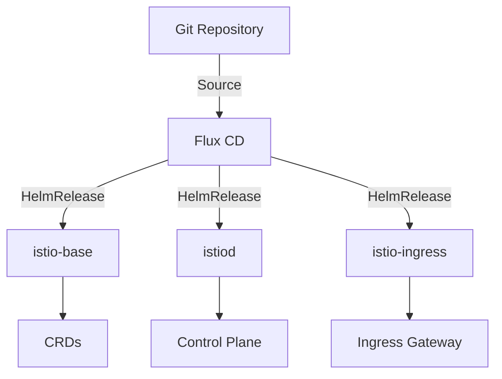

# How to Deploy Istio with Flux CD

Author: [nawazdhandala](https://github.com/nawazdhandala)

Tags: flux cd, istio, service mesh, gitops, kubernetes, networking, security

Description: Learn how to deploy and manage Istio service mesh on Kubernetes using Flux CD for a fully GitOps-driven service mesh installation and configuration.

---

Istio is the most popular service mesh for Kubernetes, providing traffic management, security, and observability features. Deploying Istio through Flux CD ensures your service mesh configuration is version-controlled, auditable, and automatically reconciled. This guide covers the complete setup of Istio using Flux CD.

## Prerequisites

Before you begin, ensure you have the following:

- A Kubernetes cluster (v1.26 or later)
- Flux CD installed on your cluster (v2.x)
- kubectl configured to access your cluster
- Familiarity with Istio concepts (sidecar injection, gateways, virtual services)

## Understanding the Deployment Architecture

Istio can be installed via Helm charts or the Istio operator. Using Flux CD HelmRelease resources with the official Istio Helm charts is the recommended GitOps approach because it gives you fine-grained control over each component.



## Step 1: Add the Istio Helm Repository

Create a HelmRepository source for the official Istio charts:

```yaml
# istio-helm-repo.yaml
# HelmRepository pointing to the official Istio Helm charts
apiVersion: source.toolkit.fluxcd.io/v1
kind: HelmRepository
metadata:
  name: istio
  namespace: flux-system
spec:
  interval: 1h
  url: https://istio-release.storage.googleapis.com/charts
```

## Step 2: Install Istio Base (CRDs)

Install the Istio base chart which contains the CRDs:

```yaml
# istio-base.yaml
# HelmRelease for Istio base CRDs - must be installed first
apiVersion: helm.toolkit.fluxcd.io/v2
kind: HelmRelease
metadata:
  name: istio-base
  namespace: istio-system
spec:
  interval: 10m
  chart:
    spec:
      chart: base
      version: "1.22.x"
      sourceRef:
        kind: HelmRepository
        name: istio
        namespace: flux-system
  # Install CRDs with the chart
  install:
    crds: Create
  # Update CRDs when upgrading
  upgrade:
    crds: CreateReplace
```

## Step 3: Install Istiod (Control Plane)

Deploy the Istio control plane (istiod):

```yaml
# istiod.yaml
# HelmRelease for istiod - the Istio control plane
apiVersion: helm.toolkit.fluxcd.io/v2
kind: HelmRelease
metadata:
  name: istiod
  namespace: istio-system
spec:
  interval: 10m
  # Wait for istio-base to be ready before installing
  dependsOn:
    - name: istio-base
      namespace: istio-system
  chart:
    spec:
      chart: istiod
      version: "1.22.x"
      sourceRef:
        kind: HelmRepository
        name: istio
        namespace: flux-system
  values:
    # Global mesh configuration
    global:
      # Set the mesh ID for multi-cluster setups
      meshID: my-mesh
      # Network name for multi-network setups
      network: network1
    # Pilot (istiod) configuration
    pilot:
      # Resource requests and limits
      resources:
        requests:
          cpu: 200m
          memory: 256Mi
        limits:
          cpu: 500m
          memory: 512Mi
      # Auto-scaling configuration
      autoscaleEnabled: true
      autoscaleMin: 2
      autoscaleMax: 5
      # Enable status updates for Istio resources
      env:
        PILOT_ENABLE_STATUS: "true"
    # Mesh-wide configuration
    meshConfig:
      # Enable access logging
      accessLogFile: /dev/stdout
      # Access log format
      accessLogEncoding: JSON
      # Default proxy configuration
      defaultConfig:
        # Enable distributed tracing
        tracing:
          sampling: 100.0
          zipkin:
            address: jaeger-collector.observability:9411
        # Hold application start until proxy is ready
        holdApplicationUntilProxyStarts: true
      # Enable automatic mTLS
      enableAutoMtls: true
      # Outbound traffic policy - allow or restrict
      outboundTrafficPolicy:
        mode: REGISTRY_ONLY
```

## Step 4: Install the Istio Ingress Gateway

Deploy the Istio Ingress Gateway:

```yaml
# istio-ingress.yaml
# HelmRelease for Istio Ingress Gateway
apiVersion: helm.toolkit.fluxcd.io/v2
kind: HelmRelease
metadata:
  name: istio-ingress
  namespace: istio-ingress
spec:
  interval: 10m
  dependsOn:
    - name: istiod
      namespace: istio-system
  chart:
    spec:
      chart: gateway
      version: "1.22.x"
      sourceRef:
        kind: HelmRepository
        name: istio
        namespace: flux-system
  values:
    # Service configuration for the gateway
    service:
      type: LoadBalancer
      # Annotations for cloud provider load balancers
      annotations:
        service.beta.kubernetes.io/aws-load-balancer-type: nlb
        service.beta.kubernetes.io/aws-load-balancer-scheme: internet-facing
    # Resource configuration
    resources:
      requests:
        cpu: 100m
        memory: 128Mi
      limits:
        cpu: 500m
        memory: 256Mi
    # Auto-scaling
    autoscaling:
      enabled: true
      minReplicas: 2
      maxReplicas: 10
      targetCPUUtilizationPercentage: 80
    # Pod disruption budget
    podDisruptionBudget:
      minAvailable: 1
```

## Step 5: Create the Istio Namespace with Sidecar Injection

Set up namespaces with automatic sidecar injection:

```yaml
# app-namespace.yaml
# Namespace with Istio sidecar injection enabled
apiVersion: v1
kind: Namespace
metadata:
  name: my-app
  labels:
    # This label enables automatic sidecar injection
    istio-injection: enabled
    # Pod security standards
    pod-security.kubernetes.io/enforce: baseline
```

## Step 6: Configure Peer Authentication

Set up mesh-wide mTLS policies:

```yaml
# peer-authentication.yaml
# PeerAuthentication to enforce strict mTLS across the mesh
apiVersion: security.istio.io/v1
kind: PeerAuthentication
metadata:
  name: default
  namespace: istio-system
spec:
  # Enforce strict mTLS for all workloads in the mesh
  mtls:
    mode: STRICT
---
# Per-namespace PeerAuthentication (if needed)
apiVersion: security.istio.io/v1
kind: PeerAuthentication
metadata:
  name: default
  namespace: my-app
spec:
  mtls:
    mode: STRICT
  # Port-level overrides for specific ports
  portLevelMtls:
    # Allow plaintext on health check port
    8080:
      mode: PERMISSIVE
```

## Step 7: Deploy a Sample Application

Deploy a sample application to verify the mesh is working:

```yaml
# sample-app.yaml
# Sample deployment with Istio sidecar
apiVersion: apps/v1
kind: Deployment
metadata:
  name: httpbin
  namespace: my-app
spec:
  replicas: 2
  selector:
    matchLabels:
      app: httpbin
  template:
    metadata:
      labels:
        app: httpbin
        # Version label for traffic management
        version: v1
    spec:
      containers:
        - name: httpbin
          image: docker.io/kong/httpbin:0.1.0
          ports:
            - containerPort: 80
          resources:
            requests:
              cpu: 100m
              memory: 128Mi
---
# Service for the sample app
apiVersion: v1
kind: Service
metadata:
  name: httpbin
  namespace: my-app
spec:
  selector:
    app: httpbin
  ports:
    - port: 80
      targetPort: 80
      name: http
```

## Step 8: Set Up Observability

Configure Istio telemetry and monitoring:

```yaml
# telemetry.yaml
# Telemetry configuration for the mesh
apiVersion: telemetry.istio.io/v1
kind: Telemetry
metadata:
  name: mesh-default
  namespace: istio-system
spec:
  # Configure metrics
  metrics:
    - providers:
        - name: prometheus
      overrides:
        # Enable all default metrics
        - match:
            mode: CLIENT_AND_SERVER
          disabled: false
  # Configure access logging
  accessLogging:
    - providers:
        - name: envoy
      filter:
        expression: "response.code >= 400"
```

## Step 9: Create the Flux CD Kustomization

Organize all Istio resources under a Flux CD Kustomization:

```yaml
# kustomization.yaml
# Flux CD Kustomization for Istio deployment
apiVersion: kustomize.toolkit.fluxcd.io/v1
kind: Kustomization
metadata:
  name: istio-system
  namespace: flux-system
spec:
  interval: 10m
  sourceRef:
    kind: GitRepository
    name: infrastructure
  path: ./istio
  prune: true
  wait: true
  timeout: 15m
  healthChecks:
    - apiVersion: apps/v1
      kind: Deployment
      name: istiod
      namespace: istio-system
```

## Step 10: Verify the Installation

Validate that Istio is properly installed and functioning:

```bash
# Check Istio components
kubectl get pods -n istio-system
kubectl get pods -n istio-ingress

# Verify Istio CRDs are installed
kubectl get crds | grep istio

# Check the mesh configuration
kubectl get cm istio -n istio-system -o yaml

# Verify sidecar injection is working
kubectl get pods -n my-app -o jsonpath='{.items[*].spec.containers[*].name}'

# Check mTLS status
kubectl get peerauthentication -A

# View the Istio proxy status
istioctl proxy-status

# Analyze the mesh for issues
istioctl analyze --all-namespaces
```

## Upgrading Istio with Flux CD

To upgrade Istio, update the chart version in your HelmRelease resources:

```yaml
# Update the version in each HelmRelease
spec:
  chart:
    spec:
      # Change from 1.22.x to 1.23.x
      version: "1.23.x"
```

Flux CD will detect the change and perform a rolling upgrade. The dependency chain ensures components upgrade in the correct order: base first, then istiod, then gateways.

## Best Practices

1. **Use HelmRelease dependencies** to ensure correct installation order
2. **Enable strict mTLS** for production environments
3. **Configure resource limits** for Istio components to prevent resource contention
4. **Use revision tags** for canary upgrades of the control plane
5. **Monitor Istio components** using Prometheus and Grafana
6. **Set outbound traffic policy** to REGISTRY_ONLY for enhanced security
7. **Enable access logging** for debugging and auditing

## Conclusion

Deploying Istio with Flux CD provides a reliable, repeatable, and auditable service mesh installation. By managing Istio configuration through Git, you ensure that mesh settings are version-controlled and automatically reconciled. The HelmRelease dependency chain guarantees proper installation ordering, and Flux CD's health checks ensure each component is ready before proceeding to the next. This GitOps approach simplifies Istio upgrades and makes it easy to maintain consistent configurations across multiple clusters.
