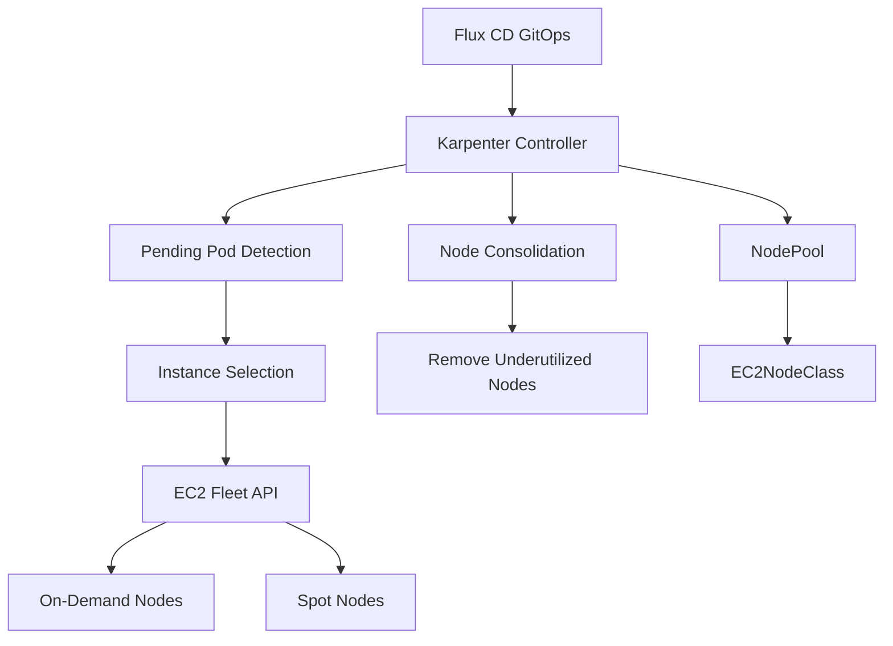

# How to Deploy Karpenter Node Autoscaler with Flux CD

Author: [nawazdhandala](https://github.com/nawazdhandala)

Tags: flux cd, karpenter, node autoscaling, kubernetes, aws, gitops, cost optimization

Description: A practical guide to deploying Karpenter for intelligent node autoscaling on AWS EKS using Flux CD for GitOps-driven infrastructure scaling.

---

## Introduction

Karpenter is a high-performance Kubernetes node autoscaler built for AWS. Unlike the traditional Cluster Autoscaler that works with Auto Scaling Groups, Karpenter provisions nodes directly through the AWS EC2 Fleet API, enabling faster scaling, better instance selection, and more cost-effective infrastructure. Karpenter observes pending pods, calculates optimal instance types, and launches nodes in seconds rather than minutes.

This guide covers deploying Karpenter on EKS with Flux CD, configuring NodePools, and setting up cost-optimized scaling strategies.

## Prerequisites

- An AWS EKS cluster (v1.25+)
- Flux CD installed and bootstrapped
- AWS IAM roles configured for Karpenter (IRSA)
- kubectl, flux CLI, and AWS CLI installed
- The Karpenter IAM roles and SQS queue pre-provisioned (via Terraform or CloudFormation)

## Architecture Overview



## Repository Structure

```
clusters/
  my-cluster/
    karpenter/
      namespace.yaml
      helmrepository.yaml
      helmrelease.yaml
      default-nodepool.yaml
      spot-nodepool.yaml
      ec2nodeclass.yaml
      kustomization.yaml
```

## Step 1: Create the Namespace

```yaml
# clusters/my-cluster/karpenter/namespace.yaml
apiVersion: v1
kind: Namespace
metadata:
  name: karpenter
  labels:
    app.kubernetes.io/managed-by: flux
```

## Step 2: Add the Karpenter Helm Repository

```yaml
# clusters/my-cluster/karpenter/helmrepository.yaml
apiVersion: source.toolkit.fluxcd.io/v1
kind: HelmRepository
metadata:
  name: karpenter
  namespace: karpenter
spec:
  interval: 1h
  type: oci
  # Official Karpenter OCI Helm chart repository
  url: oci://public.ecr.aws/karpenter
```

## Step 3: Deploy Karpenter with HelmRelease

```yaml
# clusters/my-cluster/karpenter/helmrelease.yaml
apiVersion: helm.toolkit.fluxcd.io/v2
kind: HelmRelease
metadata:
  name: karpenter
  namespace: karpenter
spec:
  interval: 30m
  chart:
    spec:
      chart: karpenter
      version: "1.1.x"
      sourceRef:
        kind: HelmRepository
        name: karpenter
        namespace: karpenter
      interval: 12h
  values:
    # Service account with IRSA for AWS API access
    serviceAccount:
      annotations:
        # IAM role ARN for Karpenter to manage EC2 instances
        eks.amazonaws.com/role-arn: arn:aws:iam::111122223333:role/KarpenterControllerRole

    # Cluster settings
    settings:
      # EKS cluster name
      clusterName: my-cluster
      # EKS cluster endpoint for node bootstrapping
      clusterEndpoint: https://ABCDEF1234567890.gr7.us-east-1.eks.amazonaws.com
      # SQS queue for spot interruption and rebalance events
      interruptionQueue: my-cluster-karpenter

    # Controller configuration
    controller:
      resources:
        requests:
          cpu: 200m
          memory: 256Mi
        limits:
          cpu: 1000m
          memory: 512Mi

    # Replica count for HA
    replicas: 2

    # Pod disruption budget
    podDisruptionBudget:
      minAvailable: 1

    # Logging
    logLevel: info
```

## Step 4: Create an EC2NodeClass

The EC2NodeClass defines the AWS-specific configuration for nodes.

```yaml
# clusters/my-cluster/karpenter/ec2nodeclass.yaml
apiVersion: karpenter.k8s.aws/v1
kind: EC2NodeClass
metadata:
  name: default
spec:
  # IAM role for the nodes (instance profile)
  role: KarpenterNodeRole-my-cluster

  # AMI configuration
  amiSelectorTerms:
    # Use the latest EKS-optimized AMI
    - alias: al2023@latest

  # Subnet selection - Karpenter will choose the best subnet
  subnetSelectorTerms:
    - tags:
        karpenter.sh/discovery: my-cluster
        kubernetes.io/role/internal-elb: "1"

  # Security group selection
  securityGroupSelectorTerms:
    - tags:
        karpenter.sh/discovery: my-cluster

  # Block device mappings for node storage
  blockDeviceMappings:
    - deviceName: /dev/xvda
      ebs:
        volumeSize: 100Gi
        volumeType: gp3
        iops: 3000
        throughput: 125
        encrypted: true
        deleteOnTermination: true

  # User data for node bootstrapping (optional)
  userData: |
    #!/bin/bash
    # Custom node initialization
    echo "Node provisioned by Karpenter"

  # Tags applied to all EC2 instances
  tags:
    Environment: production
    ManagedBy: karpenter
    Team: platform

  # Metadata options for IMDSv2
  metadataOptions:
    httpEndpoint: enabled
    httpProtocolIPv6: disabled
    httpPutResponseHopLimit: 2
    # Require IMDSv2 tokens for security
    httpTokens: required
```

## Step 5: Create a Default NodePool

The NodePool defines scheduling constraints and scaling behavior.

```yaml
# clusters/my-cluster/karpenter/default-nodepool.yaml
apiVersion: karpenter.sh/v1
kind: NodePool
metadata:
  name: default
spec:
  template:
    metadata:
      labels:
        # Labels applied to all nodes in this pool
        node-type: general
        managed-by: karpenter
    spec:
      # Reference to the EC2NodeClass
      nodeClassRef:
        group: karpenter.k8s.aws
        kind: EC2NodeClass
        name: default

      # Instance type requirements
      requirements:
        # Use on-demand instances for reliability
        - key: karpenter.sh/capacity-type
          operator: In
          values: ["on-demand"]
        # Allow multiple instance families for flexibility
        - key: node.kubernetes.io/instance-type
          operator: In
          values:
            - m5.large
            - m5.xlarge
            - m5.2xlarge
            - m6i.large
            - m6i.xlarge
            - m6i.2xlarge
            - m7i.large
            - m7i.xlarge
        # Architecture requirement
        - key: kubernetes.io/arch
          operator: In
          values: ["amd64"]
        # Availability zone spread
        - key: topology.kubernetes.io/zone
          operator: In
          values:
            - us-east-1a
            - us-east-1b
            - us-east-1c

      # Taints to apply to nodes (optional)
      # taints:
      #   - key: dedicated
      #     value: general
      #     effect: NoSchedule

      # How long to wait before considering a node for removal
      expireAfter: 720h

  # Resource limits for this NodePool
  limits:
    # Maximum total CPU across all nodes
    cpu: "200"
    # Maximum total memory across all nodes
    memory: 800Gi

  # Disruption settings for node lifecycle management
  disruption:
    # Consolidation policy to reduce costs
    consolidationPolicy: WhenEmptyOrUnderutilized
    # How long to wait after a node becomes empty
    consolidateAfter: 60s

  # Weight for scheduling priority (higher = preferred)
  weight: 50
```

## Step 6: Create a Spot NodePool

Use Spot instances for cost savings on fault-tolerant workloads.

```yaml
# clusters/my-cluster/karpenter/spot-nodepool.yaml
apiVersion: karpenter.sh/v1
kind: NodePool
metadata:
  name: spot
spec:
  template:
    metadata:
      labels:
        node-type: spot
        managed-by: karpenter
    spec:
      nodeClassRef:
        group: karpenter.k8s.aws
        kind: EC2NodeClass
        name: default
      requirements:
        # Use spot instances for cost savings
        - key: karpenter.sh/capacity-type
          operator: In
          values: ["spot"]
        # Wide instance selection for better spot availability
        - key: node.kubernetes.io/instance-type
          operator: In
          values:
            - m5.large
            - m5.xlarge
            - m5.2xlarge
            - m6i.large
            - m6i.xlarge
            - m6i.2xlarge
            - c5.large
            - c5.xlarge
            - c5.2xlarge
            - c6i.large
            - c6i.xlarge
            - r5.large
            - r5.xlarge
        - key: kubernetes.io/arch
          operator: In
          values: ["amd64"]
        - key: topology.kubernetes.io/zone
          operator: In
          values:
            - us-east-1a
            - us-east-1b
            - us-east-1c
      # Taint spot nodes so only tolerant workloads schedule here
      taints:
        - key: karpenter.sh/capacity-type
          value: spot
          effect: NoSchedule
      expireAfter: 720h
  limits:
    cpu: "500"
    memory: 2000Gi
  disruption:
    consolidationPolicy: WhenEmptyOrUnderutilized
    consolidateAfter: 30s
  # Lower weight means spot is chosen after on-demand
  weight: 20
```

## Step 7: Example Workload Using Spot Nodes

```yaml
# clusters/my-cluster/apps/spot-workload.yaml
apiVersion: apps/v1
kind: Deployment
metadata:
  name: batch-worker
  namespace: default
spec:
  replicas: 10
  selector:
    matchLabels:
      app: batch-worker
  template:
    metadata:
      labels:
        app: batch-worker
    spec:
      # Tolerate spot node taints
      tolerations:
        - key: karpenter.sh/capacity-type
          value: spot
          operator: Equal
          effect: NoSchedule
      # Prefer spot nodes for cost savings
      affinity:
        nodeAffinity:
          preferredDuringSchedulingIgnoredDuringExecution:
            - weight: 100
              preference:
                matchExpressions:
                  - key: karpenter.sh/capacity-type
                    operator: In
                    values: ["spot"]
      # Spread across availability zones
      topologySpreadConstraints:
        - maxSkew: 1
          topologyKey: topology.kubernetes.io/zone
          whenUnsatisfiable: DoNotSchedule
          labelSelector:
            matchLabels:
              app: batch-worker
      containers:
        - name: worker
          image: batch-worker:latest
          resources:
            requests:
              cpu: 500m
              memory: 512Mi
            limits:
              cpu: 1000m
              memory: 1Gi
```

## Step 8: Flux Kustomization

```yaml
# clusters/my-cluster/karpenter/kustomization.yaml
apiVersion: kustomize.toolkit.fluxcd.io/v1
kind: Kustomization
metadata:
  name: karpenter
  namespace: flux-system
spec:
  interval: 10m
  path: ./clusters/my-cluster/karpenter
  prune: true
  sourceRef:
    kind: GitRepository
    name: flux-system
  wait: true
  timeout: 5m
  healthChecks:
    - apiVersion: apps/v1
      kind: Deployment
      name: karpenter
      namespace: karpenter
```

## Verifying the Deployment

```bash
# Check Karpenter pods are running
kubectl get pods -n karpenter

# Verify NodePools are created
kubectl get nodepools

# Verify EC2NodeClass
kubectl get ec2nodeclass

# Check Karpenter logs for provisioning activity
kubectl logs -n karpenter -l app.kubernetes.io/name=karpenter --tail=20

# View nodes provisioned by Karpenter
kubectl get nodes -l karpenter.sh/nodepool

# Check node capacity and allocatable resources
kubectl describe node -l karpenter.sh/nodepool=default | grep -A5 "Capacity"

# View Karpenter metrics
kubectl get --raw /metrics -n karpenter | grep karpenter_
```

## Troubleshooting

```bash
# Check for provisioning errors
kubectl logs -n karpenter -l app.kubernetes.io/name=karpenter | grep -i error

# Verify IAM permissions
kubectl describe sa -n karpenter karpenter

# Check if nodes are being consolidated
kubectl logs -n karpenter -l app.kubernetes.io/name=karpenter | grep -i consolidat

# View pending pods that should trigger scaling
kubectl get pods --field-selector=status.phase=Pending

# Check NodePool status and limits
kubectl describe nodepool default
```

## Conclusion

Karpenter with Flux CD provides fast, intelligent node autoscaling managed through GitOps. By defining NodePools and EC2NodeClasses as code, you control instance selection, capacity types, and consolidation policies declaratively. Karpenter's ability to provision nodes in seconds and its cost-aware consolidation make it superior to traditional cluster autoscalers for AWS EKS environments. Flux CD ensures your scaling configuration is version-controlled and consistently deployed.
