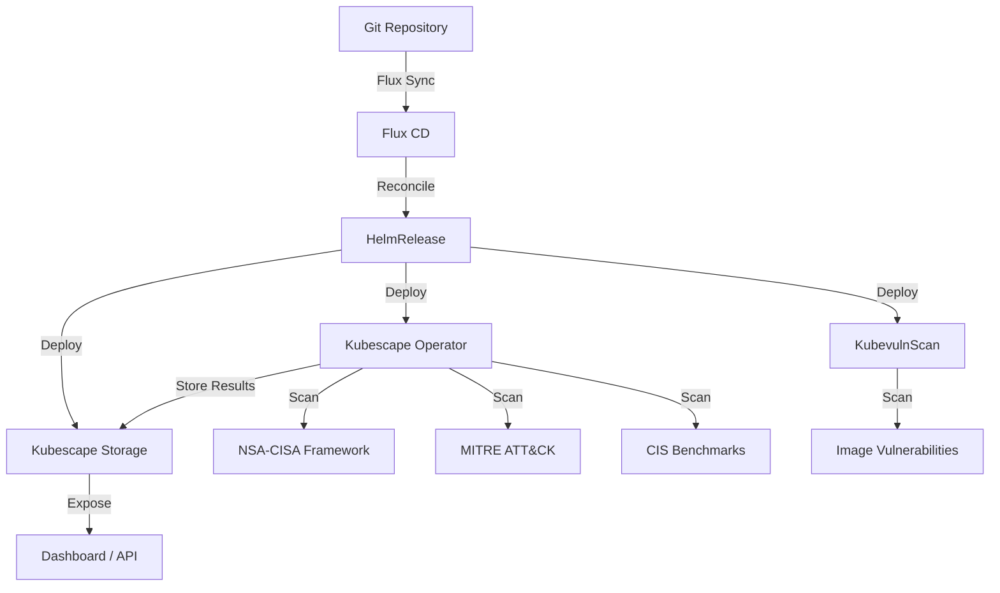

# How to Deploy Kubescape with Flux CD

Author: [nawazdhandala](https://github.com/nawazdhandala)

Tags: flux cd, kubescape, kubernetes security, gitops, compliance, security posture

Description: A practical guide to deploying Kubescape on Kubernetes using Flux CD for continuous security posture management and compliance scanning.

---

## Introduction

Kubescape is an open-source Kubernetes security platform that provides comprehensive security posture management. It scans clusters against multiple security frameworks including NSA-CISA, MITRE ATT&CK, and CIS Benchmarks, identifying misconfigurations, vulnerabilities, and compliance violations. Kubescape also performs image vulnerability scanning and RBAC analysis.

This guide walks through deploying Kubescape on Kubernetes using Flux CD, enabling continuous security assessment managed through GitOps.

## Prerequisites

Before starting, ensure you have:

- A Kubernetes cluster (v1.26 or later)
- Flux CD installed and bootstrapped
- kubectl configured for your cluster
- A Git repository connected to Flux CD

## Architecture Overview



## Step 1: Create the Namespace

Define a namespace for Kubescape.

```yaml
# kubescape-namespace.yaml
# Dedicated namespace for Kubescape security platform
apiVersion: v1
kind: Namespace
metadata:
  name: kubescape
  labels:
    app.kubernetes.io/managed-by: flux
    app.kubernetes.io/name: kubescape
```

## Step 2: Add the Kubescape Helm Repository

Register the Kubescape Helm chart repository.

```yaml
# kubescape-helmrepo.yaml
# Official Kubescape Helm chart repository
apiVersion: source.toolkit.fluxcd.io/v1
kind: HelmRepository
metadata:
  name: kubescape
  namespace: kubescape
spec:
  interval: 1h
  url: https://kubescape.github.io/helm-charts/
```

## Step 3: Create the HelmRelease

Deploy Kubescape with all scanning components enabled.

```yaml
# kubescape-helmrelease.yaml
# Deploys the Kubescape security platform via Flux CD
apiVersion: helm.toolkit.fluxcd.io/v2
kind: HelmRelease
metadata:
  name: kubescape
  namespace: kubescape
spec:
  interval: 30m
  chart:
    spec:
      chart: kubescape-operator
      version: "1.x"
      sourceRef:
        kind: HelmRepository
        name: kubescape
        namespace: kubescape
      interval: 12h
  values:
    # Cluster name for identification
    clusterName: production-cluster

    # Kubescape operator configuration
    kubescape:
      enabled: true
      resources:
        requests:
          cpu: 100m
          memory: 256Mi
        limits:
          cpu: 500m
          memory: 512Mi
      # Enable scheduled scanning
      scanSchedule: "0 */6 * * *"
      # Frameworks to scan against
      submit: true
      # Skip scanning specific namespaces
      skipNamespaces:
        - kube-system
        - kube-public

    # Vulnerability scanning component
    kubevuln:
      enabled: true
      resources:
        requests:
          cpu: 100m
          memory: 256Mi
        limits:
          cpu: 500m
          memory: 1Gi
      # Scan schedule for vulnerability scanning
      scanSchedule: "0 */12 * * *"

    # Storage backend for scan results
    storage:
      enabled: true
      resources:
        requests:
          cpu: 50m
          memory: 128Mi
        limits:
          cpu: 200m
          memory: 256Mi
      persistence:
        enabled: true
        size: 10Gi
        storageClass: standard

    # Node agent for runtime monitoring
    nodeAgent:
      enabled: true
      resources:
        requests:
          cpu: 50m
          memory: 128Mi
        limits:
          cpu: 250m
          memory: 256Mi

    # Kollector for cluster data collection
    kollector:
      enabled: true
      resources:
        requests:
          cpu: 50m
          memory: 128Mi
        limits:
          cpu: 200m
          memory: 256Mi

    # Gateway component
    gateway:
      enabled: true
      resources:
        requests:
          cpu: 50m
          memory: 64Mi
        limits:
          cpu: 100m
          memory: 128Mi

    # Global configuration
    global:
      # Override image registry if using a mirror
      overrideImageRegistry: ""
```

## Step 4: Configure Scan Frameworks

Create a ConfigMap to specify which security frameworks to use.

```yaml
# kubescape-frameworks.yaml
# ConfigMap specifying scanning frameworks and exceptions
apiVersion: v1
kind: ConfigMap
metadata:
  name: kubescape-scan-config
  namespace: kubescape
  labels:
    app.kubernetes.io/managed-by: flux
data:
  # Frameworks to scan against
  frameworks.json: |
    {
      "frameworks": [
        "NSA",
        "MITRE",
        "CIS-V1.23",
        "DevOpsBest",
        "ArmoBest"
      ]
    }

  # Exception configuration for known acceptable risks
  exceptions.json: |
    {
      "exceptions": [
        {
          "name": "allow-kube-system-privileged",
          "policyType": "postureExceptionPolicy",
          "actions": ["alertOnly"],
          "resources": [
            {
              "designatorType": "Attributes",
              "attributes": {
                "namespace": "kube-system"
              }
            }
          ],
          "posturePolicies": [
            {
              "controlName": "Privileged container"
            }
          ]
        },
        {
          "name": "allow-monitoring-host-network",
          "policyType": "postureExceptionPolicy",
          "actions": ["alertOnly"],
          "resources": [
            {
              "designatorType": "Attributes",
              "attributes": {
                "namespace": "monitoring"
              }
            }
          ],
          "posturePolicies": [
            {
              "controlName": "HostNetwork access"
            }
          ]
        }
      ]
    }
```

## Step 5: Set Up Prometheus Monitoring

Create monitoring resources for Kubescape metrics.

```yaml
# kubescape-servicemonitor.yaml
# Prometheus ServiceMonitor for Kubescape metrics
apiVersion: monitoring.coreos.com/v1
kind: ServiceMonitor
metadata:
  name: kubescape-monitor
  namespace: kubescape
  labels:
    release: prometheus
spec:
  selector:
    matchLabels:
      app.kubernetes.io/name: kubescape
  endpoints:
    - port: metrics
      interval: 60s
      path: /metrics
---
# Alert rules for Kubescape findings
apiVersion: monitoring.coreos.com/v1
kind: PrometheusRule
metadata:
  name: kubescape-alerts
  namespace: kubescape
  labels:
    release: prometheus
spec:
  groups:
    - name: kubescape-compliance
      rules:
        # Alert when compliance score drops below threshold
        - alert: LowComplianceScore
          expr: >
            kubescape_framework_score{framework="NSA"} < 70
          for: 15m
          labels:
            severity: warning
          annotations:
            summary: "NSA compliance score below 70%"
            description: >
              The NSA framework compliance score is {{ $value }}%.
              Review and remediate failing controls.

        # Alert on critical control failures
        - alert: CriticalControlFailed
          expr: >
            kubescape_control_failed{severity="critical"} > 0
          for: 5m
          labels:
            severity: critical
          annotations:
            summary: "Critical security control failed: {{ $labels.control }}"
            description: >
              Control {{ $labels.control }} has {{ $value }} failing resources.

        # Alert on new high vulnerabilities
        - alert: HighVulnerabilityDetected
          expr: >
            increase(kubescape_vulnerabilities{severity="high"}[1h]) > 0
          for: 5m
          labels:
            severity: warning
          annotations:
            summary: "New high severity vulnerabilities detected"
            description: "{{ $value }} new high severity vulnerabilities found."
```

## Step 6: Configure Network Policies

Secure Kubescape component communication.

```yaml
# kubescape-networkpolicy.yaml
# Network policy for Kubescape operator
apiVersion: networking.k8s.io/v1
kind: NetworkPolicy
metadata:
  name: kubescape-operator-policy
  namespace: kubescape
spec:
  podSelector:
    matchLabels:
      app.kubernetes.io/name: kubescape
  policyTypes:
    - Ingress
    - Egress
  ingress:
    # Allow metrics scraping
    - from:
        - namespaceSelector:
            matchLabels:
              name: monitoring
      ports:
        - protocol: TCP
          port: 8080
    # Allow internal communication between components
    - from:
        - podSelector: {}
      ports:
        - protocol: TCP
          port: 8080
        - protocol: TCP
          port: 4002
  egress:
    # Allow DNS
    - ports:
        - protocol: UDP
          port: 53
    # Allow HTTPS for downloading frameworks and vulnerability data
    - ports:
        - protocol: TCP
          port: 443
    # Allow communication with K8s API server
    - ports:
        - protocol: TCP
          port: 6443
    # Allow internal communication
    - to:
        - podSelector: {}
```

## Step 7: Set Up the Flux Kustomization

Orchestrate all Kubescape resources.

```yaml
# kustomization.yaml
# Flux Kustomization for Kubescape
apiVersion: kustomize.toolkit.fluxcd.io/v1
kind: Kustomization
metadata:
  name: kubescape
  namespace: flux-system
spec:
  interval: 10m
  targetNamespace: kubescape
  sourceRef:
    kind: GitRepository
    name: flux-system
  path: ./clusters/my-cluster/kubescape
  prune: true
  healthChecks:
    - apiVersion: apps/v1
      kind: Deployment
      name: kubescape
      namespace: kubescape
    - apiVersion: apps/v1
      kind: Deployment
      name: kubevuln
      namespace: kubescape
    - apiVersion: apps/v1
      kind: Deployment
      name: storage
      namespace: kubescape
  timeout: 10m
```

## Step 8: Verify the Deployment

After pushing to Git, verify the deployment.

```bash
# Check Flux reconciliation
flux get helmreleases -n kubescape

# Verify all Kubescape pods are running
kubectl get pods -n kubescape

# Trigger a manual scan
kubectl exec -n kubescape deploy/kubescape -- \
  kubescape scan framework nsa --submit

# View scan results
kubectl exec -n kubescape deploy/kubescape -- \
  kubescape scan framework nsa --format json | jq '.summaryDetails.frameworkScore'

# Check vulnerability scan results
kubectl get vulnerabilitymanifestsummaries -A

# List workload scan summaries
kubectl get workloadconfigurationscansummaries -A

# View detailed results for a specific workload
kubectl get workloadconfigurationscans -n default -o yaml
```

## Step 9: Review Compliance Reports

Check compliance against various frameworks.

```bash
# Run NSA framework scan
kubectl exec -n kubescape deploy/kubescape -- \
  kubescape scan framework nsa --format pretty-printer

# Run MITRE ATT&CK scan
kubectl exec -n kubescape deploy/kubescape -- \
  kubescape scan framework mitre --format pretty-printer

# Run CIS Benchmark scan
kubectl exec -n kubescape deploy/kubescape -- \
  kubescape scan framework cis-v1.23 --format pretty-printer

# Scan a specific namespace
kubectl exec -n kubescape deploy/kubescape -- \
  kubescape scan framework nsa --include-namespaces default,production
```

## Troubleshooting

Common issues and solutions:

```bash
# Check operator logs
kubectl logs -n kubescape deploy/kubescape --tail=100

# Verify CRDs are installed
kubectl get crds | grep kubescape

# Check storage component
kubectl logs -n kubescape deploy/storage --tail=50

# Verify vulnerability scanner
kubectl logs -n kubescape deploy/kubevuln --tail=50

# Check Flux errors
kubectl describe helmrelease kubescape -n kubescape

# Force reconciliation
flux reconcile helmrelease kubescape -n kubescape

# Check persistent volume claims
kubectl get pvc -n kubescape
```

## Conclusion

You have successfully deployed Kubescape on Kubernetes using Flux CD. Your cluster is now continuously assessed against NSA-CISA, MITRE ATT&CK, and CIS security frameworks. With Prometheus integration and alerting, you will be notified when compliance scores drop or critical security controls fail. The GitOps approach ensures your security posture management configuration is consistent, auditable, and version-controlled.
