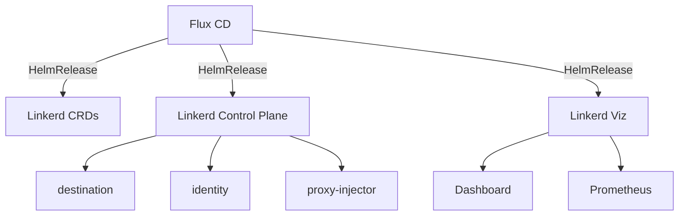

# How to Deploy Linkerd with Flux CD

Author: [nawazdhandala](https://github.com/nawazdhandala)

Tags: flux cd, linkerd, service mesh, gitops, kubernetes, security, observability

Description: Learn how to deploy and manage the Linkerd service mesh on Kubernetes using Flux CD for a fully GitOps-driven lightweight service mesh installation.

---

Linkerd is a lightweight, security-focused service mesh for Kubernetes. It provides automatic mTLS, observability, and reliability features with minimal resource overhead. Deploying Linkerd with Flux CD ensures your service mesh is version-controlled, reproducible, and automatically reconciled. This guide covers the complete installation and configuration of Linkerd using Flux CD.

## Prerequisites

Before you begin, ensure you have the following:

- A Kubernetes cluster (v1.26 or later)
- Flux CD installed on your cluster (v2.x)
- kubectl configured to access your cluster
- The step CLI for generating TLS certificates (or your own PKI)

## Understanding Linkerd Architecture

Linkerd consists of three main components: the control plane, the data plane (proxies), and extensions (like the viz dashboard). Each component can be managed independently through Flux CD HelmReleases.



## Step 1: Generate Trust Anchor and Issuer Certificates

Linkerd requires a trust anchor certificate for mTLS. Generate it before deploying:

```bash
# Generate the trust anchor certificate (valid for 10 years)
step certificate create root.linkerd.cluster.local ca.crt ca.key \
  --profile root-ca \
  --no-password \
  --insecure \
  --not-after=87600h

# Generate the issuer certificate (valid for 1 year)
step certificate create identity.linkerd.cluster.local issuer.crt issuer.key \
  --profile intermediate-ca \
  --not-after=8760h \
  --no-password \
  --insecure \
  --ca ca.crt \
  --ca-key ca.key
```

## Step 2: Store Certificates as Kubernetes Secrets

Create secrets for the Linkerd certificates:

```yaml
# linkerd-certs-secret.yaml
# Secret containing Linkerd trust anchor and issuer certificates
apiVersion: v1
kind: Secret
metadata:
  name: linkerd-trust-anchor
  namespace: linkerd
type: Opaque
data:
  # Base64-encoded trust anchor certificate
  ca.crt: LS0tLS1CRUd...
---
# Issuer certificate and key for the identity service
apiVersion: v1
kind: Secret
metadata:
  name: linkerd-identity-issuer
  namespace: linkerd
type: kubernetes.io/tls
data:
  # Base64-encoded issuer certificate
  tls.crt: LS0tLS1CRUd...
  # Base64-encoded issuer private key
  tls.key: LS0tLS1CRUd...
  # Base64-encoded trust anchor (CA) certificate
  ca.crt: LS0tLS1CRUd...
```

Apply the namespace and secrets:

```bash
# Create the linkerd namespace
kubectl create namespace linkerd

# Apply the certificate secrets
kubectl apply -f linkerd-certs-secret.yaml
```

## Step 3: Add the Linkerd Helm Repository

Create a HelmRepository source for Linkerd charts:

```yaml
# linkerd-helm-repo.yaml
# HelmRepository for the official Linkerd Helm charts
apiVersion: source.toolkit.fluxcd.io/v1
kind: HelmRepository
metadata:
  name: linkerd
  namespace: flux-system
spec:
  interval: 1h
  url: https://helm.linkerd.io/edge
---
# HelmRepository for Linkerd extensions
apiVersion: source.toolkit.fluxcd.io/v1
kind: HelmRepository
metadata:
  name: linkerd-buoyant
  namespace: flux-system
spec:
  interval: 1h
  url: https://helm.buoyant.cloud
```

## Step 4: Install Linkerd CRDs

Install the Linkerd CRDs as a separate HelmRelease:

```yaml
# linkerd-crds.yaml
# HelmRelease for Linkerd CRDs - must be installed first
apiVersion: helm.toolkit.fluxcd.io/v2
kind: HelmRelease
metadata:
  name: linkerd-crds
  namespace: linkerd
spec:
  interval: 10m
  chart:
    spec:
      chart: linkerd-crds
      version: "2024.x"
      sourceRef:
        kind: HelmRepository
        name: linkerd
        namespace: flux-system
  install:
    crds: Create
  upgrade:
    crds: CreateReplace
```

## Step 5: Install the Linkerd Control Plane

Deploy the Linkerd control plane:

```yaml
# linkerd-control-plane.yaml
# HelmRelease for the Linkerd control plane
apiVersion: helm.toolkit.fluxcd.io/v2
kind: HelmRelease
metadata:
  name: linkerd-control-plane
  namespace: linkerd
spec:
  interval: 10m
  # Wait for CRDs to be installed first
  dependsOn:
    - name: linkerd-crds
      namespace: linkerd
  chart:
    spec:
      chart: linkerd-control-plane
      version: "2024.x"
      sourceRef:
        kind: HelmRepository
        name: linkerd
        namespace: flux-system
  values:
    # Identity configuration using the pre-created certificates
    identity:
      # Use an external issuer (certificates from secrets)
      externalCA: true
      issuer:
        scheme: kubernetes.io/tls
    # Trust anchor certificate value
    identityTrustAnchorsPEM: |
      -----BEGIN CERTIFICATE-----
      <your-trust-anchor-certificate>
      -----END CERTIFICATE-----
    # Proxy configuration
    proxy:
      resources:
        cpu:
          request: 100m
          limit: 500m
        memory:
          request: 20Mi
          limit: 250Mi
    # Control plane resource configuration
    controllerResources: &controller_resources
      cpu:
        request: 100m
        limit: 500m
      memory:
        request: 50Mi
        limit: 250Mi
    # Destination controller resources
    destinationResources: *controller_resources
    # Proxy injector resources
    proxyInjectorResources: *controller_resources
    # High availability configuration
    controllerReplicas: 3
    # Enable pod disruption budgets
    enablePodDisruptionBudget: true
    # Enable pod anti-affinity for high availability
    enablePodAntiAffinity: true
    # Webhook failure policy
    webhookFailurePolicy: Fail
```

## Step 6: Install Linkerd Viz Extension

Deploy the Linkerd visualization dashboard:

```yaml
# linkerd-viz.yaml
# HelmRelease for the Linkerd Viz dashboard extension
apiVersion: helm.toolkit.fluxcd.io/v2
kind: HelmRelease
metadata:
  name: linkerd-viz
  namespace: linkerd-viz
spec:
  interval: 10m
  dependsOn:
    - name: linkerd-control-plane
      namespace: linkerd
  chart:
    spec:
      chart: linkerd-viz
      version: "2024.x"
      sourceRef:
        kind: HelmRepository
        name: linkerd
        namespace: flux-system
  values:
    # Dashboard configuration
    dashboard:
      # Number of dashboard replicas
      replicas: 2
      # Resource limits
      resources:
        cpu:
          request: 100m
          limit: 250m
        memory:
          request: 50Mi
          limit: 250Mi
    # Prometheus configuration
    prometheus:
      enabled: true
      resources:
        cpu:
          request: 300m
          limit: "1"
        memory:
          request: 300Mi
          limit: 1Gi
    # Metrics API resources
    metricsAPI:
      replicas: 1
      resources:
        cpu:
          request: 100m
          limit: 250m
        memory:
          request: 50Mi
          limit: 250Mi
    # Default dashboard namespace
    defaultNamespace: my-app
```

## Step 7: Install Linkerd Jaeger Extension

Add distributed tracing support:

```yaml
# linkerd-jaeger.yaml
# HelmRelease for the Linkerd Jaeger tracing extension
apiVersion: helm.toolkit.fluxcd.io/v2
kind: HelmRelease
metadata:
  name: linkerd-jaeger
  namespace: linkerd-jaeger
spec:
  interval: 10m
  dependsOn:
    - name: linkerd-control-plane
      namespace: linkerd
  chart:
    spec:
      chart: linkerd-jaeger
      version: "2024.x"
      sourceRef:
        kind: HelmRepository
        name: linkerd
        namespace: flux-system
  values:
    # Collector configuration
    collector:
      resources:
        cpu:
          request: 100m
          limit: 500m
        memory:
          request: 50Mi
          limit: 250Mi
    # Jaeger configuration
    jaeger:
      resources:
        cpu:
          request: 100m
          limit: 500m
        memory:
          request: 50Mi
          limit: 500Mi
```

## Step 8: Enable Sidecar Injection

Configure namespaces for automatic proxy injection:

```yaml
# meshed-namespace.yaml
# Namespace with Linkerd proxy injection enabled
apiVersion: v1
kind: Namespace
metadata:
  name: my-app
  annotations:
    # Enable automatic proxy injection
    linkerd.io/inject: enabled
    # Set the default opaque ports
    config.linkerd.io/opaque-ports: "3306,5432,6379"
  labels:
    # Pod security standards
    pod-security.kubernetes.io/enforce: baseline
```

## Step 9: Deploy a Sample Application

Deploy a sample application to verify the mesh:

```yaml
# sample-app.yaml
# Sample deployment that will be automatically meshed by Linkerd
apiVersion: apps/v1
kind: Deployment
metadata:
  name: web-app
  namespace: my-app
  annotations:
    # Linkerd proxy configuration overrides
    config.linkerd.io/proxy-cpu-request: "50m"
    config.linkerd.io/proxy-memory-request: "20Mi"
spec:
  replicas: 3
  selector:
    matchLabels:
      app: web-app
  template:
    metadata:
      labels:
        app: web-app
    spec:
      containers:
        - name: web-app
          image: nginx:1.25
          ports:
            - containerPort: 80
              name: http
          resources:
            requests:
              cpu: 100m
              memory: 128Mi
---
# Service for the sample app
apiVersion: v1
kind: Service
metadata:
  name: web-app
  namespace: my-app
spec:
  selector:
    app: web-app
  ports:
    - port: 80
      targetPort: 80
      name: http
```

## Step 10: Create the Flux CD Kustomization

```yaml
# kustomization.yaml
# Flux CD Kustomization for Linkerd deployment
apiVersion: kustomize.toolkit.fluxcd.io/v1
kind: Kustomization
metadata:
  name: linkerd
  namespace: flux-system
spec:
  interval: 10m
  sourceRef:
    kind: GitRepository
    name: infrastructure
  path: ./linkerd
  prune: true
  wait: true
  timeout: 15m
  healthChecks:
    - apiVersion: apps/v1
      kind: Deployment
      name: linkerd-destination
      namespace: linkerd
    - apiVersion: apps/v1
      kind: Deployment
      name: linkerd-identity
      namespace: linkerd
    - apiVersion: apps/v1
      kind: Deployment
      name: linkerd-proxy-injector
      namespace: linkerd
```

## Verify the Installation

Check that Linkerd is properly installed:

```bash
# Check Linkerd control plane pods
kubectl get pods -n linkerd

# Run the Linkerd check command
linkerd check

# Verify proxy injection is working
kubectl get pods -n my-app -o jsonpath='{.items[*].spec.containers[*].name}'

# Check meshed status
linkerd stat deploy -n my-app

# View the dashboard
linkerd viz dashboard

# Check Flux reconciliation
flux get helmreleases -n linkerd

# View recent events
kubectl get events -n linkerd --sort-by=.lastTimestamp
```

## Certificate Rotation

Set up automated certificate rotation with cert-manager:

```yaml
# cert-manager-issuer.yaml
# Issuer for Linkerd certificate rotation
apiVersion: cert-manager.io/v1
kind: Issuer
metadata:
  name: linkerd-trust-anchor
  namespace: linkerd
spec:
  ca:
    secretName: linkerd-trust-anchor
---
# Certificate that cert-manager will auto-rotate
apiVersion: cert-manager.io/v1
kind: Certificate
metadata:
  name: linkerd-identity-issuer
  namespace: linkerd
spec:
  secretName: linkerd-identity-issuer
  duration: 48h
  renewBefore: 25h
  issuerRef:
    name: linkerd-trust-anchor
    kind: Issuer
  commonName: identity.linkerd.cluster.local
  dnsNames:
    - identity.linkerd.cluster.local
  isCA: true
  privateKey:
    algorithm: ECDSA
  usages:
    - cert sign
    - crl sign
    - server auth
    - client auth
```

## Best Practices

1. **Use external CA** with cert-manager for automatic certificate rotation
2. **Enable high availability** with multiple control plane replicas
3. **Set resource limits** for both the control plane and data plane proxies
4. **Use pod disruption budgets** to prevent downtime during upgrades
5. **Install extensions separately** so they can be managed independently
6. **Configure opaque ports** for protocols Linkerd cannot understand (MySQL, Redis)
7. **Monitor proxy resource usage** and adjust limits based on traffic patterns

## Conclusion

Deploying Linkerd with Flux CD provides a reliable, GitOps-driven approach to service mesh management. Linkerd's lightweight design combined with Flux CD's automated reconciliation creates a powerful platform for securing and observing your microservices. The HelmRelease dependency chain ensures proper installation ordering, and certificate management through cert-manager automates the otherwise complex task of mTLS certificate rotation. This approach makes it straightforward to maintain a consistent Linkerd deployment across multiple clusters.
