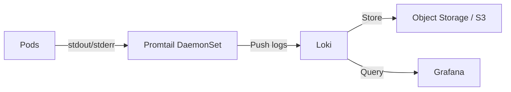

# How to Deploy Logging Stack with Flux CD

Author: [nawazdhandala](https://github.com/nawazdhandala)

Tags: flux cd, logging, loki, promtail, grafana, kubernetes, gitops, observability

Description: Learn how to deploy a production-grade logging stack with Loki, Promtail, and Grafana using Flux CD and GitOps workflows.

---

## Introduction

Centralized logging is a cornerstone of Kubernetes observability. The Grafana Loki stack provides a lightweight, cost-effective alternative to Elasticsearch-based solutions. Loki is designed to index only metadata (labels) rather than full log content, making it significantly cheaper to operate at scale.

This guide covers deploying a complete logging stack using Loki for log aggregation, Promtail for log collection, and Grafana for visualization, all managed through Flux CD.

## Prerequisites

- A running Kubernetes cluster
- Flux CD installed and bootstrapped
- An S3-compatible object storage bucket (for production deployments)
- kubectl access to your cluster

## Architecture Overview

The logging stack consists of three main components:



- **Promtail** runs as a DaemonSet on every node, tailing container logs and shipping them to Loki
- **Loki** receives, indexes, and stores log data
- **Grafana** provides the query interface for exploring logs

## Repository Structure

```
infrastructure/
  logging/
    namespace.yaml
    helmrepository.yaml
    loki-helmrelease.yaml
    promtail-helmrelease.yaml
    grafana-datasource.yaml
```

## Creating the Logging Namespace

```yaml
# infrastructure/logging/namespace.yaml
apiVersion: v1
kind: Namespace
metadata:
  name: logging
  labels:
    monitoring: enabled
```

## Adding the Helm Repository

```yaml
# infrastructure/logging/helmrepository.yaml
apiVersion: source.toolkit.fluxcd.io/v1
kind: HelmRepository
metadata:
  name: grafana
  namespace: flux-system
spec:
  interval: 1h
  url: https://grafana.github.io/helm-charts
```

## Deploying Loki

Deploy Loki in single-binary mode for smaller clusters or microservices mode for production.

```yaml
# infrastructure/logging/loki-helmrelease.yaml
apiVersion: helm.toolkit.fluxcd.io/v2
kind: HelmRelease
metadata:
  name: loki
  namespace: logging
spec:
  interval: 30m
  chart:
    spec:
      chart: loki
      version: "6.x"
      sourceRef:
        kind: HelmRepository
        name: grafana
        namespace: flux-system
  install:
    remediation:
      retries: 3
  upgrade:
    remediation:
      retries: 3
  values:
    # Deployment mode: single binary for simplicity
    deploymentMode: SingleBinary
    singleBinary:
      replicas: 1
      resources:
        requests:
          cpu: 200m
          memory: 512Mi
        limits:
          cpu: "1"
          memory: 1Gi
    # Loki configuration
    loki:
      # Authentication disabled for internal use
      auth_enabled: false
      # Common configuration shared across components
      commonConfig:
        replication_factor: 1
      # Schema configuration for index and chunks
      schemaConfig:
        configs:
          - from: "2024-01-01"
            store: tsdb
            object_store: s3
            schema: v13
            index:
              prefix: loki_index_
              period: 24h
      # Storage backend configuration
      storage:
        type: s3
        bucketNames:
          chunks: loki-chunks
          ruler: loki-ruler
          admin: loki-admin
        s3:
          endpoint: s3.amazonaws.com
          region: us-east-1
          # Use IRSA or workload identity for authentication
          insecure: false
      # Retention settings
      limits_config:
        # Keep logs for 30 days
        retention_period: 720h
        # Maximum query lookback period
        max_query_lookback: 720h
        # Ingestion limits
        ingestion_rate_mb: 10
        ingestion_burst_size_mb: 20
        per_stream_rate_limit: 5MB
        per_stream_rate_limit_burst: 15MB
      # Compactor configuration for retention enforcement
      compactor:
        retention_enabled: true
        delete_request_store: s3
    # Service account with cloud IAM role
    serviceAccount:
      annotations:
        eks.amazonaws.com/role-arn: arn:aws:iam::123456789012:role/loki-s3-access
    # Gateway configuration
    gateway:
      enabled: true
      replicas: 1
    # Disable components not needed in single-binary mode
    read:
      replicas: 0
    write:
      replicas: 0
    backend:
      replicas: 0
```

## Deploying Promtail

Promtail collects logs from all pods on each node and ships them to Loki.

```yaml
# infrastructure/logging/promtail-helmrelease.yaml
apiVersion: helm.toolkit.fluxcd.io/v2
kind: HelmRelease
metadata:
  name: promtail
  namespace: logging
spec:
  interval: 30m
  chart:
    spec:
      chart: promtail
      version: "6.x"
      sourceRef:
        kind: HelmRepository
        name: grafana
        namespace: flux-system
  install:
    remediation:
      retries: 3
  values:
    # Loki endpoint configuration
    config:
      clients:
        - url: http://loki-gateway.logging.svc.cluster.local/loki/api/v1/push
          # Tenant ID (only needed if multi-tenancy is enabled)
          # tenant_id: default
      snippets:
        # Pipeline stages for log processing
        pipelineStages:
          # Extract Docker/CRI container log format
          - cri: {}
          # Drop debug-level logs to save storage
          - match:
              selector: '{app="debug-app"}'
              stages:
                - drop:
                    expression: ".*DEBUG.*"
          # Add custom labels based on log content
          - match:
              selector: '{namespace="production"}'
              stages:
                - regex:
                    expression: '.*level=(?P<level>\w+).*'
                - labels:
                    level:
        # Additional scrape configs for system logs
        extraScrapeConfigs: |
          # Scrape systemd journal logs
          - job_name: journal
            journal:
              max_age: 12h
              labels:
                job: systemd-journal
            relabel_configs:
              - source_labels: ['__journal__systemd_unit']
                target_label: unit
    # Resource allocation for Promtail
    resources:
      requests:
        cpu: 50m
        memory: 64Mi
      limits:
        cpu: 200m
        memory: 256Mi
    # Tolerations to run on all nodes including masters
    tolerations:
      - effect: NoSchedule
        operator: Exists
    # Mount additional paths for system logs
    extraVolumes:
      - name: journal
        hostPath:
          path: /var/log/journal
    extraVolumeMounts:
      - name: journal
        mountPath: /var/log/journal
        readOnly: true
```

## Grafana Datasource Configuration

If Grafana is already deployed (e.g., via kube-prometheus-stack), add Loki as a datasource.

```yaml
# infrastructure/logging/grafana-datasource.yaml
apiVersion: v1
kind: ConfigMap
metadata:
  name: loki-grafana-datasource
  namespace: monitoring
  labels:
    # This label tells the Grafana sidecar to load this datasource
    grafana_datasource: "true"
data:
  loki-datasource.yaml: |
    apiVersion: 1
    datasources:
      - name: Loki
        type: loki
        access: proxy
        url: http://loki-gateway.logging.svc.cluster.local
        isDefault: false
        jsonData:
          # Maximum number of log lines per query
          maxLines: 5000
          # Derive fields from log content
          derivedFields:
            # Link trace IDs to a tracing datasource
            - datasourceUid: tempo
              matcherRegex: "traceID=(\\w+)"
              name: TraceID
              url: "$${__value.raw}"
```

## Log-Based Alerting Rules

Create alerting rules based on log patterns.

```yaml
# infrastructure/logging/alert-rules.yaml
apiVersion: monitoring.coreos.com/v1
kind: PrometheusRule
metadata:
  name: loki-alerts
  namespace: logging
spec:
  groups:
    - name: loki-health
      rules:
        # Alert when Loki ingestion drops
        - alert: LokiIngestionDrop
          expr: |
            rate(loki_distributor_lines_received_total[5m]) == 0
          for: 15m
          labels:
            severity: critical
          annotations:
            summary: "Loki is not receiving any logs"
            description: "No logs have been ingested for 15 minutes."
        # Alert on high error rate in logs
        - alert: HighErrorRate
          expr: |
            sum(rate(loki_distributor_lines_received_total{level="error"}[5m])) > 100
          for: 5m
          labels:
            severity: warning
          annotations:
            summary: "High error log rate detected"
```

## Flux Kustomization

Tie the logging stack together with a Flux Kustomization.

```yaml
# clusters/my-cluster/logging.yaml
apiVersion: kustomize.toolkit.fluxcd.io/v1
kind: Kustomization
metadata:
  name: logging-stack
  namespace: flux-system
spec:
  interval: 15m
  path: ./infrastructure/logging
  prune: true
  sourceRef:
    kind: GitRepository
    name: flux-system
  # Logging depends on the monitoring stack for Grafana
  dependsOn:
    - name: monitoring-stack
  healthChecks:
    - apiVersion: apps/v1
      kind: StatefulSet
      name: loki
      namespace: logging
    - apiVersion: apps/v1
      kind: DaemonSet
      name: promtail
      namespace: logging
  timeout: 10m
```

## Production Considerations: Loki Microservices Mode

For production workloads, deploy Loki in microservices mode for better scalability.

```yaml
# infrastructure/logging/overlays/production/loki-patch.yaml
apiVersion: helm.toolkit.fluxcd.io/v2
kind: HelmRelease
metadata:
  name: loki
  namespace: logging
spec:
  values:
    deploymentMode: Distributed
    # Disable single binary
    singleBinary:
      replicas: 0
    # Ingester - writes incoming log data
    ingester:
      replicas: 3
      resources:
        requests:
          cpu: 500m
          memory: 1Gi
    # Distributor - distributes incoming writes
    distributor:
      replicas: 2
      resources:
        requests:
          cpu: 200m
          memory: 256Mi
    # Querier - handles read queries
    querier:
      replicas: 2
      resources:
        requests:
          cpu: 500m
          memory: 512Mi
    # Query frontend - caches and splits queries
    queryFrontend:
      replicas: 2
      resources:
        requests:
          cpu: 200m
          memory: 256Mi
    # Compactor - handles retention and compaction
    compactor:
      replicas: 1
      resources:
        requests:
          cpu: 200m
          memory: 512Mi
```

## Verifying the Deployment

```bash
# Check Flux reconciliation
flux get kustomizations logging-stack
flux get helmreleases -n logging

# Verify all logging pods are running
kubectl get pods -n logging

# Check Promtail is running on all nodes
kubectl get pods -n logging -l app.kubernetes.io/name=promtail -o wide

# Test Loki by querying logs
kubectl port-forward -n logging svc/loki-gateway 3100:80
curl -s "http://localhost:3100/loki/api/v1/labels" | jq .

# Query logs via LogCLI or Grafana
curl -G "http://localhost:3100/loki/api/v1/query_range" \
  --data-urlencode 'query={namespace="default"}' \
  --data-urlencode 'limit=10' | jq .
```

## Troubleshooting

- **Promtail not collecting logs**: Check that the /var/log/pods path is mounted correctly. Verify with `kubectl logs <promtail-pod> -n logging`
- **Loki rejecting logs**: Check rate limits in loki configuration. Look for "rate limit" errors in Loki logs
- **High storage costs**: Adjust retention period, enable compaction, and filter out noisy logs in Promtail pipeline stages
- **Query timeout**: For large log volumes, increase query timeout and consider deploying query-frontend for caching

## Conclusion

Deploying a logging stack with Flux CD provides a GitOps-managed, centralized logging solution. The Loki-Promtail-Grafana stack offers excellent performance at lower cost than Elasticsearch-based alternatives. By managing the entire stack through Flux CD, you ensure consistency, reproducibility, and easy rollback of logging configuration changes across all your clusters.
