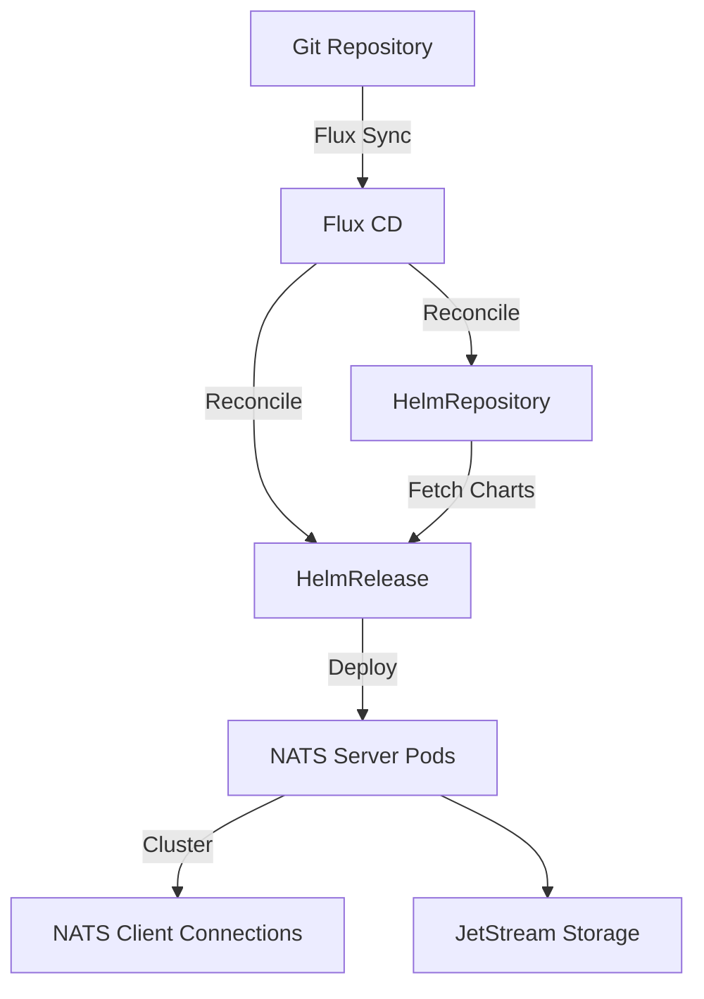

# How to Deploy NATS with Flux CD

Author: [nawazdhandala](https://github.com/nawazdhandala)

Tags: flux cd, nats, message queue, kubernetes, gitops, messaging

Description: A practical guide to deploying NATS messaging system on Kubernetes using Flux CD and GitOps principles.

---

## Introduction

NATS is a high-performance, cloud-native messaging system designed for microservices, IoT, and distributed systems. It provides a simple, secure, and scalable way for applications to communicate through publish-subscribe, request-reply, and queue-based messaging patterns.

In this guide, we will deploy NATS on Kubernetes using Flux CD, enabling a fully GitOps-driven workflow where all configuration changes are tracked in Git and automatically reconciled to your cluster.

## Prerequisites

Before starting, ensure you have the following:

- A running Kubernetes cluster (v1.26 or later)
- Flux CD installed and bootstrapped on the cluster
- kubectl configured to access your cluster
- A Git repository connected to Flux CD

## Architecture Overview



## Step 1: Create the Namespace

Start by defining a namespace for NATS. Create a file called `nats-namespace.yaml` in your Flux repository.

```yaml
# nats-namespace.yaml
# Defines the dedicated namespace for NATS components
apiVersion: v1
kind: Namespace
metadata:
  name: nats-system
  labels:
    # Label for Flux to track this resource
    app.kubernetes.io/managed-by: flux
    app.kubernetes.io/name: nats
```

## Step 2: Add the NATS Helm Repository

Create a `HelmRepository` resource to point Flux CD to the official NATS Helm chart repository.

```yaml
# nats-helmrepo.yaml
# Registers the NATS Helm chart repository with Flux
apiVersion: source.toolkit.fluxcd.io/v1
kind: HelmRepository
metadata:
  name: nats
  namespace: nats-system
spec:
  interval: 1h
  # Official NATS Helm chart repository
  url: https://nats-io.github.io/k8s/helm/charts/
```

## Step 3: Create the HelmRelease

Define the `HelmRelease` resource that tells Flux CD how to deploy NATS using the Helm chart.

```yaml
# nats-helmrelease.yaml
# Deploys NATS using the official Helm chart via Flux CD
apiVersion: helm.toolkit.fluxcd.io/v2
kind: HelmRelease
metadata:
  name: nats
  namespace: nats-system
spec:
  interval: 30m
  chart:
    spec:
      chart: nats
      # Pin to a specific version for reproducibility
      version: "1.2.x"
      sourceRef:
        kind: HelmRepository
        name: nats
        namespace: nats-system
      interval: 12h
  values:
    # Configure the NATS cluster with 3 replicas for high availability
    cluster:
      enabled: true
      replicas: 3

    # Enable JetStream for persistence and streaming
    jetstream:
      enabled: true
      # Configure storage for JetStream
      fileStore:
        enabled: true
        storageDirectory: /data
        pvc:
          enabled: true
          size: 10Gi
          storageClassName: standard

    # Resource limits and requests for NATS pods
    nats:
      resources:
        requests:
          cpu: 200m
          memory: 256Mi
        limits:
          cpu: 500m
          memory: 512Mi

    # Enable monitoring via Prometheus
    exporter:
      enabled: true
      resources:
        requests:
          cpu: 50m
          memory: 64Mi
        limits:
          cpu: 100m
          memory: 128Mi

    # Authentication configuration
    auth:
      enabled: true
      # Use a Kubernetes secret for credentials
      resolver:
        type: full
```

## Step 4: Configure NATS Authentication

Create a Kubernetes secret to store NATS authentication credentials.

```yaml
# nats-auth-secret.yaml
# Stores NATS authentication credentials
# In production, use sealed-secrets or SOPS for encryption
apiVersion: v1
kind: Secret
metadata:
  name: nats-auth
  namespace: nats-system
type: Opaque
stringData:
  # NATS server configuration for authentication
  nats.conf: |
    authorization {
      default_permissions = {
        publish = ["public.>"]
        subscribe = ["public.>"]
      }
      users = [
        {
          user: "admin"
          password: "$NATS_ADMIN_PASSWORD"
          permissions: {
            publish: ">"
            subscribe: ">"
          }
        },
        {
          user: "client"
          password: "$NATS_CLIENT_PASSWORD"
          permissions: {
            publish: ["events.>", "requests.>"]
            subscribe: ["events.>", "replies.>"]
          }
        }
      ]
    }
```

## Step 5: Add a Network Policy

Secure NATS network access with a Kubernetes NetworkPolicy.

```yaml
# nats-networkpolicy.yaml
# Restricts network access to NATS pods
apiVersion: networking.k8s.io/v1
kind: NetworkPolicy
metadata:
  name: nats-network-policy
  namespace: nats-system
spec:
  podSelector:
    matchLabels:
      app.kubernetes.io/name: nats
  policyTypes:
    - Ingress
    - Egress
  ingress:
    # Allow client connections on port 4222
    - from:
        - namespaceSelector:
            matchLabels:
              nats-access: "true"
      ports:
        - protocol: TCP
          port: 4222
    # Allow cluster routing on port 6222
    - from:
        - podSelector:
            matchLabels:
              app.kubernetes.io/name: nats
      ports:
        - protocol: TCP
          port: 6222
  egress:
    # Allow DNS resolution
    - to: []
      ports:
        - protocol: UDP
          port: 53
    # Allow cluster routing between NATS pods
    - to:
        - podSelector:
            matchLabels:
              app.kubernetes.io/name: nats
      ports:
        - protocol: TCP
          port: 6222
```

## Step 6: Configure Monitoring

Create a ServiceMonitor to enable Prometheus to scrape NATS metrics.

```yaml
# nats-servicemonitor.yaml
# Enables Prometheus to scrape NATS metrics
apiVersion: monitoring.coreos.com/v1
kind: ServiceMonitor
metadata:
  name: nats-monitor
  namespace: nats-system
  labels:
    release: prometheus
spec:
  selector:
    matchLabels:
      app.kubernetes.io/name: nats
  endpoints:
    # Scrape the metrics exporter endpoint
    - port: metrics
      interval: 30s
      path: /metrics
```

## Step 7: Set Up the Kustomization

Tie all resources together using a Flux Kustomization.

```yaml
# kustomization.yaml
# Flux Kustomization to deploy all NATS resources in order
apiVersion: kustomize.toolkit.fluxcd.io/v1
kind: Kustomization
metadata:
  name: nats
  namespace: flux-system
spec:
  interval: 10m
  targetNamespace: nats-system
  sourceRef:
    kind: GitRepository
    name: flux-system
  path: ./clusters/my-cluster/nats
  prune: true
  # Ensure resources are applied in the correct order
  dependsOn:
    - name: flux-system
  healthChecks:
    - apiVersion: apps/v1
      kind: StatefulSet
      name: nats
      namespace: nats-system
  timeout: 5m
```

## Step 8: Verify the Deployment

After pushing the configuration to your Git repository, Flux will automatically reconcile the resources.

```bash
# Check the Flux reconciliation status
flux get helmreleases -n nats-system

# Verify NATS pods are running
kubectl get pods -n nats-system

# Check NATS cluster connectivity
kubectl exec -n nats-system nats-0 -- nats-server --help

# Test publishing a message
kubectl run nats-client --rm -it --image=natsio/nats-tools -- \
  nats pub test.subject "Hello from Flux CD" \
  --server nats://nats.nats-system.svc:4222

# Test subscribing to messages
kubectl run nats-sub --rm -it --image=natsio/nats-tools -- \
  nats sub "test.>" \
  --server nats://nats.nats-system.svc:4222
```

## Step 9: Configure JetStream Streams

Create JetStream streams for persistent messaging by applying a NATS configuration job.

```yaml
# nats-stream-config.yaml
# Job to create JetStream streams after NATS is deployed
apiVersion: batch/v1
kind: Job
metadata:
  name: nats-stream-setup
  namespace: nats-system
spec:
  template:
    spec:
      containers:
        - name: nats-setup
          image: natsio/nats-tools:latest
          command:
            - /bin/sh
            - -c
            - |
              # Wait for NATS to be ready
              sleep 5
              # Create a stream for application events
              nats stream add EVENTS \
                --subjects "events.>" \
                --retention limits \
                --max-msgs 1000000 \
                --max-bytes 1073741824 \
                --max-age 72h \
                --storage file \
                --replicas 3 \
                --server nats://nats.nats-system.svc:4222
              # Create a consumer for the events stream
              nats consumer add EVENTS event-processor \
                --deliver all \
                --ack explicit \
                --max-deliver 5 \
                --server nats://nats.nats-system.svc:4222
      restartPolicy: OnFailure
  backoffLimit: 3
```

## Troubleshooting

If you encounter issues with the deployment, check the following:

```bash
# Check Flux HelmRelease status and events
flux get helmreleases -n nats-system
kubectl describe helmrelease nats -n nats-system

# Check pod logs for errors
kubectl logs -n nats-system -l app.kubernetes.io/name=nats

# Verify JetStream is enabled
kubectl exec -n nats-system nats-0 -- nats server info \
  --server nats://localhost:4222

# Check persistent volume claims
kubectl get pvc -n nats-system
```

## Conclusion

You have successfully deployed NATS on Kubernetes using Flux CD. This GitOps-driven approach ensures that your NATS configuration is version-controlled, auditable, and automatically reconciled. With JetStream enabled, you have a robust messaging platform that supports persistent streaming, at-least-once delivery, and horizontal scaling across your Kubernetes cluster.
