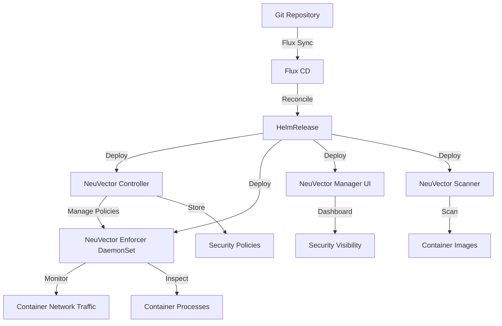

# How to Deploy Neuvector with Flux CD

Author: [nawazdhandala](https://github.com/nawazdhandala)

Tags: Flux CD, neuvector, Container Security, Kubernetes, GitOps, Network Security, Zero Trust

Description: A practical guide to deploying NeuVector full lifecycle container security platform on Kubernetes using Flux CD for GitOps-driven security.

---

## Introduction

NeuVector is an open-source, full lifecycle container security platform that provides deep network visibility, container runtime protection, and compliance scanning. Originally developed by NeuVector Inc. and now maintained by SUSE, it offers zero-trust network security for containers with automated policy learning, vulnerability scanning, and DLP/WAF capabilities.

This guide walks through deploying NeuVector on Kubernetes using Flux CD, enabling comprehensive container security managed through GitOps workflows.

## Prerequisites

Before starting, ensure you have:

- A Kubernetes cluster (v1.26 or later) with at least 3 worker nodes
- Flux CD installed and bootstrapped
- kubectl configured for your cluster
- A Git repository connected to Flux CD
- Sufficient cluster resources (NeuVector requires approximately 1 CPU and 1Gi memory per enforcer)

## Architecture Overview



## Step 1: Create the Namespace

Define a namespace for NeuVector.

```yaml
# neuvector-namespace.yaml
# Dedicated namespace for NeuVector security platform
apiVersion: v1
kind: Namespace
metadata:
  name: neuvector
  labels:
    app.kubernetes.io/managed-by: flux
    app.kubernetes.io/name: neuvector
    # NeuVector enforcers need privileged access
    pod-security.kubernetes.io/enforce: privileged
```

## Step 2: Add the NeuVector Helm Repository

Register the NeuVector Helm chart repository.

```yaml
# neuvector-helmrepo.yaml
# Official NeuVector Helm chart repository
apiVersion: source.toolkit.fluxcd.io/v1
kind: HelmRepository
metadata:
  name: neuvector
  namespace: neuvector
spec:
  interval: 1h
  url: https://neuvector.github.io/neuvector-helm/
```

## Step 3: Create the Admin Secret

Set up the initial admin password for NeuVector.

```yaml
# neuvector-admin-secret.yaml
# Initial admin credentials for NeuVector
# Use sealed-secrets or SOPS in production
apiVersion: v1
kind: Secret
metadata:
  name: neuvector-init
  namespace: neuvector
type: Opaque
stringData:
  # Initial admin user configuration
  userinitcfg.yaml: |
    users:
      - username: admin
        password: your-secure-admin-password
        role: admin
        email: admin@example.com
      - username: reader
        password: your-reader-password
        role: reader
        email: reader@example.com
```

## Step 4: Create the HelmRelease

Deploy NeuVector with all security components.

```yaml
# neuvector-helmrelease.yaml
# Deploys the NeuVector security platform via Flux CD
apiVersion: helm.toolkit.fluxcd.io/v2
kind: HelmRelease
metadata:
  name: neuvector
  namespace: neuvector
spec:
  interval: 30m
  chart:
    spec:
      chart: core
      version: "2.7.x"
      sourceRef:
        kind: HelmRepository
        name: neuvector
        namespace: neuvector
      interval: 12h
  values:
    # Global settings
    tag: "5.3"
    registry: docker.io

    # Controller configuration - manages security policies
    controller:
      replicas: 3
      resources:
        requests:
          cpu: 200m
          memory: 512Mi
        limits:
          cpu: "1"
          memory: 2Gi
      # Persistent storage for policies and configuration
      pvc:
        enabled: true
        capacity: 10Gi
        storageClass: standard
      # Controller configuration
      configmap:
        enabled: true
        data:
          # Auto-learn network policies for new services
          auto_profile: "true"
          # Set new services to Monitor mode by default
          new_service_policy_mode: "Monitor"
          # Admission control webhook
          admission_control: "true"

    # Enforcer configuration - DaemonSet on every node
    enforcer:
      enabled: true
      resources:
        requests:
          cpu: 100m
          memory: 256Mi
        limits:
          cpu: "1"
          memory: 1Gi
      # Tolerations to run on all nodes
      tolerations:
        - effect: NoSchedule
          operator: Exists
        - effect: NoExecute
          operator: Exists

    # Manager (Web UI) configuration
    manager:
      enabled: true
      replicas: 1
      resources:
        requests:
          cpu: 100m
          memory: 256Mi
        limits:
          cpu: 500m
          memory: 512Mi
      svc:
        type: ClusterIP
        # Use LoadBalancer or Ingress in production
      ingress:
        enabled: false
        # Uncomment and configure for external access
        # host: neuvector.example.com
        # tls: true
        # secretName: neuvector-tls

    # Scanner configuration for image vulnerability scanning
    scanner:
      enabled: true
      replicas: 2
      resources:
        requests:
          cpu: 200m
          memory: 512Mi
        limits:
          cpu: "1"
          memory: 1Gi
      # Auto-scale scanner pods based on workload
      autoscaling:
        enabled: true
        minReplicas: 2
        maxReplicas: 5
        targetCPUUtilizationPercentage: 80

    # CRD support for security policies as code
    crdwebhook:
      enabled: true
      resources:
        requests:
          cpu: 50m
          memory: 64Mi
        limits:
          cpu: 200m
          memory: 256Mi

    # Admission control for blocking insecure workloads
    admissionwebhook:
      type: ClusterIP

    # Use the pre-configured admin secret
    containerd:
      enabled: true
      path: /var/run/containerd/containerd.sock
```

## Step 5: Define Security Policies as CRDs

Create NeuVector security policies using custom resources.

```yaml
# neuvector-network-policy.yaml
# NeuVector CRD-based network security policy
apiVersion: neuvector.com/v1
kind: NvSecurityRule
metadata:
  name: production-network-rules
  namespace: neuvector
spec:
  version: v1
  target:
    policymode: Protect
    selector:
      name: nv.production-app
      criteria:
        - key: namespace
          value: production
          op: "="
  # Ingress rules - allowed inbound connections
  ingress:
    - selector:
        name: nv.api-gateway
        criteria:
          - key: namespace
            value: production
            op: "="
      ports: tcp/8080
      action: allow
      applications:
        - HTTP
    - selector:
        name: external
      action: deny

  # Egress rules - allowed outbound connections
  egress:
    - selector:
        name: nv.database
        criteria:
          - key: namespace
            value: production
            op: "="
      ports: tcp/5432
      action: allow
      applications:
        - PostgreSQL
    - selector:
        name: nv.redis
        criteria:
          - key: namespace
            value: production
            op: "="
      ports: tcp/6379
      action: allow
---
# Admission control policy
apiVersion: neuvector.com/v1
kind: NvAdmissionControlSecurityRule
metadata:
  name: block-privileged-containers
  namespace: neuvector
spec:
  rules:
    - id: 1
      comment: "Block privileged containers in production"
      criteria:
        - name: namespace
          value: production
          op: containsAny
        - name: runAsPrivileged
          value: "true"
          op: "="
      disable: false
      rule_type: deny
    - id: 2
      comment: "Block containers running as root"
      criteria:
        - name: namespace
          value: production
          op: containsAny
        - name: runAsRoot
          value: "true"
          op: "="
      disable: false
      rule_type: deny
    - id: 3
      comment: "Block images without scan results"
      criteria:
        - name: namespace
          value: production
          op: containsAny
        - name: imageScanned
          value: "false"
          op: "="
      disable: false
      rule_type: deny
```

## Step 6: Configure Vulnerability Scanning Policy

Set up automated vulnerability scanning for container images.

```yaml
# neuvector-scan-policy.yaml
# ConfigMap for vulnerability scan configuration
apiVersion: v1
kind: ConfigMap
metadata:
  name: neuvector-scan-config
  namespace: neuvector
data:
  scan-config.yaml: |
    # Auto-scan new images when deployed
    auto_scan: true
    # Scan schedule for registry scanning
    scan_schedule: "0 */4 * * *"
    # Vulnerability severity threshold
    vulnerability_threshold:
      high: 0
      medium: 10
    # Registries to scan
    registries:
      - name: docker-hub
        type: docker
        url: https://registry.hub.docker.com
        filter:
          - "company/*"
      - name: ecr-production
        type: ecr
        url: "123456789012.dkr.ecr.us-east-1.amazonaws.com"
        filter:
          - "*"
```

## Step 7: Set Up Monitoring

Create monitoring resources for NeuVector metrics.

```yaml
# neuvector-servicemonitor.yaml
# Prometheus ServiceMonitor for NeuVector metrics
apiVersion: monitoring.coreos.com/v1
kind: ServiceMonitor
metadata:
  name: neuvector-monitor
  namespace: neuvector
  labels:
    release: prometheus
spec:
  selector:
    matchLabels:
      app: neuvector-controller-pod
  endpoints:
    - port: api
      interval: 30s
      path: /v1/internal/metrics
      scheme: https
      tlsConfig:
        insecureSkipVerify: true
---
# Alert rules for NeuVector security events
apiVersion: monitoring.coreos.com/v1
kind: PrometheusRule
metadata:
  name: neuvector-alerts
  namespace: neuvector
  labels:
    release: prometheus
spec:
  groups:
    - name: neuvector-security
      rules:
        - alert: NeuVectorThreatDetected
          expr: increase(neuvector_threats_total[5m]) > 0
          for: 1m
          labels:
            severity: critical
          annotations:
            summary: "NeuVector detected a security threat"
            description: "{{ $value }} new threats detected in the last 5 minutes."

        - alert: NeuVectorPolicyViolation
          expr: increase(neuvector_violations_total[5m]) > 0
          for: 1m
          labels:
            severity: warning
          annotations:
            summary: "NeuVector policy violation detected"
            description: "{{ $value }} policy violations in the last 5 minutes."
```

## Step 8: Set Up the Flux Kustomization

Organize all NeuVector resources.

```yaml
# kustomization.yaml
# Flux Kustomization for NeuVector
apiVersion: kustomize.toolkit.fluxcd.io/v1
kind: Kustomization
metadata:
  name: neuvector
  namespace: flux-system
spec:
  interval: 10m
  targetNamespace: neuvector
  sourceRef:
    kind: GitRepository
    name: flux-system
  path: ./clusters/my-cluster/neuvector
  prune: true
  healthChecks:
    - apiVersion: apps/v1
      kind: Deployment
      name: neuvector-controller-pod
      namespace: neuvector
    - apiVersion: apps/v1
      kind: DaemonSet
      name: neuvector-enforcer-pod
      namespace: neuvector
    - apiVersion: apps/v1
      kind: Deployment
      name: neuvector-manager-pod
      namespace: neuvector
  timeout: 10m
```

## Step 9: Verify the Deployment

After pushing to Git, verify NeuVector is running.

```bash
# Check Flux reconciliation
flux get helmreleases -n neuvector

# Verify all NeuVector pods
kubectl get pods -n neuvector

# Check controller status
kubectl logs -n neuvector -l app=neuvector-controller-pod --tail=20

# Verify enforcers are running on all nodes
kubectl get pods -n neuvector -l app=neuvector-enforcer-pod -o wide

# Access the NeuVector UI via port-forward
kubectl port-forward -n neuvector svc/neuvector-service-webui 8443:8443

# Check CRD security rules are applied
kubectl get nvsecurityrules -n neuvector

# Verify admission control
kubectl get validatingwebhookconfigurations | grep neuvector
```

## Troubleshooting

Common issues and solutions:

```bash
# Check controller logs for errors
kubectl logs -n neuvector deploy/neuvector-controller-pod --tail=100

# Verify enforcer connectivity
kubectl logs -n neuvector ds/neuvector-enforcer-pod --tail=50

# Check scanner status
kubectl logs -n neuvector deploy/neuvector-scanner-pod --tail=50

# Verify containerd socket is accessible
kubectl exec -n neuvector ds/neuvector-enforcer-pod -- \
  ls -la /var/run/containerd/containerd.sock

# Check Flux errors
kubectl describe helmrelease neuvector -n neuvector

# Verify PVC is bound
kubectl get pvc -n neuvector

# Force reconciliation
flux reconcile helmrelease neuvector -n neuvector
```

## Conclusion

You have successfully deployed NeuVector on Kubernetes using Flux CD. Your cluster now has comprehensive container security including zero-trust network policies, runtime protection, vulnerability scanning, admission control, and DLP capabilities. The GitOps approach ensures all security policies are defined as code, version-controlled, and automatically applied through Flux CD reconciliation.
