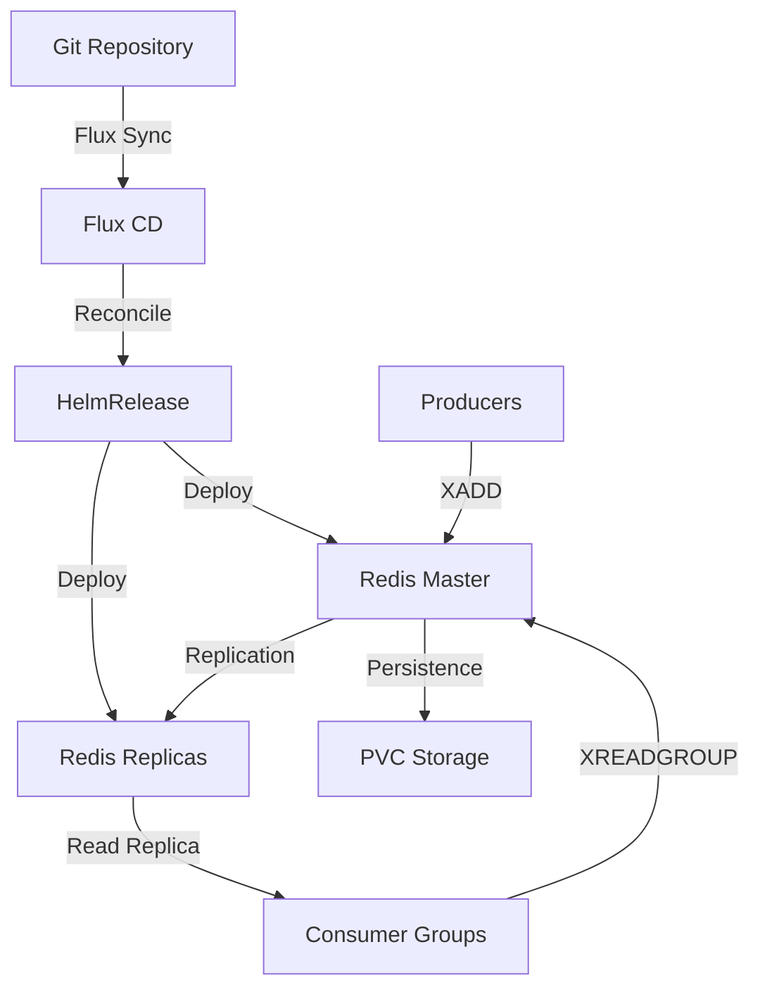

# How to Deploy Redis Streams with Flux CD

Author: [nawazdhandala](https://github.com/nawazdhandala)

Tags: flux cd, redis, redis streams, message queue, kubernetes, gitops

Description: A practical guide to deploying Redis with Streams enabled on Kubernetes using Flux CD for real-time event streaming.

---

## Introduction

Redis Streams is a powerful data structure introduced in Redis 5.0 that provides an append-only log with consumer group support, making it ideal for event streaming, message queuing, and real-time data processing. Unlike traditional message brokers, Redis Streams combines the simplicity of Redis with robust streaming capabilities.

This guide demonstrates how to deploy Redis with Streams enabled on Kubernetes using Flux CD, providing a lightweight yet powerful messaging solution managed through GitOps.

## Prerequisites

Before starting, ensure you have:

- A Kubernetes cluster (v1.26 or later)
- Flux CD installed and bootstrapped
- kubectl configured for your cluster
- A Git repository connected to Flux CD

## Architecture Overview



## Step 1: Create the Namespace

Define a namespace for the Redis deployment.

```yaml
# redis-namespace.yaml
# Dedicated namespace for Redis Streams
apiVersion: v1
kind: Namespace
metadata:
  name: redis-system
  labels:
    app.kubernetes.io/managed-by: flux
    app.kubernetes.io/name: redis
```

## Step 2: Add the Bitnami Helm Repository

Register the Bitnami Helm repository, which provides the Redis chart.

```yaml
# redis-helmrepo.yaml
# Bitnami Helm repository for the Redis chart
apiVersion: source.toolkit.fluxcd.io/v1
kind: HelmRepository
metadata:
  name: bitnami
  namespace: redis-system
spec:
  interval: 1h
  # Bitnami OCI registry for Helm charts
  url: https://charts.bitnami.com/bitnami
```

## Step 3: Create the Redis Authentication Secret

Set up a secret for Redis authentication before deploying.

```yaml
# redis-auth-secret.yaml
# Redis password secret - use sealed-secrets or SOPS in production
apiVersion: v1
kind: Secret
metadata:
  name: redis-password
  namespace: redis-system
type: Opaque
stringData:
  # Strong password for Redis authentication
  redis-password: "your-secure-redis-password-here"
```

## Step 4: Create the HelmRelease

Define the HelmRelease to deploy Redis with Streams-optimized configuration.

```yaml
# redis-helmrelease.yaml
# Deploys Redis with configuration optimized for Streams usage
apiVersion: helm.toolkit.fluxcd.io/v2
kind: HelmRelease
metadata:
  name: redis
  namespace: redis-system
spec:
  interval: 30m
  chart:
    spec:
      chart: redis
      version: "19.x"
      sourceRef:
        kind: HelmRepository
        name: bitnami
        namespace: redis-system
      interval: 12h
  values:
    # Use the existing password secret
    auth:
      enabled: true
      existingSecret: redis-password
      existingSecretPasswordKey: redis-password

    # Master node configuration
    master:
      count: 1
      resources:
        requests:
          cpu: 250m
          memory: 512Mi
        limits:
          cpu: "1"
          memory: 1Gi
      persistence:
        enabled: true
        size: 20Gi
        storageClass: standard
      # Redis configuration optimized for Streams
      configuration: |
        # Memory management
        maxmemory 768mb
        maxmemory-policy noeviction

        # Streams-specific settings
        # Maximum length of stream entries before trimming
        stream-node-max-bytes 4096
        stream-node-max-entries 100

        # Persistence settings for durability
        appendonly yes
        appendfsync everysec

        # RDB snapshots
        save 900 1
        save 300 10
        save 60 10000

        # Slow log for debugging
        slowlog-log-slower-than 10000
        slowlog-max-len 128

    # Replica configuration for read scaling
    replica:
      replicaCount: 3
      resources:
        requests:
          cpu: 200m
          memory: 256Mi
        limits:
          cpu: 500m
          memory: 512Mi
      persistence:
        enabled: true
        size: 20Gi
        storageClass: standard
      configuration: |
        # Replica-specific settings
        maxmemory 512mb
        maxmemory-policy noeviction
        appendonly yes
        appendfsync everysec

    # Redis Sentinel for high availability
    sentinel:
      enabled: true
      resources:
        requests:
          cpu: 100m
          memory: 128Mi
        limits:
          cpu: 200m
          memory: 256Mi
      # Sentinel configuration
      configuration: |
        sentinel down-after-milliseconds mymaster 5000
        sentinel failover-timeout mymaster 10000
        sentinel parallel-syncs mymaster 1

    # Metrics exporter for Prometheus
    metrics:
      enabled: true
      resources:
        requests:
          cpu: 50m
          memory: 64Mi
        limits:
          cpu: 100m
          memory: 128Mi
      serviceMonitor:
        enabled: true
        interval: 30s
```

## Step 5: Create Stream Initialization Job

Initialize Redis Streams and consumer groups after deployment.

```yaml
# redis-stream-init.yaml
# Job to create initial streams and consumer groups
apiVersion: batch/v1
kind: Job
metadata:
  name: redis-stream-init
  namespace: redis-system
spec:
  template:
    spec:
      containers:
        - name: redis-init
          image: redis:7-alpine
          command:
            - /bin/sh
            - -c
            - |
              # Wait for Redis to be ready
              until redis-cli -h redis-master.redis-system.svc \
                -a "$REDIS_PASSWORD" ping | grep PONG; do
                echo "Waiting for Redis..."
                sleep 5
              done

              # Create streams with initial entries
              # Events stream for application events
              redis-cli -h redis-master.redis-system.svc \
                -a "$REDIS_PASSWORD" \
                XADD events:app '*' type init message "Stream initialized"

              # Create consumer groups for the events stream
              redis-cli -h redis-master.redis-system.svc \
                -a "$REDIS_PASSWORD" \
                XGROUP CREATE events:app processors '$' MKSTREAM

              redis-cli -h redis-master.redis-system.svc \
                -a "$REDIS_PASSWORD" \
                XGROUP CREATE events:app analytics '$' MKSTREAM

              # Notifications stream
              redis-cli -h redis-master.redis-system.svc \
                -a "$REDIS_PASSWORD" \
                XADD notifications '*' type init message "Stream initialized"

              redis-cli -h redis-master.redis-system.svc \
                -a "$REDIS_PASSWORD" \
                XGROUP CREATE notifications handlers '$' MKSTREAM

              echo "Streams and consumer groups created successfully"
          env:
            - name: REDIS_PASSWORD
              valueFrom:
                secretKeyRef:
                  name: redis-password
                  key: redis-password
      restartPolicy: OnFailure
  backoffLimit: 3
```

## Step 6: Add Network Policies

Restrict network access to Redis pods.

```yaml
# redis-networkpolicy.yaml
# Network policy to secure Redis access
apiVersion: networking.k8s.io/v1
kind: NetworkPolicy
metadata:
  name: redis-access-policy
  namespace: redis-system
spec:
  podSelector:
    matchLabels:
      app.kubernetes.io/name: redis
  policyTypes:
    - Ingress
    - Egress
  ingress:
    # Allow client access from labeled namespaces
    - from:
        - namespaceSelector:
            matchLabels:
              redis-access: "true"
      ports:
        - protocol: TCP
          port: 6379
    # Allow Sentinel communication
    - from:
        - podSelector:
            matchLabels:
              app.kubernetes.io/name: redis
      ports:
        - protocol: TCP
          port: 6379
        - protocol: TCP
          port: 26379
  egress:
    # Allow DNS
    - ports:
        - protocol: UDP
          port: 53
    # Allow Redis replication traffic
    - to:
        - podSelector:
            matchLabels:
              app.kubernetes.io/name: redis
      ports:
        - protocol: TCP
          port: 6379
        - protocol: TCP
          port: 26379
```

## Step 7: Set Up the Flux Kustomization

Orchestrate all Redis resources with a Flux Kustomization.

```yaml
# kustomization.yaml
# Flux Kustomization for Redis Streams deployment
apiVersion: kustomize.toolkit.fluxcd.io/v1
kind: Kustomization
metadata:
  name: redis-streams
  namespace: flux-system
spec:
  interval: 10m
  targetNamespace: redis-system
  sourceRef:
    kind: GitRepository
    name: flux-system
  path: ./clusters/my-cluster/redis
  prune: true
  healthChecks:
    - apiVersion: apps/v1
      kind: StatefulSet
      name: redis-master
      namespace: redis-system
    - apiVersion: apps/v1
      kind: StatefulSet
      name: redis-replicas
      namespace: redis-system
  timeout: 10m
```

## Step 8: Verify the Deployment

Confirm that Redis and Streams are working correctly.

```bash
# Check Flux reconciliation status
flux get helmreleases -n redis-system

# Verify all Redis pods are running
kubectl get pods -n redis-system

# Test Redis connectivity
kubectl exec -n redis-system redis-master-0 -- \
  redis-cli -a "$REDIS_PASSWORD" ping

# Verify streams exist
kubectl exec -n redis-system redis-master-0 -- \
  redis-cli -a "$REDIS_PASSWORD" XINFO STREAM events:app

# List consumer groups
kubectl exec -n redis-system redis-master-0 -- \
  redis-cli -a "$REDIS_PASSWORD" XINFO GROUPS events:app

# Publish a test message
kubectl exec -n redis-system redis-master-0 -- \
  redis-cli -a "$REDIS_PASSWORD" \
  XADD events:app '*' source test action "flux-cd-verification"

# Read messages from the stream
kubectl exec -n redis-system redis-master-0 -- \
  redis-cli -a "$REDIS_PASSWORD" \
  XRANGE events:app - +

# Check Sentinel status
kubectl exec -n redis-system redis-node-0 -- \
  redis-cli -p 26379 SENTINEL masters
```

## Troubleshooting

Common issues and fixes:

```bash
# Check Flux HelmRelease errors
kubectl describe helmrelease redis -n redis-system

# View Redis master logs
kubectl logs -n redis-system redis-master-0

# Check memory usage
kubectl exec -n redis-system redis-master-0 -- \
  redis-cli -a "$REDIS_PASSWORD" INFO memory

# Check replication status
kubectl exec -n redis-system redis-master-0 -- \
  redis-cli -a "$REDIS_PASSWORD" INFO replication

# Verify persistent volumes
kubectl get pvc -n redis-system

# Check Sentinel failover logs
kubectl logs -n redis-system -l app.kubernetes.io/component=sentinel
```

## Conclusion

You have successfully deployed Redis with Streams enabled on Kubernetes using Flux CD. This setup provides a lightweight, high-performance messaging solution with consumer groups, persistent storage, high availability through Sentinel, and read scaling through replicas. The GitOps approach with Flux CD ensures your Redis configuration is version-controlled and automatically reconciled.
