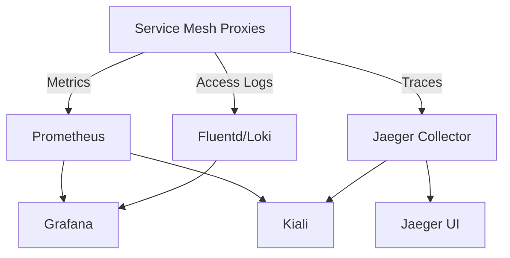

# How to Deploy Service Mesh Observability Stack with Flux CD

Author: [nawazdhandala](https://github.com/nawazdhandala)

Tags: flux cd, observability, service mesh, gitops, kubernetes, prometheus, grafana, jaeger, tracing

Description: Deploy a complete observability stack for service mesh monitoring including metrics, tracing, and logging using Flux CD.

---

## Introduction

Observability is essential for operating a service mesh in production. Without proper metrics, traces, and logs, you cannot understand how traffic flows between services or diagnose performance issues. This guide walks you through deploying a complete observability stack -- Prometheus for metrics, Grafana for dashboards, Jaeger for distributed tracing, and Kiali for service mesh visualization -- all managed by Flux CD.

## Prerequisites

Before you begin, ensure you have:

- A Kubernetes cluster (v1.25 or later) with a service mesh (Istio recommended)
- Flux CD bootstrapped and connected to a Git repository
- Sufficient cluster resources (at least 8 GB RAM available)
- kubectl configured for your cluster

## Stack Architecture

The observability stack components work together to provide full visibility.



## Adding Helm Repositories

Register all required Helm chart repositories.

```yaml
# infrastructure/sources/observability-repos.yaml
apiVersion: source.toolkit.fluxcd.io/v1
kind: HelmRepository
metadata:
  name: prometheus-community
  namespace: flux-system
spec:
  interval: 1h
  url: https://prometheus-community.github.io/helm-charts
---
apiVersion: source.toolkit.fluxcd.io/v1
kind: HelmRepository
metadata:
  name: grafana
  namespace: flux-system
spec:
  interval: 1h
  url: https://grafana.github.io/helm-charts
---
apiVersion: source.toolkit.fluxcd.io/v1
kind: HelmRepository
metadata:
  name: jaegertracing
  namespace: flux-system
spec:
  interval: 1h
  url: https://jaegertracing.github.io/helm-charts
---
apiVersion: source.toolkit.fluxcd.io/v1
kind: HelmRepository
metadata:
  name: kiali
  namespace: flux-system
spec:
  interval: 1h
  url: https://kiali.org/helm-charts
```

## Creating the Observability Namespace

Define a dedicated namespace for observability components.

```yaml
# infrastructure/observability/namespace.yaml
apiVersion: v1
kind: Namespace
metadata:
  name: observability
  labels:
    # Enable Istio sidecar injection for the observability namespace
    istio-injection: enabled
```

## Deploying Prometheus

Deploy Prometheus with service mesh scraping configuration.

```yaml
# infrastructure/observability/prometheus-helmrelease.yaml
apiVersion: helm.toolkit.fluxcd.io/v2
kind: HelmRelease
metadata:
  name: prometheus
  namespace: observability
spec:
  interval: 30m
  chart:
    spec:
      chart: kube-prometheus-stack
      version: "65.x"
      sourceRef:
        kind: HelmRepository
        name: prometheus-community
        namespace: flux-system
      interval: 12h
  install:
    crds: CreateReplace
    remediation:
      retries: 3
  upgrade:
    crds: CreateReplace
  values:
    # Prometheus server configuration
    prometheus:
      prometheusSpec:
        # Retention period for metrics
        retention: 15d
        # Storage configuration
        storageSpec:
          volumeClaimTemplate:
            spec:
              accessModes: ["ReadWriteOnce"]
              resources:
                requests:
                  storage: 50Gi
        # Additional scrape configs for service mesh
        additionalScrapeConfigs:
          # Scrape Istio control plane metrics
          - job_name: "istio-mesh"
            kubernetes_sd_configs:
              - role: endpoints
                namespaces:
                  names:
                    - istio-system
            relabel_configs:
              - source_labels: [__meta_kubernetes_service_name]
                action: keep
                regex: istio-telemetry
          # Scrape Envoy sidecar proxy metrics
          - job_name: "envoy-stats"
            metrics_path: /stats/prometheus
            kubernetes_sd_configs:
              - role: pod
            relabel_configs:
              - source_labels: [__meta_kubernetes_pod_container_port_name]
                action: keep
                regex: ".*-envoy-prom"
        resources:
          requests:
            memory: "512Mi"
            cpu: "250m"
          limits:
            memory: "2Gi"
            cpu: "1000m"
    # Configure Alertmanager
    alertmanager:
      alertmanagerSpec:
        replicas: 1
        storage:
          volumeClaimTemplate:
            spec:
              accessModes: ["ReadWriteOnce"]
              resources:
                requests:
                  storage: 10Gi
    # Disable default Grafana (we deploy it separately)
    grafana:
      enabled: false
```

## Deploying Grafana

Deploy Grafana with pre-configured service mesh dashboards.

```yaml
# infrastructure/observability/grafana-helmrelease.yaml
apiVersion: helm.toolkit.fluxcd.io/v2
kind: HelmRelease
metadata:
  name: grafana
  namespace: observability
spec:
  interval: 30m
  chart:
    spec:
      chart: grafana
      version: "8.x"
      sourceRef:
        kind: HelmRepository
        name: grafana
        namespace: flux-system
      interval: 12h
  values:
    # Admin credentials from secret
    admin:
      existingSecret: grafana-admin-credentials
    # Configure data sources
    datasources:
      datasources.yaml:
        apiVersion: 1
        datasources:
          # Prometheus data source for metrics
          - name: Prometheus
            type: prometheus
            url: http://prometheus-kube-prometheus-prometheus:9090
            access: proxy
            isDefault: true
          # Jaeger data source for traces
          - name: Jaeger
            type: jaeger
            url: http://jaeger-query.observability:16686
            access: proxy
          # Loki data source for logs
          - name: Loki
            type: loki
            url: http://loki.observability:3100
            access: proxy
    # Pre-configured dashboards
    dashboardProviders:
      dashboardproviders.yaml:
        apiVersion: 1
        providers:
          - name: "istio"
            orgId: 1
            folder: "Istio"
            type: file
            disableDeletion: false
            editable: true
            options:
              path: /var/lib/grafana/dashboards/istio
          - name: "mesh"
            orgId: 1
            folder: "Service Mesh"
            type: file
            disableDeletion: false
            editable: true
            options:
              path: /var/lib/grafana/dashboards/mesh
    # Import community dashboards by ID
    dashboards:
      istio:
        # Istio Mesh Dashboard
        istio-mesh:
          gnetId: 7639
          revision: 1
          datasource: Prometheus
        # Istio Service Dashboard
        istio-service:
          gnetId: 7636
          revision: 1
          datasource: Prometheus
        # Istio Workload Dashboard
        istio-workload:
          gnetId: 7630
          revision: 1
          datasource: Prometheus
    # Persistence for Grafana
    persistence:
      enabled: true
      size: 10Gi
    # Resource limits
    resources:
      requests:
        memory: "256Mi"
        cpu: "100m"
      limits:
        memory: "512Mi"
        cpu: "500m"
```

## Deploying Jaeger for Distributed Tracing

Set up Jaeger to collect and visualize distributed traces.

```yaml
# infrastructure/observability/jaeger-helmrelease.yaml
apiVersion: helm.toolkit.fluxcd.io/v2
kind: HelmRelease
metadata:
  name: jaeger
  namespace: observability
spec:
  interval: 30m
  chart:
    spec:
      chart: jaeger
      version: "3.x"
      sourceRef:
        kind: HelmRepository
        name: jaegertracing
        namespace: flux-system
      interval: 12h
  values:
    # Use the all-in-one deployment for simplicity
    # For production, use the production strategy with Elasticsearch
    provisionDataStore:
      cassandra: false
      elasticsearch: true
    storage:
      type: elasticsearch
      elasticsearch:
        host: elasticsearch-master
        port: 9200
    # Collector configuration
    collector:
      replicas: 2
      resources:
        requests:
          memory: "256Mi"
          cpu: "100m"
        limits:
          memory: "512Mi"
          cpu: "300m"
      # Accept traces from Istio's Zipkin format
      service:
        zipkin:
          port: 9411
    # Query service for the Jaeger UI
    query:
      replicas: 1
      resources:
        requests:
          memory: "128Mi"
          cpu: "100m"
        limits:
          memory: "256Mi"
          cpu: "200m"
    # Agent configuration (runs as DaemonSet)
    agent:
      daemonset:
        useHostPort: true
      resources:
        requests:
          memory: "64Mi"
          cpu: "50m"
        limits:
          memory: "128Mi"
          cpu: "100m"
```

## Configuring Istio Telemetry

Configure Istio to send metrics and traces to the observability stack.

```yaml
# infrastructure/observability/istio-telemetry.yaml
apiVersion: telemetry.istio.io/v1
kind: Telemetry
metadata:
  name: mesh-default
  namespace: istio-system
spec:
  # Configure tracing
  tracing:
    - providers:
        - name: jaeger
      # Sample 10% of traces in production
      randomSamplingPercentage: 10.0
      customTags:
        # Add custom tags to all traces
        environment:
          literal:
            value: production
        cluster:
          literal:
            value: primary
  # Configure access logging
  accessLogging:
    - providers:
        - name: envoy
      filter:
        # Log only error responses
        expression: "response.code >= 400"
```

## Deploying Kiali for Mesh Visualization

Deploy Kiali to visualize service mesh topology and traffic.

```yaml
# infrastructure/observability/kiali-helmrelease.yaml
apiVersion: helm.toolkit.fluxcd.io/v2
kind: HelmRelease
metadata:
  name: kiali
  namespace: observability
spec:
  interval: 30m
  chart:
    spec:
      chart: kiali-server
      version: "2.x"
      sourceRef:
        kind: HelmRepository
        name: kiali
        namespace: flux-system
      interval: 12h
  values:
    # Authentication strategy
    auth:
      strategy: anonymous
    # External services configuration
    external_services:
      prometheus:
        url: http://prometheus-kube-prometheus-prometheus.observability:9090
      grafana:
        enabled: true
        in_cluster_url: http://grafana.observability:80
        url: https://grafana.example.com
      tracing:
        enabled: true
        in_cluster_url: http://jaeger-query.observability:16686
        url: https://jaeger.example.com
        use_grpc: false
    # Deployment configuration
    deployment:
      replicas: 1
      resources:
        requests:
          memory: "128Mi"
          cpu: "100m"
        limits:
          memory: "256Mi"
          cpu: "200m"
```

## Creating the Flux Kustomization

Orchestrate the observability stack deployment with proper dependencies.

```yaml
# clusters/my-cluster/infrastructure/observability.yaml
apiVersion: kustomize.toolkit.fluxcd.io/v1
kind: Kustomization
metadata:
  name: observability
  namespace: flux-system
spec:
  interval: 10m
  sourceRef:
    kind: GitRepository
    name: flux-system
  path: ./infrastructure/observability
  prune: true
  wait: true
  timeout: 15m
  # Ensure service mesh is deployed first
  dependsOn:
    - name: istio
  healthChecks:
    - apiVersion: apps/v1
      kind: Deployment
      name: grafana
      namespace: observability
    - apiVersion: apps/v1
      kind: Deployment
      name: jaeger-query
      namespace: observability
    - apiVersion: apps/v1
      kind: Deployment
      name: kiali
      namespace: observability
    - apiVersion: apps/v1
      kind: StatefulSet
      name: prometheus-kube-prometheus-prometheus
      namespace: observability
```

## Configuring Alerting Rules

Define Prometheus alerting rules for service mesh health.

```yaml
# infrastructure/observability/alerting-rules.yaml
apiVersion: monitoring.coreos.com/v1
kind: PrometheusRule
metadata:
  name: service-mesh-alerts
  namespace: observability
  labels:
    # Label must match Prometheus ruleSelector
    release: prometheus
spec:
  groups:
    - name: service-mesh
      rules:
        # Alert on high error rate
        - alert: HighServiceErrorRate
          expr: |
            sum(rate(istio_requests_total{response_code=~"5.*"}[5m])) by (destination_service_name)
            /
            sum(rate(istio_requests_total[5m])) by (destination_service_name)
            > 0.05
          for: 5m
          labels:
            severity: critical
          annotations:
            summary: "High error rate for {{ $labels.destination_service_name }}"
            description: "Service {{ $labels.destination_service_name }} has an error rate above 5%."
        # Alert on high latency
        - alert: HighServiceLatency
          expr: |
            histogram_quantile(0.99,
              sum(rate(istio_request_duration_milliseconds_bucket[5m])) by (destination_service_name, le)
            ) > 1000
          for: 5m
          labels:
            severity: warning
          annotations:
            summary: "High P99 latency for {{ $labels.destination_service_name }}"
            description: "Service {{ $labels.destination_service_name }} P99 latency is above 1 second."
        # Alert when sidecar injection fails
        - alert: SidecarInjectionFailure
          expr: |
            sum(rate(sidecar_injection_failure_total[5m])) > 0
          for: 2m
          labels:
            severity: critical
          annotations:
            summary: "Sidecar injection failures detected"
```

## Verifying the Observability Stack

Check that all components are running correctly.

```bash
# Check Flux reconciliation status
flux get kustomizations observability

# Verify all observability pods are running
kubectl get pods -n observability

# Check Prometheus targets are being scraped
kubectl port-forward -n observability svc/prometheus-kube-prometheus-prometheus 9090:9090 &
# Visit http://localhost:9090/targets to see scrape targets

# Check Grafana is accessible
kubectl port-forward -n observability svc/grafana 3000:80 &
# Visit http://localhost:3000

# Verify Jaeger is collecting traces
kubectl port-forward -n observability svc/jaeger-query 16686:16686 &
# Visit http://localhost:16686

# Check Kiali dashboard
kubectl port-forward -n observability svc/kiali 20001:20001 &
# Visit http://localhost:20001
```

## Summary

Deploying a service mesh observability stack with Flux CD gives you comprehensive visibility into your mesh while maintaining GitOps practices. Prometheus collects metrics from mesh proxies, Grafana visualizes them with pre-built dashboards, Jaeger traces requests across services, and Kiali provides real-time mesh topology. With Flux managing the entire stack, upgrades, configuration changes, and alert rules are all version-controlled and automatically reconciled.
