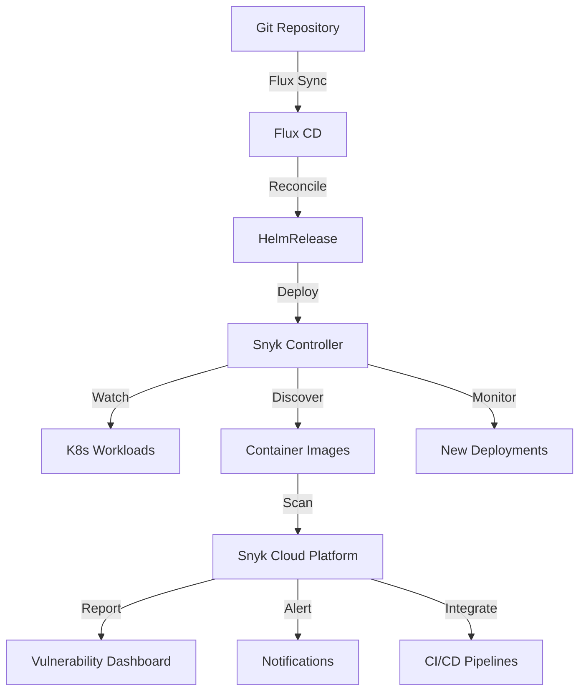

# How to Deploy Snyk Controller with Flux CD

Author: [nawazdhandala](https://github.com/nawazdhandala)

Tags: flux cd, snyk, vulnerability scanning, kubernetes, gitops, security, devsecops

Description: A practical guide to deploying the Snyk Controller on Kubernetes using Flux CD for continuous container image vulnerability monitoring.

---

## Introduction

Snyk Controller (also known as snyk-monitor) is a Kubernetes agent that monitors running workloads and automatically imports container images into Snyk for vulnerability scanning. It provides continuous security monitoring by detecting new images as they are deployed, scanning them against Snyk's vulnerability database, and reporting findings through the Snyk platform.

This guide walks through deploying the Snyk Controller on Kubernetes using Flux CD, enabling automated vulnerability monitoring managed through GitOps workflows.

## Prerequisites

Before starting, ensure you have:

- A Kubernetes cluster (v1.26 or later)
- Flux CD installed and bootstrapped
- kubectl configured for your cluster
- A Git repository connected to Flux CD
- A Snyk account with an Organization ID and API token
- Snyk integration ID for Kubernetes (obtain from Snyk dashboard)

## Architecture Overview



## Step 1: Create the Namespace

Define a namespace for the Snyk Controller.

```yaml
# snyk-namespace.yaml
# Dedicated namespace for Snyk Controller
apiVersion: v1
kind: Namespace
metadata:
  name: snyk-monitor
  labels:
    app.kubernetes.io/managed-by: flux
    app.kubernetes.io/name: snyk-monitor
```

## Step 2: Create the Snyk Secrets

Set up the required secrets for Snyk Controller authentication.

```yaml
# snyk-secret.yaml
# Snyk API credentials and integration configuration
# Use sealed-secrets or SOPS in production
apiVersion: v1
kind: Secret
metadata:
  name: snyk-monitor
  namespace: snyk-monitor
type: Opaque
stringData:
  # Snyk API token - obtain from Snyk account settings
  # https://app.snyk.io/account
  snykToken: "your-snyk-api-token-here"

  # Snyk Integration ID for Kubernetes
  # Obtain from: Snyk Dashboard > Integrations > Kubernetes
  integrationId: "your-integration-id-here"
---
# Docker config for private registry access
# Required if your cluster uses private container registries
apiVersion: v1
kind: Secret
metadata:
  name: snyk-docker-config
  namespace: snyk-monitor
type: kubernetes.io/dockerconfigjson
stringData:
  .dockerconfigjson: |
    {
      "auths": {
        "registry.example.com": {
          "username": "scanner",
          "password": "your-registry-password",
          "auth": "base64-encoded-credentials"
        },
        "123456789012.dkr.ecr.us-east-1.amazonaws.com": {
          "username": "AWS",
          "password": "ecr-token"
        },
        "ghcr.io": {
          "username": "github-user",
          "password": "ghp_your-token"
        }
      }
    }
```

## Step 3: Add the Snyk Helm Repository

Register the Snyk Helm chart repository with Flux CD.

```yaml
# snyk-helmrepo.yaml
# Official Snyk Helm chart repository
apiVersion: source.toolkit.fluxcd.io/v1
kind: HelmRepository
metadata:
  name: snyk
  namespace: snyk-monitor
spec:
  interval: 1h
  url: https://snyk.github.io/kubernetes-monitor/
```

## Step 4: Create the HelmRelease

Deploy the Snyk Controller using the Helm chart.

```yaml
# snyk-helmrelease.yaml
# Deploys the Snyk Controller (snyk-monitor) via Flux CD
apiVersion: helm.toolkit.fluxcd.io/v1
kind: HelmRelease
metadata:
  name: snyk-monitor
  namespace: snyk-monitor
spec:
  interval: 30m
  chart:
    spec:
      chart: snyk-monitor
      version: "2.x"
      sourceRef:
        kind: HelmRepository
        name: snyk
        namespace: snyk-monitor
      interval: 12h
  values:
    # Cluster display name in Snyk dashboard
    clusterName: production-cluster

    # Use existing secrets for authentication
    monitorSecrets: snyk-monitor

    # Image pull secrets for private registries
    registryCredentials: snyk-docker-config

    # Resource limits for the controller
    resources:
      requests:
        cpu: 100m
        memory: 256Mi
      limits:
        cpu: 500m
        memory: 512Mi

    # Temporary storage for image analysis
    pvc:
      enabled: true
      create: true
      name: snyk-monitor-pvc
      storageClassName: standard
      size: 20Gi

    # Node selector for scheduling
    nodeSelector: {}

    # Tolerations
    tolerations: []

    # Scope configuration - which namespaces to monitor
    scope:
      # Monitor all namespaces except excluded ones
      excludedNamespaces:
        - kube-system
        - kube-public
        - kube-node-lease
        - flux-system

    # Image scanning configuration
    image:
      # Scan init containers as well
      scanInitContainers: true
      # Scan sidecar containers
      scanSidecarContainers: true

    # Workload event monitoring
    workloadEvents:
      enabled: true

    # Skip TLS verification for internal registries (use with caution)
    skopeo:
      compression:
        level: 6
```

## Step 5: Configure Namespace Annotations

Annotate namespaces to control Snyk monitoring behavior.

```yaml
# namespace-annotations.yaml
# Annotate namespaces for Snyk monitoring control
apiVersion: v1
kind: Namespace
metadata:
  name: production
  labels:
    # Enable Snyk monitoring for this namespace
    snyk-monitor: "enabled"
  annotations:
    # Custom Snyk organization for this namespace
    snyk.io/organization: "production-team"
---
apiVersion: v1
kind: Namespace
metadata:
  name: staging
  labels:
    snyk-monitor: "enabled"
  annotations:
    snyk.io/organization: "staging-team"
---
apiVersion: v1
kind: Namespace
metadata:
  name: development
  labels:
    # Disable monitoring for development
    snyk-monitor: "disabled"
```

## Step 6: Set Up Workload Annotations

Add annotations to workloads for fine-grained Snyk configuration.

```yaml
# example-workload-annotations.yaml
# Example deployment with Snyk annotations
apiVersion: apps/v1
kind: Deployment
metadata:
  name: web-application
  namespace: production
  annotations:
    # Override the default Snyk project name
    snyk.io/project-name: "web-app-production"
    # Set a custom severity threshold
    snyk.io/severity-threshold: "high"
spec:
  replicas: 3
  selector:
    matchLabels:
      app: web-application
  template:
    metadata:
      labels:
        app: web-application
    spec:
      containers:
        - name: web-app
          image: registry.example.com/web-app:v1.2.3
          ports:
            - containerPort: 8080
          resources:
            requests:
              cpu: 100m
              memory: 128Mi
            limits:
              cpu: 500m
              memory: 256Mi
```

## Step 7: Add Network Policies

Secure Snyk Controller network access.

```yaml
# snyk-networkpolicy.yaml
# Network policy for Snyk Controller
apiVersion: networking.k8s.io/v1
kind: NetworkPolicy
metadata:
  name: snyk-monitor-policy
  namespace: snyk-monitor
spec:
  podSelector:
    matchLabels:
      app.kubernetes.io/name: snyk-monitor
  policyTypes:
    - Ingress
    - Egress
  ingress:
    # Allow metrics scraping from Prometheus
    - from:
        - namespaceSelector:
            matchLabels:
              name: monitoring
      ports:
        - protocol: TCP
          port: 8080
  egress:
    # Allow DNS resolution
    - ports:
        - protocol: UDP
          port: 53
    # Allow HTTPS to Snyk API and container registries
    - ports:
        - protocol: TCP
          port: 443
    # Allow communication with Kubernetes API server
    - ports:
        - protocol: TCP
          port: 6443
    # Allow HTTP for non-TLS registries (if needed)
    - ports:
        - protocol: TCP
          port: 80
```

## Step 8: Configure Monitoring and Alerts

Set up Prometheus monitoring for the Snyk Controller.

```yaml
# snyk-servicemonitor.yaml
# Prometheus ServiceMonitor for Snyk Controller
apiVersion: monitoring.coreos.com/v1
kind: ServiceMonitor
metadata:
  name: snyk-monitor-metrics
  namespace: snyk-monitor
  labels:
    release: prometheus
spec:
  selector:
    matchLabels:
      app.kubernetes.io/name: snyk-monitor
  endpoints:
    - port: http
      interval: 60s
      path: /metrics
---
# Alert rules for Snyk Controller health
apiVersion: monitoring.coreos.com/v1
kind: PrometheusRule
metadata:
  name: snyk-monitor-alerts
  namespace: snyk-monitor
  labels:
    release: prometheus
spec:
  groups:
    - name: snyk-monitor-health
      rules:
        # Alert if Snyk Controller is down
        - alert: SnykControllerDown
          expr: up{job="snyk-monitor"} == 0
          for: 5m
          labels:
            severity: critical
          annotations:
            summary: "Snyk Controller is down"
            description: "The Snyk Controller has been unreachable for 5 minutes."

        # Alert on high memory usage
        - alert: SnykControllerHighMemory
          expr: >
            container_memory_working_set_bytes{
              namespace="snyk-monitor",
              container="snyk-monitor"
            } > 450e6
          for: 10m
          labels:
            severity: warning
          annotations:
            summary: "Snyk Controller memory usage is high"
            description: "Memory usage is {{ $value | humanize }} bytes."

        # Alert if PVC is running low on space
        - alert: SnykControllerLowDiskSpace
          expr: >
            kubelet_volume_stats_available_bytes{
              namespace="snyk-monitor",
              persistentvolumeclaim="snyk-monitor-pvc"
            } / kubelet_volume_stats_capacity_bytes{
              namespace="snyk-monitor",
              persistentvolumeclaim="snyk-monitor-pvc"
            } < 0.1
          for: 5m
          labels:
            severity: warning
          annotations:
            summary: "Snyk Controller PVC is running low on disk space"
            description: "Less than 10% disk space remaining."
```

## Step 9: Set Up the Flux Kustomization

Organize all Snyk resources with a Flux Kustomization.

```yaml
# kustomization.yaml
# Flux Kustomization for Snyk Controller
apiVersion: kustomize.toolkit.fluxcd.io/v1
kind: Kustomization
metadata:
  name: snyk-monitor
  namespace: flux-system
spec:
  interval: 10m
  targetNamespace: snyk-monitor
  sourceRef:
    kind: GitRepository
    name: flux-system
  path: ./clusters/my-cluster/snyk
  prune: true
  healthChecks:
    - apiVersion: apps/v1
      kind: Deployment
      name: snyk-monitor
      namespace: snyk-monitor
  timeout: 5m
```

## Step 10: Verify the Deployment

After pushing to Git, verify the Snyk Controller is working.

```bash
# Check Flux reconciliation
flux get helmreleases -n snyk-monitor

# Verify the Snyk Controller pod is running
kubectl get pods -n snyk-monitor

# Check controller logs for successful connection
kubectl logs -n snyk-monitor deploy/snyk-monitor --tail=50

# Verify the controller is scanning workloads
kubectl logs -n snyk-monitor deploy/snyk-monitor | grep -i "scanning\|imported"

# Check PVC is bound and has space
kubectl get pvc -n snyk-monitor
kubectl exec -n snyk-monitor deploy/snyk-monitor -- df -h /var/tmp

# Verify in Snyk Dashboard
# Navigate to: https://app.snyk.io > Integrations > Kubernetes
# You should see your cluster listed with imported projects
```

## Step 11: Review Results in Snyk Dashboard

After deployment, the Snyk Controller will automatically discover and scan workloads.

```bash
# Use Snyk CLI to check imported projects
snyk monitor --org=your-org-id

# List Kubernetes projects via Snyk API
curl -s -H "Authorization: token $SNYK_TOKEN" \
  "https://api.snyk.io/rest/orgs/$SNYK_ORG_ID/projects?type=k8sconfig" | \
  jq '.data[] | {name: .attributes.name, status: .attributes.status}'

# Check for critical vulnerabilities
curl -s -H "Authorization: token $SNYK_TOKEN" \
  "https://api.snyk.io/rest/orgs/$SNYK_ORG_ID/issues?severity=critical" | \
  jq '.data | length'
```

## Troubleshooting

Common issues and solutions:

```bash
# Check controller logs for authentication errors
kubectl logs -n snyk-monitor deploy/snyk-monitor | grep -i "error\|auth\|token"

# Verify secrets are correctly mounted
kubectl exec -n snyk-monitor deploy/snyk-monitor -- env | grep -i snyk

# Check if the controller can reach Snyk API
kubectl exec -n snyk-monitor deploy/snyk-monitor -- \
  wget -qO- --timeout=5 https://api.snyk.io/rest/openapi

# Verify docker config is valid for private registries
kubectl get secret snyk-docker-config -n snyk-monitor -o jsonpath='{.data.\.dockerconfigjson}' | base64 -d | jq .

# Check Flux errors
kubectl describe helmrelease snyk-monitor -n snyk-monitor

# Restart the controller if stuck
kubectl rollout restart deployment/snyk-monitor -n snyk-monitor

# Force Flux reconciliation
flux reconcile helmrelease snyk-monitor -n snyk-monitor
```

## Conclusion

You have successfully deployed the Snyk Controller on Kubernetes using Flux CD. The controller now continuously monitors your cluster workloads, automatically importing container images into Snyk for vulnerability scanning. With the Snyk dashboard, you have full visibility into vulnerabilities across your Kubernetes environment. The GitOps approach ensures your security monitoring configuration is version-controlled, auditable, and consistently applied through Flux CD reconciliation.
