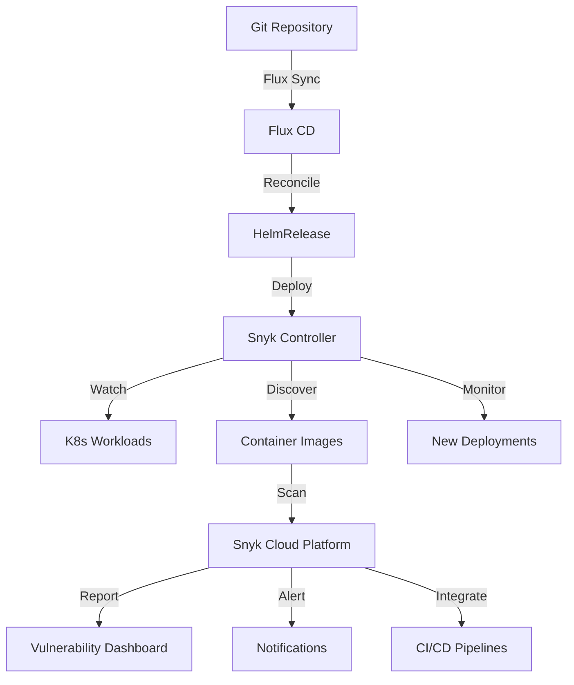

# How to Deploy Snyk Controller with Flux CD

Author: [nawazdhandala](https://github.com/nawazdhandala)

Tags: Flux CD, Snyk, Vulnerability Scanning, Kubernetes, GitOps, Security, DevSecOps

Description: A practical guide to deploying the Snyk Controller on Kubernetes using Flux CD for continuous container image vulnerability monitoring.

---

## Introduction

Snyk Controller (also known as snyk-monitor) is a Kubernetes agent that monitors running workloads and automatically imports container images into Snyk for vulnerability scanning. It provides continuous security monitoring by detecting new images as they are deployed, scanning them against Snyk's vulnerability database, and reporting findings through the Snyk platform.

This guide walks through deploying the Snyk Controller on Kubernetes using Flux CD, enabling automated vulnerability monitoring managed through GitOps workflows.

## Prerequisites

Before starting, ensure you have:

- A Kubernetes cluster with a linux/amd64 worker node and at least 50 GiB of temporary storage
- Flux CD installed and bootstrapped
- kubectl configured for your cluster
- A Git repository connected to Flux CD
- A Snyk Enterprise account with an Organization ID and service account API token
- Snyk integration ID for Kubernetes (obtain from Snyk dashboard)

## Architecture Overview


```mermaid
graph TD
    A[Git Repository] -->|Flux Sync| B[Flux CD]
    B -->|Reconcile| C[HelmRelease]
    C -->|Deploy| D[Snyk Controller]
    D -->|Watch| E[K8s Workloads]
    D -->|Discover| F[Container Images]
    F -->|Scan| G[Snyk Cloud Platform]
    G -->|Report| H[Vulnerability Dashboard]
    G -->|Alert| I[Notifications]
    G -->|Integrate| J[CI/CD Pipelines]
    D -->|Monitor| K[New Deployments]
```

## Step 1: Create the Namespace

Define a namespace for the Snyk Controller.

```yaml
# snyk-namespace.yaml

# Dedicated namespace for Snyk Controller
apiVersion: v1
kind: Namespace
metadata:
  name: snyk-monitor
  labels:
    app.kubernetes.io/managed-by: flux
    app.kubernetes.io/name: snyk-monitor
```

## Step 2: Create the Snyk Secrets

Set up the required secrets for Snyk Controller authentication.

```yaml
# snyk-secret.yaml
# Snyk API credentials and integration configuration
# Use sealed-secrets or SOPS in production
apiVersion: v1
kind: Secret
metadata:
  name: snyk-monitor
  namespace: snyk-monitor
type: Opaque
stringData:
  # Snyk Integration ID for Kubernetes
  # Obtain from: Snyk Dashboard > Integrations > Kubernetes
  integrationId: "your-integration-id-here"

  # Snyk service account API token with permission to publish Kubernetes resources
  serviceAccountApiToken: "your-snyk-service-account-api-token-here"

  # Docker config for private registry access
  # Use {} if you only scan public registries
  dockercfg.json: |
    {
      "auths": {
        "registry.example.com": {
          "username": "scanner",
          "password": "your-registry-password",
          "auth": "base64-encoded-credentials"
        },
        "123456789012.dkr.ecr.us-east-1.amazonaws.com": {
          "username": "AWS",
          "password": "ecr-token"
        },
        "ghcr.io": {
          "username": "github-user",
          "password": "ghp_your-token"
        }
      }
    }
```

## Step 3: Add the Snyk Helm Repository

Register the Snyk Helm chart repository with Flux CD.

```yaml
# snyk-helmrepo.yaml
# Official Snyk Helm chart repository
apiVersion: source.toolkit.fluxcd.io/v1
kind: HelmRepository
metadata:
  name: snyk
  namespace: snyk-monitor
spec:
  interval: 1h
  url: https://snyk.github.io/kubernetes-monitor
```

## Step 4: Create the HelmRelease

Deploy the Snyk Controller using the Helm chart.

```yaml
# snyk-helmrelease.yaml
# Deploys the Snyk Controller (snyk-monitor) via Flux CD
apiVersion: helm.toolkit.fluxcd.io/v2
kind: HelmRelease
metadata:
  name: snyk-monitor
  namespace: snyk-monitor
spec:
  interval: 30m
  chart:
    spec:
      chart: snyk-monitor
      version: "2.x"
      sourceRef:
        kind: HelmRepository
        name: snyk
        namespace: snyk-monitor
      interval: 12h
  values:
    # Cluster display name in Snyk dashboard
    clusterName: production-cluster

    # Use existing secrets for authentication
    monitorSecrets: snyk-monitor

    # Resource limits for the controller
    requests:
      cpu: 250m
      memory: 400Mi
    limits:
      cpu: "1"
      memory: 2Gi

    # Temporary storage for image analysis
    temporaryStorageSize: 50Gi
    pvc:
      enabled: true
      create: true
      name: snyk-monitor-pvc
      storageClassName: standard

    # Node selector for scheduling
    nodeSelector: {}

    # Tolerations
    tolerations: []

    # Monitor all namespaces except excluded ones
    excludedNamespaces:
      - kube-system
      - kube-public
      - kube-node-lease
      - flux-system

    # Enable automatic workload import through workload policies
    policyOrgs:
      - "your-snyk-org-id-here"

    # Optional: use the custom Rego policy from Step 5
    workloadPoliciesMap: snyk-monitor-workload-policies

    # Skopeo compression level for image handling
    skopeo:
      compression:
        level: 6
```

## Step 5: Configure Workload Policies

Create a Rego workload policy to control which namespaces are automatically imported.

```yaml
# snyk-workload-policies.yaml
# Workload policy for automatic Snyk imports
apiVersion: v1
kind: ConfigMap
metadata:
  name: snyk-monitor-workload-policies
  namespace: snyk-monitor
data:
  workload-events.rego: |-
    package snyk

    orgs := ["your-snyk-org-id-here"]

    default workload_events = false

    workload_events {
      input.kind != "Job"
      input.kind != "Pod"
      input.metadata.namespace == "production"
    }

    workload_events {
      input.kind != "Job"
      input.kind != "Pod"
      input.metadata.namespace == "staging"
    }
```

## Step 6: Set Up a Workload to Import

Deploy workloads in namespaces allowed by the Snyk workload policy.

```yaml
# example-workload.yaml
# Example deployment that matches the workload policy
apiVersion: apps/v1
kind: Deployment
metadata:
  name: web-application
  namespace: production
spec:
  replicas: 3
  selector:
    matchLabels:
      app: web-application
  template:
    metadata:
      labels:
        app: web-application
    spec:
      containers:
        - name: web-app
          image: registry.example.com/web-app:v1.2.3
          ports:
            - containerPort: 8080
          resources:
            requests:
              cpu: 100m
              memory: 128Mi
            limits:
              cpu: 500m
              memory: 256Mi
```

## Step 7: Add Network Policies

Secure Snyk Controller network access.

```yaml
# Add under spec.values in snyk-helmrelease.yaml
networkPolicy:
  enabled: true
  egress:
    # Allow DNS resolution
    - ports:
        - protocol: UDP
          port: 53
        - protocol: TCP
          port: 53
    # Allow HTTPS to Snyk API and container registries
    - ports:
        - protocol: TCP
          port: 443
    # Allow communication with Kubernetes API server
    - ports:
        - protocol: TCP
          port: 6443
    # Allow HTTP for non-TLS registries (if needed)
    - ports:
        - protocol: TCP
          port: 80
```

## Step 8: Configure Monitoring and Alerts

Set up Prometheus alerts for the Snyk Controller.

```yaml
# snyk-prometheusrule.yaml
# Alert rules for Snyk Controller health
apiVersion: monitoring.coreos.com/v1
kind: PrometheusRule
metadata:
  name: snyk-monitor-alerts
  namespace: snyk-monitor
  labels:
    release: prometheus
spec:
  groups:
    - name: snyk-monitor-health
      rules:
        # Alert if Snyk Controller is down
        - alert: SnykControllerDown
          expr: kube_deployment_status_replicas_available{namespace="snyk-monitor", deployment="snyk-monitor"} < 1
          for: 5m
          labels:
            severity: critical
          annotations:
            summary: "Snyk Controller is down"
            description: "The Snyk Controller has been unreachable for 5 minutes."

        # Alert on high memory usage
        - alert: SnykControllerHighMemory
          expr: >
            container_memory_working_set_bytes{
              namespace="snyk-monitor",
              container="snyk-monitor"
            } > 450e6
          for: 10m
          labels:
            severity: warning
          annotations:
            summary: "Snyk Controller memory usage is high"
            description: "Memory usage is {{ $value | humanize }} bytes."

        # Alert if PVC is running low on space
        - alert: SnykControllerLowDiskSpace
          expr: >
            kubelet_volume_stats_available_bytes{
              namespace="snyk-monitor",
              persistentvolumeclaim="snyk-monitor-pvc"
            } / kubelet_volume_stats_capacity_bytes{
              namespace="snyk-monitor",
              persistentvolumeclaim="snyk-monitor-pvc"
            } < 0.1
          for: 5m
          labels:
            severity: warning
          annotations:
            summary: "Snyk Controller PVC is running low on disk space"
            description: "Less than 10% disk space remaining."
```

## Step 9: Set Up the Flux Kustomization

Organize all Snyk resources with a Flux Kustomization.

```yaml
# kustomization.yaml
# Flux Kustomization for Snyk Controller
apiVersion: kustomize.toolkit.fluxcd.io/v1
kind: Kustomization
metadata:
  name: snyk-monitor
  namespace: flux-system
spec:
  interval: 10m
  targetNamespace: snyk-monitor
  sourceRef:
    kind: GitRepository
    name: flux-system
  path: ./clusters/my-cluster/snyk
  prune: true
  healthChecks:
    - apiVersion: apps/v1
      kind: Deployment
      name: snyk-monitor
      namespace: snyk-monitor
  timeout: 5m
```

## Step 10: Verify the Deployment

After pushing to Git, verify the Snyk Controller is working.

```bash
# Check Flux reconciliation
flux get helmreleases -n snyk-monitor

# Verify the Snyk Controller pod is running
kubectl get pods -n snyk-monitor

# Check controller logs for successful connection
kubectl logs -n snyk-monitor deploy/snyk-monitor --tail=50

# Verify the controller is scanning workloads
kubectl logs -n snyk-monitor deploy/snyk-monitor | grep -i "scanning\|imported"

# Check PVC is bound and has space
kubectl get pvc -n snyk-monitor
kubectl exec -n snyk-monitor deploy/snyk-monitor -- df -h /var/tmp

# Verify in Snyk Dashboard
# Navigate to: https://app.snyk.io > Integrations > Kubernetes
# You should see your cluster listed with imported projects
```

## Step 11: Review Results in Snyk Dashboard

After deployment, the Snyk Controller will automatically discover and scan workloads.

```bash
# List Kubernetes projects via Snyk API
curl -s -H "Authorization: Token $SNYK_TOKEN" \
  "https://api.snyk.io/rest/orgs/$SNYK_ORG_ID/projects?version=2024-10-15" | \
  jq '.data[] | select(.attributes.origin == "kubernetes") | {name: .attributes.name, origin: .attributes.origin}'

# Check for critical vulnerabilities
curl -s -H "Authorization: Token $SNYK_TOKEN" \
  "https://api.snyk.io/rest/orgs/$SNYK_ORG_ID/issues?version=2024-10-15&effective_severity_level=critical" | \
  jq '.data | length'
```

## Troubleshooting

Common issues and solutions:

```bash
# Check controller logs for authentication errors
kubectl logs -n snyk-monitor deploy/snyk-monitor | grep -i "error\|auth\|token"

# Verify secrets are correctly mounted
kubectl exec -n snyk-monitor deploy/snyk-monitor -- env | grep -i snyk

# Check if the controller can reach Snyk API
kubectl exec -n snyk-monitor deploy/snyk-monitor -- \
  wget -qO- --timeout=5 https://api.snyk.io/rest/self?version=2024-10-15

# Verify docker config is valid for private registries
kubectl get secret snyk-monitor -n snyk-monitor -o jsonpath='{.data.dockercfg\.json}' | base64 -d | jq .

# Check Flux errors
kubectl describe helmrelease snyk-monitor -n snyk-monitor

# Restart the controller if stuck
kubectl rollout restart deployment/snyk-monitor -n snyk-monitor

# Force Flux reconciliation
flux reconcile helmrelease snyk-monitor -n snyk-monitor
```

## Conclusion

You have successfully deployed the Snyk Controller on Kubernetes using Flux CD. The controller now continuously monitors your cluster workloads, automatically importing container images into Snyk for vulnerability scanning. With the Snyk dashboard, you have full visibility into vulnerabilities across your Kubernetes environment. The GitOps approach ensures your security monitoring configuration is version-controlled, auditable, and consistently applied through Flux CD reconciliation.
