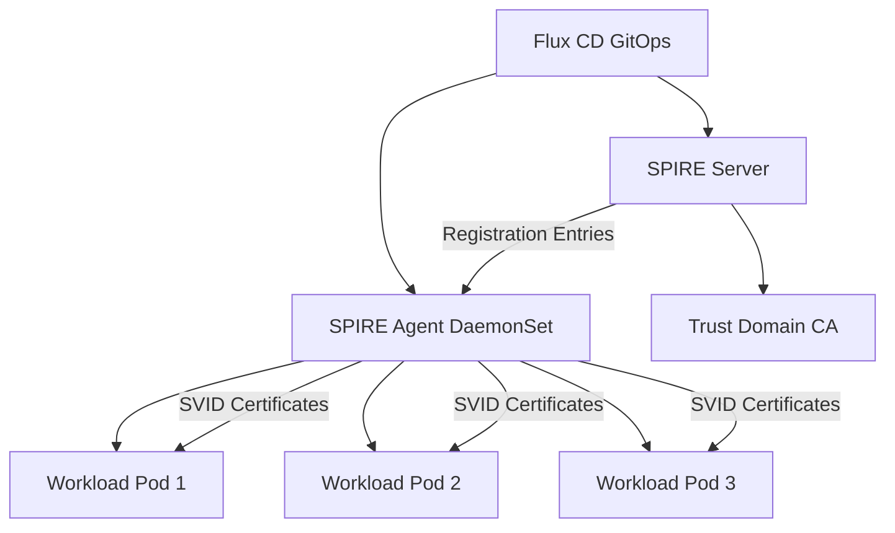

# How to Deploy SPIFFE/SPIRE with Flux CD

Author: [nawazdhandala](https://github.com/nawazdhandala)

Tags: flux cd, spiffe, spire, kubernetes, security, zero trust, service identity, gitops

Description: A practical guide to deploying SPIFFE/SPIRE on Kubernetes using Flux CD for workload identity and zero-trust service authentication.

---

## Introduction

SPIFFE (Secure Production Identity Framework for Everyone) provides a standard for identifying and securing communications between workloads. SPIRE (SPIFFE Runtime Environment) is the reference implementation that issues SPIFFE IDs and manages X.509 certificates or JWT tokens for workload authentication.

Deploying SPIRE with Flux CD gives you a GitOps-managed zero-trust identity infrastructure. This guide covers installing the SPIRE server, agents, and configuring workload registration.

## Prerequisites

Before getting started, ensure you have:

- A Kubernetes cluster (v1.25+)
- Flux CD installed and bootstrapped
- kubectl and flux CLI tools installed
- Understanding of SPIFFE concepts (trust domains, SPIFFE IDs)

## Architecture Overview



## Repository Structure

```
clusters/
  my-cluster/
    spire/
      namespace.yaml
      helmrepository.yaml
      spire-server-helmrelease.yaml
      spire-agent-helmrelease.yaml
      cluster-spiffe-id.yaml
      kustomization.yaml
```

## Step 1: Create the Namespace

```yaml
# clusters/my-cluster/spire/namespace.yaml
apiVersion: v1
kind: Namespace
metadata:
  name: spire-system
  labels:
    app.kubernetes.io/managed-by: flux
    # Pod security standard for SPIRE components
    pod-security.kubernetes.io/enforce: privileged
```

## Step 2: Add the SPIRE Helm Repository

```yaml
# clusters/my-cluster/spire/helmrepository.yaml
apiVersion: source.toolkit.fluxcd.io/v1
kind: HelmRepository
metadata:
  name: spiffe
  namespace: spire-system
spec:
  interval: 1h
  # Official SPIFFE Helm chart repository
  url: https://spiffe.github.io/helm-charts-hardened/
```

## Step 3: Deploy the SPIRE Server

The SPIRE Server is the central authority that manages identities and issues SVIDs.

```yaml
# clusters/my-cluster/spire/spire-server-helmrelease.yaml
apiVersion: helm.toolkit.fluxcd.io/v1
kind: HelmRelease
metadata:
  name: spire-server
  namespace: spire-system
spec:
  interval: 30m
  chart:
    spec:
      chart: spire
      version: "0.21.x"
      sourceRef:
        kind: HelmRepository
        name: spiffe
        namespace: spire-system
      interval: 12h
  values:
    # Global settings for the SPIRE deployment
    global:
      spire:
        # The trust domain defines the scope of identity
        trustDomain: "example.org"
        # Cluster name used in SPIFFE IDs
        clusterName: "my-cluster"
        # Enable strict mode for security
        strictMode: true

    # SPIRE Server configuration
    spire-server:
      enabled: true
      replicas: 3

      # Data store configuration
      dataStore:
        sql:
          # Use PostgreSQL for production deployments
          databaseType: postgres
          connectionString: "dbname=spire host=postgres.spire-system.svc port=5432 sslmode=require"

      # CA configuration
      ca:
        # Key type for the root CA
        keyType: "ec-p256"
        # TTL for the CA certificate
        ttl: "720h"

      # Node attestation configuration
      nodeAttestor:
        k8sPsat:
          enabled: true
          # Service account allow list for agent attestation
          serviceAccountAllowList:
            - "spire-system:spire-agent"

      # Controller manager for automatic registration
      controllerManager:
        enabled: true
        # Watch namespaces for workload registration
        watchedNamespaces:
          - "default"
          - "app-namespace"

      resources:
        requests:
          cpu: 200m
          memory: 256Mi
        limits:
          cpu: 1000m
          memory: 512Mi

      # Persistence for the data store
      persistence:
        enabled: true
        size: 1Gi
        storageClass: standard

    # SPIRE Agent configuration
    spire-agent:
      enabled: true

      # Agent runs as a DaemonSet on every node
      resources:
        requests:
          cpu: 100m
          memory: 128Mi
        limits:
          cpu: 500m
          memory: 256Mi

      # Socket path for workload API
      socketPath: /run/spire/agent-sockets/spire-agent.sock

      # Workload attestor configuration
      workloadAttestor:
        k8s:
          enabled: true
          # Disable container selectors if not needed
          disableContainerSelectors: false
          # Verify the pod service account
          verifyServiceAccount: true

    # SPIFFE CSI Driver for mounting SVID certificates
    spiffe-csi-driver:
      enabled: true

    # OIDC Discovery Provider for federation
    spiffe-oidc-discovery-provider:
      enabled: true
```

## Step 4: Create ClusterSPIFFEID Resources

Register workloads to receive SPIFFE identities.

```yaml
# clusters/my-cluster/spire/cluster-spiffe-id.yaml
apiVersion: spire.spiffe.io/v1alpha1
kind: ClusterSPIFFEID
metadata:
  name: default-workloads
spec:
  # SPIFFE ID template using Kubernetes metadata
  spiffeIDTemplate: "spiffe://example.org/ns/{{ .PodMeta.Namespace }}/sa/{{ .PodSpec.ServiceAccountName }}"
  # Selector to match pods that should receive this identity
  podSelector:
    matchLabels:
      spiffe.io/identity: "true"
  # Namespaces where this identity applies
  namespaceSelector:
    matchExpressions:
      - key: kubernetes.io/metadata.name
        operator: In
        values:
          - default
          - app-namespace
  # TTL for the issued SVIDs
  ttl: "1h"
  # DNS names to include in the X.509 SVID
  dnsNameTemplates:
    - "{{ .PodMeta.Name }}.{{ .PodMeta.Namespace }}.svc.cluster.local"
```

## Step 5: Configure a Workload to Use SPIFFE Identity

Here is an example workload that consumes SPIFFE identities via the CSI driver.

```yaml
# clusters/my-cluster/apps/example-workload.yaml
apiVersion: apps/v1
kind: Deployment
metadata:
  name: my-secure-app
  namespace: default
  labels:
    app: my-secure-app
    # Label required for ClusterSPIFFEID matching
    spiffe.io/identity: "true"
spec:
  replicas: 2
  selector:
    matchLabels:
      app: my-secure-app
  template:
    metadata:
      labels:
        app: my-secure-app
        spiffe.io/identity: "true"
    spec:
      serviceAccountName: my-secure-app
      containers:
        - name: app
          image: my-secure-app:latest
          ports:
            - containerPort: 8443
          # Mount the SPIFFE workload API socket
          volumeMounts:
            - name: spiffe-workload-api
              mountPath: /spiffe-workload-api
              readOnly: true
          env:
            # Tell the application where to find the SPIFFE socket
            - name: SPIFFE_ENDPOINT_SOCKET
              value: "unix:///spiffe-workload-api/spire-agent.sock"
      volumes:
        # Use the SPIFFE CSI driver to mount the workload API
        - name: spiffe-workload-api
          csi:
            driver: "csi.spiffe.io"
            readOnly: true
```

## Step 6: Federation Configuration

To federate with another SPIRE trust domain:

```yaml
# clusters/my-cluster/spire/federation.yaml
apiVersion: spire.spiffe.io/v1alpha1
kind: ClusterFederatedTrustDomain
metadata:
  name: partner-org
spec:
  # The foreign trust domain to federate with
  trustDomain: "partner.org"
  # SPIFFE bundle endpoint for the remote trust domain
  bundleEndpointURL: "https://spire.partner.org:8443"
  # How the bundle endpoint is secured
  bundleEndpointProfile:
    type: https_spiffe
    endpointSPIFFEID: "spiffe://partner.org/spire/server"
  # Trust domain bundle refresh interval
  trustDomainBundle: ""
```

## Step 7: Add the Flux Kustomization

```yaml
# clusters/my-cluster/spire/kustomization.yaml
apiVersion: kustomize.toolkit.fluxcd.io/v1
kind: Kustomization
metadata:
  name: spire
  namespace: flux-system
spec:
  interval: 10m
  path: ./clusters/my-cluster/spire
  prune: true
  sourceRef:
    kind: GitRepository
    name: flux-system
  wait: true
  timeout: 10m
  # SPIRE components need time to initialize
  healthChecks:
    - apiVersion: apps/v1
      kind: StatefulSet
      name: spire-server
      namespace: spire-system
    - apiVersion: apps/v1
      kind: DaemonSet
      name: spire-agent
      namespace: spire-system
```

## Verifying the Deployment

```bash
# Check SPIRE Server pods are running
kubectl get pods -n spire-system -l app.kubernetes.io/name=spire-server

# Check SPIRE Agent DaemonSet
kubectl get daemonset -n spire-system -l app.kubernetes.io/name=spire-agent

# Verify the SPIRE Server health
kubectl exec -n spire-system spire-server-0 -- \
  /opt/spire/bin/spire-server healthcheck

# List registered entries
kubectl exec -n spire-system spire-server-0 -- \
  /opt/spire/bin/spire-server entry show

# Check SPIRE Agent health on a node
kubectl exec -n spire-system $(kubectl get pods -n spire-system -l app.kubernetes.io/name=spire-agent -o jsonpath='{.items[0].metadata.name}') -- \
  /opt/spire/bin/spire-agent healthcheck

# Verify a workload received its SVID
kubectl exec -n default deploy/my-secure-app -- \
  ls /spiffe-workload-api/
```

## Troubleshooting

```bash
# Check SPIRE Server logs for registration issues
kubectl logs -n spire-system -l app.kubernetes.io/name=spire-server --tail=50

# Check SPIRE Agent logs for attestation issues
kubectl logs -n spire-system -l app.kubernetes.io/name=spire-agent --tail=50

# Verify the CSI driver is installed
kubectl get csidriver csi.spiffe.io

# Check ClusterSPIFFEID status
kubectl get clusterspiffeid -o yaml

# Debug workload attestation
kubectl exec -n spire-system $(kubectl get pods -n spire-system -l app.kubernetes.io/name=spire-agent -o jsonpath='{.items[0].metadata.name}') -- \
  /opt/spire/bin/spire-agent api fetch x509 -socketPath /run/spire/agent-sockets/spire-agent.sock
```

## Security Considerations

- Always use a production-grade data store (PostgreSQL) for the SPIRE Server
- Keep SVID TTLs short (1 hour or less) to limit the impact of compromised credentials
- Enable strict mode to enforce security policies
- Use namespace selectors to limit which workloads can receive identities
- Regularly rotate the root CA and plan for key ceremonies
- Monitor SPIRE health with Prometheus metrics and set up alerts
- Use network policies to restrict access to the SPIRE Agent socket

## Conclusion

Deploying SPIFFE/SPIRE with Flux CD provides a GitOps-managed zero-trust identity layer for your Kubernetes workloads. With automatic workload registration via the controller manager and SVID distribution via the CSI driver, your applications can establish mutual TLS without managing certificates manually. Flux CD ensures the entire identity infrastructure is version-controlled, auditable, and consistently deployed across clusters.
