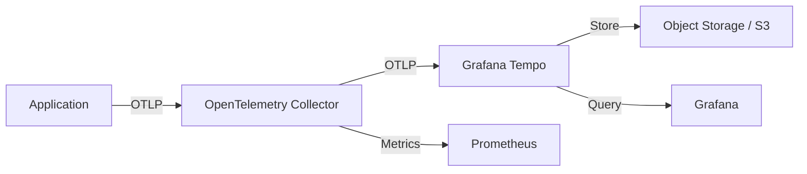

# How to Deploy Tracing Stack with Flux CD

Author: [nawazdhandala](https://github.com/nawazdhandala)

Tags: flux cd, tracing, tempo, opentelemetry, jaeger, kubernetes, gitops, observability

Description: A hands-on guide to deploying a distributed tracing stack with Grafana Tempo and OpenTelemetry Collector using Flux CD.

---

## Introduction

Distributed tracing is the third pillar of observability alongside metrics and logging. It allows you to follow a request as it travels through multiple services, helping you identify bottlenecks, errors, and latency issues. Grafana Tempo provides a scalable, cost-effective tracing backend that integrates seamlessly with Grafana for visualization.

This guide covers deploying Grafana Tempo with the OpenTelemetry Collector using Flux CD, creating a complete tracing pipeline managed through GitOps.

## Prerequisites

- A running Kubernetes cluster
- Flux CD installed and bootstrapped
- An S3-compatible object storage bucket for trace storage
- Applications instrumented with OpenTelemetry SDKs
- kubectl access to your cluster

## Architecture Overview



- **Applications** send traces via OTLP protocol to the OpenTelemetry Collector
- **OpenTelemetry Collector** processes, batches, and forwards traces to Tempo
- **Grafana Tempo** stores and indexes traces
- **Grafana** provides the UI for searching and visualizing traces

## Repository Structure

```
infrastructure/
  tracing/
    namespace.yaml
    helmrepository.yaml
    tempo-helmrelease.yaml
    otel-collector-helmrelease.yaml
    grafana-datasource.yaml
```

## Creating the Namespace

```yaml
# infrastructure/tracing/namespace.yaml
apiVersion: v1
kind: Namespace
metadata:
  name: tracing
  labels:
    monitoring: enabled
```

## Helm Repositories

```yaml
# infrastructure/tracing/helmrepository.yaml
apiVersion: source.toolkit.fluxcd.io/v1
kind: HelmRepository
metadata:
  name: grafana
  namespace: flux-system
spec:
  interval: 1h
  url: https://grafana.github.io/helm-charts
---
apiVersion: source.toolkit.fluxcd.io/v1
kind: HelmRepository
metadata:
  name: open-telemetry
  namespace: flux-system
spec:
  interval: 1h
  url: https://open-telemetry.github.io/opentelemetry-helm-charts
```

## Deploying Grafana Tempo

```yaml
# infrastructure/tracing/tempo-helmrelease.yaml
apiVersion: helm.toolkit.fluxcd.io/v1
kind: HelmRelease
metadata:
  name: tempo
  namespace: tracing
spec:
  interval: 30m
  chart:
    spec:
      chart: tempo
      version: "1.x"
      sourceRef:
        kind: HelmRepository
        name: grafana
        namespace: flux-system
  install:
    remediation:
      retries: 3
  upgrade:
    remediation:
      retries: 3
  values:
    tempo:
      # Receivers for ingesting traces
      receivers:
        otlp:
          protocols:
            # gRPC receiver on port 4317
            grpc:
              endpoint: "0.0.0.0:4317"
            # HTTP receiver on port 4318
            http:
              endpoint: "0.0.0.0:4318"
        # Jaeger protocol support for backward compatibility
        jaeger:
          protocols:
            thrift_http:
              endpoint: "0.0.0.0:14268"
            grpc:
              endpoint: "0.0.0.0:14250"
        # Zipkin protocol support
        zipkin:
          endpoint: "0.0.0.0:9411"
      # Storage configuration
      storage:
        trace:
          backend: s3
          s3:
            bucket: tempo-traces
            endpoint: s3.amazonaws.com
            region: us-east-1
          # Write-ahead log configuration
          wal:
            path: /var/tempo/wal
          # Local block storage
          local:
            path: /var/tempo/blocks
      # Retention settings
      retention: 336h  # 14 days
      # Global rate limits
      global_overrides:
        max_traces_per_user: 0  # unlimited
        max_bytes_per_trace: 5000000  # 5MB per trace
    # Persistence for WAL
    persistence:
      enabled: true
      size: 10Gi
      storageClassName: standard
    # Resource allocation
    resources:
      requests:
        cpu: 200m
        memory: 512Mi
      limits:
        cpu: "1"
        memory: 1Gi
    # Service account for S3 access
    serviceAccount:
      annotations:
        eks.amazonaws.com/role-arn: arn:aws:iam::123456789012:role/tempo-s3-access
```

## Deploying OpenTelemetry Collector

The OTel Collector acts as a central processing pipeline for traces.

```yaml
# infrastructure/tracing/otel-collector-helmrelease.yaml
apiVersion: helm.toolkit.fluxcd.io/v1
kind: HelmRelease
metadata:
  name: otel-collector
  namespace: tracing
spec:
  interval: 30m
  chart:
    spec:
      chart: opentelemetry-collector
      version: "0.90.x"
      sourceRef:
        kind: HelmRepository
        name: open-telemetry
        namespace: flux-system
  install:
    remediation:
      retries: 3
  values:
    # Deploy as a Deployment (gateway mode)
    mode: deployment
    replicaCount: 2
    # Resource allocation
    resources:
      requests:
        cpu: 200m
        memory: 256Mi
      limits:
        cpu: 500m
        memory: 512Mi
    # Collector configuration
    config:
      # Receivers: how the collector ingests data
      receivers:
        otlp:
          protocols:
            grpc:
              endpoint: "0.0.0.0:4317"
            http:
              endpoint: "0.0.0.0:4318"
      # Processors: transformations applied to data
      processors:
        # Batch traces before sending to reduce API calls
        batch:
          timeout: 5s
          send_batch_size: 1000
          send_batch_max_size: 1500
        # Add Kubernetes metadata to spans
        k8sattributes:
          auth_type: serviceAccount
          extract:
            metadata:
              - k8s.namespace.name
              - k8s.pod.name
              - k8s.deployment.name
              - k8s.node.name
          pod_association:
            - sources:
                - from: resource_attribute
                  name: k8s.pod.ip
        # Memory limiter to prevent OOM
        memory_limiter:
          check_interval: 1s
          limit_mib: 400
          spike_limit_mib: 100
        # Tail-based sampling to reduce volume
        tail_sampling:
          decision_wait: 10s
          num_traces: 100000
          policies:
            # Always keep error traces
            - name: errors
              type: status_code
              status_code:
                status_codes:
                  - ERROR
            # Always keep slow traces (> 2 seconds)
            - name: slow-traces
              type: latency
              latency:
                threshold_ms: 2000
            # Sample 10% of remaining traces
            - name: probabilistic
              type: probabilistic
              probabilistic:
                sampling_percentage: 10
      # Exporters: where the collector sends data
      exporters:
        # Send traces to Tempo
        otlp/tempo:
          endpoint: tempo.tracing.svc.cluster.local:4317
          tls:
            insecure: true
        # Export span metrics to Prometheus
        prometheus:
          endpoint: "0.0.0.0:8889"
          resource_to_telemetry_conversion:
            enabled: true
      # Service pipelines
      service:
        pipelines:
          traces:
            receivers:
              - otlp
            processors:
              - memory_limiter
              - k8sattributes
              - tail_sampling
              - batch
            exporters:
              - otlp/tempo
          # Generate metrics from traces (RED metrics)
          metrics:
            receivers:
              - otlp
            processors:
              - memory_limiter
              - batch
            exporters:
              - prometheus
    # Service monitor for Prometheus scraping
    ports:
      metrics:
        enabled: true
        containerPort: 8889
        servicePort: 8889
    serviceMonitor:
      enabled: true
      metricsEndpoints:
        - port: metrics
```

## OTel Collector DaemonSet for Node-Level Collection

For sidecar-less collection, deploy a DaemonSet collector on each node.

```yaml
# infrastructure/tracing/otel-daemonset-helmrelease.yaml
apiVersion: helm.toolkit.fluxcd.io/v1
kind: HelmRelease
metadata:
  name: otel-collector-agent
  namespace: tracing
spec:
  interval: 30m
  chart:
    spec:
      chart: opentelemetry-collector
      version: "0.90.x"
      sourceRef:
        kind: HelmRepository
        name: open-telemetry
        namespace: flux-system
  values:
    # Deploy as DaemonSet on every node
    mode: daemonset
    resources:
      requests:
        cpu: 100m
        memory: 128Mi
      limits:
        cpu: 250m
        memory: 256Mi
    config:
      receivers:
        otlp:
          protocols:
            grpc:
              endpoint: "0.0.0.0:4317"
            http:
              endpoint: "0.0.0.0:4318"
      processors:
        batch:
          timeout: 2s
          send_batch_size: 500
        memory_limiter:
          check_interval: 1s
          limit_mib: 200
      exporters:
        # Forward to the gateway collector
        otlp:
          endpoint: otel-collector-opentelemetry-collector.tracing.svc.cluster.local:4317
          tls:
            insecure: true
      service:
        pipelines:
          traces:
            receivers:
              - otlp
            processors:
              - memory_limiter
              - batch
            exporters:
              - otlp
```

## Grafana Datasource for Tempo

```yaml
# infrastructure/tracing/grafana-datasource.yaml
apiVersion: v1
kind: ConfigMap
metadata:
  name: tempo-grafana-datasource
  namespace: monitoring
  labels:
    grafana_datasource: "true"
data:
  tempo-datasource.yaml: |
    apiVersion: 1
    datasources:
      - name: Tempo
        type: tempo
        access: proxy
        uid: tempo
        url: http://tempo.tracing.svc.cluster.local:3100
        jsonData:
          # Link to Loki for logs correlation
          tracesToLogsV2:
            datasourceUid: loki
            spanStartTimeShift: "-1h"
            spanEndTimeShift: "1h"
            filterByTraceID: true
            filterBySpanID: false
            tags:
              - key: k8s.namespace.name
                value: namespace
              - key: k8s.pod.name
                value: pod
          # Link to Prometheus for metrics correlation
          tracesToMetrics:
            datasourceUid: prometheus
            spanStartTimeShift: "-1h"
            spanEndTimeShift: "1h"
            tags:
              - key: service.name
                value: service
          # Enable TraceQL search
          search:
            hide: false
          # Node graph visualization
          nodeGraph:
            enabled: true
          # Service graph
          serviceMap:
            datasourceUid: prometheus
```

## Flux Kustomization

```yaml
# clusters/my-cluster/tracing.yaml
apiVersion: kustomize.toolkit.fluxcd.io/v1
kind: Kustomization
metadata:
  name: tracing-stack
  namespace: flux-system
spec:
  interval: 15m
  path: ./infrastructure/tracing
  prune: true
  sourceRef:
    kind: GitRepository
    name: flux-system
  dependsOn:
    - name: monitoring-stack
  healthChecks:
    - apiVersion: apps/v1
      kind: StatefulSet
      name: tempo
      namespace: tracing
    - apiVersion: apps/v1
      kind: Deployment
      name: otel-collector-opentelemetry-collector
      namespace: tracing
  timeout: 10m
```

## Verifying the Deployment

```bash
# Check Flux reconciliation
flux get kustomizations tracing-stack
flux get helmreleases -n tracing

# Verify pods are running
kubectl get pods -n tracing

# Test sending a trace via OTLP HTTP
curl -X POST http://localhost:4318/v1/traces \
  -H "Content-Type: application/json" \
  -d '{
    "resourceSpans": [{
      "resource": {"attributes": [{"key": "service.name", "value": {"stringValue": "test-service"}}]},
      "scopeSpans": [{
        "spans": [{
          "traceId": "5b8aa5a2d2c872e8321cf37308d69df2",
          "spanId": "051581bf3cb55c13",
          "name": "test-span",
          "kind": 1,
          "startTimeUnixNano": "1704067200000000000",
          "endTimeUnixNano": "1704067201000000000"
        }]
      }]
    }]
  }'

# Access Grafana and navigate to the Explore view with Tempo datasource
kubectl port-forward -n monitoring svc/kube-prometheus-stack-grafana 3000:80
```

## Troubleshooting

- **No traces appearing in Tempo**: Check OTel Collector logs for export errors. Verify the Tempo endpoint is reachable from the collector
- **High memory usage in collector**: Adjust batch sizes and memory limiter settings. Consider increasing tail sampling rates
- **Traces missing spans**: Ensure context propagation is configured correctly in your application. Check that all services use the same trace format
- **Slow queries in Grafana**: Add search tags to Tempo configuration for frequently queried attributes

## Conclusion

Deploying a tracing stack with Flux CD brings the same GitOps benefits to observability that you enjoy for application deployments. The combination of OpenTelemetry Collector for flexible data collection and Grafana Tempo for cost-effective storage provides a production-ready tracing solution. With tail-based sampling and automatic Kubernetes metadata enrichment, you get meaningful trace data without overwhelming your storage backend.
