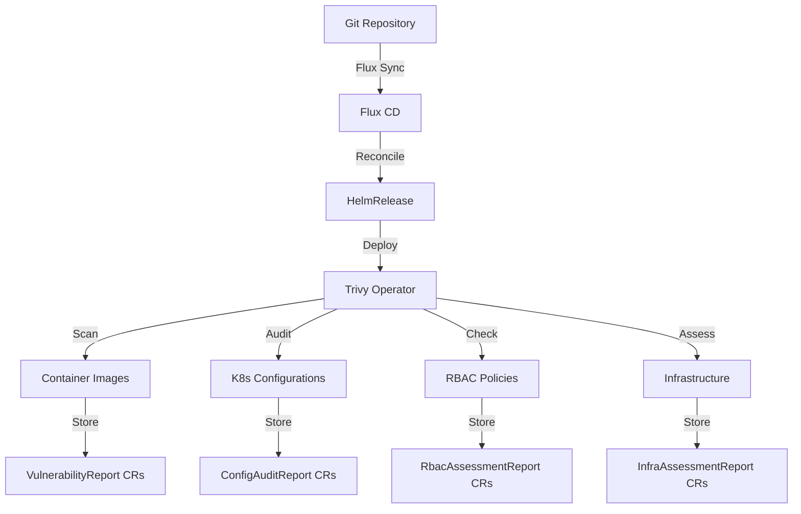

# How to Deploy Trivy Operator with Flux CD

Author: [nawazdhandala](https://github.com/nawazdhandala)

Tags: flux cd, trivy, vulnerability scanning, kubernetes, gitops, security, container security

Description: A practical guide to deploying Trivy Operator on Kubernetes using Flux CD for automated vulnerability scanning and compliance checks.

---

## Introduction

Trivy Operator is a Kubernetes-native security tool that automates vulnerability scanning, configuration auditing, and compliance checks for your cluster workloads. Built on top of Aqua Security's Trivy scanner, it continuously scans container images, Kubernetes resources, and infrastructure components, storing results as Kubernetes custom resources.

This guide demonstrates how to deploy Trivy Operator on Kubernetes using Flux CD, enabling automated security scanning driven by GitOps workflows.

## Prerequisites

Before starting, ensure you have:

- A Kubernetes cluster (v1.26 or later)
- Flux CD installed and bootstrapped
- kubectl configured for your cluster
- A Git repository connected to Flux CD

## Architecture Overview



## Step 1: Create the Namespace

Define a namespace for Trivy Operator.

```yaml
# trivy-namespace.yaml
# Dedicated namespace for Trivy Operator
apiVersion: v1
kind: Namespace
metadata:
  name: trivy-system
  labels:
    app.kubernetes.io/managed-by: flux
    app.kubernetes.io/name: trivy-operator
```

## Step 2: Add the Aqua Security Helm Repository

Register the Aqua Security Helm repository.

```yaml
# trivy-helmrepo.yaml
# Aqua Security Helm repository for Trivy Operator
apiVersion: source.toolkit.fluxcd.io/v1
kind: HelmRepository
metadata:
  name: aqua-security
  namespace: trivy-system
spec:
  interval: 1h
  url: https://aquasecurity.github.io/helm-charts/
```

## Step 3: Create the HelmRelease

Deploy Trivy Operator with comprehensive scanning enabled.

```yaml
# trivy-helmrelease.yaml
# Deploys Trivy Operator via Flux CD
apiVersion: helm.toolkit.fluxcd.io/v2
kind: HelmRelease
metadata:
  name: trivy-operator
  namespace: trivy-system
spec:
  interval: 30m
  chart:
    spec:
      chart: trivy-operator
      version: "0.24.x"
      sourceRef:
        kind: HelmRepository
        name: aqua-security
        namespace: trivy-system
      interval: 12h
  values:
    # Operator configuration
    operator:
      # Scan all namespaces
      scanJobsConcurrentLimit: 10
      # Automatically scan new workloads
      vulnerabilityScannerEnabled: true
      configAuditScannerEnabled: true
      rbacAssessmentScannerEnabled: true
      infraAssessmentScannerEnabled: true
      exposedSecretScannerEnabled: true
      # Scan schedule (every 24 hours)
      scanJobTTL: 30m
      # Namespaces to exclude from scanning
      excludeNamespaces: "kube-system,kube-public,kube-node-lease"

    # Trivy scanner configuration
    trivy:
      # Use Standalone mode (no server required)
      mode: Standalone
      # Severity levels to report
      severity: "UNKNOWN,LOW,MEDIUM,HIGH,CRITICAL"
      # Scan timeout
      timeout: 10m0s
      # Resource limits for scan jobs
      resources:
        requests:
          cpu: 100m
          memory: 256Mi
        limits:
          cpu: 500m
          memory: 512Mi
      # Vulnerability database update settings
      dbRepository: ghcr.io/aquasecurity/trivy-db
      dbRepositoryInsecure: false
      # Use built-in policies for config auditing
      useBuiltinPolicies: true
      # Ignore unfixed vulnerabilities
      ignoreUnfixed: false

    # Operator pod resources
    resources:
      requests:
        cpu: 100m
        memory: 128Mi
      limits:
        cpu: 500m
        memory: 512Mi

    # Service account configuration
    serviceAccount:
      create: true
      name: trivy-operator

    # Node selector for operator pod
    nodeSelector: {}

    # Tolerations
    tolerations: []

    # Metrics and monitoring
    serviceMonitor:
      enabled: true
      interval: 60s
      labels:
        release: prometheus
```

## Step 4: Configure Private Registry Scanning

If you use private container registries, configure access credentials.

```yaml
# trivy-registry-secret.yaml
# Secret for private registry authentication
# Use sealed-secrets or SOPS in production
apiVersion: v1
kind: Secret
metadata:
  name: trivy-registry-credentials
  namespace: trivy-system
type: Opaque
stringData:
  # Docker config for private registry access
  docker-config.json: |
    {
      "auths": {
        "registry.example.com": {
          "username": "scanner",
          "password": "your-registry-password",
          "auth": "base64-encoded-credentials"
        },
        "ghcr.io": {
          "username": "github-user",
          "password": "ghp_your-github-token"
        }
      }
    }
```

## Step 5: Create Custom Compliance Policies

Define custom compliance policies using ConfigMap.

```yaml
# trivy-custom-policies.yaml
# Custom compliance policies for Trivy Operator
apiVersion: v1
kind: ConfigMap
metadata:
  name: trivy-operator-custom-policies
  namespace: trivy-system
  labels:
    app.kubernetes.io/managed-by: flux
data:
  # Custom policy to enforce read-only root filesystem
  policy.readonly_rootfs.rego: |
    package appshield.kubernetes.KSV014

    import data.lib.kubernetes
    import data.lib.result

    __rego_metadata__ := {
      "id": "KSV014",
      "title": "Root file system is not read-only",
      "description": "Container should use a read-only root file system",
      "severity": "HIGH",
      "type": "Kubernetes Security Check",
    }

    deny[res] {
      container := kubernetes.containers[_]
      not container.securityContext.readOnlyRootFilesystem == true
      res := result.new(
        sprintf("Container '%s' should set readOnlyRootFilesystem to true", [container.name]),
        container,
      )
    }

  # Custom policy to require resource limits
  policy.resource_limits.rego: |
    package appshield.kubernetes.KSV015

    import data.lib.kubernetes
    import data.lib.result

    __rego_metadata__ := {
      "id": "KSV015",
      "title": "CPU and memory limits not set",
      "description": "All containers should have CPU and memory limits",
      "severity": "MEDIUM",
      "type": "Kubernetes Security Check",
    }

    deny[res] {
      container := kubernetes.containers[_]
      not container.resources.limits.cpu
      res := result.new(
        sprintf("Container '%s' should set CPU limits", [container.name]),
        container,
      )
    }

    deny[res] {
      container := kubernetes.containers[_]
      not container.resources.limits.memory
      res := result.new(
        sprintf("Container '%s' should set memory limits", [container.name]),
        container,
      )
    }
```

## Step 6: Set Up Alert Rules

Create PrometheusRule for alerting on critical vulnerabilities.

```yaml
# trivy-alertrules.yaml
# Prometheus alert rules for Trivy vulnerability findings
apiVersion: monitoring.coreos.com/v1
kind: PrometheusRule
metadata:
  name: trivy-vulnerability-alerts
  namespace: trivy-system
  labels:
    release: prometheus
spec:
  groups:
    - name: trivy-vulnerability-alerts
      rules:
        # Alert on critical vulnerabilities
        - alert: CriticalVulnerabilityFound
          expr: >
            trivy_image_vulnerabilities{severity="Critical"} > 0
          for: 5m
          labels:
            severity: critical
          annotations:
            summary: "Critical vulnerability found in {{ $labels.image_repository }}"
            description: >
              Image {{ $labels.image_repository }}:{{ $labels.image_tag }}
              in namespace {{ $labels.namespace }} has {{ $value }} critical vulnerabilities.

        # Alert on high vulnerabilities
        - alert: HighVulnerabilityFound
          expr: >
            trivy_image_vulnerabilities{severity="High"} > 5
          for: 15m
          labels:
            severity: warning
          annotations:
            summary: "Multiple high vulnerabilities in {{ $labels.image_repository }}"
            description: >
              Image {{ $labels.image_repository }}:{{ $labels.image_tag }}
              has {{ $value }} high severity vulnerabilities.

        # Alert on config audit failures
        - alert: ConfigAuditCriticalFailure
          expr: >
            trivy_resource_configaudits{severity="Critical"} > 0
          for: 5m
          labels:
            severity: warning
          annotations:
            summary: "Critical config audit failure in {{ $labels.namespace }}/{{ $labels.name }}"
            description: "Resource has {{ $value }} critical configuration issues."
```

## Step 7: Add Network Policies

Secure Trivy Operator network access.

```yaml
# trivy-networkpolicy.yaml
# Network policy for Trivy Operator
apiVersion: networking.k8s.io/v1
kind: NetworkPolicy
metadata:
  name: trivy-operator-policy
  namespace: trivy-system
spec:
  podSelector:
    matchLabels:
      app.kubernetes.io/name: trivy-operator
  policyTypes:
    - Ingress
    - Egress
  ingress:
    # Allow metrics scraping from Prometheus
    - from:
        - namespaceSelector:
            matchLabels:
              name: monitoring
      ports:
        - protocol: TCP
          port: 8080
  egress:
    # Allow DNS resolution
    - ports:
        - protocol: UDP
          port: 53
    # Allow HTTPS for pulling vulnerability databases and scanning images
    - ports:
        - protocol: TCP
          port: 443
    # Allow communication with Kubernetes API server
    - ports:
        - protocol: TCP
          port: 6443
```

## Step 8: Set Up the Flux Kustomization

Organize all resources with a Flux Kustomization.

```yaml
# kustomization.yaml
# Flux Kustomization for Trivy Operator
apiVersion: kustomize.toolkit.fluxcd.io/v1
kind: Kustomization
metadata:
  name: trivy-operator
  namespace: flux-system
spec:
  interval: 10m
  targetNamespace: trivy-system
  sourceRef:
    kind: GitRepository
    name: flux-system
  path: ./clusters/my-cluster/trivy
  prune: true
  healthChecks:
    - apiVersion: apps/v1
      kind: Deployment
      name: trivy-operator
      namespace: trivy-system
  timeout: 5m
```

## Step 9: Verify the Deployment

After pushing to Git, verify Trivy Operator is working.

```bash
# Check Flux reconciliation
flux get helmreleases -n trivy-system

# Verify the operator is running
kubectl get pods -n trivy-system

# Check CRDs are installed
kubectl get crds | grep aquasecurity

# List vulnerability reports
kubectl get vulnerabilityreports -A

# View a specific vulnerability report
kubectl get vulnerabilityreports -n default -o yaml | head -100

# List config audit reports
kubectl get configauditreports -A

# Check RBAC assessment reports
kubectl get rbacassessmentreports -A

# View critical vulnerabilities across the cluster
kubectl get vulnerabilityreports -A -o json | \
  jq '.items[] | select(.report.summary.criticalCount > 0) |
  {namespace: .metadata.namespace, name: .metadata.name, critical: .report.summary.criticalCount}'
```

## Troubleshooting

Common issues and solutions:

```bash
# Check operator logs
kubectl logs -n trivy-system deploy/trivy-operator --tail=100

# Verify scan jobs are running
kubectl get jobs -n trivy-system

# Check failed scan jobs
kubectl get jobs -n trivy-system --field-selector status.successful=0

# View scan job logs
kubectl logs -n trivy-system job/scan-vulnerabilityreport-xxx

# Force a rescan by deleting existing reports
kubectl delete vulnerabilityreports -n default --all

# Check Flux errors
kubectl describe helmrelease trivy-operator -n trivy-system
```

## Conclusion

You have successfully deployed Trivy Operator on Kubernetes using Flux CD. The operator now continuously scans your workloads for vulnerabilities, configuration issues, RBAC problems, and exposed secrets. With Prometheus integration and alert rules, you will be immediately notified of critical security findings. The GitOps approach ensures your security scanning configuration is version-controlled and consistently applied across environments.
