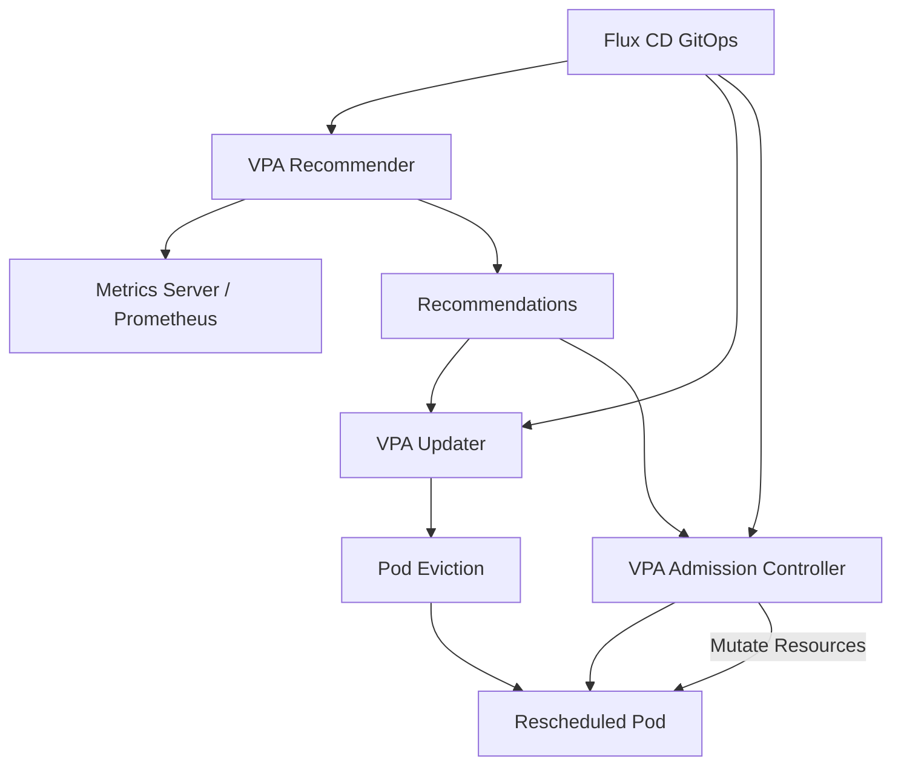

# How to Deploy VPA (Vertical Pod Autoscaler) with Flux CD

Author: [nawazdhandala](https://github.com/nawazdhandala)

Tags: Flux CD, VPA, Vertical Pod Autoscaler, Kubernetes, Resource Management, Autoscaling, GitOps

Description: A practical guide to deploying the Vertical Pod Autoscaler on Kubernetes using Flux CD for automatic resource right-sizing of workloads.

---

## Introduction

The Vertical Pod Autoscaler (VPA) automatically adjusts the CPU and memory requests and limits of containers based on actual usage. While the Horizontal Pod Autoscaler (HPA) scales the number of pod replicas, VPA scales the resources allocated to each pod. This is essential for workloads where adding more replicas does not help (such as single-threaded applications or databases) or where resource requests need to track changing patterns.

This guide covers deploying VPA with Flux CD and configuring it for different operational modes.

## Prerequisites

- A Kubernetes cluster (v1.25+)
- Flux CD installed and bootstrapped
- Metrics Server installed in the cluster
- kubectl and flux CLI tools installed

## Architecture Overview



## Repository Structure

```text
clusters/
  my-cluster/
    vpa/
      namespace.yaml
      helmrepository.yaml
      helmrelease.yaml
      vpa-resources/
        recommendation-only.yaml
        auto-update.yaml
        initial-only.yaml
      kustomization.yaml
```

## Step 1: Create the Namespace

```yaml
# clusters/my-cluster/vpa/namespace.yaml
apiVersion: v1
kind: Namespace
metadata:
  name: vpa
  labels:
    app.kubernetes.io/managed-by: flux
```

## Step 2: Add the Helm Repository

```yaml
# clusters/my-cluster/vpa/helmrepository.yaml
apiVersion: source.toolkit.fluxcd.io/v1
kind: HelmRepository
metadata:
  name: fairwinds-stable
  namespace: vpa
spec:
  interval: 1h
  # Fairwinds hosts the community VPA Helm chart
  url: https://charts.fairwinds.com/stable
```

## Step 3: Deploy VPA with HelmRelease

```yaml
# clusters/my-cluster/vpa/helmrelease.yaml
apiVersion: helm.toolkit.fluxcd.io/v2
kind: HelmRelease
metadata:
  name: vpa
  namespace: vpa
spec:
  interval: 30m
  chart:
    spec:
      chart: vpa
      version: "4.7.x"
      sourceRef:
        kind: HelmRepository
        name: fairwinds-stable
        namespace: vpa
      interval: 12h
  values:
    # Recommender analyzes metrics and generates recommendations
    recommender:
      enabled: true
      replicas: 1
      resources:
        requests:
          cpu: 50m
          memory: 256Mi
        limits:
          cpu: 500m
          memory: 1Gi
      extraArgs:
        # Use Prometheus for historical data (recommended for production)
        storage: prometheus
        prometheus-address: http://prometheus-server.monitoring.svc:9090
        # How often to check pods for recommendations
        recommender-interval: "1m"
        # Safety margin above actual usage (15%)
        recommendation-margin-fraction: "0.15"
        # Minimum CPU recommendation in millicores
        pod-recommendation-min-cpu-millicores: 15
        # Minimum memory recommendation in MB
        pod-recommendation-min-memory-mb: 64
        # How many days of metrics to consider
        memory-saver: "true"
        # OOM bump-up factor
        oom-bump-up-ratio: "1.2"
        # Minimum OOM memory increase in bytes
        oom-min-bump-up-bytes: 104857600

    # Updater evicts pods to apply new resource recommendations
    updater:
      enabled: true
      replicas: 1
      resources:
        requests:
          cpu: 50m
          memory: 128Mi
        limits:
          cpu: 250m
          memory: 256Mi
      extraArgs:
        # Minimum time between two consecutive evictions
        eviction-tolerance: "0.5"
        # Minimum change needed to trigger eviction (10%)
        min-replicas: 2
        # How often to run the update loop
        updater-interval: "1m"
        # Eviction rate limit
        eviction-rate-limit: "-1"
        # Eviction rate burst
        eviction-rate-burst: "1"

    # Admission controller mutates pod resources at creation time
    admissionController:
      enabled: true
      replicas: 2
      resources:
        requests:
          cpu: 50m
          memory: 64Mi
        limits:
          cpu: 250m
          memory: 128Mi
      # Generate TLS certificates for the webhook
      certGen:
        enabled: true

    # Metrics and monitoring
    metrics:
      serviceMonitor:
        enabled: true
```

## Step 4: VPA in Recommendation-Only Mode

Use "Off" mode to get recommendations without automatic updates.

```yaml
# clusters/my-cluster/vpa/vpa-resources/recommendation-only.yaml
apiVersion: autoscaling.k8s.io/v1
kind: VerticalPodAutoscaler
metadata:
  name: web-api-vpa
  namespace: default
spec:
  # Target the deployment to provide recommendations for
  targetRef:
    apiVersion: apps/v1
    kind: Deployment
    name: web-api
  # Update policy controls how VPA applies recommendations
  updatePolicy:
    # "Off" mode: only provide recommendations, no automatic updates
    updateMode: "Off"
  # Resource policy to constrain recommendations
  resourcePolicy:
    containerPolicies:
      - containerName: api
        # Minimum allowed resources
        minAllowed:
          cpu: 50m
          memory: 64Mi
        # Maximum allowed resources
        maxAllowed:
          cpu: 4000m
          memory: 8Gi
        # Control which resources VPA manages
        controlledResources: ["cpu", "memory"]
        # Control both requests and limits
        controlledValues: RequestsAndLimits
      # Exclude sidecar containers from VPA management
      - containerName: istio-proxy
        mode: "Off"
```

## Step 5: VPA with Auto Update Mode

Use "Auto" mode for VPA to automatically adjust resources.

```yaml
# clusters/my-cluster/vpa/vpa-resources/auto-update.yaml
apiVersion: autoscaling.k8s.io/v1
kind: VerticalPodAutoscaler
metadata:
  name: batch-worker-vpa
  namespace: default
spec:
  targetRef:
    apiVersion: apps/v1
    kind: Deployment
    name: batch-worker
  updatePolicy:
    # "Auto" mode: VPA will evict pods and set new resources
    updateMode: "Auto"
    # Minimum number of replicas that must be available during updates
    minReplicas: 2
  resourcePolicy:
    containerPolicies:
      - containerName: worker
        minAllowed:
          cpu: 100m
          memory: 128Mi
        maxAllowed:
          cpu: 8000m
          memory: 16Gi
        controlledResources: ["cpu", "memory"]
        controlledValues: RequestsAndLimits
```

## Step 6: VPA with Initial Mode

Use "Initial" mode to set resources only at pod creation, without evictions.

```yaml
# clusters/my-cluster/vpa/vpa-resources/initial-only.yaml
apiVersion: autoscaling.k8s.io/v1
kind: VerticalPodAutoscaler
metadata:
  name: stateful-app-vpa
  namespace: default
spec:
  targetRef:
    apiVersion: apps/v1
    kind: StatefulSet
    name: stateful-app
  updatePolicy:
    # "Initial" mode: set resources only at pod creation, no evictions
    updateMode: "Initial"
  resourcePolicy:
    containerPolicies:
      - containerName: app
        minAllowed:
          cpu: 250m
          memory: 256Mi
        maxAllowed:
          cpu: 4000m
          memory: 8Gi
        controlledResources: ["cpu", "memory"]
        controlledValues: RequestsOnly
```

## Step 7: VPA with HPA Coexistence

When using VPA alongside HPA, configure them to manage different resources.

```yaml
# clusters/my-cluster/vpa/vpa-resources/vpa-with-hpa.yaml
apiVersion: autoscaling.k8s.io/v1
kind: VerticalPodAutoscaler
metadata:
  name: api-server-vpa
  namespace: default
spec:
  targetRef:
    apiVersion: apps/v1
    kind: Deployment
    name: api-server
  updatePolicy:
    updateMode: "Auto"
  resourcePolicy:
    containerPolicies:
      - containerName: api
        # Only manage memory - let HPA handle CPU-based scaling
        controlledResources: ["memory"]
        minAllowed:
          memory: 128Mi
        maxAllowed:
          memory: 4Gi
        controlledValues: RequestsAndLimits
---
# HPA manages horizontal scaling based on CPU
apiVersion: autoscaling/v2
kind: HorizontalPodAutoscaler
metadata:
  name: api-server-hpa
  namespace: default
spec:
  scaleTargetRef:
    apiVersion: apps/v1
    kind: Deployment
    name: api-server
  minReplicas: 2
  maxReplicas: 10
  metrics:
    - type: Resource
      resource:
        name: cpu
        target:
          type: Utilization
          # Scale when CPU exceeds 70%
          averageUtilization: 70
  behavior:
    scaleDown:
      stabilizationWindowSeconds: 300
```

## Step 8: Pod Disruption Budget for VPA Updates

Protect workloads during VPA-triggered evictions.

```yaml
# clusters/my-cluster/vpa/vpa-resources/pdb.yaml
apiVersion: policy/v1
kind: PodDisruptionBudget
metadata:
  name: batch-worker-pdb
  namespace: default
spec:
  # Ensure at least half the replicas remain during VPA updates
  minAvailable: "50%"
  selector:
    matchLabels:
      app: batch-worker
```

## Step 9: Flux Kustomization

```yaml
# clusters/my-cluster/vpa/kustomization.yaml
apiVersion: kustomize.toolkit.fluxcd.io/v1
kind: Kustomization
metadata:
  name: vpa
  namespace: flux-system
spec:
  interval: 10m
  path: ./clusters/my-cluster/vpa
  prune: true
  sourceRef:
    kind: GitRepository
    name: flux-system
  wait: true
  timeout: 5m
  healthChecks:
    - apiVersion: apps/v1
      kind: Deployment
      name: vpa-recommender
      namespace: vpa
    - apiVersion: apps/v1
      kind: Deployment
      name: vpa-updater
      namespace: vpa
    - apiVersion: apps/v1
      kind: Deployment
      name: vpa-admission-controller
      namespace: vpa
```

## Verifying the Deployment

```bash
# Check VPA component pods
kubectl get pods -n vpa

# List all VPA objects and their recommendations
kubectl get vpa -A

# View detailed recommendations for a specific VPA
kubectl describe vpa web-api-vpa -n default

# Check the recommendation values
kubectl get vpa web-api-vpa -n default -o jsonpath='{.status.recommendation.containerRecommendations}' | jq .

# Verify the admission controller webhook
kubectl get mutatingwebhookconfigurations | grep vpa

# Check VPA events for update activity
kubectl get events -n default --field-selector reason=EvictedByVPA
```

## Troubleshooting

```bash
# Check recommender logs for metric collection issues
kubectl logs -n vpa -l app=vpa-recommender --tail=30

# Check updater logs for eviction issues
kubectl logs -n vpa -l app=vpa-updater --tail=30

# Check admission controller logs
kubectl logs -n vpa -l app=vpa-admission-controller --tail=30

# Verify metrics server is providing data
kubectl top pods -n default

# Check if VPA CRDs are installed
kubectl get crd | grep verticalpodautoscaler

# Debug a VPA that shows no recommendations
kubectl describe vpa web-api-vpa -n default | grep -A20 "Status"
```

## Best Practices

- Start with "Off" mode to review recommendations before enabling auto-updates
- Always set `minAllowed` and `maxAllowed` to prevent extreme resource assignments
- Use PodDisruptionBudgets to protect availability during VPA-triggered evictions
- When combining VPA with HPA, have VPA manage memory and HPA manage CPU
- Exclude sidecar containers (istio-proxy, linkerd-proxy) from VPA management
- Monitor OOM events and adjust `oom-bump-up-ratio` if pods are frequently killed
- Use "Initial" mode for StatefulSets to avoid disruptive evictions
- Allow the recommender at least 24 hours of data before acting on recommendations

## Conclusion

The Vertical Pod Autoscaler with Flux CD provides automated resource right-sizing managed through GitOps. By choosing the appropriate update mode for each workload, you can either get recommendations for manual review or let VPA automatically adjust resources. This ensures your workloads have the resources they need without over-provisioning, reducing costs while maintaining performance. Flux CD keeps the VPA configuration version-controlled and consistently applied across environments.
