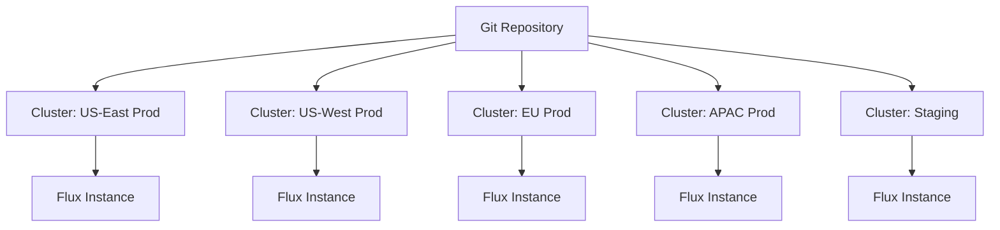

# Flux CD for Enterprise: Scaling Considerations

Author: [nawazdhandala](https://github.com/nawazdhandala)

Tags: Flux CD, GitOps, Kubernetes, Enterprise, Scaling, Multi-Tenant, Best Practices

Description: A guide to scaling Flux CD for enterprise environments with multi-cluster, multi-tenant, and high-availability considerations.

---

Enterprise organizations face challenges that small teams do not: hundreds of clusters, strict compliance requirements, multi-tenancy, and teams that cannot afford downtime. Flux CD's decentralized architecture handles these well, but it requires deliberate planning. This guide covers the key scaling considerations.

## Multi-Cluster Architecture

In enterprise environments, you typically manage dozens or hundreds of clusters. Flux CD runs independently in each cluster, pulling configuration from Git. There is no central control plane to become a bottleneck or single point of failure.



```yaml
# Repository structure for enterprise multi-cluster
# fleet-infra/
#   clusters/
#     us-east-prod/
#     us-west-prod/
#     eu-prod/
#     apac-prod/
#     staging/
#   infrastructure/
#     base/
#     overlays/
#       us-east/
#       us-west/
#       eu/
#       apac/
#   platform/
#     monitoring/
#     ingress/
#     cert-manager/
#   tenants/
#     team-alpha/
#     team-beta/
#     team-gamma/

# Each cluster entry point references shared configurations
# clusters/us-east-prod/kustomization.yaml
apiVersion: kustomize.toolkit.fluxcd.io/v1
kind: Kustomization
metadata:
  name: infrastructure
  namespace: flux-system
spec:
  interval: 30m
  sourceRef:
    kind: GitRepository
    name: fleet-infra
  path: ./infrastructure/overlays/us-east
  prune: true
  wait: true
  timeout: 10m
  # Use variable substitution for cluster-specific values
  postBuild:
    substitute:
      CLUSTER_NAME: us-east-prod
      REGION: us-east-1
      ENVIRONMENT: production
```

## Multi-Tenancy

Enterprise clusters serve multiple teams. Flux CD supports multi-tenancy through namespace isolation, service account restrictions, and separate Git repositories per tenant.

```yaml
# Platform team defines tenant namespaces and RBAC
# tenants/team-alpha/namespace.yaml
apiVersion: v1
kind: Namespace
metadata:
  name: team-alpha
  labels:
    tenant: team-alpha
---
# Service account for Flux to use when reconciling tenant resources
apiVersion: v1
kind: ServiceAccount
metadata:
  name: team-alpha-reconciler
  namespace: team-alpha
---
# Restrict what the tenant can deploy
apiVersion: rbac.authorization.k8s.io/v1
kind: RoleBinding
metadata:
  name: team-alpha-reconciler
  namespace: team-alpha
roleRef:
  apiGroup: rbac.authorization.k8s.io
  kind: ClusterRole
  # Only allow standard workload resources
  name: flux-tenant-role
subjects:
  - kind: ServiceAccount
    name: team-alpha-reconciler
    namespace: team-alpha
```

```yaml
# ClusterRole that restricts tenant permissions
apiVersion: rbac.authorization.k8s.io/v1
kind: ClusterRole
metadata:
  name: flux-tenant-role
rules:
  - apiGroups: ["apps"]
    resources: ["deployments", "statefulsets"]
    verbs: ["*"]
  - apiGroups: [""]
    resources: ["services", "configmaps", "secrets"]
    verbs: ["*"]
  - apiGroups: ["networking.k8s.io"]
    resources: ["ingresses"]
    verbs: ["*"]
  - apiGroups: ["autoscaling"]
    resources: ["horizontalpodautoscalers"]
    verbs: ["*"]
  # Explicitly deny cluster-scoped resources
  # Tenants cannot create namespaces, clusterroles, etc.
```

```yaml
# Tenant Kustomization with restricted service account
apiVersion: kustomize.toolkit.fluxcd.io/v1
kind: Kustomization
metadata:
  name: team-alpha-apps
  namespace: flux-system
spec:
  interval: 5m
  sourceRef:
    kind: GitRepository
    name: team-alpha-repo
  path: ./apps
  prune: true
  # Run as the tenant service account - enforces RBAC
  serviceAccountName: team-alpha-reconciler
  # Confine all resources to the tenant namespace
  targetNamespace: team-alpha
```

## Resource Limits and Performance Tuning

At enterprise scale, Flux controllers process many resources. Tune controller resources and concurrency settings.

```yaml
# Patch Flux controllers for enterprise workloads
# clusters/production/flux-system/kustomize-controller-patch.yaml
apiVersion: apps/v1
kind: Deployment
metadata:
  name: kustomize-controller
  namespace: flux-system
spec:
  template:
    spec:
      containers:
        - name: manager
          resources:
            requests:
              cpu: 500m
              memory: 1Gi
            limits:
              cpu: 2000m
              memory: 4Gi
          args:
            # Increase concurrent reconciliations
            - --concurrent=20
            # Increase requeue dependency interval
            - --requeue-dependency=10s
            # Enable rate limiting
            - --kube-api-qps=200
            - --kube-api-burst=300
```

```yaml
# Tune source-controller for large repositories
apiVersion: apps/v1
kind: Deployment
metadata:
  name: source-controller
  namespace: flux-system
spec:
  template:
    spec:
      containers:
        - name: manager
          resources:
            requests:
              cpu: 250m
              memory: 512Mi
            limits:
              cpu: 1000m
              memory: 2Gi
          args:
            - --concurrent=10
            - --storage-adv-addr=source-controller.$(RUNTIME_NAMESPACE).svc
            # Increase artifact storage size
            - --storage-path=/data
          volumeMounts:
            - name: data
              mountPath: /data
      volumes:
        - name: data
          emptyDir:
            sizeLimit: 10Gi
```

## High Availability

For production clusters, run Flux controllers with multiple replicas and leader election.

```yaml
# HA configuration for kustomize-controller
apiVersion: apps/v1
kind: Deployment
metadata:
  name: kustomize-controller
  namespace: flux-system
spec:
  replicas: 2
  template:
    spec:
      containers:
        - name: manager
          args:
            - --concurrent=20
            # Leader election ensures only one active reconciler
            - --leader-elect=true
      # Spread across nodes for resilience
      affinity:
        podAntiAffinity:
          preferredDuringSchedulingIgnoredDuringExecution:
            - weight: 100
              podAffinityTerm:
                labelSelector:
                  matchLabels:
                    app: kustomize-controller
                topologyKey: kubernetes.io/hostname
      # Tolerate node failures
      topologySpreadConstraints:
        - maxSkew: 1
          topologyKey: topology.kubernetes.io/zone
          whenUnsatisfiable: DoNotSchedule
          labelSelector:
            matchLabels:
              app: kustomize-controller
```

## Notification and Alerting at Scale

Enterprise teams need notifications routed to the right people. Flux supports multiple notification providers.

```yaml
# Alert configuration for production issues
apiVersion: notification.toolkit.fluxcd.io/v1
kind: Provider
metadata:
  name: slack-platform
  namespace: flux-system
spec:
  type: slack
  channel: platform-alerts
  secretRef:
    name: slack-webhook-url
---
apiVersion: notification.toolkit.fluxcd.io/v1
kind: Provider
metadata:
  name: pagerduty-critical
  namespace: flux-system
spec:
  type: pagerduty
  channel: flux-critical
  secretRef:
    name: pagerduty-token
---
# Route critical failures to PagerDuty
apiVersion: notification.toolkit.fluxcd.io/v1
kind: Alert
metadata:
  name: critical-failures
  namespace: flux-system
spec:
  providerRef:
    name: pagerduty-critical
  eventSeverity: error
  eventSources:
    - kind: Kustomization
      name: "*"
      namespace: flux-system
    - kind: HelmRelease
      name: "*"
      namespace: "*"
---
# Route all events to Slack for visibility
apiVersion: notification.toolkit.fluxcd.io/v1
kind: Alert
metadata:
  name: all-events
  namespace: flux-system
spec:
  providerRef:
    name: slack-platform
  eventSeverity: info
  eventSources:
    - kind: Kustomization
      name: "*"
    - kind: HelmRelease
      name: "*"
    - kind: GitRepository
      name: "*"
```

## Git Repository Strategy

Large organizations need to decide how to structure their Git repositories. Two common patterns exist.

### Monorepo Approach

All cluster configurations in a single repository. Simpler to manage but requires careful access controls.

```yaml
# Single repo with path-based separation
apiVersion: source.toolkit.fluxcd.io/v1
kind: GitRepository
metadata:
  name: fleet-infra
  namespace: flux-system
spec:
  interval: 5m
  url: https://github.com/my-org/fleet-infra.git
  ref:
    branch: main
  secretRef:
    name: git-credentials
  # Ignore paths not relevant to this cluster
  ignore: |
    # Ignore other cluster configurations
    /clusters/us-west-prod/
    /clusters/eu-prod/
```

### Polyrepo Approach

Separate repositories per team or per cluster. Better isolation but more repositories to manage.

```yaml
# Platform repo for shared infrastructure
apiVersion: source.toolkit.fluxcd.io/v1
kind: GitRepository
metadata:
  name: platform-infra
  namespace: flux-system
spec:
  interval: 10m
  url: https://github.com/my-org/platform-infra.git
  ref:
    branch: main
  secretRef:
    name: platform-git-credentials
---
# Tenant repo for team-alpha
apiVersion: source.toolkit.fluxcd.io/v1
kind: GitRepository
metadata:
  name: team-alpha-repo
  namespace: flux-system
spec:
  interval: 5m
  url: https://github.com/my-org/team-alpha-apps.git
  ref:
    branch: main
  secretRef:
    name: team-alpha-git-credentials
```

## Monitoring Flux at Scale

Use Prometheus metrics exposed by Flux controllers to monitor reconciliation health.

```yaml
# ServiceMonitor for Flux controllers
apiVersion: monitoring.coreos.com/v1
kind: ServiceMonitor
metadata:
  name: flux-system
  namespace: flux-system
spec:
  selector:
    matchLabels:
      app.kubernetes.io/part-of: flux
  endpoints:
    - port: http-prom
      interval: 30s
      path: /metrics
```

```yaml
# Prometheus alerting rules for Flux
apiVersion: monitoring.coreos.com/v1
kind: PrometheusRule
metadata:
  name: flux-alerts
  namespace: flux-system
spec:
  groups:
    - name: flux
      rules:
        # Alert when reconciliation has been failing
        - alert: FluxReconciliationFailure
          expr: |
            max(gotk_reconcile_condition{status="False",type="Ready"}) by (namespace, name, kind) > 0
          for: 15m
          labels:
            severity: critical
          annotations:
            summary: "Flux reconciliation failing for {{ $labels.kind }}/{{ $labels.name }}"
        # Alert when Flux hasn't reconciled recently
        - alert: FluxReconciliationStale
          expr: |
            max(gotk_reconcile_duration_seconds_count) by (namespace, name, kind)
            unless
            increase(gotk_reconcile_duration_seconds_count[1h]) > 0
          for: 1h
          labels:
            severity: warning
          annotations:
            summary: "Flux hasn't reconciled {{ $labels.kind }}/{{ $labels.name }} in over 1 hour"
```

## Key Takeaways for Enterprise Adoption

1. Run Flux per-cluster for decentralized resilience.
2. Use multi-tenancy with service account isolation to enforce boundaries.
3. Tune controller resources and concurrency for your workload size.
4. Deploy controllers in HA mode with leader election.
5. Structure Git repositories based on your organizational boundaries.
6. Monitor Flux controllers with Prometheus and alert on reconciliation failures.
7. Route notifications to the right teams using severity-based alerting.

Enterprise adoption of Flux CD is not just about installing it - it requires planning around tenancy, performance, and operational visibility.
