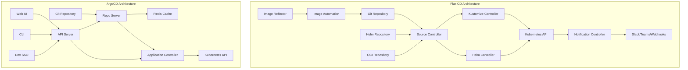

# Flux CD vs ArgoCD: Architecture Comparison

Author: [nawazdhandala](https://github.com/nawazdhandala)

Tags: flux cd, argocd, gitops, kubernetes, architecture, comparison, devops

Description: A detailed architectural comparison between Flux CD and ArgoCD, examining their design philosophies, component structures, and how they implement GitOps on Kubernetes.

---

## Introduction

Flux CD and ArgoCD are the two leading GitOps tools for Kubernetes. While both implement the GitOps pattern of using Git as the source of truth for declarative infrastructure, they take fundamentally different architectural approaches. Understanding these differences is critical for choosing the right tool for your organization.

This post provides a deep comparison of their architectures, component designs, extension models, and operational characteristics.

## Core Design Philosophy

Flux CD follows a modular, toolkit-based approach. It is built as a set of specialized controllers that can be composed together or used independently. Each controller handles a specific concern: source management, kustomize reconciliation, Helm releases, image automation, and notifications.

ArgoCD follows a monolithic application-centric approach. It provides an integrated platform with a central API server, application controller, repository server, and built-in UI. All components work together as a single cohesive system.

## Component Architecture

### Flux CD Components

Flux CD is composed of several independent controllers, each running as its own Kubernetes deployment.

```yaml
# Flux CD controller architecture
# Each controller is a separate deployment in the flux-system namespace

# 1. Source Controller - manages Git repos, Helm repos, OCI repos, S3 buckets
apiVersion: apps/v1
kind: Deployment
metadata:
  name: source-controller
  namespace: flux-system
spec:
  replicas: 1
  template:
    spec:
      containers:
        - name: manager
          # Handles fetching and storing artifacts from sources
          # Watches: GitRepository, HelmRepository, OCIRepository, Bucket
          image: ghcr.io/fluxcd/source-controller

# 2. Kustomize Controller - reconciles Kustomization resources
apiVersion: apps/v1
kind: Deployment
metadata:
  name: kustomize-controller
  namespace: flux-system
spec:
  replicas: 1
  template:
    spec:
      containers:
        - name: manager
          # Applies kustomize overlays and plain YAML manifests
          # Watches: Kustomization
          image: ghcr.io/fluxcd/kustomize-controller

# 3. Helm Controller - manages Helm releases
apiVersion: apps/v1
kind: Deployment
metadata:
  name: helm-controller
  namespace: flux-system
spec:
  replicas: 1
  template:
    spec:
      containers:
        - name: manager
          # Performs Helm install, upgrade, test, rollback
          # Watches: HelmRelease
          image: ghcr.io/fluxcd/helm-controller

# 4. Notification Controller - handles alerts and events
apiVersion: apps/v1
kind: Deployment
metadata:
  name: notification-controller
  namespace: flux-system
spec:
  replicas: 1
  template:
    spec:
      containers:
        - name: manager
          # Dispatches events to external systems
          # Watches: Alert, Provider, Receiver
          image: ghcr.io/fluxcd/notification-controller

# 5. Image Reflector + Automation Controllers (optional)
apiVersion: apps/v1
kind: Deployment
metadata:
  name: image-reflector-controller
  namespace: flux-system
spec:
  replicas: 1
  template:
    spec:
      containers:
        - name: manager
          # Scans container registries for new tags
          # Watches: ImageRepository, ImagePolicy
          image: ghcr.io/fluxcd/image-reflector-controller
```

### ArgoCD Components

ArgoCD runs as an integrated set of services that communicate through a central API.

```yaml
# ArgoCD component architecture
# All components run in the argocd namespace

# 1. API Server - central REST/gRPC API and Web UI
apiVersion: apps/v1
kind: Deployment
metadata:
  name: argocd-server
  namespace: argocd
spec:
  replicas: 2
  template:
    spec:
      containers:
        - name: argocd-server
          # Serves the Web UI and API
          # Handles authentication, RBAC, and SSO
          image: quay.io/argoproj/argocd

# 2. Application Controller - reconciles Application resources
apiVersion: apps/v1
kind: Deployment
metadata:
  name: argocd-application-controller
  namespace: argocd
spec:
  replicas: 1
  template:
    spec:
      containers:
        - name: argocd-application-controller
          # Watches Application CRs and compares live vs desired state
          # Performs sync operations
          image: quay.io/argoproj/argocd

# 3. Repo Server - manages Git repository operations
apiVersion: apps/v1
kind: Deployment
metadata:
  name: argocd-repo-server
  namespace: argocd
spec:
  replicas: 2
  template:
    spec:
      containers:
        - name: argocd-repo-server
          # Clones repos, generates manifests (Helm, Kustomize, Jsonnet)
          # Caches manifests for performance
          image: quay.io/argoproj/argocd

# 4. Redis - caching layer
apiVersion: apps/v1
kind: Deployment
metadata:
  name: argocd-redis
  namespace: argocd
spec:
  replicas: 1
  template:
    spec:
      containers:
        - name: redis
          # Caches application state and repo data
          image: redis:7

# 5. Dex (optional) - SSO and identity provider
apiVersion: apps/v1
kind: Deployment
metadata:
  name: argocd-dex-server
  namespace: argocd
spec:
  replicas: 1
  template:
    spec:
      containers:
        - name: dex
          image: ghcr.io/dexidp/dex
```

## Architecture Diagram



## Reconciliation Model

### Flux CD Reconciliation

Flux uses a pull-based reconciliation model where each controller independently watches its CRDs and reconciles on a configurable interval.

```yaml
# Flux CD reconciliation example
# Each resource has its own interval
apiVersion: source.toolkit.fluxcd.io/v1
kind: GitRepository
metadata:
  name: app-repo
  namespace: flux-system
spec:
  # Source controller polls Git every 5 minutes
  interval: 5m
  url: https://github.com/org/app.git
  ref:
    branch: main
---
apiVersion: kustomize.toolkit.fluxcd.io/v1
kind: Kustomization
metadata:
  name: app
  namespace: flux-system
spec:
  # Kustomize controller reconciles every 10 minutes
  interval: 10m
  sourceRef:
    kind: GitRepository
    name: app-repo
  path: ./deploy
  prune: true
  # Force apply to handle field manager conflicts
  force: false
  # Health checks wait for resources to become ready
  healthChecks:
    - apiVersion: apps/v1
      kind: Deployment
      name: app
      namespace: default
  # Retry on failure
  retryInterval: 2m
```

### ArgoCD Reconciliation

ArgoCD uses an application-centric model where the controller continuously monitors the live state against the desired state defined in Git.

```yaml
# ArgoCD reconciliation example
apiVersion: argoproj.io/v1alpha1
kind: Application
metadata:
  name: app
  namespace: argocd
spec:
  project: default
  source:
    repoURL: https://github.com/org/app.git
    targetRevision: main
    path: deploy
  destination:
    server: https://kubernetes.default.svc
    namespace: default
  syncPolicy:
    automated:
      # Auto-sync when drift is detected
      prune: true
      selfHeal: true
      # Allow empty directories
      allowEmpty: false
    syncOptions:
      - CreateNamespace=true
    retry:
      limit: 5
      backoff:
        duration: 5s
        factor: 2
        maxDuration: 3m
```

## Resource Management Comparison

### How Flux CD Manages Resources

```yaml
# Flux uses server-side apply with field ownership tracking
apiVersion: kustomize.toolkit.fluxcd.io/v1
kind: Kustomization
metadata:
  name: infrastructure
  namespace: flux-system
spec:
  interval: 10m
  path: ./infrastructure
  # Server-side apply is the default
  # Each field is tracked by its manager
  prune: true
  sourceRef:
    kind: GitRepository
    name: flux-system
  # Dependency ordering between Kustomizations
  dependsOn:
    - name: cert-manager
    - name: ingress-nginx
  # Post-build variable substitution
  postBuild:
    substitute:
      CLUSTER_NAME: production
      DOMAIN: example.com
    substituteFrom:
      - kind: ConfigMap
        name: cluster-settings
```

### How ArgoCD Manages Resources

```yaml
# ArgoCD uses its own diff and sync engine
apiVersion: argoproj.io/v1alpha1
kind: Application
metadata:
  name: infrastructure
  namespace: argocd
  annotations:
    # Ignore differences in specific fields
    argocd.argoproj.io/compare-options: IgnoreExtraneous
spec:
  project: default
  source:
    repoURL: https://github.com/org/infra.git
    path: ./infrastructure
    targetRevision: main
  destination:
    server: https://kubernetes.default.svc
  # Ignore specific resource differences
  ignoreDifferences:
    - group: apps
      kind: Deployment
      jsonPointers:
        - /spec/replicas
    - group: ""
      kind: Service
      jqPathExpressions:
        - .spec.clusterIP
```

## Extension and Plugin Model

### Flux CD Extension

Flux is extended by adding new controllers or using existing integrations.

```yaml
# Flux uses CRDs and controllers for extensibility
# Example: Adding Terraform support via tf-controller
apiVersion: source.toolkit.fluxcd.io/v1
kind: GitRepository
metadata:
  name: terraform-modules
  namespace: flux-system
spec:
  url: https://github.com/org/terraform.git
  interval: 5m
  ref:
    branch: main
---
# Third-party controller extends Flux natively
apiVersion: infra.contrib.fluxcd.io/v1alpha2
kind: Terraform
metadata:
  name: vpc
  namespace: flux-system
spec:
  interval: 1h
  path: ./modules/vpc
  sourceRef:
    kind: GitRepository
    name: terraform-modules
  approvePlan: auto
  writeOutputsToSecret:
    name: vpc-outputs
```

### ArgoCD Extension

ArgoCD is extended through plugins and custom config management tools.

```yaml
# ArgoCD uses Config Management Plugins (CMP)
apiVersion: v1
kind: ConfigMap
metadata:
  name: argocd-cm
  namespace: argocd
data:
  # Register a custom plugin
  configManagementPlugins: |
    - name: kustomize-with-sops
      init:
        command: ["/bin/sh", "-c"]
        args: ["sops -d secrets.enc.yaml > secrets.yaml"]
      generate:
        command: ["/bin/sh", "-c"]
        args: ["kustomize build ."]
```

## Scalability Characteristics

### Flux CD Scaling

```yaml
# Flux scales by sharding controllers across namespaces
# Each controller can be configured independently

# Horizontal scaling via multiple Flux instances
# Instance 1: manages namespaces team-a, team-b
apiVersion: kustomize.toolkit.fluxcd.io/v1
kind: Kustomization
metadata:
  name: team-a-apps
  namespace: flux-system
spec:
  interval: 5m
  path: ./teams/team-a
  prune: true
  sourceRef:
    kind: GitRepository
    name: flux-system
  # Target specific namespace
  targetNamespace: team-a

# Flux sharding with label selectors (v2.3+)
# Configure controllers to only watch specific labels
# --watch-label-selector=sharding.fluxcd.io/key=shard1
```

### ArgoCD Scaling

```yaml
# ArgoCD scales the application controller with sharding
apiVersion: apps/v1
kind: Deployment
metadata:
  name: argocd-application-controller
  namespace: argocd
spec:
  replicas: 3
  template:
    spec:
      containers:
        - name: argocd-application-controller
          env:
            # Enable controller sharding
            - name: ARGOCD_CONTROLLER_REPLICAS
              value: "3"
          # Each replica handles a subset of applications
          # Sharding is based on application hash
```

## Comparison Summary Table

| Aspect | Flux CD | ArgoCD |
|--------|---------|--------|
| Architecture | Modular toolkit (separate controllers) | Monolithic platform (integrated services) |
| UI | No built-in UI (use Weave GitOps or third-party) | Built-in Web UI with app visualization |
| API | Kubernetes-native CRDs only | REST/gRPC API server + CRDs |
| State Storage | Kubernetes etcd (CRD status) | Kubernetes etcd + Redis cache |
| Authentication | Delegates to Kubernetes RBAC | Built-in SSO, OIDC, LDAP, SAML |
| Multi-cluster | Native via Kustomization targeting | Via cluster secrets and AppSets |
| Helm Support | Native HelmRelease controller | Renders Helm to manifests, then applies |
| Drift Detection | Periodic reconciliation | Continuous live state monitoring |
| Resource Apply | Server-side apply (Kubernetes native) | Custom diff/sync engine |
| Image Updates | Built-in image automation controllers | Requires ArgoCD Image Updater (separate) |
| Dependencies | CRD dependsOn field | Sync waves and hooks |
| Notifications | Built-in notification controller | Notification engine with triggers |

## When to Choose Flux CD

Flux CD is a better fit when:

- You prefer a modular architecture where components can be used independently
- Your team is comfortable with CLI-first workflows
- You need native multi-tenancy with Kubernetes RBAC
- You want server-side apply for proper field ownership
- You need built-in image automation for continuous deployment
- You prefer a lighter footprint with fewer running components

## When to Choose ArgoCD

ArgoCD is a better fit when:

- You need a rich built-in Web UI for application visualization
- Your team prefers a centralized management interface
- You need built-in SSO and fine-grained access control
- You want application-centric management with sync status dashboards
- You need the ApplicationSet controller for generating apps from templates
- Your organization values a single integrated platform

## Summary

Flux CD and ArgoCD represent two valid but different approaches to GitOps on Kubernetes. Flux CD's modular toolkit architecture gives you flexibility and composability, with each controller handling a single concern. ArgoCD's integrated platform provides a complete solution with a powerful UI and centralized management. The architectural differences influence everything from scaling strategies to extension models. Choose based on your team's operational preferences, scale requirements, and whether you value modularity or integration.
