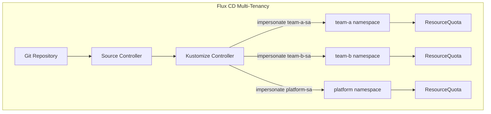

# Flux CD vs ArgoCD: Multi-Tenancy Comparison

Author: [nawazdhandala](https://github.com/nawazdhandala)

Tags: flux cd, argocd, gitops, kubernetes, multi-tenancy, rbac, security, comparison

Description: A detailed comparison of how Flux CD and ArgoCD implement multi-tenancy, covering isolation models, RBAC, namespace management, and team-based access control.

---

## Introduction

Multi-tenancy is a critical requirement for organizations running shared Kubernetes clusters. When multiple teams share a cluster, each team needs isolated environments with appropriate access controls, resource quotas, and deployment boundaries. Flux CD and ArgoCD take fundamentally different approaches to multi-tenancy.

This guide compares their multi-tenancy models, showing practical configurations for isolating teams, enforcing boundaries, and managing access in both tools.

## Multi-Tenancy Models Overview

Flux CD uses a Kubernetes-native multi-tenancy model. Each tenant gets their own namespace with Flux resources, and isolation is enforced through standard Kubernetes RBAC and service accounts. Flux controllers impersonate tenant service accounts when applying resources.

ArgoCD uses an application-centric multi-tenancy model built around the concept of AppProjects. Each project defines which repositories, clusters, namespaces, and resource types a team can access. ArgoCD implements its own RBAC layer on top of Kubernetes RBAC.

## Flux CD Multi-Tenancy Setup

### Tenant Isolation Architecture



### Step 1: Define Tenant Namespaces and Service Accounts

```yaml
# tenants/base/team-a/namespace.yaml
apiVersion: v1
kind: Namespace
metadata:
  name: team-a
  labels:
    toolkit.fluxcd.io/tenant: team-a
---
# Service account that Flux will impersonate for this tenant
apiVersion: v1
kind: ServiceAccount
metadata:
  name: team-a-reconciler
  namespace: team-a
  labels:
    toolkit.fluxcd.io/tenant: team-a
```

### Step 2: Configure Tenant RBAC

```yaml
# tenants/base/team-a/rbac.yaml
# Role that limits what the tenant can deploy
apiVersion: rbac.authorization.k8s.io/v1
kind: Role
metadata:
  name: team-a-reconciler
  namespace: team-a
rules:
  # Allow deploying standard workload resources
  - apiGroups: ["apps"]
    resources: ["deployments", "statefulsets", "daemonsets"]
    verbs: ["*"]
  - apiGroups: [""]
    resources: ["services", "configmaps", "secrets", "serviceaccounts"]
    verbs: ["*"]
  - apiGroups: ["networking.k8s.io"]
    resources: ["ingresses"]
    verbs: ["*"]
  - apiGroups: ["autoscaling"]
    resources: ["horizontalpodautoscalers"]
    verbs: ["*"]
  - apiGroups: ["batch"]
    resources: ["jobs", "cronjobs"]
    verbs: ["*"]
  # Explicitly deny cluster-scoped resources
  # by not granting ClusterRole permissions
---
apiVersion: rbac.authorization.k8s.io/v1
kind: RoleBinding
metadata:
  name: team-a-reconciler
  namespace: team-a
roleRef:
  apiGroup: rbac.authorization.k8s.io
  kind: Role
  name: team-a-reconciler
subjects:
  - kind: ServiceAccount
    name: team-a-reconciler
    namespace: team-a
```

### Step 3: Configure Flux Kustomization with Tenant Impersonation

```yaml
# clusters/production/tenants/team-a.yaml
apiVersion: kustomize.toolkit.fluxcd.io/v1
kind: Kustomization
metadata:
  name: team-a-apps
  namespace: flux-system
spec:
  interval: 10m
  sourceRef:
    kind: GitRepository
    name: flux-system
  path: ./tenants/team-a/apps
  prune: true
  # Key: impersonate the tenant service account
  # This ensures Flux applies resources with tenant permissions only
  serviceAccountName: team-a-reconciler
  targetNamespace: team-a
  # Prevent cross-namespace references
  # Tenant cannot reference resources outside their namespace
  validation: client
  # Health checks scoped to tenant namespace
  healthChecks:
    - apiVersion: apps/v1
      kind: Deployment
      name: "*"
      namespace: team-a
```

### Step 4: Enforce Resource Quotas per Tenant

```yaml
# tenants/base/team-a/quota.yaml
apiVersion: v1
kind: ResourceQuota
metadata:
  name: team-a-quota
  namespace: team-a
spec:
  hard:
    # CPU and memory limits
    requests.cpu: "16"
    requests.memory: 32Gi
    limits.cpu: "32"
    limits.memory: 64Gi
    # Object count limits
    pods: "50"
    services: "20"
    secrets: "50"
    configmaps: "50"
    persistentvolumeclaims: "20"
    # Storage limits
    requests.storage: 200Gi
---
apiVersion: v1
kind: LimitRange
metadata:
  name: team-a-limits
  namespace: team-a
spec:
  limits:
    - type: Container
      default:
        cpu: 500m
        memory: 512Mi
      defaultRequest:
        cpu: 100m
        memory: 128Mi
      max:
        cpu: "4"
        memory: 8Gi
    - type: Pod
      max:
        cpu: "8"
        memory: 16Gi
```

### Step 5: Network Isolation for Tenants

```yaml
# tenants/base/team-a/network-policy.yaml
apiVersion: networking.k8s.io/v1
kind: NetworkPolicy
metadata:
  name: team-a-isolation
  namespace: team-a
spec:
  podSelector: {}
  policyTypes:
    - Ingress
    - Egress
  ingress:
    # Allow traffic within the same namespace
    - from:
        - podSelector: {}
    # Allow ingress controller traffic
    - from:
        - namespaceSelector:
            matchLabels:
              app.kubernetes.io/name: ingress-nginx
  egress:
    # Allow traffic within the same namespace
    - to:
        - podSelector: {}
    # Allow DNS resolution
    - to:
        - namespaceSelector: {}
          podSelector:
            matchLabels:
              k8s-app: kube-dns
      ports:
        - port: 53
          protocol: UDP
    # Allow external traffic
    - to:
        - ipBlock:
            cidr: 0.0.0.0/0
            except:
              # Block access to other tenant namespaces via cluster IPs
              - 10.0.0.0/8
```

### Step 6: Tenant Git Repository Access

```yaml
# Each tenant can have their own source or share a monorepo
# Option 1: Separate Git repository per tenant
apiVersion: source.toolkit.fluxcd.io/v1
kind: GitRepository
metadata:
  name: team-a-repo
  namespace: flux-system
spec:
  interval: 5m
  url: https://github.com/org/team-a-deployments
  ref:
    branch: main
  secretRef:
    # Tenant-specific Git credentials
    name: team-a-git-auth

---
# Option 2: Shared monorepo with path-based isolation
apiVersion: kustomize.toolkit.fluxcd.io/v1
kind: Kustomization
metadata:
  name: team-a-from-monorepo
  namespace: flux-system
spec:
  interval: 10m
  sourceRef:
    kind: GitRepository
    name: fleet-repo
  # Each team only has access to their directory
  path: ./teams/team-a
  prune: true
  serviceAccountName: team-a-reconciler
  targetNamespace: team-a
```

## ArgoCD Multi-Tenancy Setup

### AppProject-Based Isolation

```yaml
# ArgoCD uses AppProjects to define tenant boundaries
apiVersion: argoproj.io/v1alpha1
kind: AppProject
metadata:
  name: team-a
  namespace: argocd
spec:
  description: "Team A project with restricted access"

  # Allowed source repositories
  sourceRepos:
    - "https://github.com/org/team-a-*"
    - "https://charts.example.com"

  # Allowed destination clusters and namespaces
  destinations:
    - server: https://kubernetes.default.svc
      namespace: team-a
    - server: https://kubernetes.default.svc
      namespace: team-a-staging

  # Allowed Kubernetes resource types
  clusterResourceWhitelist: []
  # Deny all cluster-scoped resources

  # Allowed namespace-scoped resources
  namespaceResourceWhitelist:
    - group: "apps"
      kind: "Deployment"
    - group: "apps"
      kind: "StatefulSet"
    - group: ""
      kind: "Service"
    - group: ""
      kind: "ConfigMap"
    - group: ""
      kind: "Secret"
    - group: "networking.k8s.io"
      kind: "Ingress"
    - group: "batch"
      kind: "Job"
    - group: "batch"
      kind: "CronJob"
    - group: "autoscaling"
      kind: "HorizontalPodAutoscaler"

  # Denied namespace-scoped resources
  namespaceResourceBlacklist:
    - group: ""
      kind: "ResourceQuota"
    - group: ""
      kind: "LimitRange"
    - group: "networking.k8s.io"
      kind: "NetworkPolicy"

  # Roles for project-level RBAC
  roles:
    - name: developer
      description: "Developer access - can sync and view"
      policies:
        - p, proj:team-a:developer, applications, get, team-a/*, allow
        - p, proj:team-a:developer, applications, sync, team-a/*, allow
      groups:
        - "team-a-developers"

    - name: admin
      description: "Admin access - full control"
      policies:
        - p, proj:team-a:admin, applications, *, team-a/*, allow
        - p, proj:team-a:admin, repositories, *, team-a/*, allow
      groups:
        - "team-a-admins"

  # Sync windows for deployment control
  syncWindows:
    - kind: allow
      schedule: "0 8-18 * * 1-5"
      duration: 10h
      applications:
        - "*"
    - kind: deny
      schedule: "0 0 * * 0"
      duration: 24h
      applications:
        - "*"
```

### ArgoCD RBAC Configuration

```yaml
# ArgoCD has its own RBAC system configured via ConfigMap
apiVersion: v1
kind: ConfigMap
metadata:
  name: argocd-rbac-cm
  namespace: argocd
data:
  # Default policy for authenticated users
  policy.default: role:readonly

  # Fine-grained RBAC policies
  policy.csv: |
    # Platform team - full access to all projects
    p, role:platform-admin, applications, *, */*, allow
    p, role:platform-admin, clusters, *, *, allow
    p, role:platform-admin, repositories, *, *, allow
    p, role:platform-admin, projects, *, *, allow
    g, platform-admins, role:platform-admin

    # Team A developers - can view and sync their apps
    p, role:team-a-dev, applications, get, team-a/*, allow
    p, role:team-a-dev, applications, sync, team-a/*, allow
    p, role:team-a-dev, applications, action/*, team-a/*, allow
    p, role:team-a-dev, logs, get, team-a/*, allow
    g, team-a-developers, role:team-a-dev

    # Team A admins - full control over their project
    p, role:team-a-admin, applications, *, team-a/*, allow
    p, role:team-a-admin, repositories, *, team-a/*, allow
    p, role:team-a-admin, logs, get, team-a/*, allow
    p, role:team-a-admin, exec, create, team-a/*, allow
    g, team-a-admins, role:team-a-admin

    # Team B developers
    p, role:team-b-dev, applications, get, team-b/*, allow
    p, role:team-b-dev, applications, sync, team-b/*, allow
    g, team-b-developers, role:team-b-dev

    # Read-only access for all authenticated users
    p, role:readonly, applications, get, */*, allow
    p, role:readonly, projects, get, *, allow

  # Map SSO groups to ArgoCD roles
  scopes: "[groups, email]"
```

### ArgoCD ApplicationSet for Multi-Tenant App Generation

```yaml
# ApplicationSet generates applications per tenant automatically
apiVersion: argoproj.io/v1alpha1
kind: ApplicationSet
metadata:
  name: tenant-apps
  namespace: argocd
spec:
  generators:
    # Generate one application per team directory
    - git:
        repoURL: https://github.com/org/fleet-repo.git
        revision: main
        directories:
          - path: teams/*
  template:
    metadata:
      name: "{{path.basename}}-app"
    spec:
      project: "{{path.basename}}"
      source:
        repoURL: https://github.com/org/fleet-repo.git
        targetRevision: main
        path: "{{path}}"
      destination:
        server: https://kubernetes.default.svc
        namespace: "{{path.basename}}"
      syncPolicy:
        automated:
          prune: true
          selfHeal: true
```

## Key Differences Comparison

### Isolation Mechanism

```yaml
# Flux CD: Uses Kubernetes-native service account impersonation
# The controller runs with elevated permissions but impersonates
# tenant service accounts when applying resources
apiVersion: kustomize.toolkit.fluxcd.io/v1
kind: Kustomization
metadata:
  name: tenant-apps
  namespace: flux-system
spec:
  # This is the key multi-tenancy mechanism in Flux
  serviceAccountName: tenant-reconciler
  # Combined with targetNamespace, this creates a security boundary
  targetNamespace: tenant-ns
  # Cross-namespace references are blocked
  path: ./tenant/apps
  prune: true
  interval: 10m
  sourceRef:
    kind: GitRepository
    name: flux-system
```

```yaml
# ArgoCD: Uses AppProject-based boundaries with custom RBAC
# The application controller always runs with its own permissions
# Projects restrict what can be deployed, not how
apiVersion: argoproj.io/v1alpha1
kind: Application
metadata:
  name: tenant-app
  namespace: argocd
spec:
  # Project defines the security boundary
  project: tenant-project
  source:
    repoURL: https://github.com/org/tenant-app.git
    path: deploy
  destination:
    # Must match allowed destinations in the AppProject
    server: https://kubernetes.default.svc
    namespace: tenant-ns
```

### Access Control Model

| Feature | Flux CD | ArgoCD |
|---------|---------|--------|
| RBAC Model | Kubernetes-native RBAC | Custom RBAC layer + Kubernetes RBAC |
| Authentication | Kubernetes auth (OIDC, certs) | Built-in SSO (OIDC, SAML, LDAP, Dex) |
| Resource Restrictions | Kubernetes Role/ClusterRole | AppProject resource whitelist/blacklist |
| Namespace Isolation | Service account impersonation | AppProject destination restrictions |
| Repository Access | Per-source credentials | Per-project source repo restrictions |
| Deploy Windows | Not built-in (use external tools) | Built-in sync windows per project |
| Audit Trail | Kubernetes audit logs + Git history | Built-in audit logs + Git history |

### Scaling Multi-Tenancy

```yaml
# Flux CD: Adding a new tenant
# 1. Create namespace, service account, role, rolebinding
# 2. Create Kustomization with serviceAccountName
# 3. Commit to Git - done

# Reusable tenant template with kustomize
# tenants/base/kustomization.yaml
apiVersion: kustomize.config.k8s.io/v1beta1
kind: Kustomization
resources:
  - namespace.yaml
  - service-account.yaml
  - role.yaml
  - rolebinding.yaml
  - resource-quota.yaml
  - limit-range.yaml
  - network-policy.yaml

# tenants/team-c/kustomization.yaml
apiVersion: kustomize.config.k8s.io/v1beta1
kind: Kustomization
resources:
  - ../base
namePrefix: team-c-
namespace: team-c
patches:
  - target:
      kind: Namespace
    patch: |
      - op: replace
        path: /metadata/name
        value: team-c
```

```yaml
# ArgoCD: Adding a new tenant
# 1. Create AppProject with source/destination/resource restrictions
# 2. Configure RBAC policies in argocd-rbac-cm
# 3. Create Application or ApplicationSet
# 4. Optionally create namespace and quotas separately

# Using ApplicationSet to auto-generate tenant apps
apiVersion: argoproj.io/v1alpha1
kind: ApplicationSet
metadata:
  name: onboard-tenant
  namespace: argocd
spec:
  generators:
    - list:
        elements:
          - team: team-c
            repo: https://github.com/org/team-c-apps
            quota_cpu: "16"
            quota_memory: "32Gi"
  template:
    metadata:
      name: "{{team}}-apps"
    spec:
      project: "{{team}}"
      source:
        repoURL: "{{repo}}"
        path: deploy
      destination:
        server: https://kubernetes.default.svc
        namespace: "{{team}}"
```

## Security Considerations

### Flux CD Security Model

```yaml
# Flux CD strengths for multi-tenancy security:
# 1. Service account impersonation - tenant permissions are enforced at the Kubernetes API level
# 2. No central API server to compromise
# 3. Standard Kubernetes RBAC - well-understood security model
# 4. Cross-namespace references can be blocked

# Flux CD weaknesses:
# 1. No built-in authentication beyond Kubernetes auth
# 2. No web UI means no visual audit interface
# 3. Tenant isolation relies on correct RBAC configuration
# 4. No built-in sync windows for deployment control
```

### ArgoCD Security Model

```yaml
# ArgoCD strengths for multi-tenancy security:
# 1. Built-in SSO with OIDC, SAML, LDAP
# 2. Fine-grained RBAC with project-level policies
# 3. Resource whitelist/blacklist per project
# 4. Sync windows for deployment timing control
# 5. Audit logging built into the platform

# ArgoCD weaknesses:
# 1. Central API server is a high-value target
# 2. Custom RBAC adds complexity on top of Kubernetes RBAC
# 3. All tenants share the same application controller
# 4. Repo server has access to all tenant repositories
```

## When to Choose Each Approach

Flux CD multi-tenancy works best when:

- You want Kubernetes-native isolation using standard RBAC
- Your team is experienced with Kubernetes security primitives
- You need lightweight per-tenant overhead
- You want tenants to be fully isolated at the Kubernetes API level
- You prefer convention over configuration for tenant management

ArgoCD multi-tenancy works best when:

- You need a built-in UI for cross-team visibility
- You want integrated SSO without external tools
- You need deployment windows and scheduling controls per team
- You prefer a centralized management plane for all tenants
- You need fine-grained resource type restrictions per project

## Summary

Flux CD and ArgoCD offer different but effective multi-tenancy models. Flux CD leverages Kubernetes-native service account impersonation and RBAC, making tenant isolation a first-class Kubernetes concern. ArgoCD provides its own AppProject-based isolation with a custom RBAC layer, offering more granular controls at the application level. The choice depends on whether you prefer Kubernetes-native security primitives (Flux) or an application-centric security model with built-in SSO and UI (ArgoCD). Both tools can achieve strong multi-tenant isolation when properly configured.
