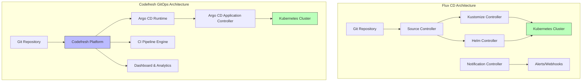
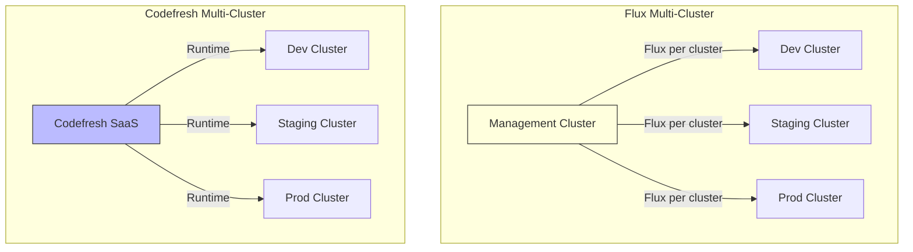

# Flux CD vs Codefresh GitOps: A Detailed Comparison

Author: [nawazdhandala](https://github.com/nawazdhandala)

Tags: Flux CD, Codefresh, GitOps, Kubernetes, Comparison, CI/CD

Description: Compare Flux CD and Codefresh GitOps across architecture, features, ease of use, and scalability to choose the right GitOps tool for your Kubernetes deployments.

---

## Introduction

Flux CD and Codefresh GitOps represent two different approaches to GitOps for Kubernetes. Flux CD is a CNCF graduated open-source project focused purely on GitOps reconciliation. Codefresh GitOps is a commercial platform built on top of Argo CD that combines CI/CD pipelines with GitOps delivery. Understanding the differences helps you pick the right tool for your team's needs.

## Architecture Comparison



Flux CD runs entirely inside your cluster as a set of Kubernetes controllers. Codefresh operates as a SaaS platform with an in-cluster Argo CD runtime that connects back to the Codefresh control plane.

## Feature Comparison

| Feature | Flux CD | Codefresh GitOps |
|---------|---------|-----------------|
| **Core Engine** | Custom Flux controllers | Argo CD (managed) |
| **Deployment Model** | Fully in-cluster | SaaS + in-cluster runtime |
| **Source Types** | Git, OCI, S3, Helm repos | Git, Helm repos |
| **Manifest Tools** | Kustomize, Helm (native) | Kustomize, Helm, Jsonnet |
| **CI/CD Integration** | External (any CI system) | Built-in CI pipelines |
| **Multi-Cluster** | Native multi-cluster | Centralized multi-cluster |
| **UI/Dashboard** | Weave GitOps or third-party | Built-in commercial dashboard |
| **Progressive Delivery** | Flagger integration | Argo Rollouts integration |
| **Cost** | Free (open source) | Commercial licensing |
| **CNCF Status** | Graduated project | Not a CNCF project |

## Reconciliation Model

### Flux CD

Flux uses a pull-based reconciliation loop. Each controller watches its source and reconciles independently.

```yaml
# Flux reconciliation -- each resource has its own interval and source
apiVersion: source.toolkit.fluxcd.io/v1
kind: GitRepository
metadata:
  name: app-source
  namespace: flux-system
spec:
  interval: 1m
  url: https://github.com/your-org/app-manifests
  ref:
    branch: main
---
apiVersion: kustomize.toolkit.fluxcd.io/v1
kind: Kustomization
metadata:
  name: app-deploy
  namespace: flux-system
spec:
  interval: 5m
  sourceRef:
    kind: GitRepository
    name: app-source
  path: ./deploy/production
  prune: true
  # Health checks block until resources are healthy
  healthChecks:
    - apiVersion: apps/v1
      kind: Deployment
      name: frontend
      namespace: production
  timeout: 10m
```

### Codefresh GitOps

Codefresh uses Argo CD Applications as the deployment unit, managed through the Codefresh platform.

```yaml
# Codefresh uses Argo CD Application resources under the hood
apiVersion: argoproj.io/v1alpha1
kind: Application
metadata:
  name: app-deploy
  namespace: argocd
spec:
  project: default
  source:
    repoURL: https://github.com/your-org/app-manifests
    targetRevision: main
    path: deploy/production
  destination:
    server: https://kubernetes.default.svc
    namespace: production
  syncPolicy:
    automated:
      prune: true
      selfHeal: true
```

## Multi-Cluster Management



Flux CD installs independently on each cluster, using Git as the shared coordination point. This means each cluster operates autonomously even if other clusters or the management plane are unavailable.

Codefresh provides a centralized SaaS dashboard where you can see all clusters, trigger syncs, and manage deployments from one place. The tradeoff is a dependency on the Codefresh platform for visibility and management.

## CI/CD Integration

### Flux CD with External CI

Flux does not include a CI engine. You pair it with any CI system you already use.

```yaml
# GitHub Actions workflow that works with Flux CD
name: Build and Update Manifests
on:
  push:
    branches: [main]
    paths: ["src/**"]

jobs:
  build:
    runs-on: ubuntu-latest
    steps:
      - uses: actions/checkout@v4

      - name: Build and push image
        run: |
          docker build -t ghcr.io/your-org/app:${{ github.sha }} .
          docker push ghcr.io/your-org/app:${{ github.sha }}

      # Update the image tag in the deployment manifests
      # Flux detects the change and reconciles automatically
      - name: Update manifest
        run: |
          cd deploy/production
          kustomize edit set image app=ghcr.io/your-org/app:${{ github.sha }}

      - name: Commit and push
        run: |
          git config user.name "CI Bot"
          git config user.email "ci@example.com"
          git add .
          git commit -m "Update image to ${{ github.sha }}"
          git push
```

### Codefresh Built-in CI

Codefresh provides integrated pipelines that connect CI builds directly to GitOps deployments.

```yaml
# codefresh.yml -- Codefresh pipeline with built-in GitOps integration
version: "1.0"
stages:
  - build
  - deploy

steps:
  build_image:
    type: build
    stage: build
    image_name: your-org/app
    tag: "${{CF_SHORT_REVISION}}"

  report_image:
    type: codefresh-report-image
    stage: deploy
    arguments:
      CF_API_KEY: "${{CF_API_KEY}}"
      CF_IMAGE: "your-org/app:${{CF_SHORT_REVISION}}"
      CF_GIT_REPO: your-org/app-manifests
```

## When to Choose Flux CD

- You want a fully open-source, vendor-neutral solution
- You need to run entirely within your own infrastructure (air-gapped, regulated)
- You already have a CI system and want to keep it
- You prefer lightweight, composable controllers over monolithic platforms
- You want OCI artifacts as a delivery mechanism
- CNCF graduation matters for your compliance requirements

## When to Choose Codefresh GitOps

- You want an integrated CI/CD and GitOps platform in one product
- You need a polished commercial dashboard and analytics out of the box
- Your team prefers a managed platform over self-operated tooling
- You are already invested in the Argo CD ecosystem
- You want built-in image enrichment and deployment tracking

## Migrating Between Them

If you start with Codefresh GitOps and later want to move to Flux CD, the main work is converting Argo CD Application resources to Flux Kustomization and HelmRelease resources. Your Git repository structure and Kubernetes manifests remain the same.

```yaml
# Converting an Argo CD Application to Flux resources
# Before (Argo CD / Codefresh):
# apiVersion: argoproj.io/v1alpha1
# kind: Application
# spec:
#   source:
#     repoURL: https://github.com/your-org/app
#     path: deploy/production

# After (Flux CD):
apiVersion: source.toolkit.fluxcd.io/v1
kind: GitRepository
metadata:
  name: app
  namespace: flux-system
spec:
  interval: 1m
  url: https://github.com/your-org/app
  ref:
    branch: main
---
apiVersion: kustomize.toolkit.fluxcd.io/v1
kind: Kustomization
metadata:
  name: app
  namespace: flux-system
spec:
  interval: 5m
  sourceRef:
    kind: GitRepository
    name: app
  path: ./deploy/production
  prune: true
```

## Conclusion

Flux CD and Codefresh GitOps solve the same core problem -- keeping Kubernetes clusters in sync with desired state in Git -- but they take different approaches. Flux CD is a lean, open-source, in-cluster solution that excels in flexibility and independence. Codefresh GitOps is a commercial platform that bundles CI, GitOps, and observability into one product. Choose Flux CD when you value open-source independence and already have a CI system. Choose Codefresh when you want an all-in-one platform with commercial support and integrated pipelines.
