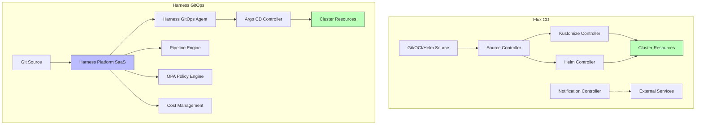
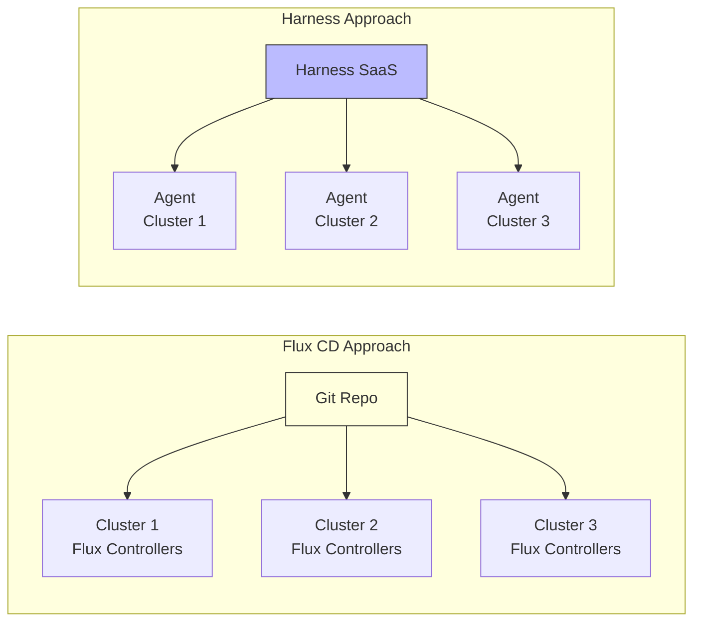

# Flux CD vs Harness GitOps: Feature Comparison

Author: [nawazdhandala](https://github.com/nawazdhandala)

Tags: Flux CD, Harness, GitOps, Kubernetes, Comparison, CI/CD

Description: Compare Flux CD and Harness GitOps across architecture, deployment strategies, multi-cluster support, and operational features to determine which fits your organization.

---

## Introduction

Flux CD and Harness GitOps are two approaches to implementing GitOps for Kubernetes deployments. Flux CD is a CNCF graduated, open-source GitOps toolkit that runs entirely within your cluster. Harness GitOps is part of the Harness platform, a commercial continuous delivery solution that integrates Argo CD under the hood with enterprise features like pipeline orchestration, governance, and cost management. This comparison helps you evaluate both tools for your specific requirements.

## Architecture Differences



Flux CD is fully decentralized. Each cluster runs its own set of controllers with no external dependency. Harness GitOps uses a centralized SaaS platform with in-cluster agents that connect back to the Harness control plane.

## Feature-by-Feature Comparison

| Feature | Flux CD | Harness GitOps |
|---------|---------|----------------|
| **Core Engine** | Flux controllers (custom) | Argo CD (managed) |
| **Hosting** | Self-hosted, in-cluster | SaaS + in-cluster agent |
| **Source Types** | Git, OCI, Helm, S3 | Git, Helm |
| **Kustomize** | Native controller | Via Argo CD |
| **Helm** | Native controller | Via Argo CD |
| **Multi-Cluster** | Decentralized per cluster | Centralized management |
| **Progressive Delivery** | Flagger | Harness pipelines + Argo Rollouts |
| **Policy Enforcement** | External (OPA, Kyverno) | Built-in OPA governance |
| **Secrets Management** | SOPS, Sealed Secrets | Harness Secrets Manager |
| **CI Integration** | External (any CI) | Built-in Harness CI |
| **Cost Management** | Not included | Built-in cloud cost module |
| **RBAC** | Kubernetes-native | Harness platform RBAC |
| **Audit Trail** | Git history | Platform audit logs + Git |
| **License** | Apache 2.0 (free) | Commercial (free tier available) |

## Deployment Configuration

### Flux CD

```yaml
# Flux deployment -- modular controllers with separate concerns
apiVersion: source.toolkit.fluxcd.io/v1
kind: GitRepository
metadata:
  name: webapp
  namespace: flux-system
spec:
  interval: 1m
  url: https://github.com/your-org/webapp
  ref:
    branch: main
---
apiVersion: kustomize.toolkit.fluxcd.io/v1
kind: Kustomization
metadata:
  name: webapp-production
  namespace: flux-system
spec:
  interval: 5m
  sourceRef:
    kind: GitRepository
    name: webapp
  path: ./deploy/overlays/production
  prune: true
  wait: true
  # Post-build variable substitution for environment-specific values
  postBuild:
    substituteFrom:
      - kind: ConfigMap
        name: production-vars
  healthChecks:
    - apiVersion: apps/v1
      kind: Deployment
      name: webapp
      namespace: production
  timeout: 10m
```

### Harness GitOps

In Harness, you configure GitOps applications through the platform UI or API, which creates Argo CD Application resources behind the scenes.

```yaml
# Harness GitOps Application definition (Argo CD Application under the hood)
apiVersion: argoproj.io/v1alpha1
kind: Application
metadata:
  name: webapp-production
  namespace: argocd
  # Harness adds labels for tracking
  labels:
    harness.io/project: webapp
    harness.io/environment: production
spec:
  project: default
  source:
    repoURL: https://github.com/your-org/webapp
    targetRevision: main
    path: deploy/overlays/production
  destination:
    server: https://kubernetes.default.svc
    namespace: production
  syncPolicy:
    automated:
      prune: true
      selfHeal: true
    syncOptions:
      - CreateNamespace=true
```

## Multi-Cluster Management



### Flux CD Multi-Cluster

Each cluster runs Flux independently. You manage cluster-specific configuration through directory structures or Kustomize overlays in Git.

```yaml
# Flux multi-cluster: one repo, cluster-specific paths
# clusters/production-us-east/kustomization.yaml
apiVersion: kustomize.toolkit.fluxcd.io/v1
kind: Kustomization
metadata:
  name: apps
  namespace: flux-system
spec:
  interval: 10m
  sourceRef:
    kind: GitRepository
    name: flux-system
  # Each cluster uses its own overlay path
  path: ./apps/overlays/production-us-east
  prune: true
  postBuild:
    substituteFrom:
      - kind: ConfigMap
        name: cluster-vars
```

### Harness Multi-Cluster

Harness provides a centralized view of all clusters through its platform, with a single pane of glass for managing deployments across environments.

## Secrets Management

### Flux CD with SOPS

```yaml
# Flux uses SOPS for in-repo secret encryption
apiVersion: kustomize.toolkit.fluxcd.io/v1
kind: Kustomization
metadata:
  name: webapp
  namespace: flux-system
spec:
  interval: 5m
  sourceRef:
    kind: GitRepository
    name: webapp
  path: ./deploy/production
  prune: true
  # Decrypt SOPS-encrypted secrets during reconciliation
  decryption:
    provider: sops
    secretRef:
      name: sops-age-key
```

### Harness Secrets Manager

Harness provides a built-in secrets manager that integrates with HashiCorp Vault, AWS Secrets Manager, GCP Secret Manager, and Azure Key Vault through its platform, removing the need to manage encrypted secrets in Git.

## Progressive Delivery

### Flux CD with Flagger

```yaml
# Flux uses Flagger for canary deployments
apiVersion: flagger.app/v1beta1
kind: Canary
metadata:
  name: webapp
  namespace: production
spec:
  targetRef:
    apiVersion: apps/v1
    kind: Deployment
    name: webapp
  # Flagger manages the traffic shifting
  service:
    port: 80
  analysis:
    interval: 30s
    threshold: 5
    maxWeight: 50
    stepWeight: 10
    metrics:
      - name: request-success-rate
        thresholdRange:
          min: 99
        interval: 1m
      - name: request-duration
        thresholdRange:
          max: 500
        interval: 1m
```

### Harness Pipelines

Harness uses its pipeline engine to orchestrate progressive delivery with approval gates, verification steps, and rollback logic.

## When to Choose Flux CD

- You need a fully open-source, self-hosted solution
- You want to avoid vendor lock-in
- Your team prefers declarative, Git-native configuration over UI-driven workflows
- You need OCI artifact support for manifest delivery
- Air-gapped or highly regulated environments where SaaS dependencies are not acceptable
- You already have CI, secrets management, and monitoring solutions

## When to Choose Harness GitOps

- You want an integrated platform covering CI, CD, GitOps, cost management, and governance
- Your organization needs centralized RBAC and audit logging across all teams
- Built-in OPA policy enforcement is a priority
- You need commercial support with SLAs
- Your team prefers a UI-driven workflow with Git as the backend
- You want to consolidate tooling into a single vendor

## Migration Considerations

Moving from Harness GitOps to Flux CD involves converting Argo CD Application resources to Flux GitRepository and Kustomization resources. The underlying Kubernetes manifests and Kustomize overlays remain unchanged.

Moving from Flux CD to Harness GitOps means importing your Git repositories into the Harness platform and creating Application definitions that point to your existing manifest paths.

## Conclusion

Flux CD and Harness GitOps occupy different positions in the GitOps landscape. Flux CD is a focused, open-source GitOps engine that does one thing well and integrates with the broader Kubernetes ecosystem. Harness GitOps is a feature-rich commercial platform that wraps Argo CD with enterprise capabilities including pipelines, governance, and cost management. Organizations that value open-source independence and already have mature toolchains will lean toward Flux CD. Organizations looking for a unified platform that reduces tool sprawl will find Harness GitOps compelling.
