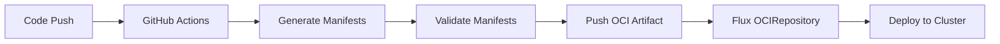

# How to Generate Kubernetes Manifests with GitHub Actions for Flux

Author: [nawazdhandala](https://github.com/nawazdhandala)

Tags: Flux CD, GitHub Actions, kubernetes manifests, Kustomize, oci artifacts, CI/CD, Manifest Generation

Description: A practical guide to generating Kubernetes manifests in GitHub Actions CI pipelines and delivering them to Flux CD via OCI artifacts and kustomize overlays.

---

## Introduction

Many teams prefer to generate Kubernetes manifests dynamically rather than maintaining them by hand. Whether you use Helm templates, kustomize, jsonnet, or custom scripts, generating manifests in CI ensures consistency and reduces manual errors. GitHub Actions can run these generators, validate the output, and push the results as OCI artifacts that Flux CD consumes for deployment.

This guide covers manifest generation techniques in GitHub Actions, pushing generated manifests as OCI artifacts, and configuring Flux to deploy them.

## Prerequisites

- A GitHub repository with application code and manifest templates
- A Kubernetes cluster with Flux CD bootstrapped
- Flux CLI installed locally
- A container registry that supports OCI artifacts (GHCR, Docker Hub, etc.)

## Architecture Overview



## Step 1: Set Up the Manifest Generation Workflow

Create a GitHub Actions workflow that generates manifests from templates.

```yaml
# .github/workflows/generate-manifests.yaml
name: Generate and Push Kubernetes Manifests

on:
  push:
    branches:
      - main
    paths:
      # Trigger when templates or values change
      - "manifests/**"
      - "helm/**"
      - "kustomize/**"
      - "Dockerfile"
  pull_request:
    branches:
      - main
    paths:
      - "manifests/**"
      - "helm/**"
      - "kustomize/**"

env:
  REGISTRY: ghcr.io
  ARTIFACT_REPO: ${{ github.repository }}-manifests

jobs:
  generate:
    runs-on: ubuntu-latest
    permissions:
      contents: read
      packages: write
    steps:
      - name: Checkout repository
        uses: actions/checkout@v4

      - name: Set up tools
        run: |
          # Install kustomize
          curl -s "https://raw.githubusercontent.com/kubernetes-sigs/kustomize/master/hack/install_kustomize.sh" | bash
          sudo mv kustomize /usr/local/bin/

          # Install Helm
          curl https://raw.githubusercontent.com/helm/helm/main/scripts/get-helm-3 | bash

          # Install kubeval for validation
          curl -L https://github.com/instrumenta/kubeval/releases/latest/download/kubeval-linux-amd64.tar.gz | tar xz
          sudo mv kubeval /usr/local/bin/

      - name: Generate manifests from kustomize
        run: |
          # Create output directory
          mkdir -p generated/

          # Build kustomize overlays for each environment
          for env_dir in kustomize/overlays/*/; do
            ENV_NAME=$(basename "$env_dir")
            echo "Generating manifests for environment: $ENV_NAME"

            kustomize build "$env_dir" > "generated/${ENV_NAME}.yaml"
            echo "  Output: generated/${ENV_NAME}.yaml"
          done

      - name: Generate manifests from Helm templates
        run: |
          # Template Helm charts with environment-specific values
          for values_file in helm/values-*.yaml; do
            ENV_NAME=$(basename "$values_file" | sed 's/values-//' | sed 's/.yaml//')
            echo "Generating Helm manifests for: $ENV_NAME"

            helm template my-app helm/chart/ \
              --values "$values_file" \
              --namespace my-app \
              --set image.tag="${{ github.sha }}" \
              > "generated/helm-${ENV_NAME}.yaml"
          done

      - name: Validate generated manifests
        run: |
          echo "Validating all generated manifests..."
          for manifest in generated/*.yaml; do
            echo "Validating: $manifest"

            # Check YAML syntax
            python3 -c "import yaml; list(yaml.safe_load_all(open('$manifest')))"

            # Validate against Kubernetes schemas
            kubeval "$manifest" --strict --ignore-missing-schemas
            echo "  Valid"
          done

      - name: Upload manifests as artifact
        uses: actions/upload-artifact@v4
        with:
          name: kubernetes-manifests
          path: generated/
          retention-days: 30
```

## Step 2: Push Manifests as OCI Artifacts

After generating and validating manifests, push them as OCI artifacts for Flux.

```yaml
# Add this job to the workflow above
  push-oci:
    needs: generate
    runs-on: ubuntu-latest
    if: github.event_name == 'push' && github.ref == 'refs/heads/main'
    permissions:
      contents: read
      packages: write
      id-token: write
    steps:
      - name: Checkout repository
        uses: actions/checkout@v4

      - name: Download generated manifests
        uses: actions/download-artifact@v4
        with:
          name: kubernetes-manifests
          path: generated/

      - name: Set up Flux CLI
        uses: fluxcd/flux2/action@main

      - name: Push OCI artifact for production
        run: |
          # Create a kustomization.yaml that references the generated manifests
          cat > generated/kustomization.yaml <<'KUSTOM'
          apiVersion: kustomize.config.k8s.io/v1beta1
          kind: Kustomization
          resources:
            - production.yaml
            - helm-production.yaml
          KUSTOM

          # Push the manifests as an OCI artifact
          flux push artifact \
            oci://${{ env.REGISTRY }}/${{ env.ARTIFACT_REPO }}:$(git rev-parse --short HEAD) \
            --path=./generated \
            --source="$(git config --get remote.origin.url)" \
            --revision="main/$(git rev-parse HEAD)" \
            --creds ${{ github.actor }}:${{ secrets.GITHUB_TOKEN }}

      - name: Tag as latest
        run: |
          flux tag artifact \
            oci://${{ env.REGISTRY }}/${{ env.ARTIFACT_REPO }}:$(git rev-parse --short HEAD) \
            --tag latest \
            --creds ${{ github.actor }}:${{ secrets.GITHUB_TOKEN }}

      - name: Tag with timestamp
        run: |
          TIMESTAMP=$(date +'%Y%m%d%H%M%S')
          flux tag artifact \
            oci://${{ env.REGISTRY }}/${{ env.ARTIFACT_REPO }}:$(git rev-parse --short HEAD) \
            --tag "$TIMESTAMP" \
            --creds ${{ github.actor }}:${{ secrets.GITHUB_TOKEN }}
```

## Step 3: Configure Flux to Consume Generated Manifests

Set up Flux to pull and deploy the generated manifests from the OCI artifact.

```yaml
# clusters/production/oci-source.yaml
apiVersion: source.toolkit.fluxcd.io/v1
kind: OCIRepository
metadata:
  name: app-manifests
  namespace: flux-system
spec:
  # OCI artifact pushed by GitHub Actions
  url: oci://ghcr.io/my-org/my-app-manifests
  interval: 5m
  ref:
    tag: latest
  provider: generic
  secretRef:
    name: ghcr-credentials
```

Create the Kustomization to deploy:

```yaml
# clusters/production/app-deployment.yaml
apiVersion: kustomize.toolkit.fluxcd.io/v1
kind: Kustomization
metadata:
  name: app-manifests
  namespace: flux-system
spec:
  interval: 10m
  retryInterval: 2m
  sourceRef:
    kind: OCIRepository
    name: app-manifests
  path: ./
  prune: true
  wait: true
  timeout: 5m
  # Force apply to handle resource conflicts
  force: false
  healthChecks:
    - apiVersion: apps/v1
      kind: Deployment
      name: my-app
      namespace: my-app
```

## Step 4: Set Up Kustomize Overlays

Structure your kustomize configuration for manifest generation.

Base manifests:

```yaml
# kustomize/base/deployment.yaml
apiVersion: apps/v1
kind: Deployment
metadata:
  name: my-app
spec:
  selector:
    matchLabels:
      app: my-app
  template:
    metadata:
      labels:
        app: my-app
    spec:
      containers:
        - name: my-app
          image: ghcr.io/my-org/my-app:latest
          ports:
            - containerPort: 8080
          readinessProbe:
            httpGet:
              path: /health
              port: 8080
            initialDelaySeconds: 5
            periodSeconds: 10

---
# kustomize/base/service.yaml
apiVersion: v1
kind: Service
metadata:
  name: my-app
spec:
  selector:
    app: my-app
  ports:
    - port: 80
      targetPort: 8080

---
# kustomize/base/kustomization.yaml
apiVersion: kustomize.config.k8s.io/v1beta1
kind: Kustomization
resources:
  - deployment.yaml
  - service.yaml
```

Production overlay:

```yaml
# kustomize/overlays/production/kustomization.yaml
apiVersion: kustomize.config.k8s.io/v1beta1
kind: Kustomization
namespace: my-app
resources:
  - ../../base
  - namespace.yaml
  - hpa.yaml
patches:
  - target:
      kind: Deployment
      name: my-app
    patch: |
      - op: replace
        path: /spec/replicas
        value: 5
      - op: add
        path: /spec/template/spec/containers/0/resources
        value:
          requests:
            cpu: 500m
            memory: 512Mi
          limits:
            cpu: 1000m
            memory: 1Gi
images:
  - name: ghcr.io/my-org/my-app
    newTag: "1.2.0"

---
# kustomize/overlays/production/namespace.yaml
apiVersion: v1
kind: Namespace
metadata:
  name: my-app

---
# kustomize/overlays/production/hpa.yaml
apiVersion: autoscaling/v2
kind: HorizontalPodAutoscaler
metadata:
  name: my-app
spec:
  scaleTargetRef:
    apiVersion: apps/v1
    kind: Deployment
    name: my-app
  minReplicas: 5
  maxReplicas: 20
  metrics:
    - type: Resource
      resource:
        name: cpu
        target:
          type: Utilization
          averageUtilization: 70
```

Staging overlay:

```yaml
# kustomize/overlays/staging/kustomization.yaml
apiVersion: kustomize.config.k8s.io/v1beta1
kind: Kustomization
namespace: my-app-staging
resources:
  - ../../base
  - namespace.yaml
patches:
  - target:
      kind: Deployment
      name: my-app
    patch: |
      - op: replace
        path: /spec/replicas
        value: 2
      - op: add
        path: /spec/template/spec/containers/0/resources
        value:
          requests:
            cpu: 100m
            memory: 128Mi
          limits:
            cpu: 250m
            memory: 256Mi
images:
  - name: ghcr.io/my-org/my-app
    newTag: "1.3.0-rc.1"

---
# kustomize/overlays/staging/namespace.yaml
apiVersion: v1
kind: Namespace
metadata:
  name: my-app-staging
```

## Step 5: Add Manifest Diffing to Pull Requests

Show manifest changes in PR comments to make reviews easier:

```yaml
# .github/workflows/manifest-diff.yaml
name: Manifest Diff

on:
  pull_request:
    branches:
      - main
    paths:
      - "kustomize/**"
      - "helm/**"

jobs:
  diff:
    runs-on: ubuntu-latest
    permissions:
      pull-requests: write
    steps:
      - name: Checkout PR branch
        uses: actions/checkout@v4
        with:
          path: pr-branch

      - name: Checkout main branch
        uses: actions/checkout@v4
        with:
          ref: main
          path: main-branch

      - name: Install kustomize
        run: |
          curl -s "https://raw.githubusercontent.com/kubernetes-sigs/kustomize/master/hack/install_kustomize.sh" | bash
          sudo mv kustomize /usr/local/bin/

      - name: Generate diff
        id: diff
        run: |
          # Build manifests from both branches
          mkdir -p output/main output/pr

          for env_dir in pr-branch/kustomize/overlays/*/; do
            ENV_NAME=$(basename "$env_dir")

            # Build from main branch
            if [ -d "main-branch/kustomize/overlays/$ENV_NAME" ]; then
              kustomize build "main-branch/kustomize/overlays/$ENV_NAME" > "output/main/${ENV_NAME}.yaml" 2>/dev/null || true
            fi

            # Build from PR branch
            kustomize build "$env_dir" > "output/pr/${ENV_NAME}.yaml" 2>/dev/null || true
          done

          # Generate the diff
          DIFF=$(diff -u output/main/ output/pr/ || true)

          # Write diff to file for the PR comment
          echo "$DIFF" > manifest-diff.txt

      - name: Comment diff on PR
        uses: actions/github-script@v7
        with:
          script: |
            const fs = require('fs');
            const diff = fs.readFileSync('manifest-diff.txt', 'utf8');

            const body = diff
              ? `### Manifest Changes\n\`\`\`diff\n${diff.substring(0, 60000)}\n\`\`\``
              : '### Manifest Changes\nNo changes detected in generated manifests.';

            // Find existing comment
            const comments = await github.rest.issues.listComments({
              owner: context.repo.owner,
              repo: context.repo.repo,
              issue_number: context.issue.number,
            });

            const existing = comments.data.find(c =>
              c.body.includes('### Manifest Changes')
            );

            if (existing) {
              await github.rest.issues.updateComment({
                owner: context.repo.owner,
                repo: context.repo.repo,
                comment_id: existing.id,
                body: body,
              });
            } else {
              await github.rest.issues.createComment({
                owner: context.repo.owner,
                repo: context.repo.repo,
                issue_number: context.issue.number,
                body: body,
              });
            }
```

## Step 6: Add OCI Artifact Versioning

Implement proper versioning for your OCI artifacts:

```yaml
  version-artifact:
    needs: push-oci
    runs-on: ubuntu-latest
    permissions:
      packages: write
    steps:
      - name: Checkout repository
        uses: actions/checkout@v4
        with:
          fetch-depth: 0

      - name: Set up Flux CLI
        uses: fluxcd/flux2/action@main

      - name: Determine version
        id: version
        run: |
          # Get the latest git tag for semver
          LATEST_TAG=$(git describe --tags --abbrev=0 2>/dev/null || echo "v0.0.0")
          echo "version=${LATEST_TAG#v}" >> $GITHUB_OUTPUT

      - name: Tag artifact with version
        run: |
          flux tag artifact \
            oci://${{ env.REGISTRY }}/${{ env.ARTIFACT_REPO }}:$(git rev-parse --short HEAD) \
            --tag "${{ steps.version.outputs.version }}" \
            --creds ${{ github.actor }}:${{ secrets.GITHUB_TOKEN }}
```

## Step 7: Verify the Pipeline

Test the complete manifest generation and deployment flow:

```bash
# Make changes to kustomize templates
vim kustomize/overlays/production/kustomization.yaml

# Push changes
git add .
git commit -m "feat: update production replicas"
git push origin main

# Watch the GitHub Actions run
gh run watch

# Verify the OCI artifact was pushed
flux pull artifact oci://ghcr.io/my-org/my-app-manifests:latest \
  --output ./verify-output

# Check manifests were generated correctly
cat verify-output/production.yaml

# Verify Flux picked up the new artifact
flux get sources oci app-manifests

# Check the deployment was updated
kubectl get deployment my-app -n my-app
```

## Troubleshooting

### Kustomize Build Failures

```bash
# Test the build locally
kustomize build kustomize/overlays/production/

# Check for missing resources
kustomize build kustomize/overlays/production/ 2>&1 | grep -i error
```

### OCI Artifact Push Failures

```bash
# Verify registry authentication
echo $GITHUB_TOKEN | docker login ghcr.io -u $GITHUB_ACTOR --password-stdin

# Check artifact exists
flux pull artifact oci://ghcr.io/my-org/my-app-manifests:latest --output /tmp/test
```

### Flux Not Detecting New Artifacts

```bash
# Check OCI source status
flux get sources oci

# Force reconciliation
flux reconcile source oci app-manifests

# Check source controller logs
kubectl logs -n flux-system deployment/source-controller | grep oci
```

## Conclusion

You now have a manifest generation pipeline where GitHub Actions builds Kubernetes manifests from templates, validates them, and pushes them as OCI artifacts for Flux CD to deploy. This approach keeps your deployment manifests consistent, validated, and versioned, while allowing you to use any templating tool your team prefers. The PR diff feature gives reviewers clear visibility into what will change in the cluster.
