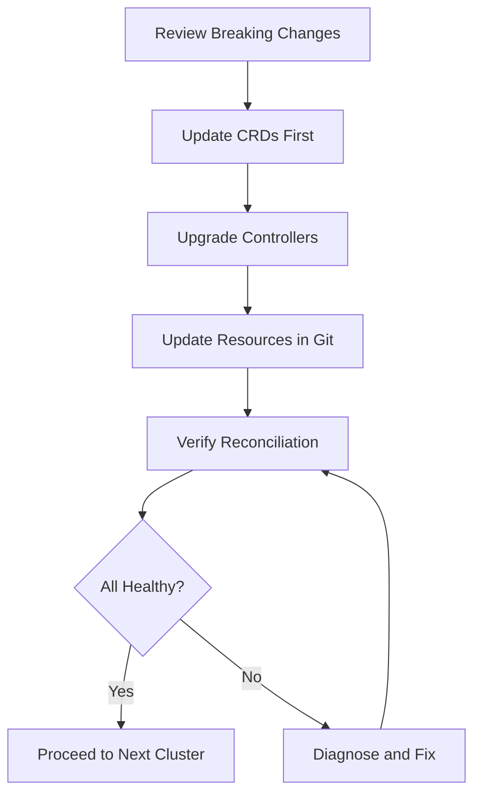

# How to Handle Breaking Changes When Upgrading Flux CD

Author: [nawazdhandala](https://github.com/nawazdhandala)

Tags: flux cd, breaking changes, upgrade, kubernetes, gitops, api migration, compatibility

Description: A detailed guide to identifying, preparing for, and resolving breaking changes when upgrading Flux CD to new major or minor versions.

---

## Introduction

Breaking changes in Flux CD can occur during major version upgrades or occasionally during minor version transitions when API versions graduate from beta to stable. These changes may affect CRD schemas, controller behavior, CLI commands, or API contracts. This guide walks you through identifying breaking changes, planning the migration, and executing upgrades that involve incompatible modifications.

## Common Types of Breaking Changes

Breaking changes in Flux CD typically fall into these categories:

- **CRD API version changes**: Moving from beta to stable API versions
- **Field removals or renames**: Deprecated fields being removed
- **Behavioral changes**: Modified reconciliation logic or defaults
- **CLI command changes**: Renamed or restructured CLI commands
- **RBAC requirement changes**: New permissions required by controllers
- **Dependency changes**: Minimum Kubernetes version requirements

## Step 1: Identify Breaking Changes

Start by thoroughly reviewing release notes and upgrade guides.

```bash
# List all releases between your version and the target
gh release list --repo fluxcd/flux2 --limit 30

# Download the upgrade guide for a specific version
gh release view v2.4.0 --repo fluxcd/flux2

# Check for breaking changes in individual controllers
gh release view v1.4.0 --repo fluxcd/source-controller
gh release view v1.4.0 --repo fluxcd/kustomize-controller
gh release view v1.1.0 --repo fluxcd/helm-controller

# Check the Flux CD documentation for migration guides
# https://fluxcd.io/flux/migration/
```

## Step 2: Audit Your Current Resources

Scan your cluster and Git repositories for resources that may be affected.

```bash
# List all Flux CRDs and their versions
kubectl get crds | grep fluxcd.io

# Export all Flux resources for analysis
flux export source git --all > audit/git-sources.yaml
flux export source helm --all > audit/helm-sources.yaml
flux export kustomization --all > audit/kustomizations.yaml
flux export helmrelease --all > audit/helmreleases.yaml
flux export alert --all > audit/alerts.yaml
flux export alert-provider --all > audit/providers.yaml

# Check for deprecated API versions in your manifests
grep -rn "v1beta1\|v1beta2" audit/
```

### Automated Deprecation Scanning

Create a script to find deprecated fields across your configuration repository.

```bash
#!/bin/bash
# scan-deprecated.sh
# Scans for deprecated Flux CD fields in YAML files

REPO_PATH="${1:-.}"
echo "Scanning $REPO_PATH for deprecated Flux CD fields..."

# Check for deprecated API versions
echo "=== Deprecated API Versions ==="
grep -rn "source.toolkit.fluxcd.io/v1beta1" "$REPO_PATH" --include="*.yaml"
grep -rn "kustomize.toolkit.fluxcd.io/v1beta1" "$REPO_PATH" --include="*.yaml"
grep -rn "helm.toolkit.fluxcd.io/v2beta1" "$REPO_PATH" --include="*.yaml"
grep -rn "notification.toolkit.fluxcd.io/v1beta1" "$REPO_PATH" --include="*.yaml"

# Check for deprecated fields
echo "=== Deprecated Fields ==="
grep -rn "spec.validation" "$REPO_PATH" --include="*.yaml"
grep -rn "spec.patchesStrategicMerge" "$REPO_PATH" --include="*.yaml"
grep -rn "spec.patchesJson6902" "$REPO_PATH" --include="*.yaml"

echo "Scan complete."
```

## Step 3: Handle CRD API Version Migrations

The most common breaking change is the graduation of API versions from beta to stable.

### Example: Kustomization API Migration

```yaml
# BEFORE: Using deprecated v1beta2 API
apiVersion: kustomize.toolkit.fluxcd.io/v1beta2
kind: Kustomization
metadata:
  name: my-app
  namespace: flux-system
spec:
  interval: 10m
  sourceRef:
    kind: GitRepository
    name: flux-config
  path: ./apps/my-app
  prune: true
  # Deprecated: validation field removed in v1
  validation: client
  # Deprecated: patchesStrategicMerge moved to patches
  patchesStrategicMerge:
    - apiVersion: apps/v1
      kind: Deployment
      metadata:
        name: my-app
      spec:
        replicas: 5
```

```yaml
# AFTER: Updated to stable v1 API
apiVersion: kustomize.toolkit.fluxcd.io/v1
kind: Kustomization
metadata:
  name: my-app
  namespace: flux-system
spec:
  interval: 10m
  sourceRef:
    kind: GitRepository
    name: flux-config
  path: ./apps/my-app
  prune: true
  # validation field is removed - no longer needed
  # patchesStrategicMerge replaced with patches
  patches:
    - target:
        kind: Deployment
        name: my-app
      patch: |
        apiVersion: apps/v1
        kind: Deployment
        metadata:
          name: my-app
        spec:
          replicas: 5
```

### Example: HelmRelease API Migration

```yaml
# BEFORE: Using v2beta1 API
apiVersion: helm.toolkit.fluxcd.io/v2beta1
kind: HelmRelease
metadata:
  name: nginx
  namespace: default
spec:
  interval: 5m
  chart:
    spec:
      chart: nginx
      version: "15.x"
      sourceRef:
        kind: HelmRepository
        name: bitnami
        namespace: flux-system
  # Deprecated: valuesFrom format changed
  valuesFrom:
    - kind: ConfigMap
      name: nginx-values
      valuesKey: values.yaml
```

```yaml
# AFTER: Updated to v2 API
apiVersion: helm.toolkit.fluxcd.io/v2
kind: HelmRelease
metadata:
  name: nginx
  namespace: default
spec:
  interval: 5m
  chart:
    spec:
      chart: nginx
      version: "15.x"
      sourceRef:
        kind: HelmRepository
        name: bitnami
        namespace: flux-system
  # Updated valuesFrom format
  valuesFrom:
    - kind: ConfigMap
      name: nginx-values
      valuesKey: values.yaml
      targetPath: ""
```

### Example: Source API Migration

```yaml
# BEFORE: GitRepository with deprecated fields
apiVersion: source.toolkit.fluxcd.io/v1beta2
kind: GitRepository
metadata:
  name: flux-config
  namespace: flux-system
spec:
  url: https://github.com/org/flux-config
  ref:
    branch: main
  interval: 5m
  # Deprecated: gitImplementation field removed
  gitImplementation: go-git
```

```yaml
# AFTER: Updated to v1 API with deprecated fields removed
apiVersion: source.toolkit.fluxcd.io/v1
kind: GitRepository
metadata:
  name: flux-config
  namespace: flux-system
spec:
  url: https://github.com/org/flux-config
  ref:
    branch: main
  interval: 5m
  # gitImplementation field removed - go-git is now the default
```

## Step 4: Handle Behavioral Changes

Some upgrades change how controllers behave, even if the API surface stays the same.

### Drift Detection Changes

```yaml
# New drift detection behavior in newer versions
apiVersion: kustomize.toolkit.fluxcd.io/v1
kind: Kustomization
metadata:
  name: my-app
  namespace: flux-system
spec:
  interval: 10m
  sourceRef:
    kind: GitRepository
    name: flux-config
  path: ./apps/my-app
  prune: true
  # Force reconciliation to correct drift
  # Behavior may differ between versions
  force: false
  # Configure how drift is handled
  wait: true
  timeout: 5m
```

### Default Value Changes

```bash
# Check if default values have changed by comparing behavior
# before and after upgrade

# Document current defaults
kubectl get kustomization -A -o yaml | grep -A2 "timeout\|interval\|retries"

# After upgrade, verify defaults are as expected
kubectl get kustomization -A -o yaml | grep -A2 "timeout\|interval\|retries"
```

## Step 5: Update RBAC Permissions

New versions may require additional RBAC permissions for controllers.

```yaml
# Additional ClusterRole rules that may be needed
# after a breaking change upgrade
apiVersion: rbac.authorization.k8s.io/v1
kind: ClusterRole
metadata:
  name: flux-custom-permissions
rules:
  # New permission required for cross-namespace references
  - apiGroups: [""]
    resources: ["namespaces"]
    verbs: ["get", "list", "watch"]
  # New permission for status subresource access
  - apiGroups: ["kustomize.toolkit.fluxcd.io"]
    resources: ["kustomizations/status"]
    verbs: ["get", "patch", "update"]
  # New permission for finalizer management
  - apiGroups: ["helm.toolkit.fluxcd.io"]
    resources: ["helmreleases/finalizers"]
    verbs: ["update"]
```

## Step 6: Staged Upgrade Approach

For upgrades with breaking changes, use a staged approach to minimize risk.



```bash
# Stage 1: Update CRDs to support both old and new API versions
flux install --crds=CreateReplace --version=v2.4.0

# Stage 2: Verify CRDs support the new API versions
kubectl get crd kustomizations.kustomize.toolkit.fluxcd.io -o yaml | grep -A10 "versions:"

# Stage 3: Update your manifests to use new API versions
# Do this in Git before upgrading controllers

# Stage 4: Upgrade the controllers
flux install --version=v2.4.0

# Stage 5: Verify everything reconciles correctly
flux get all -A
```

## Step 7: Handle CLI Breaking Changes

The Flux CLI may also have breaking changes that affect your scripts and CI/CD pipelines.

```bash
# Common CLI changes to watch for:

# BEFORE: Old command format
# flux create source git --url=...
# flux export kustomization --all

# AFTER: Check if commands have changed
flux --help
flux create source git --help

# Update CI/CD scripts to use new command syntax
# Example: updating a CI pipeline script
```

```yaml
# .github/workflows/flux-check.yaml
# Updated CI pipeline with new CLI syntax
name: Flux Validation
on:
  pull_request:
    branches: [main]
jobs:
  validate:
    runs-on: ubuntu-latest
    steps:
      - uses: actions/checkout@v4
      - name: Install Flux CLI
        # Pin to a specific version to avoid surprises
        uses: fluxcd/flux2/action@v2.4.0
      - name: Validate Flux resources
        run: |
          # Use the updated validation command
          flux check --pre
          # Validate manifests against the new API versions
          find . -name "*.yaml" -exec kubectl apply --dry-run=client -f {} \;
```

## Step 8: Testing Breaking Changes

Create a test plan specific to the breaking changes in your upgrade.

```bash
# Create a test namespace
kubectl create namespace flux-upgrade-test

# Deploy a test Kustomization with the new API format
cat <<EOF | kubectl apply -f -
apiVersion: kustomize.toolkit.fluxcd.io/v1
kind: Kustomization
metadata:
  name: upgrade-test
  namespace: flux-upgrade-test
spec:
  interval: 5m
  sourceRef:
    kind: GitRepository
    name: flux-config
    namespace: flux-system
  path: ./test
  prune: true
  patches:
    - target:
        kind: ConfigMap
        name: test-config
      patch: |
        - op: replace
          path: /data/version
          value: "new"
EOF

# Verify it reconciles
flux get kustomization upgrade-test -n flux-upgrade-test

# Clean up
kubectl delete namespace flux-upgrade-test
```

## Rollback Plan

Always have a rollback plan when dealing with breaking changes.

```bash
# If the upgrade fails, rollback to the previous version
flux install --version=v2.3.0

# If CRD changes prevent rollback, restore from backup
kubectl apply -f backup/crds.yaml

# Restore resources if needed
kubectl apply -f backup/kustomizations.yaml
kubectl apply -f backup/helmreleases.yaml
kubectl apply -f backup/git-sources.yaml
kubectl apply -f backup/helm-sources.yaml
```

## Conclusion

Handling breaking changes in Flux CD requires careful planning, thorough testing, and a staged upgrade approach. By auditing your resources before upgrading, testing changes in non-production environments, and maintaining rollback capabilities, you can navigate breaking changes confidently. Always review release notes and upgrade guides before starting, and consider running automated deprecation scanning as part of your CI/CD pipeline to catch issues early.
