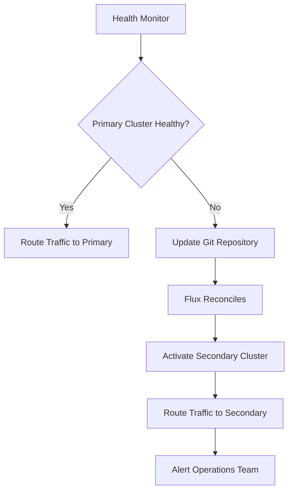

# How to Handle Cluster Failover with Flux CD GitOps

Author: [nawazdhandala](https://github.com/nawazdhandala)

Tags: flux cd, failover, disaster recovery, multi-cluster, gitops, kubernetes, high availability

Description: Learn how to implement cluster failover strategies using Flux CD GitOps to ensure application availability during cluster outages.

---

## Introduction

Cluster failover is a critical component of any production-grade multi-cluster strategy. When a cluster becomes unavailable due to infrastructure failure, network issues, or planned maintenance, workloads need to seamlessly shift to healthy clusters. Flux CD's GitOps approach makes failover predictable and auditable because the desired state, including failover configurations, is defined declaratively in Git.

This guide covers multiple failover strategies, from DNS-based failover to active-passive and active-active configurations managed entirely through GitOps.

## Prerequisites

- Two or more Kubernetes clusters (primary and secondary)
- Flux CD installed on all clusters
- A Git repository for fleet configuration
- External DNS or a global load balancer
- Shared storage or database replication (for stateful workloads)
- kubectl and Flux CLI installed

## Failover Architecture



## Strategy 1: DNS-Based Failover

The simplest approach uses health-checked DNS records to route traffic away from unhealthy clusters automatically.

### Step 1: Deploy Health Check Endpoints

```yaml
# infrastructure/health/deployment.yaml
# Health check endpoint that external monitors can probe
apiVersion: apps/v1
kind: Deployment
metadata:
  name: cluster-health
  namespace: kube-system
spec:
  replicas: 2
  selector:
    matchLabels:
      app: cluster-health
  template:
    metadata:
      labels:
        app: cluster-health
    spec:
      containers:
        - name: health
          image: your-org/health-checker:v1.0.0
          ports:
            - containerPort: 8080
          # Check critical cluster components
          env:
            - name: CHECK_ENDPOINTS
              value: "kubernetes.default.svc:443,coredns.kube-system.svc:53"
          livenessProbe:
            httpGet:
              path: /healthz
              port: 8080
            periodSeconds: 10
          readinessProbe:
            httpGet:
              path: /ready
              port: 8080
            periodSeconds: 5
---
apiVersion: v1
kind: Service
metadata:
  name: cluster-health
  namespace: kube-system
  annotations:
    # ExternalDNS will create a health-checked DNS record
    external-dns.alpha.kubernetes.io/hostname: "health.cluster-1.example.com"
spec:
  type: LoadBalancer
  selector:
    app: cluster-health
  ports:
    - port: 80
      targetPort: 8080
```

### Step 2: Configure ExternalDNS with Failover Policy

```yaml
# infrastructure/external-dns/helm-release.yaml
apiVersion: helm.toolkit.fluxcd.io/v2
kind: HelmRelease
metadata:
  name: external-dns
  namespace: external-dns
spec:
  interval: 30m
  chart:
    spec:
      chart: external-dns
      version: "1.14.x"
      sourceRef:
        kind: HelmRepository
        name: external-dns
  values:
    provider: aws
    domainFilters:
      - example.com
    policy: sync
    registry: txt
    txtOwnerId: "${CLUSTER_NAME}"
    # Set a low TTL so failover happens quickly
    extraArgs:
      - "--aws-prefer-cname"
      - "--txt-prefix=_externaldns."
```

### Step 3: Configure Application Ingress with Failover Annotations

```yaml
# apps/web-app/ingress.yaml
# Primary cluster ingress with failover routing policy
apiVersion: networking.k8s.io/v1
kind: Ingress
metadata:
  name: web-app
  namespace: production
  annotations:
    # Route53 failover routing policy
    external-dns.alpha.kubernetes.io/hostname: "app.example.com"
    external-dns.alpha.kubernetes.io/aws-failover: "PRIMARY"
    external-dns.alpha.kubernetes.io/set-identifier: "primary-cluster"
    external-dns.alpha.kubernetes.io/aws-health-check-id: "${HEALTH_CHECK_ID}"
spec:
  ingressClassName: nginx
  tls:
    - hosts:
        - app.example.com
      secretName: app-tls
  rules:
    - host: app.example.com
      http:
        paths:
          - path: /
            pathType: Prefix
            backend:
              service:
                name: web-app
                port:
                  number: 80
```

```yaml
# Secondary cluster gets the SECONDARY failover annotation
# apps/web-app/ingress-secondary.yaml
apiVersion: networking.k8s.io/v1
kind: Ingress
metadata:
  name: web-app
  namespace: production
  annotations:
    external-dns.alpha.kubernetes.io/hostname: "app.example.com"
    external-dns.alpha.kubernetes.io/aws-failover: "SECONDARY"
    external-dns.alpha.kubernetes.io/set-identifier: "secondary-cluster"
spec:
  ingressClassName: nginx
  tls:
    - hosts:
        - app.example.com
      secretName: app-tls
  rules:
    - host: app.example.com
      http:
        paths:
          - path: /
            pathType: Prefix
            backend:
              service:
                name: web-app
                port:
                  number: 80
```

## Strategy 2: Active-Passive Failover with Flux

In this approach, the secondary cluster has all resources deployed but the application replicas are scaled to zero until failover is needed.

### Step 4: Define Active and Standby Configurations

```yaml
# clusters/primary/apps/web-app/kustomization.yaml
# Primary cluster runs the full deployment
apiVersion: kustomize.config.k8s.io/v1beta1
kind: Kustomization
resources:
  - ../../../../base/apps/web-app
patches:
  - target:
      kind: Deployment
      name: web-app
    patch: |
      - op: replace
        path: /spec/replicas
        value: 5
      - op: add
        path: /metadata/labels/cluster-role
        value: primary
```

```yaml
# clusters/secondary/apps/web-app/kustomization.yaml
# Secondary cluster keeps replicas at zero until failover
apiVersion: kustomize.config.k8s.io/v1beta1
kind: Kustomization
resources:
  - ../../../../base/apps/web-app
patches:
  - target:
      kind: Deployment
      name: web-app
    patch: |
      - op: replace
        path: /spec/replicas
        value: 0
      - op: add
        path: /metadata/labels/cluster-role
        value: standby
```

### Step 5: Automate Failover with a Git Commit

When the primary cluster fails, trigger failover by updating the Git repository.

```yaml
# failover-script.yaml
# This ConfigMap contains the failover automation script
apiVersion: v1
kind: ConfigMap
metadata:
  name: failover-script
  namespace: flux-system
data:
  failover.sh: |
    #!/bin/bash
    # Failover script: scales up secondary and scales down primary

    REPO_URL="git@github.com:your-org/fleet-config.git"
    BRANCH="main"

    # Clone the fleet config repo
    git clone $REPO_URL /tmp/fleet-config
    cd /tmp/fleet-config

    # Update secondary cluster to active
    sed -i 's/value: 0/value: 5/' \
      clusters/secondary/apps/web-app/kustomization.yaml

    # Update primary cluster to standby
    sed -i 's/value: 5/value: 0/' \
      clusters/primary/apps/web-app/kustomization.yaml

    # Commit and push
    git add .
    git commit -m "FAILOVER: Activate secondary cluster, deactivate primary"
    git push origin $BRANCH
```

### Step 6: Create a CronJob for Automated Health Monitoring

```yaml
# infrastructure/failover/health-monitor.yaml
# CronJob that checks primary cluster health and triggers failover
apiVersion: batch/v1
kind: CronJob
metadata:
  name: cluster-health-monitor
  namespace: flux-system
spec:
  # Check every minute
  schedule: "*/1 * * * *"
  concurrencyPolicy: Forbid
  jobTemplate:
    spec:
      template:
        spec:
          serviceAccountName: failover-sa
          containers:
            - name: monitor
              image: your-org/failover-monitor:v1.0.0
              env:
                - name: PRIMARY_HEALTH_URL
                  value: "https://health.cluster-1.example.com/ready"
                - name: FAILOVER_THRESHOLD
                  # Number of consecutive failures before triggering failover
                  value: "3"
                - name: GIT_REPO
                  value: "git@github.com:your-org/fleet-config.git"
                - name: GIT_BRANCH
                  value: "main"
              volumeMounts:
                - name: git-credentials
                  mountPath: /etc/git-credentials
                  readOnly: true
          volumes:
            - name: git-credentials
              secret:
                secretName: git-credentials
          restartPolicy: OnFailure
```

## Strategy 3: Active-Active with Flux

Both clusters run the application simultaneously, and traffic is distributed between them.

### Step 7: Configure Active-Active Deployments

```yaml
# clusters/cluster-1/apps/web-app/kustomization.yaml
# Cluster-1 runs a portion of the total replicas
apiVersion: kustomize.config.k8s.io/v1beta1
kind: Kustomization
resources:
  - ../../../../base/apps/web-app
patches:
  - target:
      kind: Deployment
      name: web-app
    patch: |
      - op: replace
        path: /spec/replicas
        value: 3
      - op: add
        path: /metadata/annotations/fleet.example.com~1role
        value: active
```

```yaml
# clusters/cluster-2/apps/web-app/kustomization.yaml
# Cluster-2 also runs a portion of replicas
apiVersion: kustomize.config.k8s.io/v1beta1
kind: Kustomization
resources:
  - ../../../../base/apps/web-app
patches:
  - target:
      kind: Deployment
      name: web-app
    patch: |
      - op: replace
        path: /spec/replicas
        value: 3
      - op: add
        path: /metadata/annotations/fleet.example.com~1role
        value: active
```

### Step 8: Automatic Scale-Up on Failover

When one cluster in an active-active setup fails, the remaining cluster should automatically scale up.

```yaml
# infrastructure/failover/scale-up-policy.yaml
# HorizontalPodAutoscaler to handle increased load during failover
apiVersion: autoscaling/v2
kind: HorizontalPodAutoscaler
metadata:
  name: web-app-failover-hpa
  namespace: production
spec:
  scaleTargetRef:
    apiVersion: apps/v1
    kind: Deployment
    name: web-app
  # Normal operation: 3 replicas. During failover: scale up to 10
  minReplicas: 3
  maxReplicas: 10
  metrics:
    - type: Resource
      resource:
        name: cpu
        target:
          type: Utilization
          averageUtilization: 70
    - type: Resource
      resource:
        name: memory
        target:
          type: Utilization
          averageUtilization: 80
  behavior:
    # Scale up quickly during failover
    scaleUp:
      stabilizationWindowSeconds: 30
      policies:
        - type: Pods
          value: 4
          periodSeconds: 60
    # Scale down slowly after recovery
    scaleDown:
      stabilizationWindowSeconds: 300
      policies:
        - type: Pods
          value: 1
          periodSeconds: 120
```

## Step 9: Set Up Flux Notifications for Failover Events

```yaml
# infrastructure/notifications/failover-alerts.yaml
# Notify the team when failover-related changes are reconciled
apiVersion: notification.toolkit.fluxcd.io/v1beta3
kind: Provider
metadata:
  name: pagerduty
  namespace: flux-system
spec:
  type: generic
  address: https://events.pagerduty.com/v2/enqueue
  secretRef:
    name: pagerduty-routing-key
---
apiVersion: notification.toolkit.fluxcd.io/v1beta3
kind: Alert
metadata:
  name: failover-alert
  namespace: flux-system
spec:
  providerRef:
    name: pagerduty
  eventSeverity: error
  eventSources:
    - kind: Kustomization
      namespace: flux-system
      name: "*"
  # Only alert on specific events
  inclusionList:
    - ".*FAILOVER.*"
  summary: "Cluster failover event detected"
```

## Step 10: Test Your Failover Process

Regularly test failover to ensure it works when needed.

```bash
# Simulate primary cluster failure by suspending Flux
flux suspend kustomization web-app --context=primary-cluster

# Trigger failover by updating Git
cd /tmp/fleet-config
# Scale down primary, scale up secondary
git commit -am "FAILOVER TEST: Activate secondary cluster"
git push

# Monitor secondary cluster scaling up
kubectl --context=secondary-cluster get deployment web-app -n production -w

# Verify traffic is flowing to secondary
curl -s https://app.example.com/health | jq .cluster

# After testing, restore primary
git commit -am "FAILOVER RECOVERY: Restore primary cluster"
git push

# Resume Flux on primary
flux resume kustomization web-app --context=primary-cluster
```

## Troubleshooting

**Failover not triggering**: Check that the health monitor CronJob is running and has correct connectivity to the primary cluster health endpoint.

**DNS not updating**: Verify ExternalDNS logs and check DNS TTL values. Low TTLs (30-60 seconds) are recommended for failover scenarios.

**Stateful workload data loss**: Ensure database replication is configured before relying on failover. Flux manages the Kubernetes resources, but data replication must be handled separately.

```bash
# Check failover monitor logs
kubectl logs -n flux-system -l app=cluster-health-monitor --tail=50

# Verify DNS resolution
dig +short app.example.com
```

## Conclusion

Cluster failover with Flux CD GitOps brings predictability and auditability to disaster recovery. Every failover action is a Git commit, providing a clear history of when failovers occurred and what changed. Whether you choose DNS-based, active-passive, or active-active failover, Flux ensures that the desired state is reconciled across all clusters. Regular failover testing, combined with automated health monitoring, ensures your applications remain available even when entire clusters go down.
