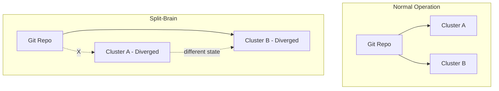

# How to Handle Split-Brain Scenarios with Flux CD

Author: [nawazdhandala](https://github.com/nawazdhandala)

Tags: Flux CD, Split-Brain, Multi-Cluster, Disaster Recovery, Kubernetes, GitOps

Description: A practical guide to preventing, detecting, and resolving split-brain scenarios in multi-cluster Flux CD deployments.

---

A split-brain scenario occurs when clusters in a multi-cluster setup lose connectivity and diverge in state. Each cluster continues operating independently, potentially making conflicting changes. This guide covers how to prevent, detect, and resolve split-brain situations in Flux CD deployments.

## What Causes Split-Brain in Flux CD

Split-brain can happen when:

- Network partitions separate clusters from each other or from the Git repository
- Different clusters reconcile different branches or commits
- Manual interventions are applied to one cluster but not reflected in Git
- Image automation runs independently on multiple clusters, producing conflicting updates



## Prevention Strategy 1: Single Source of Truth

The most important rule is that Git remains the only source of truth. Never make changes directly to clusters.

### Enforce GitOps-Only Changes

```yaml
# clusters/base/policies/deny-direct-changes.yaml
apiVersion: kyverno.io/v1
kind: ClusterPolicy
metadata:
  name: deny-direct-changes
spec:
  validationFailureAction: Enforce
  background: false
  rules:
    - name: deny-non-flux-changes
      match:
        any:
          - resources:
              kinds:
                - Deployment
                - Service
                - ConfigMap
                - Secret
              namespaces:
                - default
                - production
      preconditions:
        all:
          # Allow changes from Flux controllers
          - key: "{{ request.userInfo.username }}"
            operator: NotEquals
            value: "system:serviceaccount:flux-system:kustomize-controller"
          - key: "{{ request.userInfo.username }}"
            operator: NotEquals
            value: "system:serviceaccount:flux-system:helm-controller"
      validate:
        message: "Direct cluster changes are not allowed. Use Git to make changes."
        deny: {}
```

### Enable Drift Detection in Kustomizations

```yaml
# clusters/base/apps.yaml
apiVersion: kustomize.toolkit.fluxcd.io/v1
kind: Kustomization
metadata:
  name: apps
  namespace: flux-system
spec:
  interval: 5m
  sourceRef:
    kind: GitRepository
    name: flux-system
  path: ./clusters/base/apps
  prune: true
  wait: true
  # Force corrects any manual drift back to Git state
  force: false
  # Detect and report drift
  healthChecks:
    - apiVersion: apps/v1
      kind: Deployment
      name: my-app
      namespace: default
```

## Prevention Strategy 2: Centralized Image Automation

Run image automation on only one cluster to prevent conflicting Git updates.

```yaml
# clusters/cluster-a/image-automation.yaml
# Only Cluster A runs image automation
apiVersion: image.toolkit.fluxcd.io/v1
kind: ImageUpdateAutomation
metadata:
  name: image-updater
  namespace: flux-system
spec:
  interval: 5m
  sourceRef:
    kind: GitRepository
    name: flux-system
  git:
    checkout:
      ref:
        branch: main
    commit:
      author:
        email: flux@example.com
        name: flux-image-automation
      messageTemplate: "chore: update images {{range .Changed.Changes}}{{.OldValue}} -> {{.NewValue}}{{end}}"
    push:
      branch: main
  update:
    path: ./clusters/base/apps
    strategy: Setters
---
# clusters/cluster-b/image-automation.yaml
# Cluster B does NOT run image automation
# It only runs the image reflector to track available tags
apiVersion: image.toolkit.fluxcd.io/v1
kind: ImageRepository
metadata:
  name: my-app
  namespace: flux-system
spec:
  image: registry.example.com/my-app
  interval: 5m
# No ImageUpdateAutomation resource in Cluster B
```

## Prevention Strategy 3: Use Pinned Git References

Instead of tracking a branch, pin to specific commits or tags for critical environments.

```yaml
# clusters/production/flux-system/gotk-sync.yaml
apiVersion: source.toolkit.fluxcd.io/v1
kind: GitRepository
metadata:
  name: flux-system
  namespace: flux-system
spec:
  interval: 5m
  url: https://github.com/org/fleet-infra
  ref:
    # Use a specific tag instead of a branch
    # This prevents clusters from diverging on different commits
    tag: production-v1.2.3
  secretRef:
    name: flux-system
```

## Detecting Split-Brain Scenarios

### Monitor Cluster State Hashes

```yaml
# monitoring/state-comparison.yaml
apiVersion: batch/v1
kind: CronJob
metadata:
  name: state-hash-reporter
  namespace: flux-system
spec:
  schedule: "*/5 * * * *"
  jobTemplate:
    spec:
      template:
        spec:
          serviceAccountName: state-reporter
          containers:
            - name: reporter
              image: bitnami/kubectl:latest
              command:
                - /bin/sh
                - -c
                - |
                  # Generate a hash of current cluster state
                  STATE_HASH=$(kubectl get deployments,services,configmaps \
                    -n default -o json | sha256sum | cut -d' ' -f1)

                  CLUSTER_NAME=$(kubectl get configmap cluster-config \
                    -n default -o jsonpath='{.data.cluster-name}')

                  # Report state hash as a metric or to an external store
                  echo "cluster=$CLUSTER_NAME state_hash=$STATE_HASH timestamp=$(date -u +%s)"

                  # Write to a shared ConfigMap that can be compared
                  kubectl create configmap "state-hash-$CLUSTER_NAME" \
                    -n flux-system \
                    --from-literal=hash="$STATE_HASH" \
                    --from-literal=timestamp="$(date -u +%s)" \
                    --dry-run=client -o yaml | kubectl apply -f -
          restartPolicy: OnFailure
```

### Cross-Cluster State Comparison

```yaml
# monitoring/split-brain-detector.yaml
apiVersion: batch/v1
kind: CronJob
metadata:
  name: split-brain-detector
  namespace: flux-system
spec:
  schedule: "*/10 * * * *"
  jobTemplate:
    spec:
      template:
        spec:
          serviceAccountName: split-brain-detector
          containers:
            - name: detector
              image: curlimages/curl:latest
              env:
                - name: CLUSTER_A_API
                  value: "https://cluster-a.example.com"
                - name: CLUSTER_B_API
                  value: "https://cluster-b.example.com"
                - name: SLACK_WEBHOOK
                  valueFrom:
                    secretKeyRef:
                      name: slack-webhook
                      key: url
              command:
                - /bin/sh
                - -c
                - |
                  # Fetch Flux resource status from both clusters
                  CLUSTER_A_STATUS=$(curl -s -k \
                    "$CLUSTER_A_API/apis/kustomize.toolkit.fluxcd.io/v1/namespaces/flux-system/kustomizations/apps" \
                    -H "Authorization: Bearer $(cat /var/run/secrets/kubernetes.io/serviceaccount/token)")

                  CLUSTER_B_STATUS=$(curl -s -k \
                    "$CLUSTER_B_API/apis/kustomize.toolkit.fluxcd.io/v1/namespaces/flux-system/kustomizations/apps" \
                    -H "Authorization: Bearer $(cat /var/run/secrets/kubernetes.io/serviceaccount/token)")

                  # Compare last applied revision
                  REV_A=$(echo "$CLUSTER_A_STATUS" | grep -o '"lastAppliedRevision":"[^"]*"' | head -1)
                  REV_B=$(echo "$CLUSTER_B_STATUS" | grep -o '"lastAppliedRevision":"[^"]*"' | head -1)

                  if [ "$REV_A" != "$REV_B" ]; then
                    echo "SPLIT-BRAIN DETECTED!"
                    echo "Cluster A revision: $REV_A"
                    echo "Cluster B revision: $REV_B"

                    # Send alert
                    curl -X POST "$SLACK_WEBHOOK" \
                      -H "Content-Type: application/json" \
                      -d "{\"text\":\"SPLIT-BRAIN ALERT: Clusters are on different revisions. A=$REV_A B=$REV_B\"}"
                  else
                    echo "Clusters are in sync: $REV_A"
                  fi
          restartPolicy: OnFailure
```

### Flux Alert for Reconciliation Divergence

```yaml
# alerts/divergence-alert.yaml
apiVersion: notification.toolkit.fluxcd.io/v1beta3
kind: Alert
metadata:
  name: reconciliation-failure
  namespace: flux-system
spec:
  providerRef:
    name: slack-alert
  eventSeverity: error
  eventSources:
    - kind: Kustomization
      name: "*"
    - kind: GitRepository
      name: "*"
  # Alert on any reconciliation failure that could indicate
  # a cluster is falling behind
  exclusionList:
    - ".*no changes.*"
```

## Resolving Split-Brain

### Step 1: Identify the Divergence

```bash
# Compare Git revisions across clusters
for ctx in cluster-a cluster-b; do
  echo "=== $ctx ==="
  kubectl --context=$ctx get gitrepository flux-system -n flux-system \
    -o jsonpath='{.status.artifact.revision}'
  echo ""
  kubectl --context=$ctx get kustomization apps -n flux-system \
    -o jsonpath='{.status.lastAppliedRevision}'
  echo ""
done
```

### Step 2: Determine the Correct State

```bash
# Check which cluster matches the current Git HEAD
CURRENT_GIT_REV=$(git -C /path/to/fleet-infra rev-parse HEAD)
echo "Git HEAD: $CURRENT_GIT_REV"

# Compare with each cluster
for ctx in cluster-a cluster-b; do
  CLUSTER_REV=$(kubectl --context=$ctx get gitrepository flux-system \
    -n flux-system -o jsonpath='{.status.artifact.revision}' | cut -d'/' -f2)
  if [ "$CLUSTER_REV" = "$CURRENT_GIT_REV" ]; then
    echo "$ctx is in sync with Git"
  else
    echo "$ctx is DIVERGED (at $CLUSTER_REV)"
  fi
done
```

### Step 3: Force Reconciliation on Diverged Clusters

```bash
# Force the diverged cluster to re-sync with Git
DIVERGED_CLUSTER="cluster-b"

# Suspend and resume to clear cached state
kubectl --context=$DIVERGED_CLUSTER patch gitrepository flux-system \
  -n flux-system --type=merge -p '{"spec":{"suspend":true}}'

sleep 5

kubectl --context=$DIVERGED_CLUSTER patch gitrepository flux-system \
  -n flux-system --type=merge -p '{"spec":{"suspend":false}}'

# Force reconciliation
kubectl --context=$DIVERGED_CLUSTER annotate --overwrite \
  gitrepository flux-system -n flux-system \
  reconcile.fluxcd.io/requestedAt="$(date +%s)"

kubectl --context=$DIVERGED_CLUSTER annotate --overwrite \
  kustomization flux-system -n flux-system \
  reconcile.fluxcd.io/requestedAt="$(date +%s)"

# Wait and verify
sleep 30
kubectl --context=$DIVERGED_CLUSTER get kustomization -n flux-system
```

### Step 4: Verify Resolution

```bash
# Confirm both clusters are now on the same revision
for ctx in cluster-a cluster-b; do
  echo "=== $ctx ==="
  kubectl --context=$ctx get gitrepository flux-system -n flux-system \
    -o jsonpath='{.status.artifact.revision}'
  echo ""
  kubectl --context=$ctx get deployments -n default -o wide
done

# Compare actual workload versions
diff \
  <(kubectl --context=cluster-a get deployments -n default -o jsonpath='{range .items[*]}{.metadata.name}={.spec.template.spec.containers[0].image}{"\n"}{end}' | sort) \
  <(kubectl --context=cluster-b get deployments -n default -o jsonpath='{range .items[*]}{.metadata.name}={.spec.template.spec.containers[0].image}{"\n"}{end}' | sort)
```

## Prevention Checklist

Use this checklist to minimize split-brain risk:

```yaml
# Split-brain prevention checklist as a ConfigMap for reference
apiVersion: v1
kind: ConfigMap
metadata:
  name: split-brain-checklist
  namespace: flux-system
data:
  checklist: |
    1. Git is the ONLY source of truth - no direct kubectl changes
    2. Image automation runs on ONE cluster only
    3. Kyverno/OPA policies block direct modifications
    4. Drift detection is enabled on all Kustomizations
    5. Cross-cluster state comparison runs every 10 minutes
    6. Alerts fire when clusters diverge in revision
    7. All clusters use the same Git ref (branch/tag)
    8. Network connectivity to Git is monitored
    9. Reconciliation intervals are consistent across clusters
    10. Runbooks exist for split-brain resolution
```

## Summary

Handling split-brain scenarios with Flux CD requires:

1. **Prevention** - Enforce GitOps-only changes, centralize image automation, use pinned references
2. **Detection** - Monitor cluster state hashes, compare revisions across clusters, set up alerts
3. **Resolution** - Identify divergence, determine correct state, force reconciliation
4. **Verification** - Confirm all clusters converge to the same state

The strongest defense against split-brain is maintaining Git as the single source of truth and never making direct cluster modifications.
