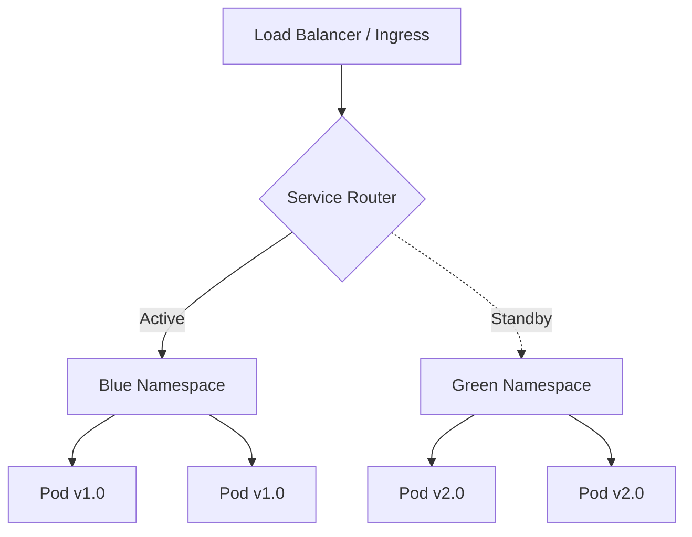

# How to Implement Blue-Green Namespace Deployments with Flux CD

Author: [nawazdhandala](https://github.com/nawazdhandala)

Tags: Flux CD, Blue-Green Deployment, Namespace, Kubernetes, GitOps, Zero Downtime

Description: A practical guide to implementing blue-green deployments using separate Kubernetes namespaces managed by Flux CD.

---

Blue-green deployments reduce downtime and risk by running two identical environments and switching traffic between them. Using namespaces as the boundary for blue and green environments is a clean approach that works well with Flux CD's Kustomization system. This guide covers the full implementation from namespace setup to traffic switching.

## How Namespace-Based Blue-Green Works

In this pattern, you maintain two namespaces: one "blue" and one "green." At any time, one namespace is live (receiving traffic) and the other is idle (ready for the next deployment). When deploying a new version, you deploy to the idle namespace, verify it works, then switch traffic to it.



## Step 1: Set Up the Namespace Structure

Create the blue and green namespaces with labels to track which is active.

```yaml
# apps/my-app/namespaces/blue.yaml
apiVersion: v1
kind: Namespace
metadata:
  name: my-app-blue
  labels:
    app: my-app
    slot: blue
    # This label indicates which namespace is currently active
    active: "true"
```

```yaml
# apps/my-app/namespaces/green.yaml
apiVersion: v1
kind: Namespace
metadata:
  name: my-app-green
  labels:
    app: my-app
    slot: green
    active: "false"
```

```yaml
# apps/my-app/namespaces/kustomization.yaml
apiVersion: kustomize.config.k8s.io/v1beta1
kind: Kustomization
resources:
  - blue.yaml
  - green.yaml
```

## Step 2: Create Base Application Manifests

Define the application manifests once and use Kustomize overlays for each namespace.

```yaml
# apps/my-app/base/deployment.yaml
apiVersion: apps/v1
kind: Deployment
metadata:
  name: my-app
spec:
  replicas: 3
  selector:
    matchLabels:
      app: my-app
  template:
    metadata:
      labels:
        app: my-app
    spec:
      containers:
        - name: my-app
          image: registry.example.com/my-app:1.0.0
          ports:
            - containerPort: 8080
          readinessProbe:
            httpGet:
              path: /ready
              port: 8080
            initialDelaySeconds: 5
            periodSeconds: 5
          livenessProbe:
            httpGet:
              path: /health
              port: 8080
            initialDelaySeconds: 10
            periodSeconds: 10
          resources:
            requests:
              cpu: 100m
              memory: 128Mi
            limits:
              cpu: 500m
              memory: 512Mi
```

```yaml
# apps/my-app/base/service.yaml
apiVersion: v1
kind: Service
metadata:
  name: my-app
spec:
  selector:
    app: my-app
  ports:
    - port: 80
      targetPort: 8080
```

```yaml
# apps/my-app/base/kustomization.yaml
apiVersion: kustomize.config.k8s.io/v1beta1
kind: Kustomization
resources:
  - deployment.yaml
  - service.yaml
```

## Step 3: Create Blue and Green Overlays

```yaml
# apps/my-app/overlays/blue/kustomization.yaml
apiVersion: kustomize.config.k8s.io/v1beta1
kind: Kustomization
namespace: my-app-blue
resources:
  - ../../base
# Blue runs the current production version
images:
  - name: registry.example.com/my-app
    newTag: "1.0.0"
```

```yaml
# apps/my-app/overlays/green/kustomization.yaml
apiVersion: kustomize.config.k8s.io/v1beta1
kind: Kustomization
namespace: my-app-green
resources:
  - ../../base
# Green gets the new version during deployment
images:
  - name: registry.example.com/my-app
    newTag: "2.0.0"
```

## Step 4: Create the Traffic Router

The traffic router determines which namespace receives production traffic. This is typically an Ingress or a Service in a shared namespace.

```yaml
# apps/my-app/router/ingress.yaml
apiVersion: networking.k8s.io/v1
kind: Ingress
metadata:
  name: my-app-router
  namespace: default
  annotations:
    nginx.ingress.kubernetes.io/upstream-vhost: my-app.example.com
spec:
  ingressClassName: nginx
  rules:
    - host: my-app.example.com
      http:
        paths:
          - path: /
            pathType: Prefix
            backend:
              service:
                # Points to the ExternalName service that routes to the active namespace
                name: my-app-active
                port:
                  number: 80
```

```yaml
# apps/my-app/router/active-service.yaml
# This ExternalName service points to whichever namespace is active
apiVersion: v1
kind: Service
metadata:
  name: my-app-active
  namespace: default
spec:
  type: ExternalName
  # Change this to switch between blue and green
  externalName: my-app.my-app-blue.svc.cluster.local
```

```yaml
# apps/my-app/router/kustomization.yaml
apiVersion: kustomize.config.k8s.io/v1beta1
kind: Kustomization
resources:
  - ingress.yaml
  - active-service.yaml
```

## Step 5: Create Flux Kustomizations

```yaml
# clusters/production/apps/my-app-namespaces.yaml
apiVersion: kustomize.toolkit.fluxcd.io/v1
kind: Kustomization
metadata:
  name: my-app-namespaces
  namespace: flux-system
spec:
  interval: 10m
  path: ./apps/my-app/namespaces
  prune: false
  sourceRef:
    kind: GitRepository
    name: flux-system
```

```yaml
# clusters/production/apps/my-app-blue.yaml
apiVersion: kustomize.toolkit.fluxcd.io/v1
kind: Kustomization
metadata:
  name: my-app-blue
  namespace: flux-system
spec:
  interval: 5m
  path: ./apps/my-app/overlays/blue
  prune: true
  sourceRef:
    kind: GitRepository
    name: flux-system
  dependsOn:
    - name: my-app-namespaces
  wait: true
  timeout: 10m
  healthChecks:
    - apiVersion: apps/v1
      kind: Deployment
      name: my-app
      namespace: my-app-blue
```

```yaml
# clusters/production/apps/my-app-green.yaml
apiVersion: kustomize.toolkit.fluxcd.io/v1
kind: Kustomization
metadata:
  name: my-app-green
  namespace: flux-system
spec:
  interval: 5m
  path: ./apps/my-app/overlays/green
  prune: true
  sourceRef:
    kind: GitRepository
    name: flux-system
  dependsOn:
    - name: my-app-namespaces
  wait: true
  timeout: 10m
  healthChecks:
    - apiVersion: apps/v1
      kind: Deployment
      name: my-app
      namespace: my-app-green
```

```yaml
# clusters/production/apps/my-app-router.yaml
apiVersion: kustomize.toolkit.fluxcd.io/v1
kind: Kustomization
metadata:
  name: my-app-router
  namespace: flux-system
spec:
  interval: 5m
  path: ./apps/my-app/router
  prune: true
  sourceRef:
    kind: GitRepository
    name: flux-system
  # Router depends on both blue and green being ready
  dependsOn:
    - name: my-app-blue
    - name: my-app-green
```

## Step 6: Deployment Workflow

To deploy a new version, follow this workflow:

```bash
# Step 1: Determine which namespace is currently idle
# If blue is active, deploy to green (and vice versa)
kubectl get ns my-app-blue -o jsonpath='{.metadata.labels.active}'
# Returns "true" - so green is the idle namespace

# Step 2: Update the green overlay with the new version
cd apps/my-app/overlays/green
```

```yaml
# apps/my-app/overlays/green/kustomization.yaml
apiVersion: kustomize.config.k8s.io/v1beta1
kind: Kustomization
namespace: my-app-green
resources:
  - ../../base
images:
  - name: registry.example.com/my-app
    # Update to the new version
    newTag: "2.0.0"
```

```bash
# Step 3: Commit and push - Flux deploys to green
git add apps/my-app/overlays/green/kustomization.yaml
git commit -m "Deploy v2.0.0 to green namespace"
git push origin main

# Step 4: Wait for green deployment to be ready
flux get kustomization my-app-green --watch
# Wait until status shows "Applied revision: main@sha1:..."

# Step 5: Verify the green deployment manually
kubectl get pods -n my-app-green
kubectl exec -n my-app-green deploy/my-app -- curl -s localhost:8080/health
```

## Step 7: Switch Traffic

Once the new version is verified in the idle namespace, switch traffic.

```yaml
# apps/my-app/router/active-service.yaml
apiVersion: v1
kind: Service
metadata:
  name: my-app-active
  namespace: default
spec:
  type: ExternalName
  # Switch from blue to green
  externalName: my-app.my-app-green.svc.cluster.local
```

```bash
# Commit the traffic switch
git add apps/my-app/router/active-service.yaml
git commit -m "Switch traffic to green (v2.0.0)"
git push origin main

# Update namespace labels to reflect the new active state
kubectl label ns my-app-blue active=false --overwrite
kubectl label ns my-app-green active=true --overwrite

# Monitor the switch
flux get kustomization my-app-router --watch
```

## Step 8: Instant Rollback

If something goes wrong, switching back is a single Git commit.

```yaml
# apps/my-app/router/active-service.yaml
apiVersion: v1
kind: Service
metadata:
  name: my-app-active
  namespace: default
spec:
  type: ExternalName
  # Rollback: switch back to blue
  externalName: my-app.my-app-blue.svc.cluster.local
```

```bash
# Commit the rollback
git add apps/my-app/router/active-service.yaml
git commit -m "Rollback: switch traffic back to blue (v1.0.0)"
git push origin main

# Traffic switches back immediately after Flux reconciles
# The old version is still running untouched in the blue namespace
```

## Step 9: Using Istio for Traffic Management

For more sophisticated traffic management, use Istio VirtualService instead of ExternalName services.

```yaml
# apps/my-app/router/virtual-service.yaml
apiVersion: networking.istio.io/v1beta1
kind: VirtualService
metadata:
  name: my-app
  namespace: default
spec:
  hosts:
    - my-app.example.com
  http:
    - route:
        # Active namespace gets 100% of traffic
        - destination:
            host: my-app.my-app-green.svc.cluster.local
            port:
              number: 80
          weight: 100
        # Idle namespace gets 0% (ready for next deployment)
        - destination:
            host: my-app.my-app-blue.svc.cluster.local
            port:
              number: 80
          weight: 0
```

You can also do a gradual shift:

```yaml
# apps/my-app/router/virtual-service.yaml
# Step 1: Send 10% to green for canary testing
apiVersion: networking.istio.io/v1beta1
kind: VirtualService
metadata:
  name: my-app
  namespace: default
spec:
  hosts:
    - my-app.example.com
  http:
    - route:
        - destination:
            host: my-app.my-app-blue.svc.cluster.local
            port:
              number: 80
          weight: 90
        - destination:
            host: my-app.my-app-green.svc.cluster.local
            port:
              number: 80
          weight: 10
```

## Step 10: Cleanup the Old Namespace

After the new version is stable, clean up the old namespace to prepare for the next deployment.

```yaml
# apps/my-app/overlays/blue/kustomization.yaml
apiVersion: kustomize.config.k8s.io/v1beta1
kind: Kustomization
namespace: my-app-blue
resources:
  - ../../base
# Update blue to match green so it is ready as a rollback target
# or scale it down to save resources
images:
  - name: registry.example.com/my-app
    newTag: "2.0.0"
```

Alternatively, scale down the idle namespace to save resources:

```yaml
# apps/my-app/overlays/blue/scale-down.yaml
apiVersion: apps/v1
kind: Deployment
metadata:
  name: my-app
spec:
  # Scale down the idle namespace to 0
  # Keep 1 replica if you want instant rollback capability
  replicas: 1
```

## Monitoring Blue-Green Deployments

```yaml
# clusters/production/notifications/blue-green-alerts.yaml
apiVersion: notification.toolkit.fluxcd.io/v1
kind: Alert
metadata:
  name: blue-green-alerts
  namespace: flux-system
spec:
  providerRef:
    name: slack
  eventSeverity: info
  eventSources:
    - kind: Kustomization
      name: "my-app-blue"
    - kind: Kustomization
      name: "my-app-green"
    - kind: Kustomization
      name: "my-app-router"
  summary: "Blue-green deployment status update"
```

## Summary

Blue-green namespace deployments with Flux CD use separate namespaces as deployment slots, Kustomize overlays to deploy different versions to each slot, and a traffic router (ExternalName Service, Ingress, or Istio VirtualService) to switch between them. Flux Kustomizations with dependencies ensure both namespaces are healthy before the router is applied. Rollbacks are instant since the previous version remains running in its namespace. This pattern provides zero-downtime deployments with a simple Git-based workflow.
