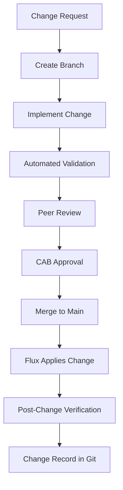

# How to Implement Change Management with Flux CD

Author: [nawazdhandala](https://github.com/nawazdhandala)

Tags: Flux CD, GitOps, Kubernetes, Change Management, ITIL, Governance

Description: A practical guide to implementing structured change management processes with Flux CD using GitOps principles.

---

Change management ensures that modifications to production systems are planned, reviewed, and traceable. Traditional change management involves ticketing systems and approval boards. With Flux CD, Git becomes the change management system. This guide shows how to implement structured change management workflows.

## Change Management Principles in GitOps

In a GitOps model, every change is a Git commit. This naturally provides:

- A description of the change (commit message)
- Who made the change (commit author)
- When the change was made (commit timestamp)
- What was changed (diff)
- Why it was approved (pull request discussion)



## Change Request Templates

Use pull request templates to enforce structured change requests.

```markdown
<!-- .github/PULL_REQUEST_TEMPLATE/change_request.md -->

## Change Request

### Summary
<!-- Brief description of what this change does -->

### Reason for Change
<!-- Why is this change needed? Link to issue or incident -->

### Risk Assessment
- [ ] Low risk - configuration change only
- [ ] Medium risk - new service or feature
- [ ] High risk - infrastructure or breaking change

### Impact Analysis
<!-- Which services/teams are affected? -->

### Rollback Plan
<!-- How to revert if something goes wrong -->

### Testing
- [ ] Tested in staging environment
- [ ] Load tested (if applicable)
- [ ] Security reviewed (if applicable)

### Change Window
<!-- When should this be applied? -->

### Approvals Required
- [ ] Team lead
- [ ] SRE on-call
- [ ] Security (for high-risk changes)
```

## Categorizing Changes with Labels

Use Git labels and directory structure to categorize changes by risk level.

```yaml
# Repository structure with risk-based organization
# fleet-infra/
#   changes/
#     standard/     (auto-approved, low risk)
#     normal/       (requires review, medium risk)
#     emergency/    (expedited review, high urgency)
#   apps/
#     base/
#     staging/
#     production/

# Standard change: configuration update
# apps/production/my-app/configmap.yaml
apiVersion: v1
kind: ConfigMap
metadata:
  name: my-app-config
  namespace: production
  labels:
    # Label for change tracking
    change-type: standard
    change-ticket: CHG-2024-001
  annotations:
    # Link to change request
    change-management/request-url: "https://github.com/my-org/fleet-infra/pull/42"
    change-management/approved-by: "jane.doe@my-org.com"
data:
  LOG_LEVEL: "info"
  CACHE_TTL: "300"
```

## Change Windows with Flux Suspend/Resume

Implement change windows by scheduling when Flux can apply changes.

```yaml
# CronJob to suspend Flux outside change windows
apiVersion: batch/v1
kind: CronJob
metadata:
  name: flux-suspend-outside-window
  namespace: flux-system
spec:
  # Suspend at 6 PM every day (end of change window)
  schedule: "0 18 * * *"
  jobTemplate:
    spec:
      template:
        spec:
          serviceAccountName: flux-scheduler
          containers:
            - name: suspend
              image: bitnami/kubectl:latest
              command:
                - /bin/sh
                - -c
                - |
                  # Suspend production kustomizations
                  kubectl patch kustomization production-apps \
                    -n flux-system \
                    --type=merge \
                    -p '{"spec":{"suspend":true}}'
                  echo "Flux suspended for production at $(date)"
          restartPolicy: OnFailure
---
# CronJob to resume Flux during change windows
apiVersion: batch/v1
kind: CronJob
metadata:
  name: flux-resume-change-window
  namespace: flux-system
spec:
  # Resume at 9 AM every weekday (start of change window)
  schedule: "0 9 * * 1-5"
  jobTemplate:
    spec:
      template:
        spec:
          serviceAccountName: flux-scheduler
          containers:
            - name: resume
              image: bitnami/kubectl:latest
              command:
                - /bin/sh
                - -c
                - |
                  # Resume production kustomizations
                  kubectl patch kustomization production-apps \
                    -n flux-system \
                    --type=merge \
                    -p '{"spec":{"suspend":false}}'
                  echo "Flux resumed for production at $(date)"
          restartPolicy: OnFailure
```

```yaml
# RBAC for the flux-scheduler service account
apiVersion: v1
kind: ServiceAccount
metadata:
  name: flux-scheduler
  namespace: flux-system
---
apiVersion: rbac.authorization.k8s.io/v1
kind: Role
metadata:
  name: flux-scheduler
  namespace: flux-system
rules:
  - apiGroups: ["kustomize.toolkit.fluxcd.io"]
    resources: ["kustomizations"]
    verbs: ["get", "patch"]
  - apiGroups: ["helm.toolkit.fluxcd.io"]
    resources: ["helmreleases"]
    verbs: ["get", "patch"]
---
apiVersion: rbac.authorization.k8s.io/v1
kind: RoleBinding
metadata:
  name: flux-scheduler
  namespace: flux-system
roleRef:
  apiGroup: rbac.authorization.k8s.io
  kind: Role
  name: flux-scheduler
subjects:
  - kind: ServiceAccount
    name: flux-scheduler
    namespace: flux-system
```

## Change Tracking with Git Tags

Use Git tags to mark approved changes and create a release log.

```bash
# Tag a change after it has been approved and merged
git tag -a "CHG-2024-001" -m "Deploy my-app v2.0.0 to production
Change Type: Normal
Risk: Medium
Approved By: Jane Doe, John Smith
Testing: Validated in staging for 48 hours
Rollback: Revert commit abc1234"

git push origin "CHG-2024-001"
```

```yaml
# Flux can reference specific tags for controlled deployments
apiVersion: source.toolkit.fluxcd.io/v1
kind: GitRepository
metadata:
  name: controlled-releases
  namespace: flux-system
spec:
  interval: 5m
  url: https://github.com/my-org/fleet-infra.git
  ref:
    # Pin to a specific approved tag
    tag: CHG-2024-001
```

## Emergency Changes

Emergency changes bypass the normal approval process but still go through Git for traceability.

```yaml
# Emergency change Kustomization with shorter interval
apiVersion: kustomize.toolkit.fluxcd.io/v1
kind: Kustomization
metadata:
  name: emergency-fixes
  namespace: flux-system
spec:
  # Poll more frequently for emergency changes
  interval: 1m
  sourceRef:
    kind: GitRepository
    name: fleet-infra
  path: ./emergency
  prune: false
  # Emergency changes applied immediately
  wait: false
```

```bash
# Emergency change workflow
# 1. Create PR with emergency label
gh pr create \
  --title "EMERGENCY: Fix critical database connection leak" \
  --label "emergency-change" \
  --body "## Emergency Change Request
Incident: INC-2024-042
Impact: Database connections exhausting pool
Fix: Reduce max connections from 100 to 50"

# 2. Get expedited approval (single reviewer for emergencies)
gh pr review --approve

# 3. Merge immediately
gh pr merge --merge

# 4. Force reconciliation
flux reconcile kustomization emergency-fixes --with-source

# 5. Document post-incident
# Create a follow-up PR with full change request documentation
```

## Change Audit Reports

Generate change audit reports from Git history.

```bash
#!/bin/bash
# generate-change-report.sh
# Generate a change management report from Git history

REPO_PATH="/path/to/fleet-infra"
START_DATE="2024-01-01"
END_DATE="2024-01-31"

echo "# Change Management Report"
echo "## Period: $START_DATE to $END_DATE"
echo ""

cd "$REPO_PATH"

# List all merged PRs in the period
echo "## Changes Applied"
git log --since="$START_DATE" --until="$END_DATE" \
  --merges \
  --pretty=format:"| %h | %ai | %an | %s |" \
  -- apps/production/

echo ""
echo "## Summary Statistics"
TOTAL=$(git log --since="$START_DATE" --until="$END_DATE" --merges --oneline -- apps/production/ | wc -l)
echo "Total changes: $TOTAL"

# Count changes by type (based on commit message patterns)
STANDARD=$(git log --since="$START_DATE" --until="$END_DATE" --merges --oneline --grep="standard" -- apps/production/ | wc -l)
EMERGENCY=$(git log --since="$START_DATE" --until="$END_DATE" --merges --oneline --grep="EMERGENCY" -- apps/production/ | wc -l)
echo "Standard changes: $STANDARD"
echo "Emergency changes: $EMERGENCY"
```

## Notifications for Change Tracking

Configure Flux notifications to integrate with change management systems.

```yaml
# Send deployment events to a change management webhook
apiVersion: notification.toolkit.fluxcd.io/v1
kind: Provider
metadata:
  name: change-management-system
  namespace: flux-system
spec:
  type: generic-hmac
  address: https://change-mgmt.my-org.com/api/webhooks/flux
  secretRef:
    name: change-mgmt-webhook-secret
---
apiVersion: notification.toolkit.fluxcd.io/v1
kind: Alert
metadata:
  name: change-tracking
  namespace: flux-system
spec:
  providerRef:
    name: change-management-system
  eventSeverity: info
  eventSources:
    - kind: Kustomization
      name: "*"
    - kind: HelmRelease
      name: "*"
```

## Dependency Management for Ordered Changes

Ensure changes are applied in the correct order using Flux dependencies.

```yaml
# Infrastructure changes must complete before app changes
apiVersion: kustomize.toolkit.fluxcd.io/v1
kind: Kustomization
metadata:
  name: infrastructure
  namespace: flux-system
spec:
  interval: 30m
  sourceRef:
    kind: GitRepository
    name: fleet-infra
  path: ./infrastructure/production
  prune: true
  wait: true
  timeout: 10m
---
# Database migrations run after infrastructure
apiVersion: kustomize.toolkit.fluxcd.io/v1
kind: Kustomization
metadata:
  name: migrations
  namespace: flux-system
spec:
  interval: 10m
  dependsOn:
    - name: infrastructure
  sourceRef:
    kind: GitRepository
    name: fleet-infra
  path: ./migrations/production
  prune: false
  wait: true
---
# Application changes depend on migrations
apiVersion: kustomize.toolkit.fluxcd.io/v1
kind: Kustomization
metadata:
  name: apps
  namespace: flux-system
spec:
  interval: 5m
  dependsOn:
    - name: migrations
  sourceRef:
    kind: GitRepository
    name: fleet-infra
  path: ./apps/production
  prune: true
  healthChecks:
    - apiVersion: apps/v1
      kind: Deployment
      name: my-app
      namespace: production
```

## Best Practices

1. Use pull request templates to standardize change requests.
2. Categorize changes by risk level and route reviews accordingly.
3. Implement change windows using CronJobs that suspend and resume Flux.
4. Tag approved changes in Git for release tracking.
5. Maintain an emergency change process that still uses Git for traceability.
6. Generate periodic audit reports from Git history.
7. Use Flux dependencies to enforce change ordering.
8. Integrate Flux notifications with your change management system.
