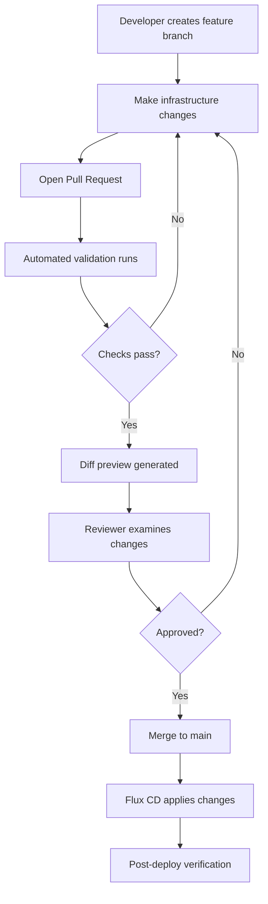

# How to Implement Code Review Workflows for Flux CD Changes

Author: [nawazdhandala](https://github.com/nawazdhandala)

Tags: Flux CD, Code Review, GitOps, Pull Requests, Kubernetes, CI/CD, Workflow

Description: A practical guide to designing and implementing effective code review workflows for Flux CD infrastructure changes using pull requests, automated checks, and approval gates.

---

## Introduction

In a GitOps workflow powered by Flux CD, every change to your Kubernetes infrastructure goes through Git. This creates a natural opportunity to implement thorough code review processes that catch misconfigurations, security issues, and operational risks before they reach any cluster.

However, reviewing Kubernetes manifests and Flux CD configurations requires specialized workflows. Traditional code review practices need to be augmented with automated validation, diff previews, and environment-aware approval gates. This guide covers how to build a comprehensive review workflow for Flux CD changes.

## Prerequisites

- A GitHub or GitLab repository used by Flux CD
- Flux CD v2 installed and bootstrapped
- CI/CD pipeline (GitHub Actions or GitLab CI)
- kubectl and Flux CLI installed locally

## Designing the Review Workflow

A well-designed review workflow for Flux CD changes follows a structured process.



## Setting Up Automated Diff Previews

Generate human-readable diffs showing exactly what will change in the cluster when a PR is merged.

```yaml
# .github/workflows/diff-preview.yaml
# Generate and post Kustomize diffs as PR comments
name: Diff Preview
on:
  pull_request:
    branches:
      - main
    paths:
      - 'clusters/**'
      - 'apps/**'
      - 'infrastructure/**'

jobs:
  diff:
    runs-on: ubuntu-latest
    permissions:
      pull-requests: write
      contents: read
    steps:
      - name: Checkout PR branch
        uses: actions/checkout@v4
        with:
          path: pr-branch

      - name: Checkout main branch
        uses: actions/checkout@v4
        with:
          ref: main
          path: main-branch

      - name: Setup Kustomize
        uses: imranismail/setup-kustomize@v2

      - name: Generate diff for each cluster
        id: diff
        run: |
          DIFF_OUTPUT=""
          # Iterate over each cluster directory
          for cluster_dir in pr-branch/clusters/*/; do
            cluster=$(basename "$cluster_dir")
            echo "Generating diff for cluster: $cluster"

            # Build manifests from main branch
            kustomize build "main-branch/clusters/$cluster" \
              > "/tmp/main-${cluster}.yaml" 2>/dev/null || true

            # Build manifests from PR branch
            kustomize build "pr-branch/clusters/$cluster" \
              > "/tmp/pr-${cluster}.yaml" 2>/dev/null || true

            # Generate the diff
            CLUSTER_DIFF=$(diff -u \
              "/tmp/main-${cluster}.yaml" \
              "/tmp/pr-${cluster}.yaml" || true)

            if [ -n "$CLUSTER_DIFF" ]; then
              DIFF_OUTPUT="${DIFF_OUTPUT}\n### Cluster: ${cluster}\n\`\`\`diff\n${CLUSTER_DIFF}\n\`\`\`\n"
            fi
          done

          # Write diff to file for the comment step
          echo "$DIFF_OUTPUT" > /tmp/diff-output.md

      - name: Post diff as PR comment
        uses: actions/github-script@v7
        with:
          script: |
            const fs = require('fs');
            const diff = fs.readFileSync('/tmp/diff-output.md', 'utf8');
            const body = `## Flux CD Diff Preview\n\n${diff || 'No changes detected in cluster manifests.'}\n\n---\n*Generated automatically by CI*`;
            github.rest.issues.createComment({
              owner: context.repo.owner,
              repo: context.repo.repo,
              issue_number: context.issue.number,
              body: body
            });
```

## Implementing Multi-Stage Validation

Run comprehensive validation checks on every PR to catch issues before review.

```yaml
# .github/workflows/validate-pr.yaml
# Multi-stage validation pipeline for Flux CD changes
name: Validate PR
on:
  pull_request:
    branches:
      - main

jobs:
  # Stage 1: Syntax and schema validation
  syntax-check:
    runs-on: ubuntu-latest
    steps:
      - uses: actions/checkout@v4

      - name: Validate YAML syntax
        run: |
          # Check all YAML files for syntax errors
          find . -name '*.yaml' -o -name '*.yml' | while read file; do
            python3 -c "
          import yaml, sys
          try:
              with open('$file') as f:
                  list(yaml.safe_load_all(f))
          except yaml.YAMLError as e:
              print(f'ERROR in $file: {e}')
              sys.exit(1)
          "
          done

      - name: Validate against Kubernetes schemas
        uses: docker://ghcr.io/yannh/kubeconform:latest
        with:
          args: >-
            -summary -strict -ignore-missing-schemas
            -schema-location default
            clusters/

  # Stage 2: Kustomize build verification
  kustomize-build:
    runs-on: ubuntu-latest
    steps:
      - uses: actions/checkout@v4

      - name: Setup Kustomize
        uses: imranismail/setup-kustomize@v2

      - name: Build all overlays
        run: |
          # Verify every cluster configuration builds successfully
          for dir in clusters/*/; do
            echo "Building: $dir"
            kustomize build "$dir" > /dev/null || exit 1
            echo "OK: $dir"
          done

  # Stage 3: Policy compliance check
  policy-check:
    runs-on: ubuntu-latest
    needs: kustomize-build
    steps:
      - uses: actions/checkout@v4

      - name: Install Kyverno CLI
        uses: kyverno/action-install-cli@v0.2

      - name: Check policy compliance
        run: |
          # Run Kyverno policies against the built manifests
          kyverno apply infrastructure/policies/ \
            --resource clusters/ \
            --detailed-results \
            --policy-report

  # Stage 4: Security scanning
  security-scan:
    runs-on: ubuntu-latest
    needs: kustomize-build
    steps:
      - uses: actions/checkout@v4

      - name: Run Trivy config scan
        uses: aquasecurity/trivy-action@master
        with:
          scan-type: config
          scan-ref: .
          severity: HIGH,CRITICAL
          exit-code: 1
```

## Configuring Review Requirements by Change Type

Different types of changes require different levels of review. Use CODEOWNERS and PR templates to guide this.

```yaml
# .github/pull_request_template.md
# Template content rendered as markdown in the PR description

# Description:
# ## Change Type
# - [ ] Application deployment update
# - [ ] Infrastructure component change
# - [ ] Policy modification
# - [ ] Flux CD system configuration
# - [ ] New application onboarding
#
# ## Environments Affected
# - [ ] Development
# - [ ] Staging
# - [ ] Production
#
# ## Risk Assessment
# - [ ] Low - No production impact expected
# - [ ] Medium - Limited production impact, rollback plan ready
# - [ ] High - Significant production impact, requires change window
#
# ## Checklist
# - [ ] Manifests validated locally with `kustomize build`
# - [ ] Changes tested in development environment
# - [ ] Resource limits and requests are set appropriately
# - [ ] No secrets or sensitive data in plain text
# - [ ] Rollback procedure documented if high risk
```

## Implementing Approval Gates for Production Changes

Use GitHub Actions to enforce stricter review requirements for production changes.

```yaml
# .github/workflows/production-gate.yaml
# Enforce additional approvals for production-affecting changes
name: Production Gate
on:
  pull_request_review:
    types:
      - submitted

jobs:
  check-production-approval:
    runs-on: ubuntu-latest
    if: github.event.review.state == 'approved'
    steps:
      - uses: actions/checkout@v4

      - name: Check if production is affected
        id: check
        run: |
          # Get list of changed files in this PR
          CHANGED=$(gh pr diff ${{ github.event.pull_request.number }} \
            --name-only)

          # Check if any production files are modified
          if echo "$CHANGED" | grep -q "clusters/production"; then
            echo "production_affected=true" >> $GITHUB_OUTPUT
          else
            echo "production_affected=false" >> $GITHUB_OUTPUT
          fi
        env:
          GH_TOKEN: ${{ secrets.GITHUB_TOKEN }}

      - name: Verify production approval count
        if: steps.check.outputs.production_affected == 'true'
        run: |
          # Production changes require at least 2 approvals
          APPROVALS=$(gh pr view ${{ github.event.pull_request.number }} \
            --json reviews \
            --jq '[.reviews[] | select(.state == "APPROVED")] | length')

          if [ "$APPROVALS" -lt 2 ]; then
            echo "Production changes require at least 2 approvals."
            echo "Current approvals: $APPROVALS"
            exit 1
          fi
          echo "Sufficient approvals for production change: $APPROVALS"
        env:
          GH_TOKEN: ${{ secrets.GITHUB_TOKEN }}
```

## Creating Review Checklists for Flux CD Resources

Provide reviewers with specific checklists for different Flux CD resource types.

```yaml
# .github/workflows/review-checklist.yaml
# Auto-add review checklists based on changed resource types
name: Review Checklist
on:
  pull_request:
    types:
      - opened
      - synchronize

jobs:
  add-checklist:
    runs-on: ubuntu-latest
    permissions:
      pull-requests: write
    steps:
      - uses: actions/checkout@v4

      - name: Generate review checklist
        uses: actions/github-script@v7
        with:
          script: |
            const { data: files } = await github.rest.pulls.listFiles({
              owner: context.repo.owner,
              repo: context.repo.repo,
              pull_number: context.issue.number
            });

            let checklist = "## Review Checklist\n\n";

            // Check for HelmRelease changes
            const helmChanges = files.filter(f =>
              f.filename.includes('helmrelease'));
            if (helmChanges.length > 0) {
              checklist += "### HelmRelease Changes\n";
              checklist += "- [ ] Chart version pinned (not using ranges)\n";
              checklist += "- [ ] Values reviewed for security implications\n";
              checklist += "- [ ] Upgrade path tested in staging\n\n";
            }

            // Check for Kustomization changes
            const kustomChanges = files.filter(f =>
              f.filename.includes('kustomization'));
            if (kustomChanges.length > 0) {
              checklist += "### Kustomization Changes\n";
              checklist += "- [ ] Prune setting is intentional\n";
              checklist += "- [ ] Dependencies are correctly defined\n";
              checklist += "- [ ] Health checks are configured\n\n";
            }

            // Check for production changes
            const prodChanges = files.filter(f =>
              f.filename.includes('production'));
            if (prodChanges.length > 0) {
              checklist += "### Production Changes\n";
              checklist += "- [ ] Tested in staging first\n";
              checklist += "- [ ] Rollback plan documented\n";
              checklist += "- [ ] Change window confirmed\n\n";
            }

            await github.rest.issues.createComment({
              owner: context.repo.owner,
              repo: context.repo.repo,
              issue_number: context.issue.number,
              body: checklist
            });
```

## Setting Up Post-Merge Verification

After changes are merged, verify that Flux CD successfully applies them.

```yaml
# .github/workflows/post-merge-verify.yaml
# Verify Flux CD reconciliation after merge
name: Post-Merge Verification
on:
  push:
    branches:
      - main

jobs:
  verify-reconciliation:
    runs-on: ubuntu-latest
    steps:
      - name: Wait for Flux reconciliation
        run: |
          echo "Waiting 60 seconds for Flux to detect changes..."
          sleep 60

      - name: Check reconciliation status
        run: |
          # Connect to cluster and verify Flux reconciliation
          flux get kustomizations --all-namespaces \
            --status-selector ready=false \
            --no-header | tee /tmp/failed-reconciliations.txt

          if [ -s /tmp/failed-reconciliations.txt ]; then
            echo "WARNING: Some reconciliations have failed"
            exit 1
          fi
          echo "All reconciliations are healthy"
        env:
          KUBECONFIG: ${{ secrets.KUBECONFIG }}
```

## Summary

Effective code review workflows for Flux CD changes combine automated validation with human judgment. The practices covered in this guide include:

- Generating diff previews that show exactly what will change in the cluster
- Running multi-stage validation including syntax checks, schema validation, and policy compliance
- Enforcing different review requirements based on change type and target environment
- Providing resource-type-specific review checklists for reviewers
- Implementing approval gates for production-affecting changes
- Verifying successful reconciliation after merge

By building these workflows into your GitOps process, you catch issues early, distribute knowledge across the team, and maintain an audit trail of every infrastructure decision.
