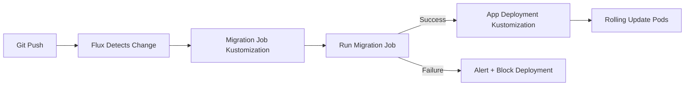

# How to Implement Database Migrations with Flux CD

Author: [nawazdhandala](https://github.com/nawazdhandala)

Tags: Flux CD, Database Migration, Kubernetes jobs, GitOps, Kubernetes, Schema Management

Description: A practical guide to running database schema migrations as part of your Flux CD GitOps workflow using Kubernetes Jobs.

---

Database migrations are one of the trickiest parts of any deployment pipeline. Schema changes must happen before the new application code starts, they must be idempotent, and they must handle failures gracefully. This guide covers how to integrate database migrations into your Flux CD workflow using Kubernetes Jobs, dependency ordering, and proper error handling.

## The Challenge

Database migrations in a GitOps workflow need to satisfy several requirements:

- Migrations must run before the new application version starts
- Migrations must be idempotent (safe to run multiple times)
- Failed migrations must block the deployment
- Migration history must be tracked
- Rollback strategies must be defined upfront

## Architecture



## Step 1: Create the Migration Container

Build a dedicated migration container that contains your migration scripts and tooling.

```yaml
# docker/migrations/Dockerfile
# Example Dockerfile for a migration container
# FROM your-base-image
# COPY migrations/ /migrations/
# COPY migrate.sh /migrate.sh
# RUN chmod +x /migrate.sh
# ENTRYPOINT ["/migrate.sh"]
```

```yaml
# apps/my-app/migrations/job.yaml
apiVersion: batch/v1
kind: Job
metadata:
  name: my-app-db-migrate
  namespace: production
  labels:
    app: my-app
    component: migration
spec:
  # Give migrations up to 10 minutes to complete
  activeDeadlineSeconds: 600
  # Retry once on failure
  backoffLimit: 1
  # Clean up completed Jobs after 2 hours
  ttlSecondsAfterFinished: 7200
  template:
    metadata:
      labels:
        app: my-app
        component: migration
    spec:
      containers:
        - name: migrate
          # Use the same version tag as the app to keep migrations in sync
          image: registry.example.com/my-app-migrations:1.5.0
          command:
            - /bin/sh
            - -c
            - |
              echo "Starting database migration..."
              echo "Target database: $DB_HOST:$DB_PORT/$DB_NAME"

              # Run migrations using your preferred tool
              # Example with golang-migrate:
              migrate -path /migrations \
                -database "postgres://$DB_USER:$DB_PASSWORD@$DB_HOST:$DB_PORT/$DB_NAME?sslmode=require" \
                up

              exit_code=$?
              if [ $exit_code -eq 0 ]; then
                echo "Migration completed successfully"
              else
                echo "Migration FAILED with exit code $exit_code"
                exit $exit_code
              fi
          env:
            - name: DB_HOST
              valueFrom:
                secretKeyRef:
                  name: db-credentials
                  key: host
            - name: DB_PORT
              valueFrom:
                secretKeyRef:
                  name: db-credentials
                  key: port
            - name: DB_NAME
              valueFrom:
                secretKeyRef:
                  name: db-credentials
                  key: name
            - name: DB_USER
              valueFrom:
                secretKeyRef:
                  name: db-credentials
                  key: username
            - name: DB_PASSWORD
              valueFrom:
                secretKeyRef:
                  name: db-credentials
                  key: password
          resources:
            requests:
              cpu: 100m
              memory: 128Mi
            limits:
              cpu: 500m
              memory: 256Mi
      restartPolicy: Never
      # Use a service account with limited permissions
      serviceAccountName: migration-runner
```

```yaml
# apps/my-app/migrations/kustomization.yaml
apiVersion: kustomize.config.k8s.io/v1beta1
kind: Kustomization
resources:
  - job.yaml
```

## Step 2: Create the Application Deployment

```yaml
# apps/my-app/deploy/deployment.yaml
apiVersion: apps/v1
kind: Deployment
metadata:
  name: my-app
  namespace: production
spec:
  replicas: 3
  selector:
    matchLabels:
      app: my-app
  strategy:
    type: RollingUpdate
    rollingUpdate:
      maxUnavailable: 1
      maxSurge: 1
  template:
    metadata:
      labels:
        app: my-app
    spec:
      containers:
        - name: my-app
          image: registry.example.com/my-app:1.5.0
          ports:
            - containerPort: 8080
          # Init container to verify migration was applied
          readinessProbe:
            httpGet:
              path: /ready
              port: 8080
            initialDelaySeconds: 10
            periodSeconds: 5
      # Optional: init container to verify schema version
      initContainers:
        - name: check-migration
          image: registry.example.com/my-app-migrations:1.5.0
          command:
            - /bin/sh
            - -c
            - |
              # Verify the expected migration version is applied
              current_version=$(migrate -path /migrations \
                -database "postgres://$DB_USER:$DB_PASSWORD@$DB_HOST:$DB_PORT/$DB_NAME?sslmode=require" \
                version 2>&1)
              echo "Current migration version: $current_version"

              # The app expects at least migration version 15
              expected_version="15"
              if [ "$current_version" -lt "$expected_version" ]; then
                echo "ERROR: Expected migration version >= $expected_version, got $current_version"
                exit 1
              fi
              echo "Migration version check passed"
          env:
            - name: DB_HOST
              valueFrom:
                secretKeyRef:
                  name: db-credentials
                  key: host
            - name: DB_PORT
              valueFrom:
                secretKeyRef:
                  name: db-credentials
                  key: port
            - name: DB_NAME
              valueFrom:
                secretKeyRef:
                  name: db-credentials
                  key: name
            - name: DB_USER
              valueFrom:
                secretKeyRef:
                  name: db-credentials
                  key: username
            - name: DB_PASSWORD
              valueFrom:
                secretKeyRef:
                  name: db-credentials
                  key: password
```

```yaml
# apps/my-app/deploy/kustomization.yaml
apiVersion: kustomize.config.k8s.io/v1beta1
kind: Kustomization
resources:
  - deployment.yaml
  - service.yaml
```

## Step 3: Create Flux Kustomizations with Dependencies

```yaml
# clusters/production/apps/my-app-migration.yaml
apiVersion: kustomize.toolkit.fluxcd.io/v1
kind: Kustomization
metadata:
  name: my-app-migration
  namespace: flux-system
spec:
  interval: 10m
  path: ./apps/my-app/migrations
  prune: true
  sourceRef:
    kind: GitRepository
    name: flux-system
  # Wait for the migration Job to complete
  wait: true
  timeout: 15m
  # Force recreate the Job since Jobs are immutable
  force: true
  healthChecks:
    - apiVersion: batch/v1
      kind: Job
      name: my-app-db-migrate
      namespace: production
```

```yaml
# clusters/production/apps/my-app-deploy.yaml
apiVersion: kustomize.toolkit.fluxcd.io/v1
kind: Kustomization
metadata:
  name: my-app-deploy
  namespace: flux-system
spec:
  interval: 10m
  path: ./apps/my-app/deploy
  prune: true
  sourceRef:
    kind: GitRepository
    name: flux-system
  # Only deploy after migrations succeed
  dependsOn:
    - name: my-app-migration
  wait: true
  timeout: 10m
  healthChecks:
    - apiVersion: apps/v1
      kind: Deployment
      name: my-app
      namespace: production
```

## Step 4: Writing Safe Migration Scripts

Migration scripts must be idempotent and backward-compatible.

```sql
-- migrations/000015_add_user_preferences.up.sql
-- This migration adds a user_preferences table
-- It is safe to run multiple times (IF NOT EXISTS)

CREATE TABLE IF NOT EXISTS user_preferences (
    id SERIAL PRIMARY KEY,
    user_id INTEGER NOT NULL REFERENCES users(id),
    preference_key VARCHAR(255) NOT NULL,
    preference_value TEXT,
    created_at TIMESTAMP WITH TIME ZONE DEFAULT NOW(),
    updated_at TIMESTAMP WITH TIME ZONE DEFAULT NOW(),
    UNIQUE(user_id, preference_key)
);

-- Add index for faster lookups
CREATE INDEX IF NOT EXISTS idx_user_preferences_user_id
    ON user_preferences(user_id);

-- Add column to existing table (safe with IF NOT EXISTS in PostgreSQL 9.6+)
ALTER TABLE users ADD COLUMN IF NOT EXISTS preferences_updated_at TIMESTAMP WITH TIME ZONE;
```

```sql
-- migrations/000015_add_user_preferences.down.sql
-- Rollback migration

DROP INDEX IF EXISTS idx_user_preferences_user_id;
DROP TABLE IF EXISTS user_preferences;
ALTER TABLE users DROP COLUMN IF EXISTS preferences_updated_at;
```

## Step 5: Handle Migration Failures

When a migration fails, the deployment should be blocked and alerts should fire.

```yaml
# clusters/production/notifications/migration-alerts.yaml
apiVersion: notification.toolkit.fluxcd.io/v1beta3
kind: Alert
metadata:
  name: migration-failures
  namespace: flux-system
spec:
  providerRef:
    name: slack
  eventSeverity: error
  eventSources:
    - kind: Kustomization
      name: "my-app-migration"
  summary: "Database migration failed. Deployment is blocked."
---
apiVersion: notification.toolkit.fluxcd.io/v1beta3
kind: Provider
metadata:
  name: slack
  namespace: flux-system
spec:
  type: slack
  channel: db-migrations
  secretRef:
    name: slack-webhook
```

```bash
# Debugging a failed migration

# Check the Kustomization status
flux get kustomization my-app-migration

# View the Job status
kubectl describe job my-app-db-migrate -n production

# View migration logs
kubectl logs -n production job/my-app-db-migrate

# Check if the deployment is blocked
flux get kustomization my-app-deploy
# Should show: "dependency 'flux-system/my-app-migration' is not ready"
```

## Step 6: Migration Rollback Strategy

Define your rollback approach before deploying.

```yaml
# apps/my-app/migrations/rollback-job.yaml
apiVersion: batch/v1
kind: Job
metadata:
  name: my-app-db-rollback
  namespace: production
  labels:
    app: my-app
    component: migration-rollback
spec:
  activeDeadlineSeconds: 300
  backoffLimit: 0
  template:
    spec:
      containers:
        - name: rollback
          image: registry.example.com/my-app-migrations:1.5.0
          command:
            - /bin/sh
            - -c
            - |
              echo "Rolling back database migration..."

              # Roll back one migration step
              migrate -path /migrations \
                -database "postgres://$DB_USER:$DB_PASSWORD@$DB_HOST:$DB_PORT/$DB_NAME?sslmode=require" \
                down 1

              exit_code=$?
              if [ $exit_code -eq 0 ]; then
                echo "Rollback completed successfully"
              else
                echo "Rollback FAILED - manual intervention required"
                exit $exit_code
              fi
          env:
            - name: DB_HOST
              valueFrom:
                secretKeyRef:
                  name: db-credentials
                  key: host
            - name: DB_PORT
              valueFrom:
                secretKeyRef:
                  name: db-credentials
                  key: port
            - name: DB_NAME
              valueFrom:
                secretKeyRef:
                  name: db-credentials
                  key: name
            - name: DB_USER
              valueFrom:
                secretKeyRef:
                  name: db-credentials
                  key: username
            - name: DB_PASSWORD
              valueFrom:
                secretKeyRef:
                  name: db-credentials
                  key: password
      restartPolicy: Never
```

```bash
# To roll back, apply the rollback Job manually
kubectl apply -f apps/my-app/migrations/rollback-job.yaml

# Monitor the rollback
kubectl logs -n production job/my-app-db-rollback -f

# Then revert the application code in Git
git revert HEAD
git push origin main
```

## Step 7: Using Flyway for Migrations

If you use Flyway, the Job looks slightly different.

```yaml
# apps/my-app/migrations/flyway-job.yaml
apiVersion: batch/v1
kind: Job
metadata:
  name: my-app-flyway-migrate
  namespace: production
spec:
  activeDeadlineSeconds: 600
  backoffLimit: 1
  ttlSecondsAfterFinished: 7200
  template:
    spec:
      containers:
        - name: flyway
          image: flyway/flyway:10
          args:
            - migrate
          env:
            - name: FLYWAY_URL
              value: "jdbc:postgresql://$(DB_HOST):$(DB_PORT)/$(DB_NAME)"
            - name: FLYWAY_USER
              valueFrom:
                secretKeyRef:
                  name: db-credentials
                  key: username
            - name: FLYWAY_PASSWORD
              valueFrom:
                secretKeyRef:
                  name: db-credentials
                  key: password
            - name: DB_HOST
              valueFrom:
                secretKeyRef:
                  name: db-credentials
                  key: host
            - name: DB_PORT
              valueFrom:
                secretKeyRef:
                  name: db-credentials
                  key: port
            - name: DB_NAME
              valueFrom:
                secretKeyRef:
                  name: db-credentials
                  key: name
          volumeMounts:
            - name: migrations
              mountPath: /flyway/sql
      volumes:
        - name: migrations
          configMap:
            # Store migration SQL files in a ConfigMap
            name: flyway-migrations
      restartPolicy: Never
```

## Step 8: Using Liquibase for Migrations

```yaml
# apps/my-app/migrations/liquibase-job.yaml
apiVersion: batch/v1
kind: Job
metadata:
  name: my-app-liquibase-migrate
  namespace: production
spec:
  activeDeadlineSeconds: 600
  backoffLimit: 1
  ttlSecondsAfterFinished: 7200
  template:
    spec:
      containers:
        - name: liquibase
          image: liquibase/liquibase:4.25
          args:
            - --url=jdbc:postgresql://$(DB_HOST):$(DB_PORT)/$(DB_NAME)
            - --username=$(DB_USER)
            - --password=$(DB_PASSWORD)
            - --changelog-file=changelog.xml
            - update
          env:
            - name: DB_HOST
              valueFrom:
                secretKeyRef:
                  name: db-credentials
                  key: host
            - name: DB_PORT
              valueFrom:
                secretKeyRef:
                  name: db-credentials
                  key: port
            - name: DB_NAME
              valueFrom:
                secretKeyRef:
                  name: db-credentials
                  key: name
            - name: DB_USER
              valueFrom:
                secretKeyRef:
                  name: db-credentials
                  key: username
            - name: DB_PASSWORD
              valueFrom:
                secretKeyRef:
                  name: db-credentials
                  key: password
          volumeMounts:
            - name: changelog
              mountPath: /liquibase/changelog
      volumes:
        - name: changelog
          configMap:
            name: liquibase-changelog
      restartPolicy: Never
```

## Step 9: Multi-Database Migration Pipeline

For applications with multiple databases, chain the migration Jobs.

```yaml
# clusters/production/apps/my-app-migrate-primary-db.yaml
apiVersion: kustomize.toolkit.fluxcd.io/v1
kind: Kustomization
metadata:
  name: my-app-migrate-primary
  namespace: flux-system
spec:
  interval: 10m
  path: ./apps/my-app/migrations/primary-db
  prune: true
  sourceRef:
    kind: GitRepository
    name: flux-system
  wait: true
  timeout: 15m
  force: true
---
# clusters/production/apps/my-app-migrate-analytics-db.yaml
apiVersion: kustomize.toolkit.fluxcd.io/v1
kind: Kustomization
metadata:
  name: my-app-migrate-analytics
  namespace: flux-system
spec:
  interval: 10m
  path: ./apps/my-app/migrations/analytics-db
  prune: true
  sourceRef:
    kind: GitRepository
    name: flux-system
  wait: true
  timeout: 15m
  force: true
  # Analytics DB migration runs after primary DB migration
  dependsOn:
    - name: my-app-migrate-primary
---
# clusters/production/apps/my-app-deploy.yaml
apiVersion: kustomize.toolkit.fluxcd.io/v1
kind: Kustomization
metadata:
  name: my-app-deploy
  namespace: flux-system
spec:
  interval: 10m
  path: ./apps/my-app/deploy
  prune: true
  sourceRef:
    kind: GitRepository
    name: flux-system
  # Wait for all database migrations to complete
  dependsOn:
    - name: my-app-migrate-primary
    - name: my-app-migrate-analytics
  wait: true
  timeout: 10m
```

## Best Practices

1. Always write backward-compatible migrations that work with both old and new code versions
2. Use `IF NOT EXISTS` and `IF EXISTS` clauses to make migrations idempotent
3. Avoid destructive operations (dropping columns/tables) in the same release as code changes
4. Test migrations against a copy of production data in staging
5. Set appropriate timeouts for migration Jobs based on data volume
6. Keep migration containers lean with only the migration tool and scripts
7. Use separate database credentials for migration Jobs with elevated permissions

## Summary

Database migrations with Flux CD use Kubernetes Jobs with Kustomization dependencies to ensure migrations complete before deployments proceed. The migration Job runs as a separate Kustomization with `wait: true` and `force: true`, and the application deployment depends on it via `dependsOn`. Failed migrations automatically block the deployment and trigger alerts. Use your preferred migration tool (golang-migrate, Flyway, Liquibase) inside the Job container, and always write idempotent, backward-compatible migration scripts.
