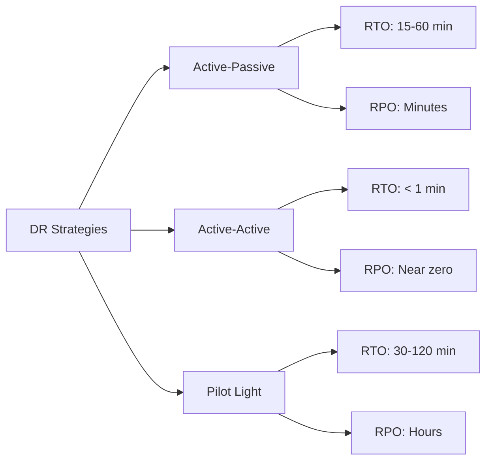

# How to Implement Disaster Recovery with Flux CD

Author: [nawazdhandala](https://github.com/nawazdhandala)

Tags: Flux CD, Disaster Recovery, Kubernetes, GitOps, Multi-Cluster, High Availability, Failover

Description: A comprehensive guide to implementing disaster recovery strategies for Kubernetes workloads using Flux CD's GitOps capabilities.

---

## Introduction

Disaster recovery (DR) for Kubernetes goes beyond simple backups. It requires a strategy for maintaining standby environments, automating failover, and ensuring data consistency. Flux CD's GitOps model naturally supports DR because your entire cluster configuration lives in Git. This guide covers implementing active-passive, active-active, and pilot-light DR strategies using Flux CD.

## Prerequisites

- Two or more Kubernetes clusters (primary and DR)
- Flux CD installed on all clusters
- A shared Git repository or mirrored repositories
- Cross-cluster networking (optional, for active-active)
- Object storage for backups (S3, GCS, or Azure Blob)

## DR Strategy Options

Choose a strategy based on your Recovery Time Objective (RTO) and Recovery Point Objective (RPO).



## Repository Structure for Multi-Cluster DR

Organize your Git repository to support multiple clusters with shared and cluster-specific configurations.

```yaml
# fleet-repo/
#   base/                    # Shared configurations
#     apps/
#       frontend/
#       backend/
#       database/
#   clusters/
#     primary/               # Primary cluster configs
#       kustomization.yaml
#       patches/
#     dr/                    # DR cluster configs
#       kustomization.yaml
#       patches/
#   dr-config/               # DR-specific resources
#     failover/
#     monitoring/
```

## Active-Passive DR Setup

In this model, the DR cluster runs Flux CD but keeps workloads scaled down until failover.

### Primary Cluster Configuration

```yaml
# clusters/primary/kustomization.yaml
apiVersion: kustomize.toolkit.fluxcd.io/v1
kind: Kustomization
metadata:
  name: apps
  namespace: flux-system
spec:
  interval: 10m
  sourceRef:
    kind: GitRepository
    name: flux-system
  path: ./base/apps
  prune: true
  wait: true
  # Apply primary-specific patches
  patches:
    - patch: |
        apiVersion: apps/v1
        kind: Deployment
        metadata:
          name: not-used
        spec:
          # Full replica count for primary
          replicas: 3
      target:
        kind: Deployment
        labelSelector: "tier=frontend"
```

### DR Cluster Configuration (Standby)

```yaml
# clusters/dr/kustomization.yaml
apiVersion: kustomize.toolkit.fluxcd.io/v1
kind: Kustomization
metadata:
  name: apps
  namespace: flux-system
spec:
  interval: 10m
  sourceRef:
    kind: GitRepository
    name: flux-system
  path: ./base/apps
  prune: true
  wait: true
  # DR cluster runs with zero replicas until failover
  patches:
    - patch: |
        apiVersion: apps/v1
        kind: Deployment
        metadata:
          name: not-used
        spec:
          # Zero replicas in standby mode
          replicas: 0
      target:
        kind: Deployment
        labelSelector: "dr-mode=standby"
    - patch: |
        apiVersion: apps/v1
        kind: Deployment
        metadata:
          name: not-used
        spec:
          # Keep one replica for health checking
          replicas: 1
      target:
        kind: Deployment
        labelSelector: "dr-mode=warm-standby"
```

### Failover Configuration

```yaml
# dr-config/failover/failover-kustomization.yaml
# This Kustomization is applied during failover to scale up the DR cluster
apiVersion: kustomize.toolkit.fluxcd.io/v1
kind: Kustomization
metadata:
  name: failover-active
  namespace: flux-system
spec:
  interval: 5m
  sourceRef:
    kind: GitRepository
    name: flux-system
  path: ./dr-config/failover/active
  prune: true
  # Initially suspended - activate during failover
  suspend: true
```

```yaml
# dr-config/failover/active/scale-up.yaml
# Applied during failover to bring DR cluster to full capacity
apiVersion: apps/v1
kind: Deployment
metadata:
  name: frontend
  namespace: production
spec:
  replicas: 3

---
apiVersion: apps/v1
kind: Deployment
metadata:
  name: backend
  namespace: production
spec:
  replicas: 5

---
apiVersion: apps/v1
kind: Deployment
metadata:
  name: worker
  namespace: production
spec:
  replicas: 3
```

## Failover Automation

Create a failover script that activates the DR cluster.

```bash
#!/bin/bash
# scripts/failover.sh
# Activates the DR cluster and deactivates the primary

set -e

DR_CONTEXT="dr-cluster"
PRIMARY_CONTEXT="primary-cluster"

echo "=== Starting Failover Procedure ==="
echo "Time: $(date -u)"

# Step 1: Verify DR cluster is accessible
echo ""
echo "Step 1: Verifying DR cluster connectivity..."
kubectl --context "$DR_CONTEXT" cluster-info
if [ $? -ne 0 ]; then
  echo "ERROR: Cannot reach DR cluster!"
  exit 1
fi

# Step 2: Activate the failover Kustomization
echo ""
echo "Step 2: Activating failover configuration..."
kubectl --context "$DR_CONTEXT" -n flux-system \
  patch kustomization failover-active \
  --type merge \
  --patch '{"spec":{"suspend":false}}'

# Step 3: Force reconciliation
echo ""
echo "Step 3: Forcing Flux reconciliation..."
flux --context "$DR_CONTEXT" reconcile kustomization failover-active --with-source

# Step 4: Wait for deployments to scale up
echo ""
echo "Step 4: Waiting for deployments to scale up..."
kubectl --context "$DR_CONTEXT" -n production \
  rollout status deployment/frontend --timeout=300s
kubectl --context "$DR_CONTEXT" -n production \
  rollout status deployment/backend --timeout=300s

# Step 5: Verify DR applications are healthy
echo ""
echo "Step 5: Verifying application health..."
kubectl --context "$DR_CONTEXT" get pods -n production

# Step 6: Update DNS to point to DR cluster
echo ""
echo "Step 6: Updating DNS records..."
DR_LB=$(kubectl --context "$DR_CONTEXT" get svc -n ingress-nginx \
  ingress-nginx-controller -o jsonpath='{.status.loadBalancer.ingress[0].hostname}')
echo "Update DNS to point to: $DR_LB"
# Implement your DNS update logic here
# Example with Route53:
# aws route53 change-resource-record-sets --hosted-zone-id ZONE_ID --change-batch ...

# Step 7: Scale down primary (if accessible)
echo ""
echo "Step 7: Scaling down primary cluster (if reachable)..."
kubectl --context "$PRIMARY_CONTEXT" -n flux-system \
  patch kustomization apps \
  --type merge \
  --patch '{"spec":{"suspend":true}}' 2>/dev/null || echo "Primary cluster not reachable - skip"

echo ""
echo "=== Failover Complete ==="
echo "DR cluster is now serving production traffic"
```

## Failback Procedure

When the primary cluster is restored, failback to it.

```bash
#!/bin/bash
# scripts/failback.sh
# Returns traffic to the primary cluster after recovery

set -e

DR_CONTEXT="dr-cluster"
PRIMARY_CONTEXT="primary-cluster"

echo "=== Starting Failback Procedure ==="

# Step 1: Verify primary cluster is healthy
echo "Step 1: Verifying primary cluster health..."
kubectl --context "$PRIMARY_CONTEXT" cluster-info
flux --context "$PRIMARY_CONTEXT" check

# Step 2: Ensure primary is fully reconciled
echo "Step 2: Reconciling primary cluster..."
kubectl --context "$PRIMARY_CONTEXT" -n flux-system \
  patch kustomization apps \
  --type merge \
  --patch '{"spec":{"suspend":false}}'
flux --context "$PRIMARY_CONTEXT" reconcile kustomization apps --with-source

# Step 3: Wait for primary deployments
echo "Step 3: Waiting for primary deployments..."
kubectl --context "$PRIMARY_CONTEXT" -n production \
  rollout status deployment/frontend --timeout=300s
kubectl --context "$PRIMARY_CONTEXT" -n production \
  rollout status deployment/backend --timeout=300s

# Step 4: Sync any data created during failover
echo "Step 4: Syncing data from DR to primary..."
# Application-specific data sync logic goes here

# Step 5: Update DNS back to primary
echo "Step 5: Switching DNS to primary..."
PRIMARY_LB=$(kubectl --context "$PRIMARY_CONTEXT" get svc -n ingress-nginx \
  ingress-nginx-controller -o jsonpath='{.status.loadBalancer.ingress[0].hostname}')
echo "Update DNS to point to: $PRIMARY_LB"

# Step 6: Scale down DR cluster
echo "Step 6: Returning DR to standby mode..."
kubectl --context "$DR_CONTEXT" -n flux-system \
  patch kustomization failover-active \
  --type merge \
  --patch '{"spec":{"suspend":true}}'

echo "=== Failback Complete ==="
```

## Continuous Data Replication

For stateful workloads, set up continuous data replication between clusters.

```yaml
# dr-config/replication/database-replication.yaml
apiVersion: kustomize.toolkit.fluxcd.io/v1
kind: Kustomization
metadata:
  name: database-replication
  namespace: flux-system
spec:
  interval: 10m
  sourceRef:
    kind: GitRepository
    name: flux-system
  path: ./dr-config/replication
  prune: true
```

```yaml
# dr-config/replication/pg-replication-cronjob.yaml
apiVersion: batch/v1
kind: CronJob
metadata:
  name: database-backup-sync
  namespace: production
spec:
  # Replicate every 15 minutes
  schedule: "*/15 * * * *"
  concurrencyPolicy: Forbid
  jobTemplate:
    spec:
      template:
        spec:
          containers:
            - name: pg-backup
              image: postgres:16
              command:
                - /bin/bash
                - -c
                - |
                  # Create a point-in-time backup
                  pg_dump -h "$PRIMARY_DB_HOST" \
                    -U "$DB_USER" \
                    -d "$DB_NAME" \
                    --format=custom \
                    --file="/backup/db-$(date +%Y%m%d-%H%M%S).dump"

                  # Upload to shared storage
                  # aws s3 cp /backup/*.dump s3://dr-backup-bucket/database/
              env:
                - name: PRIMARY_DB_HOST
                  valueFrom:
                    secretKeyRef:
                      name: db-replication-config
                      key: primary-host
                - name: DB_USER
                  valueFrom:
                    secretKeyRef:
                      name: db-replication-config
                      key: username
                - name: DB_NAME
                  value: production
                - name: PGPASSWORD
                  valueFrom:
                    secretKeyRef:
                      name: db-replication-config
                      key: password
              volumeMounts:
                - name: backup-volume
                  mountPath: /backup
          volumes:
            - name: backup-volume
              emptyDir:
                sizeLimit: 10Gi
          restartPolicy: OnFailure
```

## DR Health Monitoring

Monitor the DR cluster to ensure it is always ready for failover.

```yaml
# dr-config/monitoring/dr-health-check.yaml
apiVersion: batch/v1
kind: CronJob
metadata:
  name: dr-health-check
  namespace: flux-system
spec:
  # Check DR readiness every 10 minutes
  schedule: "*/10 * * * *"
  jobTemplate:
    spec:
      template:
        spec:
          serviceAccountName: dr-monitor
          containers:
            - name: health-check
              image: bitnami/kubectl:1.29
              command:
                - /bin/bash
                - -c
                - |
                  echo "DR Health Check - $(date -u)"

                  # Check Flux is reconciling
                  STALE=$(kubectl get kustomizations -A -o json | \
                    jq '[.items[] | select(.status.conditions[]? | select(.type=="Ready" and .status=="False"))] | length')

                  if [ "$STALE" -gt 0 ]; then
                    echo "WARNING: $STALE Kustomizations are not ready"
                    exit 1
                  fi

                  # Verify Git source is syncing
                  LAST_SYNC=$(kubectl get gitrepository flux-system -n flux-system \
                    -o jsonpath='{.status.artifact.lastUpdateTime}')
                  echo "Last Git sync: $LAST_SYNC"

                  # Check node health
                  NOT_READY=$(kubectl get nodes --no-headers | grep -v Ready | wc -l)
                  if [ "$NOT_READY" -gt 0 ]; then
                    echo "WARNING: $NOT_READY nodes are not ready"
                    exit 1
                  fi

                  echo "DR cluster is healthy and ready for failover"
          restartPolicy: OnFailure
```

## DR Drill Automation

Regularly test your DR procedure to ensure it works.

```bash
#!/bin/bash
# scripts/dr-drill.sh
# Conducts a DR drill by temporarily failing over and back

set -e

echo "=== DR Drill Starting ==="
echo "Time: $(date -u)"
DRILL_LOG="dr-drill-$(date +%Y%m%d).log"

# Record pre-drill state
echo "Recording pre-drill state..." | tee -a "$DRILL_LOG"
flux get all -A > "pre-drill-state.txt" 2>&1

# Execute failover
echo "Executing failover..." | tee -a "$DRILL_LOG"
./scripts/failover.sh 2>&1 | tee -a "$DRILL_LOG"

# Validate DR cluster
echo "Validating DR cluster..." | tee -a "$DRILL_LOG"
sleep 60  # Allow time for DNS propagation

# Run smoke tests against DR
echo "Running smoke tests..." | tee -a "$DRILL_LOG"
# Add your application-specific smoke tests here

# Execute failback
echo "Executing failback..." | tee -a "$DRILL_LOG"
./scripts/failback.sh 2>&1 | tee -a "$DRILL_LOG"

# Verify primary is back to normal
echo "Verifying primary cluster..." | tee -a "$DRILL_LOG"
flux get all -A > "post-drill-state.txt" 2>&1

echo "=== DR Drill Complete ===" | tee -a "$DRILL_LOG"
echo "Review the drill log: $DRILL_LOG"
```

## Conclusion

Implementing disaster recovery with Flux CD leverages the core GitOps principle that your entire system state is stored in Git. By maintaining a DR cluster that continuously reconciles from the same Git repository, you always have a warm standby ready for failover. The key components are a well-structured multi-cluster repository, automated failover and failback scripts, continuous data replication for stateful workloads, and regular DR drills to validate the process. With this approach, your RTO can be measured in minutes rather than hours, and your team has confidence that production can be restored quickly after any disaster.
