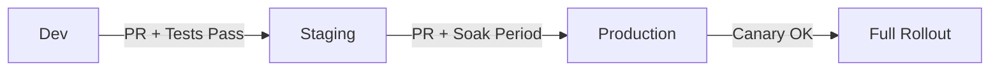

# How to Implement Environment Promotion Pipelines with Flux CD

Author: [nawazdhandala](https://github.com/nawazdhandala)

Tags: Flux CD, GitOps, Kubernetes, Environment Promotion, CI/CD, Pipelines

Description: A practical guide to implementing environment promotion pipelines with Flux CD to safely move changes from dev through staging to production.

---

Environment promotion is the process of moving a change through a sequence of environments - typically dev, staging, and production. With Flux CD, promotion happens through Git. This guide shows how to build robust promotion pipelines that ensure changes are validated at each stage before moving forward.

## Promotion Strategy Overview

There are two main approaches to environment promotion with Flux CD:

1. Directory-based promotion: Different directories per environment in the same repository.
2. Branch-based promotion: Different branches per environment.

Directory-based promotion is the recommended approach because it is simpler and avoids merge conflicts.



## Repository Structure for Promotion

```yaml
# Recommended directory structure
# fleet-infra/
#   apps/
#     base/                    (shared manifests)
#       my-app/
#         deployment.yaml
#         service.yaml
#         kustomization.yaml
#     dev/                     (dev overrides)
#       kustomization.yaml
#     staging/                 (staging overrides)
#       kustomization.yaml
#     production/              (production overrides)
#       kustomization.yaml
#   clusters/
#     dev/
#       apps.yaml
#     staging/
#       apps.yaml
#     production/
#       apps.yaml

# apps/base/my-app/deployment.yaml
apiVersion: apps/v1
kind: Deployment
metadata:
  name: my-app
spec:
  replicas: 1
  selector:
    matchLabels:
      app: my-app
  template:
    metadata:
      labels:
        app: my-app
    spec:
      containers:
        - name: my-app
          image: ghcr.io/my-org/my-app:1.0.0
          ports:
            - containerPort: 8080
          resources:
            requests:
              cpu: 100m
              memory: 128Mi
            limits:
              cpu: 500m
              memory: 256Mi
```

```yaml
# apps/base/my-app/kustomization.yaml
apiVersion: kustomize.config.k8s.io/v1beta1
kind: Kustomization
resources:
  - deployment.yaml
  - service.yaml
```

## Environment-Specific Overlays

Each environment applies its own configuration on top of the base.

```yaml
# apps/dev/kustomization.yaml
apiVersion: kustomize.config.k8s.io/v1beta1
kind: Kustomization
namespace: dev
resources:
  - ../base/my-app
patches:
  - target:
      kind: Deployment
      name: my-app
    patch: |
      - op: replace
        path: /spec/replicas
        value: 1
      - op: replace
        path: /spec/template/spec/containers/0/image
        value: ghcr.io/my-org/my-app:dev-latest
      - op: add
        path: /spec/template/spec/containers/0/env
        value:
          - name: ENVIRONMENT
            value: dev
          - name: LOG_LEVEL
            value: debug
```

```yaml
# apps/staging/kustomization.yaml
apiVersion: kustomize.config.k8s.io/v1beta1
kind: Kustomization
namespace: staging
resources:
  - ../base/my-app
patches:
  - target:
      kind: Deployment
      name: my-app
    patch: |
      - op: replace
        path: /spec/replicas
        value: 2
      - op: replace
        path: /spec/template/spec/containers/0/image
        value: ghcr.io/my-org/my-app:1.2.0
      - op: add
        path: /spec/template/spec/containers/0/env
        value:
          - name: ENVIRONMENT
            value: staging
          - name: LOG_LEVEL
            value: info
```

```yaml
# apps/production/kustomization.yaml
apiVersion: kustomize.config.k8s.io/v1beta1
kind: Kustomization
namespace: production
resources:
  - ../base/my-app
patches:
  - target:
      kind: Deployment
      name: my-app
    patch: |
      - op: replace
        path: /spec/replicas
        value: 5
      - op: replace
        path: /spec/template/spec/containers/0/image
        value: ghcr.io/my-org/my-app:1.1.0
      - op: add
        path: /spec/template/spec/containers/0/env
        value:
          - name: ENVIRONMENT
            value: production
          - name: LOG_LEVEL
            value: warn
```

## Flux Kustomizations Per Environment

Each cluster runs its own Flux instance pointing to the right directory.

```yaml
# clusters/dev/apps.yaml
apiVersion: kustomize.toolkit.fluxcd.io/v1
kind: Kustomization
metadata:
  name: apps
  namespace: flux-system
spec:
  interval: 2m
  sourceRef:
    kind: GitRepository
    name: fleet-infra
  path: ./apps/dev
  prune: true
  # Dev doesn't need health checks - fast iteration
  wait: false
```

```yaml
# clusters/staging/apps.yaml
apiVersion: kustomize.toolkit.fluxcd.io/v1
kind: Kustomization
metadata:
  name: apps
  namespace: flux-system
spec:
  interval: 5m
  sourceRef:
    kind: GitRepository
    name: fleet-infra
  path: ./apps/staging
  prune: true
  # Staging requires health checks
  healthChecks:
    - apiVersion: apps/v1
      kind: Deployment
      name: my-app
      namespace: staging
  timeout: 5m
```

```yaml
# clusters/production/apps.yaml
apiVersion: kustomize.toolkit.fluxcd.io/v1
kind: Kustomization
metadata:
  name: apps
  namespace: flux-system
spec:
  interval: 10m
  sourceRef:
    kind: GitRepository
    name: fleet-infra
  path: ./apps/production
  prune: true
  # Production has strict health checks
  healthChecks:
    - apiVersion: apps/v1
      kind: Deployment
      name: my-app
      namespace: production
  timeout: 10m
```

## Automated Promotion with CI/CD

Automate the promotion process using GitHub Actions.

```yaml
# .github/workflows/promote-to-staging.yaml
name: Promote to Staging
on:
  workflow_dispatch:
    inputs:
      image_tag:
        description: "Image tag to promote"
        required: true
        type: string

jobs:
  promote:
    runs-on: ubuntu-latest
    steps:
      - uses: actions/checkout@v4

      - name: Verify image exists in dev
        run: |
          # Confirm the image was deployed to dev
          DEV_TAG=$(grep -oP 'image: ghcr.io/my-org/my-app:\K[^\s]+' apps/dev/kustomization.yaml)
          echo "Current dev tag: $DEV_TAG"
          echo "Promoting tag: ${{ inputs.image_tag }}"

      - name: Update staging image tag
        run: |
          # Update the image tag in staging overlay
          sed -i "s|ghcr.io/my-org/my-app:.*|ghcr.io/my-org/my-app:${{ inputs.image_tag }}|" \
            apps/staging/kustomization.yaml

      - name: Create promotion PR
        run: |
          git checkout -b promote/staging-${{ inputs.image_tag }}
          git add apps/staging/kustomization.yaml
          git commit -m "promote: deploy my-app ${{ inputs.image_tag }} to staging"
          git push origin promote/staging-${{ inputs.image_tag }}

          gh pr create \
            --title "Promote my-app ${{ inputs.image_tag }} to staging" \
            --body "## Promotion Request
          - Source: dev
          - Target: staging
          - Image: ghcr.io/my-org/my-app:${{ inputs.image_tag }}
          - Dev validation: passed" \
            --label "promotion,staging"
        env:
          GH_TOKEN: ${{ secrets.GITHUB_TOKEN }}
```

```yaml
# .github/workflows/promote-to-production.yaml
name: Promote to Production
on:
  workflow_dispatch:
    inputs:
      image_tag:
        description: "Image tag to promote"
        required: true
        type: string
      soak_hours:
        description: "Hours the image has been in staging"
        required: true
        type: number

jobs:
  validate:
    runs-on: ubuntu-latest
    steps:
      - name: Verify soak period
        run: |
          if [ "${{ inputs.soak_hours }}" -lt 24 ]; then
            echo "WARNING: Soak period is less than 24 hours"
            echo "Minimum recommended soak period is 24 hours"
            exit 1
          fi

      - uses: actions/checkout@v4

      - name: Verify image is running in staging
        run: |
          STAGING_TAG=$(grep -oP 'image: ghcr.io/my-org/my-app:\K[^\s]+' apps/staging/kustomization.yaml)
          if [ "$STAGING_TAG" != "${{ inputs.image_tag }}" ]; then
            echo "ERROR: Image ${{ inputs.image_tag }} is not deployed to staging"
            echo "Staging is running: $STAGING_TAG"
            exit 1
          fi

      - name: Update production image tag
        run: |
          sed -i "s|ghcr.io/my-org/my-app:.*|ghcr.io/my-org/my-app:${{ inputs.image_tag }}|" \
            apps/production/kustomization.yaml

      - name: Create promotion PR
        run: |
          git checkout -b promote/production-${{ inputs.image_tag }}
          git add apps/production/kustomization.yaml
          git commit -m "promote: deploy my-app ${{ inputs.image_tag }} to production"
          git push origin promote/production-${{ inputs.image_tag }}

          gh pr create \
            --title "Promote my-app ${{ inputs.image_tag }} to production" \
            --body "## Production Promotion
          - Source: staging
          - Target: production
          - Image: ghcr.io/my-org/my-app:${{ inputs.image_tag }}
          - Staging soak: ${{ inputs.soak_hours }} hours
          - Staging validation: passed" \
            --label "promotion,production" \
            --reviewer "my-org/sre-team"
        env:
          GH_TOKEN: ${{ secrets.GITHUB_TOKEN }}
```

## Image Automation for Continuous Promotion

Use Flux image automation to automatically promote images from dev to staging.

```yaml
# Watch for new images in the registry
apiVersion: image.toolkit.fluxcd.io/v1
kind: ImageRepository
metadata:
  name: my-app
  namespace: flux-system
spec:
  image: ghcr.io/my-org/my-app
  interval: 5m
---
# Select images tagged with staging-ready prefix
apiVersion: image.toolkit.fluxcd.io/v1
kind: ImagePolicy
metadata:
  name: my-app-staging
  namespace: flux-system
spec:
  imageRepositoryRef:
    name: my-app
  filterTags:
    # Only consider tags that have passed dev validation
    pattern: "^staging-ready-(?P<ts>[0-9]+)$"
    extract: "$ts"
  policy:
    numerical:
      order: asc
---
# Auto-update the staging deployment
apiVersion: image.toolkit.fluxcd.io/v1
kind: ImageUpdateAutomation
metadata:
  name: staging-promotion
  namespace: flux-system
spec:
  interval: 5m
  sourceRef:
    kind: GitRepository
    name: fleet-infra
  git:
    checkout:
      ref:
        branch: main
    commit:
      author:
        name: flux-promoter
        email: flux@my-org.com
      messageTemplate: "promote: auto-promote {{.AutomationObject}} to staging"
    push:
      branch: main
  update:
    path: ./apps/staging
    strategy: Setters
```

## Promotion Gates

Add gates between environments to prevent premature promotion.

```yaml
# .github/workflows/promotion-gate.yaml
name: Promotion Gate Check
on:
  pull_request:
    paths:
      - "apps/production/**"

jobs:
  gate-check:
    runs-on: ubuntu-latest
    steps:
      - uses: actions/checkout@v4

      - name: Verify staging health
        run: |
          # Query staging cluster health (via kubectl or API)
          echo "Checking staging cluster health..."
          # In practice, query your monitoring system
          # curl -s https://monitoring.my-org.com/api/v1/query?query=up{environment="staging"}

      - name: Verify no active incidents
        run: |
          # Check incident management system
          echo "Checking for active incidents..."
          # curl -s https://incidents.my-org.com/api/active | jq '.count == 0'

      - name: Verify staging soak period
        run: |
          # Ensure the image has been in staging for the minimum soak period
          STAGING_DEPLOY_TIME=$(git log -1 --format=%ct -- apps/staging/)
          CURRENT_TIME=$(date +%s)
          HOURS_IN_STAGING=$(( (CURRENT_TIME - STAGING_DEPLOY_TIME) / 3600 ))

          echo "Image has been in staging for $HOURS_IN_STAGING hours"

          if [ "$HOURS_IN_STAGING" -lt 24 ]; then
            echo "ERROR: Minimum 24-hour soak period not met"
            exit 1
          fi
```

## Best Practices

1. Use directory-based promotion over branch-based to avoid merge conflicts.
2. Enforce a minimum soak period in staging before production promotion.
3. Automate dev-to-staging promotion using Flux image automation.
4. Require manual approval for staging-to-production promotion.
5. Add health checks at each environment level.
6. Use CI gates to verify prerequisites before allowing promotion PRs to merge.
7. Tag images with environment-specific prefixes to track promotion status.
8. Keep the same base manifests across environments and vary only configuration through overlays.
