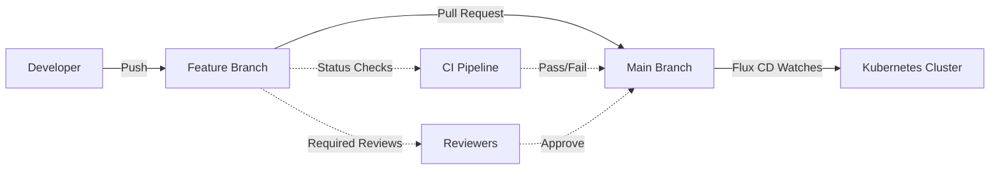

# How to Implement Git Branch Protection for Flux CD Repos

Author: [nawazdhandala](https://github.com/nawazdhandala)

Tags: Flux CD, Git, Branch Protection, GitOps, Security, GitHub, GitLab

Description: A practical guide to implementing Git branch protection rules for Flux CD repositories to prevent unauthorized changes to your Kubernetes infrastructure.

---

## Introduction

In a GitOps workflow, Git is the source of truth for your infrastructure. This means that anyone with write access to your Git repository can potentially modify production workloads. Branch protection rules are your first line of defense against unauthorized, untested, or accidental changes reaching your clusters.

This guide walks through implementing comprehensive branch protection for Flux CD repositories on GitHub and GitLab, including required reviews, status checks, and integration with Flux CD's verification features.

## Prerequisites

- A GitHub or GitLab repository used by Flux CD
- Flux CD v2 installed and bootstrapped
- Administrative access to your Git repository
- GitHub CLI (gh) or GitLab CLI (glab) installed

## Understanding the Branch Protection Strategy

Flux CD watches specific branches for changes. Protecting these branches ensures that only reviewed and validated changes are deployed.



## Configuring GitHub Branch Protection Rules

Use the GitHub API or CLI to set up branch protection rules programmatically.

```yaml
# .github/branch-protection.yaml
# Document describing the branch protection configuration
# Apply these settings via GitHub API or UI

branch_protection:
  branch: main
  rules:
    # Require pull request reviews before merging
    required_pull_request_reviews:
      # Minimum number of approving reviews required
      required_approving_review_count: 2
      # Dismiss stale reviews when new commits are pushed
      dismiss_stale_reviews: true
      # Require review from code owners
      require_code_owner_reviews: true
      # Restrict who can dismiss reviews
      dismissal_restrictions:
        teams:
          - platform-leads

    # Require status checks to pass before merging
    required_status_checks:
      # Branch must be up to date with base before merging
      strict: true
      contexts:
        - "ci/validate-manifests"
        - "ci/kustomize-build"
        - "ci/policy-check"
        - "ci/security-scan"

    # Enforce rules for administrators too
    enforce_admins: true

    # Restrict who can push to the branch
    restrictions:
      teams:
        - flux-deployers
      users: []

    # Require signed commits
    required_signatures: true

    # Prevent force pushes
    allow_force_pushes: false

    # Prevent branch deletion
    allow_deletions: false

    # Require linear history (no merge commits)
    required_linear_history: true
```

## Setting Up Branch Protection via GitHub CLI

```bash
#!/bin/bash
# setup-branch-protection.sh
# Script to configure branch protection rules using GitHub CLI

REPO="myorg/flux-infrastructure"
BRANCH="main"

# Create branch protection rule
gh api \
  --method PUT \
  -H "Accept: application/vnd.github+json" \
  "/repos/${REPO}/branches/${BRANCH}/protection" \
  -f required_status_checks='{"strict":true,"contexts":["ci/validate-manifests","ci/kustomize-build","ci/policy-check"]}' \
  -f enforce_admins=true \
  -f required_pull_request_reviews='{"required_approving_review_count":2,"dismiss_stale_reviews":true,"require_code_owner_reviews":true}' \
  -f restrictions=null \
  -F allow_force_pushes=false \
  -F allow_deletions=false \
  -F required_linear_history=true
```

## Defining CODEOWNERS for Flux CD Repositories

CODEOWNERS files ensure the right people review changes to critical paths.

```text
# .github/CODEOWNERS
# This file defines code owners for different parts of the repository

# All cluster configurations require platform team review
/clusters/ @myorg/platform-team

# Production changes require senior engineer approval
/clusters/production/ @myorg/platform-leads @myorg/sre-team

# Infrastructure components require infrastructure team review
/infrastructure/ @myorg/infrastructure-team

# Policy changes require security team review
/infrastructure/policies/ @myorg/security-team

# Application configurations require owning team review
/apps/backend/ @myorg/backend-team
/apps/frontend/ @myorg/frontend-team
/apps/data/ @myorg/data-team

# Flux system configurations require platform leads approval
/clusters/*/flux-system/ @myorg/platform-leads

# Helm release values require both app owner and platform review
/apps/*/helmrelease.yaml @myorg/platform-team
```

## Implementing CI Status Checks for Manifest Validation

Create CI pipelines that validate Kubernetes manifests before they can be merged.

```yaml
# .github/workflows/validate-manifests.yaml
# GitHub Actions workflow to validate Flux CD manifests
name: Validate Manifests
on:
  pull_request:
    branches:
      - main
    paths:
      - 'clusters/**'
      - 'apps/**'
      - 'infrastructure/**'

jobs:
  validate:
    runs-on: ubuntu-latest
    steps:
      - name: Checkout repository
        uses: actions/checkout@v4

      - name: Setup Flux CLI
        uses: fluxcd/flux2/action@main

      - name: Validate Flux manifests
        # Validate all Flux custom resources in the repository
        run: |
          flux check --pre
          find . -name '*.yaml' -path '*/clusters/*' | while read file; do
            echo "Validating $file"
            kubectl apply --dry-run=client -f "$file" 2>/dev/null || true
          done

      - name: Run Kustomize build
        # Ensure all Kustomize overlays build without errors
        run: |
          for dir in clusters/*/; do
            echo "Building kustomize for $dir"
            kustomize build "$dir" > /dev/null
          done

      - name: Validate with kubeconform
        # Check manifests against Kubernetes schemas
        uses: docker://ghcr.io/yannh/kubeconform:latest
        with:
          args: >-
            -summary
            -strict
            -ignore-missing-schemas
            -schema-location default
            -schema-location
            'https://raw.githubusercontent.com/fluxcd/flux2/main/manifests/crds/{{.Group}}_{{.ResourceKind}}.json'
            clusters/

  policy-check:
    runs-on: ubuntu-latest
    steps:
      - name: Checkout repository
        uses: actions/checkout@v4

      - name: Run Kyverno CLI checks
        # Validate manifests against Kyverno policies locally
        uses: kyverno/action-install-cli@v0.2
      - run: |
          kyverno apply infrastructure/policies/ \
            --resource apps/ \
            --detailed-results
```

## Configuring GitLab Branch Protection

For teams using GitLab, here is the equivalent configuration.

```yaml
# .gitlab-ci.yml
# GitLab CI pipeline for validating Flux CD manifests
stages:
  - validate
  - security

validate-manifests:
  stage: validate
  image: ghcr.io/fluxcd/flux-cli:v2.2.0
  script:
    # Validate all Kubernetes manifests
    - flux check --pre || true
    - |
      find . -name '*.yaml' -path '*/clusters/*' | while read file; do
        echo "Validating $file"
        flux build kustomization flux-system \
          --path="$(dirname $file)" \
          --dry-run 2>/dev/null || true
      done
  rules:
    - if: '$CI_MERGE_REQUEST_TARGET_BRANCH_NAME == "main"'
      changes:
        - clusters/**/*
        - apps/**/*
        - infrastructure/**/*

security-scan:
  stage: security
  image: aquasec/trivy:latest
  script:
    # Scan manifests for security misconfigurations
    - trivy config --severity HIGH,CRITICAL .
  rules:
    - if: '$CI_MERGE_REQUEST_TARGET_BRANCH_NAME == "main"'
```

## Flux CD Commit Signature Verification

Configure Flux CD to verify that commits are signed, adding an extra layer of trust.

```yaml
# clusters/production/flux-system/gotk-sync.yaml
# Flux GitRepository with commit signature verification
apiVersion: source.toolkit.fluxcd.io/v1
kind: GitRepository
metadata:
  name: flux-system
  namespace: flux-system
spec:
  interval: 5m
  url: https://github.com/myorg/flux-infrastructure
  ref:
    branch: main
  # Verify commit signatures using GPG keys
  verify:
    mode: head
    provider: github
    secretRef:
      # Secret containing the GPG public keys of authorized committers
      name: gpg-public-keys
```

```yaml
# clusters/production/flux-system/gpg-keys-secret.yaml
# Secret containing GPG public keys for commit verification
apiVersion: v1
kind: Secret
metadata:
  name: gpg-public-keys
  namespace: flux-system
type: Opaque
data:
  # Base64-encoded GPG public key of authorized committers
  # Generate with: gpg --export --armor <key-id> | base64
  author1.pub: <base64-encoded-gpg-key>
```

## Setting Up Notifications for Branch Protection Events

Alert your team when branch protection rules are triggered or bypassed.

```yaml
# clusters/production/notifications/git-alerts.yaml
# Flux notification for source reconciliation events
apiVersion: notification.toolkit.fluxcd.io/v1
kind: Provider
metadata:
  name: git-events-slack
  namespace: flux-system
spec:
  type: slack
  channel: gitops-security
  secretRef:
    name: slack-webhook-url
---
apiVersion: notification.toolkit.fluxcd.io/v1
kind: Alert
metadata:
  name: git-source-alerts
  namespace: flux-system
spec:
  providerRef:
    name: git-events-slack
  eventSeverity: error
  eventSources:
    # Alert on any Git source reconciliation failures
    - kind: GitRepository
      name: "*"
      namespace: flux-system
  # Include signature verification failures
  inclusionList:
    - ".*verify.*"
    - ".*signature.*"
    - ".*authentication.*"
```

## Environment-Specific Branch Strategies

Use different branches for different environments with appropriate protection levels.

```yaml
# clusters/production/flux-system/gotk-sync.yaml
# Production watches the main branch with strict verification
apiVersion: source.toolkit.fluxcd.io/v1
kind: GitRepository
metadata:
  name: flux-system
  namespace: flux-system
spec:
  interval: 5m
  url: https://github.com/myorg/flux-infrastructure
  ref:
    branch: main
  verify:
    mode: head
    provider: github
---
# clusters/staging/flux-system/gotk-sync.yaml
# Staging watches the staging branch with relaxed verification
apiVersion: source.toolkit.fluxcd.io/v1
kind: GitRepository
metadata:
  name: flux-system
  namespace: flux-system
spec:
  interval: 2m
  url: https://github.com/myorg/flux-infrastructure
  ref:
    branch: staging
```

## Summary

Git branch protection is the foundation of a secure GitOps workflow with Flux CD. The practices covered in this guide include:

- Configuring branch protection rules requiring reviews, status checks, and signed commits
- Setting up CODEOWNERS to ensure appropriate reviewers for different resource types
- Implementing CI pipelines that validate manifests before merge
- Enabling Flux CD commit signature verification for production branches
- Using environment-specific branch strategies with varying protection levels
- Setting up notifications for security-relevant events

By treating your Git repository with the same security rigor as your production infrastructure, you ensure that only authorized, validated, and reviewed changes reach your Kubernetes clusters.
